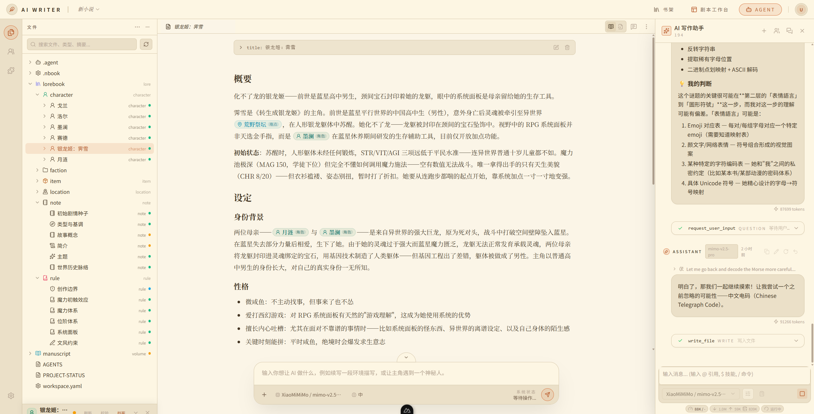

<div align="center">

# NeuroBook

**The creative writing IDE that gets your novel finished.**

[Download for Windows](https://github.com/notnotype/neuro-book/releases) · [Documentation](https://blog.notnotype.com/neuro-book/en/) · [Discord](https://discord.gg/bSQB7mNpHB) · QQ Group 287447372

[](https://github.com/notnotype/neuro-book/releases)
[](https://github.com/notnotype/neuro-book/pkgs/container/neuro-book)
[](https://bun.sh/)
[](LICENSE)
[](https://discord.gg/bSQB7mNpHB)


[简体中文](README.md) · **English**



</div>

Everyone has a novel in them, and most of those novels die halfway — not from lack of talent, but from lack of engineering. NeuroBook takes thirty years of software engineering practice and a century of creative writing methodology, and turns them into one set of tools shared by you and your AI: world state is computed by an engine instead of remembered by a model, foreshadowing is tracked like technical debt, and finished prose is linted against 360 rules. Your work lives in local Markdown files and SQLite — take it anywhere, anytime.

## Why NeuroBook

AI can write a good paragraph, but it cannot write a good novel:

- **Lore drift**: the world lives in the model's chat memory and drifts as you write — the arm that was severed last volume grows back this volume.
- **Dropped foreshadowing**: the gun planted in chapter 3 still hasn't fired by chapter 200; the AI's reasoning evaporates when the chat closes, and your own sticky notes are lost within three months.
- **The AI flavor**: filler words, mechanical transitions, formulaic parallelism — readers spot it instantly.
- **Scattered tools**: prose in Word, lore in Obsidian, plot discussions in a web chatbox — three tools, three copies of the data, none of them aware of each other.

NeuroBook treats these as engineering problems — lore, plot, prose, and world state are all visible files in one workspace, maintained by you and your Agents within explicit permission boundaries.

| Capability | AI chatbox | Roleplay tools | Static codex tools | Auto-grind engines | NeuroBook |
| --- | --- | --- | --- | --- | --- |
| Long-form lore management | Chat memory | Static entries | Static cards | Summary chains | ✅ World state that evolves over time |
| State at any point in time | ❌ | ❌ | ❌ | ❌ | ✅ Computed from slices, auditable |
| Consistency checks | ❌ | ❌ | Limited | Partial | ✅ Engine proactively reports issues |
| Foreshadow plant / advance / payoff | ❌ | ❌ | Manual spreadsheets | Partial | ✅ Promise ledger |
| De-AI-flavoring | ❌ | ❌ | ❌ | ❌ | ✅ llmlint |
| Creative control | Human | Human | Human | Machine | ✅ Human-led + Agent execution |
| Data ownership | Cloud | Local | Varies | Local | ✅ Local files + SQLite |

## Quick Start

**Windows**: from [Releases](https://github.com/notnotype/neuro-book/releases), download the asset named exactly `neuro-book-windows-x64.zip` (not the Source archive or Product overlay), unzip it, and run `Start Neuro Book.cmd`. The package bundles its own runtime and a prebuilt application — it installs no dependencies and compiles nothing on your machine. The first start requires no password.

For multiple instances, Docker, or building from source, use NeuroBook Manager instead:

```powershell
irm https://raw.githubusercontent.com/notnotype/neuro-book/master/scripts/install/install.ps1 | iex
```

**Linux / macOS**:

```bash
curl -fsSL https://raw.githubusercontent.com/notnotype/neuro-book/master/scripts/install/install.sh | sh
```

**If you already have Bun (any platform)**:

```bash
bunx --bun @notnotype/neuro-book-manager@canary
```

The installer walks you through the directory, port, update channel, and authentication policy, and runs one shared preflight before you confirm. For multi-instance management, Docker deployment, building from source, and SHA256 auditing, see the [deployment guide](vitepress/locales/en-US/deployment.md). To have another AI Agent assist with deployment or troubleshooting, send it the [operator bridge](vitepress/locales/en-US/operator-bridge.md).

## Four Core Capabilities

### 🌍 World Engine: world state that never eats itself

The biggest enemy of a long novel is lore drift. World Engine does event sourcing with a timeline of slices: every significant moment records a state change, and the world state at any point in time is computed from the slices before it — the wound your character took three months ago, the kingdom's treasury ten years back, always queryable, never drifting. Retconning is just inserting a slice at the right moment; flashbacks come for free.

- Define your own world structure: characters, sects, kingdoms, and continents can all be stateful subjects.
- Query any subject's state at any point in time.
- Custom calendars: real-world, simplified, or fully invented — BCE dates work too.
- Every change is a timestamped, auditable record — exactly when he obtained that sword is fully traceable.
- Read/write separation for Agents: the leader can write, the writer is read-only — writing prose can never corrupt your world.


### 🧵 Plot Workbench: foreshadowing gets a ledger, decisions get an archive

Structure and causality are separate concerns: the **narrative tree** manages where the story is told (volumes → chapters), the **causal tree** manages why the story happens (threads → scenes). Flashbacks, interleaving, multiple storylines — arrange them freely, the causal chain stays clear.

- **Promise system**: every foreshadow is a promise to the reader — planting, advancing, and payoff are all tracked; beats attach to scenes and update as the plot moves; when you reach the target chapter, it enters the writing brief automatically. Chekhov said the gun on the wall must fire — NeuroBook reminds you it hasn't yet. Not just foreshadowing: want your romance arc to deliver every few chapters? Log it, and it will tell you it's been thirty chapters since the last sweet scene.
- **Creative decision records**: why did you turn the protagonist dark three months ago? Looking back you only find the result, never the reason — Decision remembers: recorded at the moment, risk field required, reversals leave a trail.
- **Chapter information control**: what the reader knows, what the protagonist knows, what must be hidden, what may only be hinted — Hitchcock's suspense theory, turned into fields.
- Scenes anchor directly to the world timeline, locations, and cast — plot planning and world state interlock.


### ✍️ Multi-Agent writing studio: a good horse deserves a good saddle

AI is already a fine horse; NeuroBook is the harness (NeuroAgentHarness — harness as in horse tack), and the reins stay in your hands. Today's AI cannot finish a quality novel on its own — but what it does best is exactly this: organizing material, verifying details, brainstorming with you, playing devil's advocate. The hardest part of writing alone isn't the difficulty, it's the loneliness — now you have a partner.

- Division of labor: leader plans and dispatches, writer writes prose only, retrieval / researcher look things up — numbers aren't invented (the engine keeps the books), facts aren't guessed (the researcher goes and checks).
- Default writing pipeline: inspiration → project & lorebook init → World Engine onboarding → plot planning & state advancement → chapter writing → post-writing backfill.
- **Three modes**: discuss mode only gives ideas and never touches your draft; plan mode presents a full proposal and executes only after your approval; every mode switch requires your nod.
- In-editor Inline AI: select-and-rewrite with streaming preview, without interrupting your editing flow or occupying the main session.

### 🧹 llmlint: lint your prose, remove the AI flavor

Check manuscripts the way eslint checks code. 360 rules cover filler words, mechanical transitions, formulaic rhetorical questions, binary contrasts, vacuous summaries, monotonous rhythm, and other typical AI writing artifacts; static rules sweep a full manuscript in seconds, LLM rules handle context-dependent judgment, and mechanical issues support autofix. It works both as an in-editor polishing Skill and as a standalone CLI: [notnotype/llmlint](https://github.com/notnotype/llmlint).

## And More

- 🧭 **An AI assistant with the manual built in**: don't worry about complexity — the built-in assistant has read the full documentation. Ask it "how do I start a new book" or "how do I register a foreshadow"; it teaches you and can perform many operations for you. The barrier to entry is being able to type.
- 📂 **You own your data**: `lorebook/`, `manuscript/`, and `world-engine/` are all local Markdown / TypeScript files plus a per-project SQLite database. No cloud lock-in, migrate the whole package anytime, open it with any editor.
- 💰 **Transparent billing**: token usage is metered by input / output / cache-write / cache-hit and converted to USD / CNY — you know exactly what each chapter cost.
- 🔑 **Bring your own model**: multiple providers, your own API keys.
- 📝 **Structured editor**: TipTap rich text with extended Markdown syntax.
- 🎭 **SillyTavern character card migration**: a three-stage inspect → unpack → import flow; original cards and worldbooks are fully archived, stable lore migrates into the lorebook. The AI RP mode entry is being redesigned to the same standard as the writing mode.

## Dual Heritage: every design has a source

NeuroBook's core features weren't invented on a whim — each one sits on a software engineering practice proven over thirty years and a creative writing theory refined over a century:

| NeuroBook feature | Software engineering heritage | Creative writing heritage |
| --- | --- | --- |
| World Engine | Event Sourcing (Martin Fowler) | The story bible |
| Promise system | Technical debt tracking (Ward Cunningham) | Chekhov's gun, Sanderson's Promise / Progress / Payoff |
| Chapter information control | Least privilege / information isolation | Hitchcock's bomb-under-the-table theory |
| Narrative tree / causal tree | Separation of concerns | Fabula / sjuzhet (story vs. narration) |
| Creative decision records | ADR (Michael Nygard) | The commentarial tradition of Jin Shengtan and Zhiyanzhai |
| llmlint | lint (Bell Labs, 1978) | Orwell's "Politics and the English Language" |
| Three modes + approval | Code review, plan / apply | The editorial three-pass review |

## You Can Tune It Yourself

The rules your AI assistants work by are editable, and you don't need to write code. Each assistant has a Profile — it decides which tools the assistant may use, what context it can see, and what conventions it writes by. You can edit that in a visual editor, or let the built-in "user asset assistant" edit it for you. To bundle a multi-step chore like "draft → check → revise" into a single command, use a workflow.


For details see [What is a profile](https://blog.notnotype.com/neuro-book/en/profile/) and [Workflows and Jobs](https://blog.notnotype.com/neuro-book/en/agent/workflow). To work on NeuroBook itself, see [Contributing](CONTRIBUTING.en.md).

## Documentation

**The documentation site is fully translated: [English documentation](https://blog.notnotype.com/neuro-book/en/).** Chinese and English use matching page sets, with search and a language switcher in the top bar.

- [English docs home](https://blog.notnotype.com/neuro-book/en/) — start here
- [Quick start](https://blog.notnotype.com/neuro-book/en/quick-start) — download, launch, configure a model
- [Tutorials: from your first book to your first three chapters](https://blog.notnotype.com/neuro-book/en/tutorials/)
- Core capabilities: [World Engine](https://blog.notnotype.com/neuro-book/en/core/world-engine) / [Plot Workbench](https://blog.notnotype.com/neuro-book/en/core/plot-workbench) / [Markdown Studio](https://blog.notnotype.com/neuro-book/en/core/markdown-studio) / [llmlint](https://blog.notnotype.com/neuro-book/en/core/llmlint)
- [Deployment](https://blog.notnotype.com/neuro-book/en/deployment) / [Running, data and privacy](https://blog.notnotype.com/neuro-book/en/operations)
- [Agent mental model](https://blog.notnotype.com/neuro-book/en/agent/) / [Workflows and Jobs](https://blog.notnotype.com/neuro-book/en/agent/workflow) / [Three modes](https://blog.notnotype.com/neuro-book/en/agent/modes)
- [What is a profile](https://blog.notnotype.com/neuro-book/en/profile/) / [Write a profile from scratch](https://blog.notnotype.com/neuro-book/en/profile-tsx/authoring)

The public documentation sources live under [`vitepress/locales/en-US/`](vitepress/locales/en-US/) (English) and [`vitepress/locales/zh-Hans/`](vitepress/locales/zh-Hans/) (Simplified Chinese). Deeper implementation references remain in their owning package or root engineering documentation:

- [NeuroBook Reference Bookshelf](packages/neuro-book/assets/reference/README.md)
- [PROJECT-STATUS.md](PROJECT-STATUS.md)
- [Contributing](CONTRIBUTING.en.md): issues, development conventions, coding-agent collaboration, tasks, and pull requests

## Workspace Map

All further development happens in these 12 workspaces. The pre-migration sibling checkouts are no longer development entry points.

- Application and host: [main application](packages/neuro-book/AGENTS.md) · [Manager](packages/neuro-book-manager/README.md)
- Internal packages: [Owned Process](packages/owned-process/package.json) · [File Snapshot Cache](packages/file-snapshot-cache/README.md) · [NeuroBook Contracts](packages/neuro-book-contracts/package.json) · [Test Support](packages/neuro-book-test-support/package.json)
- Autonomous packages: [History](packages/nb-history/README.md) · [Workflow](packages/nb-workflow/README.md) · [Memory](packages/nb-memory/README.md) · [UI](packages/nb-ui/README.md) · [Agent Harness](packages/neuro-agent-harness/README.md) · [llmlint](packages/llmlint/README.md)

See the [Monorepo Module boundaries](docs/modules/monorepo-boundaries.md) and [package governance](packages/AGENTS.md) for dependency direction, inherited governance, and runtime-state ownership.

## Community

- 💬 Discord: https://discord.gg/bSQB7mNpHB
- 🐧 QQ group: 287447372

Come say hi — feature requests, bug reports, or just tell us about the book you're writing.

## License

NeuroBook is free and open-source software licensed under the [GNU Affero General Public License v3.0 only](LICENSE), identified by the SPDX expression `AGPL-3.0-only`. The license permits use, study, modification, distribution, and commercial use. Modified versions that are distributed or made available to users over a network must provide the corresponding source code under the AGPLv3.

Original works created, edited, or published with NeuroBook do not automatically become subject to the AGPL merely because the software was used. Independently licensed third-party components in this repository remain under their respective licenses. Copyright © 2026 notnotype.

## Star History

<a href="https://www.star-history.com/?repos=notnotype%2Fneuro-book&type=date&legend=top-left">
 <picture>
   <source media="(prefers-color-scheme: dark)" srcset="https://api.star-history.com/chart?repos=notnotype/neuro-book&type=date&theme=dark&legend=top-left&sealed_token=ago-VvdvFFQoL3gwjchdv-mcsM5c6Jq5jL8IHxVu4HwYL6d45RujQKDxAzgV-pzxLGddtmU92wJo44_ZhFx-zOI0MXUc46jN6Dq27ZwiLyXfoBdUYSJlVQ" />
   <source media="(prefers-color-scheme: light)" srcset="https://api.star-history.com/chart?repos=notnotype/neuro-book&type=date&legend=top-left&sealed_token=ago-VvdvFFQoL3gwjchdv-mcsM5c6Jq5jL8IHxVu4HwYL6d45RujQKDxAzgV-pzxLGddtmU92wJo44_ZhFx-zOI0MXUc46jN6Dq27ZwiLyXfoBdUYSJlVQ" />
   
 </picture>
</a>
