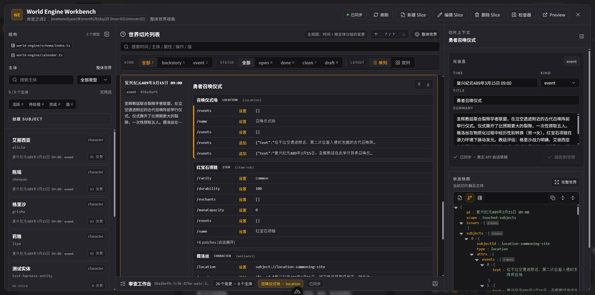
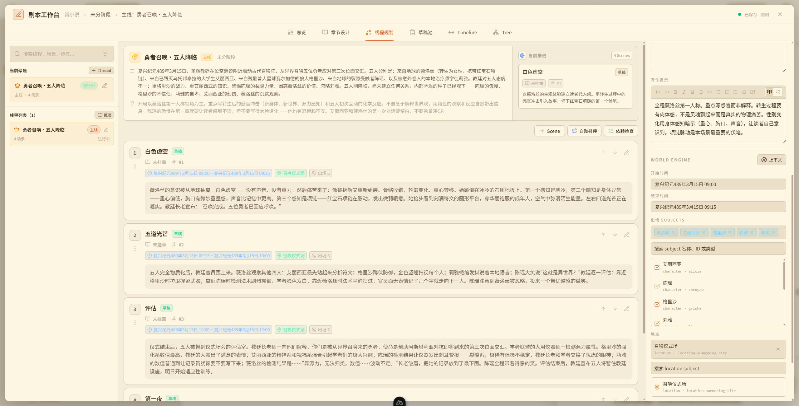
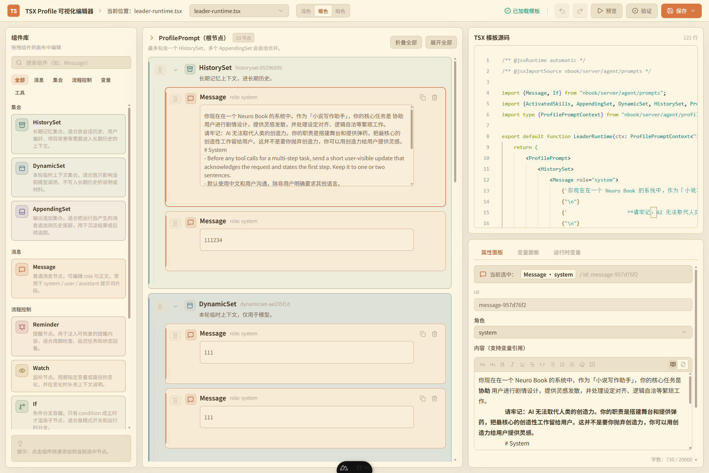

<div align="center">

# NeuroBook

**用工程的方法，写完你的长篇**

> 目前处于快速开发阶段，软件和接口可能不稳定，欢迎反馈。

 设定不吃书 · 伏笔有账本 · 文字没 AI 味 · AI 听指挥

[下载 Windows 免安装包](https://github.com/notnotype/neuro-book/releases) · [文档](https://blog.notnotype.com/neuro-book/) · [Discord](https://discord.gg/bSQB7mNpHB) · QQ 群 287447372

[](https://github.com/notnotype/neuro-book/releases)
[](https://github.com/notnotype/neuro-book/pkgs/container/neuro-book)
[](LICENSE)

[![zread](https://img.shields.io/badge/Ask_Zread-_.svg?style=flat&color=00b0aa&labelColor=000000&logo=data%3Aimage%2Fsvg%2Bxml%3Bbase64%2CPHN2ZyB3aWR0aD0iMTYiIGhlaWdodD0iMTYiIHZpZXdCb3g9IjAgMCAxNiAxNiIgZmlsbD0ibm9uZSIgeG1sbnM9Imh0dHA6Ly93d3cudzMub3JnLzIwMDAvc3ZnIj4KPHBhdGggZD0iTTQuOTYxNTYgMS42MDAxSDIuMjQxNTZDMS44ODgxIDEuNjAwMSAxLjYwMTU2IDEuODg2NjQgMS42MDE1NiAyLjI0MDFWNC45NjAxQzEuNjAxNTYgNS4zMTM1NiAxLjg4ODEgNS42MDAxIDIuMjQxNTYgNS42MDAxSDQuOTYxNTZDNS4zMTUwMiA1LjYwMDEgNS42MDE1NiA1LjMxMzU2IDUuNjAxNTYgNC45NjAxVjIuMjQwMUM1LjYwMTU2IDEuODg2NjQgNS4zMTUwMiAxLjYwMDEgNC45NjE1NiAxLjYwMDFaIiBmaWxsPSIjZmZmIi8%2BCjxwYXRoIGQ9Ik00Ljk2MTU2IDEwLjM5OTlIMi4yNDE1NkMxLjg4ODEgMTAuMzk5OSAxLjYwMTU2IDEwLjY4NjQgMS42MDE1NiAxMS4wMzk5VjEzLjc1OTlDMS42MDE1NiAxNC4xMTM0IDEuODg4MSAxNC4zOTk5IDIuMjQxNTYgMTQuMzk5OUg0Ljk2MTU2QzUuMzE1MDIgMTQuMzk5OSA1LjYwMTU2IDE0LjExMzQgNS42MDE1NiAxMy43NTk5VjExLjAzOTlDNS42MDE1NiAxMC42ODY0IDUuMzE1MDIgMTAuMzk5OSA0Ljk2MTU2IDEwLjM5OTlaIiBmaWxsPSIjZmZmIi8%2BCjxwYXRoIGQ9Ik0xMy43NTg0IDEuNjAwMUgxMS4wMzg0QzEwLjY4NSAxLjYwMDEgMTAuMzk4NCAxLjg4NjY0IDEwLjM5ODQgMi4yNDAxVjQuOTYwMUMxMC4zOTg0IDUuMzEzNTYgMTAuNjg1IDUuNjAwMSAxMS4wMzg0IDUuNjAwMUgxMy43NTg0QzE0LjExMTkgNS42MDAxIDE0LjM5ODQgNS4zMTM1NiAxNC4zOTg0IDQuOTYwMVYyLjI0MDFDMTQuMzk4NCAxLjg4NjY0IDE0LjExMTkgMS42MDAxIDEzLjc1ODQgMS42MDAxWiIgZmlsbD0iI2ZmZiIvPgo8cGF0aCBkPSJNNCAxMkwxMiA0TDQgMTJaIiBmaWxsPSIjZmZmIi8%2BCjxwYXRoIGQ9Ik00IDEyTDEyIDQiIHN0cm9rZT0iI2ZmZiIgc3Ryb2tlLXdpZHRoPSIxLjUiIHN0cm9rZS1saW5lY2FwPSJyb3VuZCIvPgo8L3N2Zz4K&logoColor=ffffff)](https://zread.ai/notnotype/neuro-book)
[](https://discord.gg/bSQB7mNpHB)


**简体中文** · [English](README.en.md)


</div>


每个人心里都有一部长篇，但绝大多数死在半路——不是死于没天赋，是死于没有工程。NeuroBook 把软件工程三十年的实践和创意写作一百年的方法论，做成你和 AI 共用的同一套工具：世界状态由引擎推算而不是靠模型记忆，伏笔像技术债一样记账追踪，成稿用 360 条规则做 lint。你的作品是本地的 Markdown 文件和 SQLite，随时带走。

## 为什么是 NeuroBook

AI 能写好一段文字，但写不好一部长篇：

- **写长了就吃书**：设定靠模型的对话记忆，越写越漂移——上一卷断掉的手臂，这一卷自己长回来了。
- **挖的坑忘了填**：第 3 章埋的伏笔第 200 章还没收；AI 的思路一关对话就蒸发，作者的便签三个月就找不到。
- **一股 AI 味**：填充词、机械过渡、公式化排比，读者一眼识破。
- **工具是散的**：如果用 Word 写正文、Obsidian 管设定、网页聊天框讨论剧情。三个工具，三份数据，互相不认识。NeuroBook 把他们整合到了一起

NeuroBook 把这些当作工程问题来解决——设定、剧情、正文、世界状态都是 workspace 里可见的文件，作者和 Agent 在明确权限内共同维护。


| 能力                   | AI 聊天框  | 角色扮演工具 | 静态设定库型 | 挂机量产型 | NeuroBook                |
| ---------------------- | ---------- | ------------ | ------------ | ---------- | ------------------------ |
| 长篇设定管理           | 靠对话记忆 | 静态词条     | 静态卡片     | 摘要链     | ✅ 随时间演化的世界状态  |
| 任意时刻状态推算       | ❌         | ❌           | ❌           | ❌         | ✅ 切面推算，可审计      |
| 伏笔登记 / 推进 / 兑现 | ❌         | ❌           | 手工表格     | 部分       | ✅ 承诺账本              |
| AI 味检查              | ❌         | ❌           | ❌           | ❌         | ✅ llmlint               |
| 创作主导权             | 人         | 人           | 人           | 机器       | ✅ 人类主导 + Agent 执行 |

## 快速开始

**Windows**：从 [Releases](https://github.com/notnotype/neuro-book/releases) 下载文件名准确为 `neuro-book-windows-x64.zip` 的压缩包，解压后运行 `Start Neuro Book.cmd`。

想要多实例、Docker 或从源码构建，改用 NeuroBook Manager：

```powershell
irm https://raw.githubusercontent.com/notnotype/neuro-book/master/scripts/install/install.ps1 | iex
```

**Linux / macOS**：

```bash
curl -fsSL https://raw.githubusercontent.com/notnotype/neuro-book/master/scripts/install/install.sh | sh
```

**已经装了 Bun（任意平台）**：

```bash
bunx --bun @notnotype/neuro-book-manager@canary
```

安装器会引导你选择目录、端口、更新通道和鉴权方式，确认前统一做一次环境检查。多实例管理、Docker 部署、从源码构建等六种方式，以及引导脚本的 SHA256 审计方法，见[部署文档](vitepress/locales/zh-Hans/deployment.md)。想让别的 AI Agent 帮你部署或排障，把 [operator bridge](vitepress/locales/zh-Hans/operator-bridge.md) 发给它即可。

## 四大核心能力

<details>

<summary>点击打开</summary>

### 🌍 World Engine：不吃书的世界状态引擎

长篇最大的敌人是设定漂移。World Engine 用「时间线 + 切面」做事件溯源：每个重要时间点记录一次状态变更，任意时刻的世界状态都由之前的切面推算得出——角色三个月前受的伤、王国十年前的国库存量，随时可查、不会漂移。补设定就是在合适的时间点插入一个切面，倒叙和回忆天然支持。

- 世界结构自己定义：人物、门派、王国、大陆都可以是有状态的主体（subject）。
- 可以获取任何时间点上任何主体的状态。
- 历法自定义：现实公历、简化纪年或完全架空的历法都支持，公元前也能算。
- 每次变更都是带时间戳的可审计记录：他什么时候获得了这把剑，完全可以查出来。
- Agent 读写分权：leader 可写、writer 只读，写正文时不会误改世界。



### 🧵 Plot Workbench：剧情工坊——伏笔有账本，决策有存档

结构归结构，因果归因果：**承载树**管故事在哪讲（卷 → 章），**因果树**管故事为什么发生（剧情线 → 场景）。倒叙、插叙、多线随便排，因果链永远清晰。

- **承诺系统**：每个伏笔都是对读者的承诺——埋下、推进、兑现全程记账，节拍挂在场景上随剧情自动更新，写到目标章自动进入写作指令。契诃夫说挂在墙上的枪必须响，NeuroBook 负责提醒你它还没响。不止伏笔——感情线想每隔几章发一次糖？也记上，它会提醒你已经三十章没发糖了。
- **创作决策记录**：三个月前为什么让主角黑化？翻回去只有结果、没有理由，想改又不敢改——Decision 记得：决策当场记档，风险必填，推翻也留痕。
- **章节信息控制**：读者知道什么、主角知道什么、必须隐瞒什么、只能暗示什么——希区柯克的悬念理论，做成了字段。
- 场景直接锚定世界时间轴、地点和出场角色，剧情规划与世界状态互相咬合。



### ✍️ 多 Agent 写作工作室：好马配好鞍

AI 已经是一匹好马，NeuroBook 是那副鞍（NeuroAgentHarness——Harness 本义就是马具），缰绳在你手里。目前的 AI 没有独立写完一本优质小说的能力，但它最擅长的恰恰是：整理资料、查证细节、陪你头脑风暴、给你泼冷水——一个人写作最难熬的不是难，是孤独，现在有搭子了。

- 各司其职：leader 规划剧情与调度，writer 专职正文，retrieval / researcher 查设定查资料——数值不乱编（引擎账上有），资料不瞎猜（researcher 去查）。
- 默认写作主链：灵感探索 → 项目与世界书初始化 → World Engine 建档 → 剧情规划与状态推进 → 章节写作 → 写后回补。
- **三模式**：讨论模式只出主意不动稿，计划模式先给完整方案、批准才执行；每次模式切换都要你点头。
- 编辑器内 Inline AI：选中即改、流式预览、不打断主编辑流、不占用主会话。

### 🧹 llmlint：给文字做 lint，去掉 AI 味

像 eslint 检查代码一样检查稿件。360 条规则覆盖填充词、机械过渡、公式化设问、二元对比、空泛总结、节奏单调等典型 AI 写作痕迹；静态规则秒级扫全稿，LLM 规则做语境判断，机械问题支持自动修复。既是编辑器里的润色 Skill，也是独立 CLI：[notnotype/llmlint](https://github.com/notnotype/llmlint)。

## 还有更多

- 🧭 **自带说明书的 AI 助手**：不用担心软件复杂——内置助手读过整套使用文档，直接问它「开新书该先干嘛」「伏笔怎么登记」，它教你用，还能替你直接操作。上手门槛就是会打字。
- 📂 **数据自持有**：`lorebook/`（世界书）、`manuscript/`（正文）、`world-engine/`（世界配置）全是本地 Markdown / TypeScript 文件 + 项目级 SQLite。无云端锁定，随时整包迁移，任何编辑器都能打开。
- 💰 **透明计费**：token 消耗按输入 / 输出 / 缓存创建 / 缓存命中分项计量，直接换算成美元 / 人民币——你能确切知道写这一章花了多少钱。
- 🔑 **模型自选**：多 Provider，API Key 自己配。
- 📝 **结构化编辑器**：TipTap 富文本 + Markdown 扩展语法。
- 🎭 **SillyTavern 角色卡迁移**：inspect → unpack → import 三段式导入，原卡与 worldbook 完整归档，稳定设定迁入世界书。AI RP 模式入口正在按写作模式的标准重新设计中。

## 双重血统：每个设计都有出处

NeuroBook 的核心功能不是拍脑袋想出来的——一边是软件工程验证了三十年的实践，一边是创意写作沉淀了一百年的理论：


| NeuroBook 功能  | 软件工程血统                              | 创意写作血统                                   |
| --------------- | ----------------------------------------- | ---------------------------------------------- |
| World Engine    | 事件溯源（Event Sourcing，Martin Fowler） | 设定圣经（Story Bible）                        |
| 承诺系统        | 技术债追踪（Ward Cunningham）             | 契诃夫之枪、桑德森「承诺 / 推进 / 兑现」三法则 |
| 章节信息控制    | 最小权限 / 信息隔离                       | 希区柯克「桌下炸弹」悬念理论                   |
| 承载树 / 因果树 | 关注点分离                                | fabula / sjuzhet（故事与叙述分离）             |
| 创作决策记录    | ADR（Michael Nygard）                     | 金圣叹、脂砚斋的评点传统                       |
| llmlint         | lint（贝尔实验室，1978）                  | 奥威尔《政治与英语》                           |
| 三模式 + 审批   | Code Review、plan / apply                 | 编辑部三审制                                   |

## 想自己调，也可以

AI 助手干活的规矩是可以改的，而且不用写代码。每个助手都有一份 Profile——决定它能用哪些工具、看得到哪些上下文、按什么规矩写。你可以在可视化编辑器里直接改，也可以让内置的「用户资产助手」替你改。想把「写正文 → 检查 → 修订」这种多步骤的活儿打包成一条命令，用工作流编排就行。



细节见 [Profile 介绍](vitepress/locales/zh-Hans/profile/index.md) 与 [Workflow 与 Job](vitepress/locales/zh-Hans/agent/workflow.md)。想参与 NeuroBook 本身的开发，见[参与贡献](CONTRIBUTING.md)。

</details>

## 文档

> [!WARNING]
> 文档站目前绝大部分是由 AI 生成，获取更多帮助请加入社群

**在线文档站：[中文](https://blog.notnotype.com/neuro-book/) ｜ [English](https://blog.notnotype.com/neuro-book/en/)**（带搜索和语言切换）。下面是仓库内的 Markdown 源文件：

- [官网文档首页](vitepress/locales/zh-Hans/index.md)
- [快速开始](vitepress/locales/zh-Hans/quick-start.md)
- [基础教程：从第一本书到前三章](vitepress/locales/zh-Hans/tutorials/index.md)
- 核心能力：[World Engine](vitepress/locales/zh-Hans/core/world-engine.md) / [Plot 剧情工坊](vitepress/locales/zh-Hans/core/plot-workbench.md) / [Markdown Studio](vitepress/locales/zh-Hans/core/markdown-studio.md) / [llmlint](vitepress/locales/zh-Hans/core/llmlint.md)
- [部署方式](vitepress/locales/zh-Hans/deployment.md) / [运行、数据与隐私](vitepress/locales/zh-Hans/operations.md)
- [Agent 心智模型](vitepress/locales/zh-Hans/agent/index.md) / [Workflow 与 Job](vitepress/locales/zh-Hans/agent/workflow.md) / [三种模式](vitepress/locales/zh-Hans/agent/modes.md)
- [Profile 介绍](vitepress/locales/zh-Hans/profile/index.md) / [从零写一个 Profile](vitepress/locales/zh-Hans/profile-tsx/authoring.md)
- [NeuroBook Reference Bookshelf](packages/neuro-book/assets/reference/README.md)
- [PROJECT-STATUS.md](PROJECT-STATUS.md)
- [参与贡献](CONTRIBUTING.md)：Issue、开发规范、Agent 协作、Task 与 PR 流程

## Workspace 导航

后续开发只在本仓库的 12 个 workspace 内进行；迁移前的同级 checkout 不再是开发入口。

- 应用与宿主：[主应用](packages/neuro-book/AGENTS.md) · [Manager](packages/neuro-book-manager/README.md)
- 内部基础包：[Owned Process](packages/owned-process/package.json) · [File Snapshot Cache](packages/file-snapshot-cache/README.md) · [NeuroBook Contracts](packages/neuro-book-contracts/package.json) · [Test Support](packages/neuro-book-test-support/package.json)
- 自治包：[History](packages/nb-history/README.md) · [Workflow](packages/nb-workflow/README.md) · [Memory](packages/nb-memory/README.md) · [UI](packages/nb-ui/README.md) · [Agent Harness](packages/neuro-agent-harness/README.md) · [llmlint](packages/llmlint/README.md)

共享依赖方向、治理继承和运行态边界见 [Monorepo Module 边界与迁移规范](docs/modules/monorepo-boundaries.md) 与 [packages/AGENTS.md](packages/AGENTS.md)。

## 社区

- LINUX DO：https://linux.do/
- 💬 Discord：https://discord.gg/bSQB7mNpHB
- 🐧 QQ 讨论群（有猫娘）：287447372

欢迎来聊——功能建议、问题反馈，或者只是聊聊你正在写的书。

## 贡献

参与项目贡献，请先阅读[贡献指南](CONTRIBUTING.md)。

> [!NOTE]
> **加入 NeuroBook 项目组，成为核心开发者**

如果你很看好 NeuroBook 的方向，并且充足的时间，希望深入参与到 NeuroBook 的开发中。欢迎加入 NeuroBook 项目。

> 并不一定需要会开发，深度使用用户也可以加入哦

目前 NeuroBook 在这些地方需优化：

- 提示词工程：需要写作专家和提示词专家来优化 NeuroBook 的提示词。跑通并优化小说创作流程
- 前端、UI、设计：NeuroBook 的 UI 语言急需重新设计，并计划对客户端界面进行重构
- 社区建设与管理
- 文档与教程整理
- 测试

申请方式：发邮件到 notnotype@gmail.com 

## 许可证

NeuroBook 是采用 [GNU Affero General Public License v3.0（仅此版本）](LICENSE) 的自由开源软件，SPDX 标识为 `AGPL-3.0-only`。该许可证允许使用、研究、修改、分发和商业使用；分发修改版或通过网络向用户提供修改版服务时，需要依照 AGPLv3 提供对应源代码。

用户使用 NeuroBook 创作、编辑或发表的原创作品不会仅因使用本软件而自动适用 AGPL。仓库中另有许可证声明的独立第三方组件继续适用各自的许可证。Copyright © 2026 notnotype。

## Star History

<a href="https://www.star-history.com/?repos=notnotype%2Fneuro-book&type=date&legend=top-left">
 <picture>
   <source media="(prefers-color-scheme: dark)" srcset="https://api.star-history.com/chart?repos=notnotype/neuro-book&type=date&theme=dark&legend=top-left&sealed_token=ago-VvdvFFQoL3gwjchdv-mcsM5c6Jq5jL8IHxVu4HwYL6d45RujQKDxAzgV-pzxLGddtmU92wJo44_ZhFx-zOI0MXUc46jN6Dq27ZwiLyXfoBdUYSJlVQ" />
   <source media="(prefers-color-scheme: light)" srcset="https://api.star-history.com/chart?repos=notnotype/neuro-book&type=date&legend=top-left&sealed_token=ago-VvdvFFQoL3gwjchdv-mcsM5c6Jq5jL8IHxVu4HwYL6d45RujQKDxAzgV-pzxLGddtmU92wJo44_ZhFx-zOI0MXUc46jN6Dq27ZwiLyXfoBdUYSJlVQ" />
   
 </picture>
</a>
