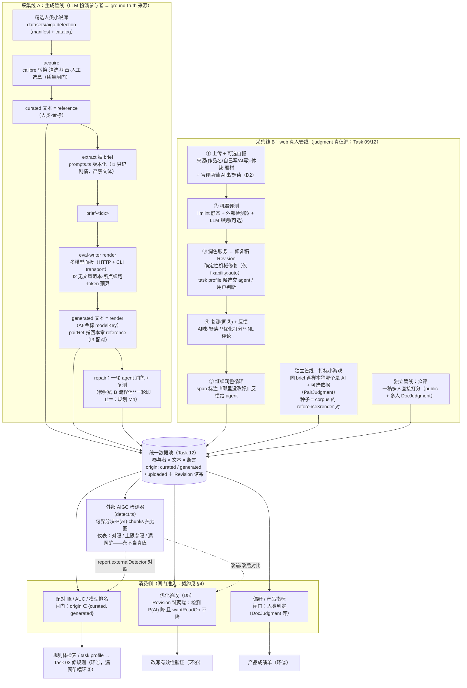

# llmlint 评测方法论（权威规范）

> **这是 `evals/` 的权威方法论与流程规范。代码按本文件实现。**
> 当代码与本文件冲突，以本文件为准——除非本文件被显式修改（改动记入对应 [walkthrough](../.agents/tasks/03-llmlint-eval-harness/README.md)；涉及 prompt 的改动必须升版本，因为它改变每一个 lift 数字）。
>
> - 术语与硬不变量：[../CONTEXT.md](../CONTEXT.md)
> - 怎么跑（快速上手）：[README.md](README.md)
> - 编年实现记录：[../.agents/tasks/03-llmlint-eval-harness/README.md](../.agents/tasks/03-llmlint-eval-harness/README.md)

---

## 0. 为什么存在（产品论点）

**产品命题：散点与诊断之间的距离。** 用真实 DeepSeek 章节手测：llmlint 产出 **349 条散点命中**，而人能一句话给出 **4 条诊断**（过度描写、破折号、不是而是、机器人数据化）。把散点变成诊断，需要知道**哪条规则是真信号、哪条是噪声、对什么任务有效、照着改到底有没有用**——没有评测，这些全靠感觉。

评测要回答两个问题，各对应一条证据链：

1. **规则判别力**（环 ①）：这条规则真能区分 AI 与人类中文写作吗？→ 证据 = ground-truth 来源的**配对语料**（采集线 A：让 LLM 扮演参与者，量大、便宜、来源即真值）。
2. **改写有效性**（环 ②④）：照规则/agent 改，文字真的变好了吗？→ 证据 = **人类判定**（采集线 B：真人盲评、润色后复评、成对猜 AI；量小、贵，但是**终审**）。

**为什么人类判定是终审**：机器检测各有盲区，且盲区互不重合——外部神经检测器在 claude 上完全失效（判 87–93% 像人类），llmlint 的表层规则又漏掉 gemini 的啰嗦干净散文（Task 08 双向实证）。所以规则 + 神经检测器只负责**高召回找候选**，对错由人类判定说了算——这是采集线 B 和统一数据模型存在的根本理由，也是 D5 验收把「人评不降」放在「检测概率降」之上的原因。

规则修复本身属 [Task 02](../.agents/tasks/02-llmlint-rule-registry/README.md)（另一个 agent）；本方法论只管**怎么量化**。

**定位（2026-07-02）**：规则库是超集、规则无全局好坏；本方法论训出的判别器**任务敏感**——喂什么语料，就得到对什么任务纠正力强的 `task profile`（见 [CONTEXT.md §2.2](../CONTEXT.md)）。当前语料 = 网文/创意写作 → 产出的是 NeuroBook 写作 profile。verdict 是 profile 内裁决，不是全局删留令。

**统一数据模型（2026-07-06，[Task 12](../.agents/tasks/12-unified-data-model/README.md)）**：评测语料与 web 采集数据是**同一个模型**——一切数据 = 参与者（人类用户 / LLM / 规则引擎 / 外部检测器）对文本的断言；**本文件描述的 reference+render 循环 = 让 LLM 扮演参与者**（换取样本量、付出可信度），web 循环收真人类参与者的数据、是真值源。质量 ⊥ 来源（人写的可以烂）。指标准入按**来源闸门**：lift / 检测器训练只吃 `origin ∈ {curated, generated}`（ground-truth）；人类判定是产品/偏好真值；机器判定（扫描 / 外部检测器 / LLM 判）只作预筛与对照、**永不当真值**——检测器有 per-model 盲区（claude 实证，Task 08）。每个研究问题 = 对统一数据的一次切片查询（task profile = 带 where 条件的 lift）。

## 1. 目标架构：统一数据池 × 两条采集线 × 闸门消费

### 1.1 总览

数据层是**统一数据模型**（[Task 12](../.agents/tasks/12-unified-data-model/README.md)：参与者 × 文本 × 断言）。数据从**两条采集线**流入同一个池子，消费侧按**闸门**取用：

- **采集线 A：生成管线**（本文件 §2 详述）——LLM 扮演参与者，产 `curated`（reference，人类金标）与 `generated`（render，AI 金标）文本。量大、来源即真值、判定可信度低。
- **采集线 B：web 真人循环**（[Task 09](../.agents/tasks/09-web-revision-persistence/README.md)）——真人上传（`uploaded`，自述不可信）、盲评（DocJudgment/SpanAnnotation，D2 先人评后揭示）、Revision 改文链、复评。量小、**judgment 真值源**。
- **消费侧三口**：lift/AUC/排名（闸门 `origin ∈ {curated, generated}`）、偏好/产品指标（闸门 = 人类判定）、优化验收（D5：Revision 链两端 检测 P(AI) 降 且 wantReadOn 不降）。
- **外部 AIGC 检测器**是横跨的**仪表**：对照/上限参照/漏网探测器，**永不当真值**（per-model 盲区，claude 实证）。

### 1.2 采集线 A 内部：两侧硬分离

```
生成侧 generator（本地，产数据）          消费侧 consumer（进 git，产报告）
  acquire → brief → render      ──语料──►   scan → metrics → report
  依赖模型 API、造 AI 样本                    纯函数、import skill 引擎、不 spawn CLI
```

两侧**唯一接口 = 语料/meta 契约**（§6）。消费侧对"非自产语料"也稳健（缺字段、文件不匹配、编码）。这条分离让判别仪器（纯脚本）能先建、能独立验证，不被生成器卡住。

### 1.3 四环归属

本文件 = **环 ①（规则选择）的仪器规范**，同时为环 ②④ 定指标契约（人类判定真值、D5 验收）、为环 ③ 供漏网矿（外部检测器 gap + gemini/claude 类分歧样本）。四环定义见 [CONTEXT §1](../CONTEXT.md)。

## 2. 完整流程（authoritative pipeline）



> 状态：采集线 A + LIFT + DET **已建**（Task 03/08），repair 一轮已接（[Task 14](../.agents/tasks/14-line-a-repair-loop/README.md)）；采集线 B 五步流程已产品化（[Task 09](../.agents/tasks/09-web-revision-persistence/README.md) / [Task 13](../.agents/tasks/13-web-five-step-flow/README.md)：服务端机器信号 + revealedAt 揭示闸门 + 检测器腿 + AI 改写 + D5 双条件）、真人数据待收；PREF/OPT 待线 B 数据（§7 路线图）。

### 2.1 生成侧（`evals/acquire/` + `evals/generator/`）

1. **acquire**：整本 epub/txt/**mobi（calibre 批转）** → 清洗 → 切章 → 候选清单 → **人工选章（不可自动化的质量闸门）** → `reference-NNNN.md` 单元；书目真相源 = `manifest.tsv`，curation 状态 = `catalog.json`。详见 [data-acquisition.md](../.agents/tasks/03-llmlint-eval-harness/data-acquisition.md) 与 [Task 08 M1](../.agents/tasks/08-eval-pipeline-hardening/README.md)。
2. **extract**：抽取器模型（`eval.config.extractor`）读一章 reference → `brief-<idx>.md`。prompt 从 `generator/prompts.ts` 版本化注册表取（现 `brief-v2`），**受 I1 约束：只记剧情内容，严禁文体**。⚠ brief 质量本身未经元评测（哪个 prompt/抽取器产出最好的 brief 待 A/B，见 §7 M3-C）。
3. **render**：render 面板（`eval.config.renderModels`，HTTP 与 CLI transport 混编）照 brief 各写一版 `render-<idx>-<slug>.md`，`targetChars`=本章字数、`pairRef`=本章 reference（真 1:1 配对）。**受 I2/I3 约束**。prompt 版本（现 `render-v1`）连同 brief 版本写进 `meta.promptVersion`（I8）。
4. **可靠性设施**（Task 08）：`eval.config.json`（gitignore）+ example 双文件；per-provider 限流 + 重试配置；proxy（所有 provider 走 `127.0.0.1:7890`）；token 预算预估/实报/自校准；**断点续跑**（brief/render 文件已存在即跳过，单篇失败只跳该篇）；拒答守门（render ≪ 目标字数判伪 render 丢弃）。
5. **元评测（`evals/experiments/`，与常规流水线分开）**：回答「我们对生成或修复做的某个改动有没有用」，而不是「每条规则的判别力」。产物**不进主语料**——主语料固定 `render-v1`，实验通常换 render prompt 版本，混进去会触发 I8 的版本混用守门。当前实验：`guide-arm`（写作期约束注入是否真的降低 AI 痕迹，用 `render-v2` 的可选约束槽位；空约束时与 v1 逐字节等价）。每个实验组 meta 必须先声明 `validity:{status:"valid"}`，再保存完整 `GuideProvenance`：tier、profile 指纹、最终选中规则指纹/数量、实际注入文本指纹；生成续跑、dry-run 与比较在读取样本前依次核对 validity 与 provenance，缺失、invalid、旧形态或任一漂移直接失败（I27）。旧 `delivery-arm` 因 toolresult 漏传 profile、两个处理臂实际使用 71/66 条不同 guide，已标 invalid，不能作为投递位置或模型强度证据；修复版必须写入独立 `delivery-arm-v2`。指标分层与判读口径见 [experiments/README.md](experiments/README.md)——**核心纪律是不能用 llmlint 自己的命中数当主指标**（把规则塞进提示词再用规则数命中是循环论证），主指标必须是外部检测器，佐证必须看留出规则。
6. **classify（语料整备，可选）**：`classifier/classify.ts` 用 LLM 小 agent 补空题组分类——**强制工具调用**（typebox 枚举白名单 + unknown，照 NeuroBook `report_result` 模式），拿不准留空（宁缺勿错，错值污染 byGenre 分层）；**只补空不覆盖**（curator > user > llm）。值集单一真相源 = `lib/taxonomy.ts`（题材 13 / 体裁 4 / 视角 4；纪律：**只增不改 key**）。模型/截断可配（`eval.config.classifier`，须 HTTP 通道——CLI transport 无工具协议）。

### 2.2 消费侧（`evals/` + `evals/lib/` + `evals/detector/`）

| 模块 | 职责 | 关键点 |
|---|---|---|
| `lib/corpus.ts` | 读 + 校验语料 | 按 meta 契约加载；透传 `pairRef`；charCount 消费侧自算（去空白码点）；**render prompt 版本混用告警（I8）** |
| `lib/scan.ts` | 每篇跑 llmlint | **import `skill/src/rules` + `skill/src/scanner`，不 spawn CLI**（I9）；出原始命中 + 去重 span + agent 桶命中 |
| `lib/metrics.ts` | lift / 检测器 / 排名 / holdout | 见 §3、§4 |
| `lib/report.ts` | 组装 `Report` 数据对象 | 纯数据契约；含 `externalDetector` 对照节 |
| `score.ts` | CLI 入口 | `--corpus --out --min-support --holdout`；默认 corpus=`evals/corpus`、out=`evals/report`、holdout=`0.4`，`import.meta.dir` 相对（I10） |
| `detector/detect.ts` | 外部检测器批量打分 | 句界分块（避实测截断窗口）+ 长度加权 mean P(AI) + chunks 热力图；**sidecar 缓存**（内容 hash，贵结果落盘复用）；summary 供 score.ts 搬进 report |
| `lib/metrics.test.ts` 等 | 数学守门（`bun test`） | docScore 走去重 span、per-rule 走原始命中、稀疏规则靠 prevalence 判 strong、pairRef 逐章配对、分块/限流/预算纯函数 |

**唯一产物 = `report.json`**（数据契约）。表现层是独立关注点，交给 `web/` 报告页渲染——methodology 不产 md/html。

### 2.3 采集线 B：web 权威操作流程（2026-07-06 用户定稿）

主管线五步（每步产出的断言按统一模型落库，schema 见 [Task 12](../.agents/tasks/12-unified-data-model/README.md)）：

1. **上传 + 可选自报**：正文来源（作品名 / 自己写 / AI 写 → `declaredProvenance`）、体裁（`textType`）、题材（`genre`）、AI 味打分、想读打分（两轴 = 盲评 DocJudgment，D2：先于机器揭示）。全部可选，不强制。
2. **机器评测**：llmlint 静态扫描（MachineScan）+ 外部 AI 检测器（MachineDetect）+ llmlint LLM 规则（可选，LlmJudgment 后置）。先算后藏，盲评完成才揭示。
3. **润色服务 → 修复稿**（新 Revision）：`fixability:auto` 只表示无需语境判断的确定性机械清理，可直接应用；`candidate/manual` 绝不批量自动改写。task profile 的产品消费发生在 **Agent 候选选择**：排除 `noise/anti`，保留 strong/weak、支持不足与未测规则，再由 agent 或用户结合上下文改写（llm_fix / user_fix）。判别力与机械安全性是两个独立维度，不能再用 verdict 把 candidate 升格为 auto，也不能用低 lift 阻止安全的零宽字符清理。
4. **复测 + 反馈**：重跑第 2 步机器评测；用户给 **AI 味 + 想读 + 优化打分（新维度：这轮改得好不好）+ 自然语言评论**（NL 原样存，D3）。
5. **继续润色循环**：用户可再润色，用 span 标注告诉 agent「哪里没改好」——标注即反馈通道。

两条**独立管线**（与主管线并列的采集入口）：

- **打标小游戏**：给同一 brief 的两个样本，用户猜哪个是 AI + 可选给依据/评价 → `PairJudgment`（感知 provenance）。**种子直接来自 corpus 的 reference×render 对**（ground-truth 已知）——这是回答"人类是否也觉得 claude 像人"的仪器（claude 隐身问题的人类终审）。
- **众评**：一稿多人直接打分（`visibility=public` + 多人 DocJudgment，schema 天然支持）→ 标注者一致性、共识标签、高分歧 = 边界样本。

**采集线 A 参照同一流程**，但**评估→润色只做一轮**（render → 评测 → agent 润色出 repair → 复测，不做多轮循环）——机器自监督的 before/after 数据，可信度低、量大，与线 B 的人类监督 before/after 形成对照（规划 M4）。

## 3. 核心方法：配对 lift

### 3.1 为什么配对
同一 brief 下的 reference 与各 render 只差"谁写的"，剧情/体裁被控住。规则命中率的差异因此可归因于"AI vs 人类"，而非"科幻 vs 言情"。

### 3.2 双口径 lift（`metrics.ts`）
单一口径会漏判别器，所以并行两条，取较强：

- **rate lift**（强度）= `(AI 中位 fireRate + α) / (人类中位 + α)`，α=0.5。抓"AI 写得更密"的规则。
- **prevalence lift**（普遍度）= `(AI 命中文档占比 + β) / (人类命中文档占比 + β)`，β=0.1。抓**"稀疏但只在 AI 出现"**的规则——这类两侧中位率都是 0，rate lift≈1 会误判噪声，prevalence 让它浮现。
- **effectiveLift = max(rate, prevalence)** —— **裁决与排序都用它**（取较强桶），保证稀疏 AI-only 判别器不被中位数埋没。原始 rate `lift` 并列保留。

### 3.3 裁决桶（`verdictOf`，阈值可调）

| 桶 | effectiveLift | 含义 / 动作 |
|---|---|---|
| `strong` | ≥ 3 | 强判别，AI 味标志，**留** |
| `weak` | 1.5 – 3 | 弱判别 |
| `noise` | 0.67 – 1.5 | 噪声，考虑**删** |
| `anti` | < 0.67 | 反指标（人比 AI 还多，有害），**删** |
| `insufficient` | — | 支持不足（`humanHits+aiHits < min-support` 或无 AI），不裁决 |

> 裁决动作作用于**当前 task profile**（选入/剔除），不是从大规则库物理删除——除非规则本身机械缺陷（如误匹配）且跨 profile 一致地 anti。

### 3.4 逐章 1:1 配对（`pairCountsByRef`）
`pairRef` 让每篇 render 指回本章 reference，按 `(题组/pairRef)` 聚合，逐章比较该规则率，报 `pairsAiGreater/pairsTotal`。逐章一致性（如 10/10 每章 AI 率都 > 人类）远比题组级均值有说服力。

## 4. 打分契约（metrics 必须计算什么）

> 消费侧对每份 `report.json` 必须产出下列全部指标。**分层（byModel/byGenre）是一等要求，不是可选**——多模型分别报一致性：只在某模型高 = 脆规则；跨模型都高 = 稳 tell。

| 指标 | 定义 | 消费者 | 代码锚点 |
|---|---|---|---|
| per-rule `lift` / `prevalenceLift` / `effectiveLift` + `verdict` | §3 | 规则体检表 → Task 02 | `ruleStats` |
| `byModel` / `byGenre` | 各分层桶的 rate 与 lift | 一致性 / 脆规则识别 | `liftBy` |
| `pairsAiGreater` / `pairsTotal` | 逐章 1:1 配对计数 | 判别稳健性 | `pairCountsByRef` |
| 检测器 `auc` | `P(AI docScore > 人类 docScore)`，docScore = 去重 span/千字 | llmlint 作 AIGC 检测器 | `detectorStat` + `rocAuc` |
| `humanMedianScore` / `aiMedianScore` | 两侧 docScore 中位 | 分离度直观量 | `detectorStat` |
| `modelRanking` | 各模型 docScore 中位（越低越像人） | 选 writer 模型 / "最像人类"榜 | `modelRanking` |
| `humanAgentFalseRate` | 人类侧 `review:agent` 桶命中率中位 | **误杀率**（检测器天花板） | `agentFireRate` |
| `holdout`（可选） | train/test 两侧 AUC | 泛化校验（防过拟合，I7）；只切至少存在一组有效 `pairRef` 的 reference/render 题组 | `splitHoldout` |
| `overlap` | rawHits / uniqueSpans / duplicateRate + 高频同 span 规则对 | 发现重复规则家族，防止规则数量虚增与候选重复 | `lib/overlap.ts` |
| `externalDetector`（可选） | 外部 AIGC 检测器在同语料的 AUC + ref/render P(AI) 中位 + byModel | **外部效度对照 + 上限参照 + 漏网新规则矿**（对照仪表，**不进 lift/docScore**） | `detector/detect.ts` → `report.externalDetector` |

**外部检测器对照（Task 08 新增）**：独立 CLI `evals/detector/detect.ts` 对 corpus 打分（句界分块避开检测器截断窗口、长度加权 mean(P(AI))），产 `report/detector-scores.json`；`score.ts` 把其 summary 原样搬进 `report.externalDetector`。复用 `rocAuc` 保证与 llmlint AUC **同口径可比**。定位见 [CONTEXT §3 外部检测器是地基不是对手](../CONTEXT.md)：三挂载点（web 首检信号 / 应用验收仪表 / 漏网探测器）。⚠ 分数是对照仪表，**绝不改 docScore/lift 任何计算**。

**扫描边界**：纯扫描只覆盖 regex 规则（300+ 条，见 `report.activeRegexRules`）；少数 **LLM 规则**（如 `register-mismatch` = 机器人数据化）需 LLM judge，属第 ③ 层，本层标"需 LLM 通道，regex 不该管"。

## 5. 护栏 / 不变量

方法论的正确性由 [CONTEXT.md §4 硬不变量](../CONTEXT.md#4-硬不变量代码必须永远遵守) 保证——**I1–I11** 是本方法论落到代码的约束；**D1–D5**（§4b）管数据准入与验收：D1 lift 闸门（只吃 `origin ∈ {curated, generated}`）、D2 盲评先于机器揭示、D3 NL 原样存、D4 人机分离、D5 验收双条件（防 Goodhart 到单一检测器）。额外借鉴 shuorenhua evals 并升级为量化：SF/SNF 框架、三轴（自然/保真/可直接发）、长文留存下限，配 `min-support` 守门 + holdout 防过拟合。**任何改动方法论的 PR 必须回看 I1–I11 / D1–D5 是否仍成立。**

## 6. 数据 / meta 契约（consumer ↔ generator 唯一接口）

```
<corpus>/<genre>/<plot-id>/
  reference-NNNN.md   render-<idx>-<slug>.md   brief-<idx>.md   meta.json

meta.json: { genre, plotId, author?,
  promptVersion?: {brief, render},          // I8：本题组 render 用的 prompt 版本；混版本消费侧告警
  classification?: {                        // LLM 分类补空（classifier/classify.ts；只补空不覆盖 curator 的 genre）
    genre?, textType?, pov?,                // 值 ∈ lib/taxonomy.ts 白名单
    source: "llm", model, classifiedAt },
  samples: [
  { file, role:"reference"|"render"|"repair",
    model?, modelVersion?, styleKey?, difficulty?,
    promptVersion?, split?:"train"|"test", referenceSource?, pairRef?, repairOf?, charCount?, title?, sourceFile?, pubYear? }
]}
```

- `role:reference` = 人类类，`role:render` = AI 类（lift 用），`repair` 单独统计（I5）。
- `role:repair` = 一轮修复本（`generator/repair.ts`）：`model` = 修复模型，`pairRef` 沿用源 render，`repairOf` = 源 render 文件名（before/after 配对键，`report.repair` 消费）；文件名 = 源 render 文件名把 `render-` 前缀换成 `repair-`（idx 与源 render 模型 slug 原样保留）。
- 允许只有 reference 的题组（无 render 时只出人类侧命中率 + 误杀基线）。
- `charCount` 消费侧自算（去空白码点），meta 里的仅供参考。
- render 的 `pairRef` 必填才进逐章配对；缺 `pairRef` 的 render 不计入配对。
- **统一模型映射**（[Task 12](../.agents/tasks/12-unified-data-model/README.md)）：`role:reference` ≙ `origin=curated`、`role:render` ≙ `origin=generated`（modelKey=meta.model、genParams=promptVersion+pairRef）、`role:repair` ≙ 后继 Revision（llm_fix）；`detector-scores.json` ≙ MachineDetect 断言；meta `classification`（source=llm）≙ LLM 分类断言（inferred，只补空；生效 genre 仍以 curator 目录名为准）。corpus 文件格式不变，映射使两侧数据可合并分析。
- render 的 `promptVersion` 是样本级必填字段，也是 I8 的审计真相源；题组级 `promptVersion` 只能记录 brief 等生成上下文，不能替代逐 render 标记。
- 生成报告前必须验证全部 render sample 的 `promptVersion`：任何缺失或多个版本并存都直接失败，不产出混合报告。
- holdout 的题组数、train/test 切分、规则拟合集和两侧 AUC 都只使用至少存在一组 `render.pairRef → reference.file` 有效映射的题组；reference-only、render 无 `pairRef` 或悬空 `pairRef` 的题组不计入 holdout 门槛。

## 7. 三层评测路线图

三层数据/标签/指标/消费者各不同，**严禁混淆**（标签来源按统一数据模型口径，见 §0 与 [Task 12](../.agents/tasks/12-unified-data-model/README.md)）：

| 层 | 测什么 | 标签来源 | 规模 | 消费者 | 状态 |
|---|---|---|---|---|---|
| ① 判别挖掘 | 每条规则在 AI vs 人的命中差（lift） | **ground-truth 来源标签**（`origin ∈ {curated, generated}`，闸门唯一准入） | 千级 | Task 02 改规则的 agent | **已建（本文件主要描述这层）** |
| ② 产品成绩单 | before→after 改写有没有更好 | **人类判定**（DocJudgment 等；LLM 判仅预筛、不当真值） | 百级 | 衡量 skill 整体 | 未建 |
| ③ 显形回归 | 已知 tell 有没有被 pipeline 顶出来、没被淹 | 手工标 top-tell | 十级 | 防 surfacing 回归 | 未建 |

> ⚠ 当前系统**全自动统计**，无任何人类/LLM 打分。"人类打分环节"属第 ② 层 critic，尚未实现。

**应用验收环（第 ② 层的 web 形态，已落地——[Task 13](../.agents/tasks/13-web-five-step-flow/README.md)）**：用户照命中改文（编辑面 = [Task 07](../.agents/tasks/07-web-review-editor/README.md)）→ 改前/改后各过一遍**外部 AIGC 检测器** + post-edit 人评，验收按 **D5 双条件**（检测概率下降 且 `wantReadOn` 不降，防 Goodhart 到单一检测器；检测器缺失时按命中数降级判定并注明口径）。检测器同时充当**漏网探测器**：判高概率 AI 但 llmlint 零命中的样本 = 新规则矿，喂 Task 02。

**里程碑**：

| M | 内容 | 产出 | 状态 |
|---|---|---|---|
| M1 | 消费侧核心 + fixture | `score.ts` 跑通，数学验证 | ✅ |
| M2 | 首条真实 lift | eval-writer 多模型 render → 真实体检表 | ✅ |
| M3 | 判别仪器可信化 | prevalence 双口径 + 逐章配对 + 分层 + holdout + 模型发现 | ✅（round-04） |
| M3-B | 扩量校准 | ≥4 题组启用 holdout ✅、外部检测器对照 ✅、均衡多模型面板 ✅（Task 08）；余：文风预设档、校准 β、byGenre 纳入 prevalence | 部分 ✅ |
| M3-D | **写作期约束元评测** | 同批 brief × {注入 `llmlint guide` 约束 / 不注入} 配对 render → 判据 = 外部检测器 docPAi 下降 **且** 留出规则命中同步下降（只有注入规则降 = 表层规避）。harness 已建（`experiments/guide-arm.ts` + `guide-compare.ts`），D5 第二条件（人评）仍缺 | harness ✅ / 结论未出 |
| M3-C | **brief/extractor 元评测** | A/B：同批 reference × {brief prompt 版本 × 抽取器（mimo vs fable 等）}→ 判据 = 剧情忠实度（LLM judge）+ 同忠实度下 lift 更高（文体泄漏更少）；胜者定为默认 extractor/prompt | 未建 |
| W | 采集线 B 真人数据首批 | web 盲评/复评/五步改文循环已产品化（[Task 09](../.agents/tasks/09-web-revision-persistence/README.md) / [Task 13](../.agents/tasks/13-web-five-step-flow/README.md)）；成对判定后置 | 待真人数据 |
| M4 | realism + repair + critic | 真 production writer 难度档 + 全池打分 | repair 一轮 ✅（[Task 14](../.agents/tasks/14-line-a-repair-loop/README.md)）；realism / critic 未建 |
| M5 | LLM 规则判别 + 产品层 + 显形回归 | 完整三层 | 未建 |

## 8. 当前基线快照（round-06，2026-07-26，规则整理后首份正式报告）

以最新 `evals/report/report.json` 为准；下列为快照，**不作数据源**。历史 round-04 快照见 [Task 03 walkthrough](../.agents/tasks/03-llmlint-eval-harness/README.md)。

**round-06**（2026-07-26；100 render 混面板，历史 render 的样本级 `promptVersion` 有据回填后解冻，见 [Task 08](../.agents/tasks/08-eval-pipeline-hardening/README.md) 2026-07-26 节）：

- 规模：5 题组 / 26 reference / **100 render**（round-05 均衡 77 + CLI 探针 23）/ 5 repair；`renderPromptVersion: render-v1`（全报告唯一，I8 审计字段）。
- **规则面 = Task 23 规则整理后**（360 total / 266 active / 245 regex）；⚠ 与 round-05 各项**不可直接对比**——docScore 量级整体降约 8 倍、重复率 32.9%→0.0%、强判别 15→5 均为规则消重与关噪声所致。
- 检测器 **ROC-AUC 0.966**；docScore 中位 人类 **2.47** / AI **8.86**；人类 Agent 误杀 **0.00/千字**。
- holdout：train 3 组 0.949 / test 2 组 **1.000**（2 组小样本，只作趋势看）。
- 强判别 5：`repeated-de-pairs` 4.80、`few-degree` 3.68、`rough-manner-modifier` 3.68、`metaphor.trailing-simile-clause` 3.57、`subject-measure-word` 3.11。
- 外部检测器对照：AUC **0.870**（ref P(AI) 0.285 / render 0.924；sidecar 缓存复用）。规则整理后 llmlint（0.966）已反超神经检测器（0.870）——但混面板含 claude 隐身样本压低外部 AUC，两者口径差异见下。
- 模型榜（⚠ 混面板：CLI 探针仅 2 题材、n=7–8，不可与 26 篇的均衡三模型直接比）：gpt-5.5 6.11 < fable-5 6.42 < opus-4-8 7.25 < deepseek 7.64 < gemini 10.76 < mimo 11.27。
- repair 一轮（不进 lift/AUC）：docScore 中位 9.48→6.25（5/5 改善）；外部 P(AI) 0.923→0.919。

**round-05 历史快照**（2026-07-03/06，Task 08 小验证轮；规则整理前口径，与 round-06 不可比）：

**核心基线 = 均衡 3 模型面板**（77 render；模型间可比的口径）：

- 规模：**5 题组**（wuxia/gongdou/wuxianliu + lotm/villain-loli）/ 26 reference / 77 render（deepseek 26 + mimo 26 + gemini 25；doubao 因混淆已禁用）。
- 检测器 **ROC-AUC 0.727**（docScore 中位 人类 19.48 / AI 24.88，误杀 8.94）——较 round-04 两组 0.833 低（判别力 genre-dependent＝task profile 实证）；但**较含 doubao 的混面板 0.664 高**（移除混淆后信号变纯）。
- **holdout**：train 3 组 AUC 0.655 / test 2 组 AUC 0.807。
- 强判别 **15**：`repeated-de-pairs` 5.37 / `rough-manner-modifier` 4.75 / `few-degree` 4.54 / `baguwen.vague-amount-noun` 3.87(15/16) 等。
- **外部检测器对照**：HF yuchuantian AUC **0.968** ≫ llmlint 0.727（同口径同语料）；ref P(AI) 0.285 / render 0.943。检测器是强 oracle 地基，gap = 漏网新规则矿。
- 模型榜（均衡面板可比）：docScore gemini 22.26 < deepseek 25.60 < mimo 29.19；⚠ gemini 在 llmlint 最像人、在神经检测器最像 AI（啰嗦干净散文躲表层规则）= 漏网活案例。

**CLI 模型探针扩展**（2026-07-03 追加，当前 report.json 即此口径：100 render / 6 模型，AUC 0.743 / 外部 0.870）：anyrouter 的 gpt-5.5、claude-opus-4-8[1M]、claude-fable-5[1M] 各 n=7–8（仅宫斗+轻小说 2 体裁，**混面板、模型榜不可比**）。**关键发现——claude 隐身**：外部神经检测器判 claude 近乎人类（P(AI) 0.07–0.13），但 llmlint 规则仍抓住（docScore 27–28 ≫ 人类 19.48）；与 gemini 恰好互补（llmlint 漏 / 神经抓）→ **两检测器各有盲区，规则 + 神经联用才完整；机器判定永不当真值，人类判定（采集线 B）是终审**。

完整每轮变更与出入见 [编年 walkthrough](../.agents/tasks/03-llmlint-eval-harness/README.md) 与 [Task 08](../.agents/tasks/08-eval-pipeline-hardening/README.md)。

## 9. Creative-writing Profile 与重复规则守门（2026-07-11）

构建期从正式 holdout 报告生成版本化 `creative-writing@1` profile。它只影响 Web/Agent 的创作改写候选，不改变 MachineScan、原始 eval 扫描、docScore 或完整规则页：

- 有有效 report 时排除 `noise/anti`，保留 `strong/weak/insufficient` 与未测规则。
- report 缺失时保留全量规则，但仍应用版本化的稳定重复规则抑制表。
- 首轮抑制程度副词、空泛量词、句尾比喻、二元转折四个重复家族，并为每条排除记录 canonical rule 与原因；规则资产本身不删除。
- `overlap` 以同一文档、同一 UTF-16 span 聚合重复命中。`duplicateRate = 1 - uniqueSpans / rawHits`；规则对同时报告同 span 次数与该次数占双方各自命中的比例。

第二轮正式报告仍保留全量规则扫描基线：5 题组 / 26 reference / 100 render / 5 repair，headline AUC 0.743，holdout train 0.680 / test 0.807；原始 overlap 为 16,962 raw hits / 11,388 unique spans / 32.9%。应用 `creative-writing@1` 后的独立验收为：全量 AUC 0.964，holdout train 0.973 / test 0.990，test 人类 Agent 误杀 1.12/千字，AI Agent 命中 5.40/千字（4.81 倍），test duplicate rate 11.1%。这些 profile 指标用于验证选择器，不回写成全局规则生死结论。

2026-07-14 扩量过程中曾观测到未补齐 render 的中间 AUC `0.530`；该口径不满足样本级 prompt 版本和有效配对守门，不是可发布基线，也不能据此得出规则质量结论。
