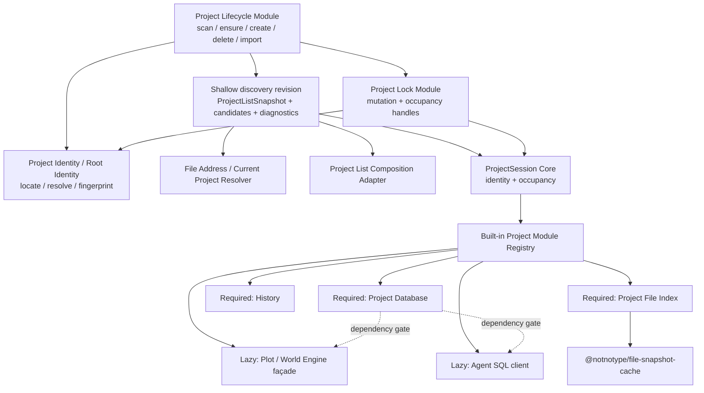

# Task 118：Project 生命周期、文件快照与 Agent 路径合同联合执行计划

> 2026-07-31 CLI 交付路径取代说明：本任务的 Project identity、mutation/Occupancy 与 fail-closed preflight 合同继续有效；CLI implementation/发行所有权由 Task 130 收口。当前同步面是 Product-owned Workspace CLI、`.nbook/agent/bin/workspace(.cmd)` wrapper 与 Product Runtime Contract 的 `workspace` 逻辑命令；下文 `assets/workspace/.nbook/agent/scripts/workspace.ts` 只保留为 hard-cut 时的历史证据，不恢复 asset script 或 `server/scripts` fallback。

> 当前状态：G1–G5 与整体审查结论均已冻结，Phase 0–8 的代码 hard cut 已完成，仍待发布级全量门禁与人工浏览器验收。Session schema v2、Application State catalog v3、runtime fail-closed gate、ProjectSessionController close-then-open、最终 Project HTTP 合同和旧 identity 清理在同一 release train 内落地；真实 State Root 只通过隔离副本演练，正式用户数据不在本任务中再次改写。Project root发布采用portable rename：NeuroBook与`workspace` CLI writer由mutation + Occupancy严格串行，并通过最终同步preflight把非协作外部writer窗口压到最窄；不引入三平台原生atomic no-replace Adapter，接受最终preflight后外部writer创建空同名目录仍可能在POSIX被替换的best-effort边界。
>
> 本任务不是替代 Task 114 或 Task 115，而是它们的协调真相源：Task 114 继续记录文件快照 package 与 NeuroBook adapter 的实现，Task 115 继续记录路径/session hard cut；本 README 冻结二者共享的 Module、Interface、Seam、依赖顺序、发布门禁和跨任务验收。
>
> 术语收口：最终合同只称 Project / Project Workspace，不再使用 `managed Project`。下文“旧 managed session”仅指旧 `workspace/<slug>` session 的迁移来源类别。

## 2026-07-28：Project 封面 mutation 与列表性能边界

- `/api/projects` 继续只消费浅层 Lifecycle snapshot；它只投影 `project.yaml.cover` 字符串，不读取封面文件、不生成变体、不打开 File Index、History、Project SQLite、Session 或 Image Variant Module。
- Project 封面 GET/PUT/DELETE 只接收 `projectRoot`，文件路径始终来自 manifest。GET 在缓存命中前也重新完成 Project、manifest 与文件身份授权。
- Lifecycle 新增 `cover-update` operation，并把 `cover?: string | null` 三态合入既有 manifest transaction。内容寻址原图先发布，manifest 是提交点：known failure 回滚新文件，unknown commit 保留新旧文件，success 后只清理旧应用托管封面。
- Project HTTP 公开的 `committed` 是客户端恢复合同：`false` 可按普通失败修正后重试；`true` 与 `unknown` 都必须先重新读取 Lifecycle snapshot。封面 Dialog 在刷新成功前持续禁用同一 Project mutation；`true` 按最新事实收口，`unknown` 则让用户核对刷新后的封面再决定。
- 首页 mutation 不为 History 记账强制打开 Project。封面原图仍是普通 Project 内容，进入 Project Workspace File Index/下载归档，并在下次正常打开时由 History 对账。详细见 [Task 132](../132-shared-image-variants-project-covers/README.md)。

> 2026-07-23统一审查结论：Project Workspace固定为Workspace Root的一级物理子目录，Project root symlink/junction/reparse point拒绝；本联合任务不新增Project rename命令，只冻结运行中rename的`PROJECT_IN_USE`协作合同。空目录/损坏manifest通过显式“打开目录”入口触发ensure，不再由空列表自动创建默认Project。新建session固定按Workspace Root mutation lock → prospective Project Occupancy Lock → resolve/fingerprint → ensure → root revalidate → snapshot publish → mutation release → 最终同步门禁 → fulfilled handoff → Module ready执行，Occupancy fail-fast；`prepareOpen()` Promise成功履行即为Occupancy所有权提交点，不增加adopter handshake。ProjectModule取代全部ResourceOwner生命周期；required Database/History/File Index并行建立最低ready，lazy Plot/World façade与Agent SQL按需激活，重扫描和维护任务可取消并在后台运行。Project/plain Workspace File Index key必须区分target kind、canonical identity/root与scan policy。

## 2026-07-28：Session v2 hard cut 与统一 Application State runner

- Application State catalog v3 固定按 `app-sqlite → agent-attachment-v1 → agent-session-v2 → agent-session-v2-review-repair` 执行。migration-only registry 拥有 v1/v2/v3 parser；App SQLite 是普通 schema migration step，不建立第二套 registry、journal 或恢复顺序。
- `plan` 只读 migration 目录和 `_prisma_migrations`；数据库不存在时只报告 pending，不创建文件或目录。`apply` 使用 Bun/Node 各自的标准 SQLite driver，并保证每条 SQL 与 migration 记录同事务提交。原 `sqlite-migrate.mjs` 已改为委托这一实现，避免 dev/deploy 两套判断继续漂移。
- Manager 负责 App SQLite 冷备份及外层 Operation Journal，Product runner 负责每个 catalog step 的 backup/checkpoint/schema 事务。两层备份分别用于整次安装事务和单次迁移恢复，不能互相替代。Source Dev、Source/Product Bun、Windows Portable、Source Docker 与 GHCR 都消费同一个候选 Product interface；容器 Profile 使用一次性容器。
- Phase 6 的 Agent Session schema v2、全部 append owner、runtime sentinel gate 与 Phase 4B + Phase 7 已原子切换。Nitro 只接受 complete catalog v3 与 Session v2 sentinel；旧 decoder 和历史 catalog parser 不进入 runtime import graph。
- Session decoder 已把 `migrationReview` 收窄为唯一 `current_project_unresolved`，并与 `currentProjectRoot` 互斥。nullable path 不再触发 review；旧 split-book `filePath` 转为 `path`；不可解析的已结束 apply_patch 只留 warning；迁移 reminder/leaf 使用旧 active path 的逻辑活动时间。
- `agent-session-v2-review-repair` 读取旧 Session v2 manifest 和 source backup，验证当前文件仍以前次 target bytes 为前缀后只替换 migrated prefix，保留迁移后 append。backup、checksum 或前缀冲突直接失败。
- 隔离复制的现有 Session 验收中，repair 只计划并修复 3 份误判：105/177/755 恢复明确 Project，Session 755 的 split-book 参数改为 `path`，最新真实活动仍为 2026-07-21 19:22:02。rollback 后三份 Session 与旧 sentinel 的 SHA-256 均逐字节恢复。真实 State Root 未被本轮修改。

## 2026-07-28：hard cut 实际结果与验证

- Project 激活从候选 handoff 改为 close-then-open：保存检查通过后先停止 SSE/consumer、释放本标签页 presence、清空旧 surface，再等待目标 `open + presence_ready`。close 后失败回 Picker，不恢复旧 Project；普通切换不调用全局 Project close。
- Controller 保留 same-root single-flight、A→B→C latest-wins、release-during-open、迟到结果丢弃与断线重连 revision。主 IDE、Workflow Preview、World Engine Preview 和 Workspace SSE 都只在 exact ready revision 与页面 bootstrap 完成后挂载 Project 数据面。
- 用户浏览器验收发现 presence 请求长期 pending 且页面停在 opening。SSE 请求保持 pending 本身正常，真正故障是响应 0 字节：route 在 `eventStream.send()` 前 `await eventStream.push(presence_ready)`，H3 `TransformStream` 又必须等 send 启动 reader 才能解除 push 背压，形成确定性死锁。现已先启动 send，再异步推首帧；首帧失败会关闭流并释放 presence。真实 localhost 探针在显式 open 后立即收到 200 `text/event-stream` 与匹配的 `presence_ready`。
- Workflow Preview 和 World Engine Preview 的首次 Catalog/World 数据加载失败原本会留下不可见的 ready presence；两者现在都会 release、清空选择并回到未选择态。普通刷新失败仍保留已打开 Project，避免把刷新错误误当成切换失败。
- 两个 Preview 现在按 `projectRoot + readyRevision` 共用 generation single-flight loader。离开 ready 会立即清空旧 Catalog/schema/subjects/slices 并撤销迟到请求的提交权；旧请求的 `finally` 只有仍持有当前 request 时才会关闭 loading。Controller terminal failed 也会让主页面停止 Workspace SSE、清空 surface 并回到裸 `/` Picker。
- Session metadata/runtime/HTTP 已切到 v2。dangling Session 和 `migrationReview` Session 可以列出和 recovery，但 invocation 分别稳定返回 `current_project_missing`、`migration_review_required`；重绑或清除 Current Project 后恢复执行。新的 HTTP 契约测试覆盖两种 409 payload。
- 最终 Picker recovery 审查发现重绑实现仍调用 `requireActiveReadyProject()`：Picker 本来就在未打开 Project 的页面，因此选择一个真实存在但未 open 的 Project 会得到 `PROJECT_NOT_OPEN`。重绑现在只在 Session mutation 临界区校验 Lifecycle snapshot，按 canonical locator 匹配并写回真实目录拼写；它不 open Project、不建立 presence、不增加 occupancy。Invocation admission 仍严格执行 `open → ready generation`，不存在的目标稳定映射为 `404 / PROJECT_NOT_FOUND`。
- 已通过的聚焦证据：config service 60/60（分 6 组）、Project HTTP/Project Session 42/42、Workflow 21/21、Session/HTTP/Attachment/runtime lease 48/48、Harness Current Project/继承/summarizer 8/8、dangling/review Harness 2/2、Agent HTTP 18/18、Product migration/SQLite/Release 声明 18 项、Manager migration/schema/operation/preflight 55 项。最终审查另通过 Session recovery/DTO/HTTP/Project route/页面合同 12 files / 90 tests、catalog/decoder/migration/repair 4 files / 40 tests、presence route/Controller/SSE parser 3 files / 19 tests。完整 config 单进程超过 10 分钟，因此按分组执行并覆盖全部 60 项。
- 本次续接新增 route seam 3 项与 Agent HTTP 18 项通过；Session DTO/repository 35 项、catalog/decoder/migration/repair 40 项、Manager 失败恢复/候选 ownership 66 项通过。Project/Session 组合 224 项中 223 项通过，唯一失败是无关的已删除模型 recovery 投影测试，隔离重跑仍失败；未把它误记为本轮回归或全绿。
- 与旧计划的有意差异：不删除 `workspace/<project>/<relative-path>`。它仍是 `authorized-file-operation` 消费的跨 Project 输入语法；本批删除的是 Session/DTO 中的旧 identity、File Scope 持久化联合及过渡 Adapter。绑定 Project 的普通相对路径和 Bash cwd 仍以 Current Project Workspace 为根，unbound 才以 Workspace Root 为根。
- 本轮发布级复跑：Manager 33 files passed / 1 skipped、209 tests passed / 2 skipped，typecheck/build/pack 与临时安装 smoke 通过；Docker/Release 资产合同 17 项通过；Application State/Session migration 4 files / 42 tests 通过。Source migration runner 在隔离空 State Root 实跑 `plan → apply → already_current`。仓内只有未通过闭包检查的 staging command，不能作为 Product bundle 证据。
- Nuxt raw build 完成，但 Product Runtime Image 后处理被 Task 130 的 `authoring/profile-compile-worker.mjs` 绝对构建路径、`node_modules/.bun/` 路径和未登记 `node-fetch` package island 阻断，因此当前不能声称 Product build/package 或 Product command smoke 通过。根 typecheck 仍被未触及的 `server/agent/skills/llmlint.test.ts` fixture 类型漂移阻断；Runtime typecheck 还受既有第三方/运行时声明缺口阻断。本轮前端组合 5 files / 17 tests 通过。除用户发现并验证的 opening 死锁外，未自动执行其余浏览器验收。

## Relative documents refs

- [SPEC：`currentProjectRoot` 语义规格](SPEC-current-project-root.md)（冻结件）
- [PLAN：第三批回归修复与后续排期](PLAN-batch3-recovery.md)
- [Task 114：文件快照缓存独立包与 Project File Index 生命周期](../114-file-snapshot-cache-package/README.md)
- [Task 115：Workspace Root Agent 路径合同硬切](../115-workspace-root-agent-path-contract/README.md)
- [Task 94：Project 生命周期模型](../94-project-lifecycle-model/README.md)
- [Task 109：File Scope、File Address 与 Product Runtime 路径合同](../109-agent-workspace-path-runtime/README.md)
- [Task 108：Agent Attachment migration 前作](../108-agent-image-attachment-references/README.md)
- [Task 83：Project List Performance](../83-project-list-performance/README.md)
- [Task 21：Project Workspace Index Watcher](../21-project-workspace-index-watcher/README.md)
- [Workspace Terms](../../../reference/workspace/TERMS.md)
- [Project Status](../../../PROJECT-STATUS.md)

## User Request / Topic

- 调度两个现有 Codex 任务：Task 114 的 `/api/projects`、Project Workspace File Index 与 snapshot cache；Task 115 的 Project discovery snapshot、Project identity、Agent cwd、session migration 和路径 hard cut。
- 先理解两边已经确认的需求与当前进度，再整合成一份能按阶段执行、能明确停止条件、能避免两个任务互相返工的计划文档。
- 找出仍会实质改变架构、数据迁移或产品语义的未决项，交给用户拍板；不在计划阶段擅自实现业务代码。

## Goal

建立唯一的联合执行顺序，使以下结果同时成立：

1. Workspace Root 一级子目录与其中的 `project.yaml` 是 Project discovery 的磁盘真相源；进程内只维护可重建的轻量 `ProjectListSnapshot`，供 Project 列表、Project identity、Current Project 解析和文件归属共同消费。
2. `@notnotype/file-snapshot-cache` 成为 Project/plain Workspace File Index 的唯一通用生命周期内核；旧 watcher、dirty/generation、timer、subscriber 和 build Promise 状态机被删除，不形成双 cache。
3. `/api/projects` 只返回轻量 `ProjectListSnapshot`/manifest metadata，不再返回文件、Plot或session统计，也不触发完整文件扫描。
4. Project Workspace File Index 继续构造完整 `WorkspaceFileNode[]`，但只服务已打开Project的文件树、校验、History和watcher消费者。
5. Agent 最终只学习 Workspace Root-relative 与 absolute filesystem path 两种文件地址；Project identity 通过结构化 Current Project/`ProjectListSnapshot` 归属存在，不再依赖 `workspace/<slug>` 字符串。
6. 旧 session、结构化路径记录、pending operation 和 UI scope 经过显式 hard-cut migration；runtime 不保留长期双读、alias 或 legacy 分支。
7. Product、Windows Portable、真实 HTTP 刷新、Nuxt/libSQL 进程资源和迁移回滚均有可复现证据；没有完成门禁时不得宣称任务完成。
8. ProjectSession 只负责 Project 核心身份、Occupancy Lock 和 Module 编排；Project Database、History、File Index 等内置 Module 拥有自己的初始化、状态、重试与关闭生命周期，并为未来插件系统保留清晰接缝，但本任务不建设第三方插件系统。

### Scope boundary

- “打开任意目录”在本任务中统一解释为“打开 Workspace Root 下任意一级已有目录”；不递归发现嵌套 Project，不扫描祖先 `project.yaml`。
- 本任务实现 Occupancy Lock 和 rename 拒绝合同，但不新增 rename UI/CLI。未来若增加 rename，必须另行决定旧 session 是否自动重绑；当前不设计活动 session rekey。
- `/api/projects` 只列出已具备合法 manifest 的 Project；普通一级目录由独立候选目录入口提供，不伪装成 Broken Project。
- Workspace Root alias 在一个 Lifecycle generation 内必须保持稳定；不支持 active Lifecycle 期间把 junction/symlink alias 实时改指向另一物理根。
- State Root 或 Workspace Root 物理位置移动前必须先关闭旧 Lifecycle、Occupancy 与 watcher，再用新 `RuntimePaths` 重建；`ProjectWorkspaceKey` 只是进程内 canonical locator key，不是 durable identity，移动后产生新 key 是正确行为。
- Phase 1 只证明稳定 alias 经 `realpath` 收敛；不宣称支持 `subst`、UNC/本地盘符互换、`\\?\` namespace alias 或其他无法由当前 canonicalization 可靠统一的 Windows 命名空间。
- Project root发布对协作NeuroBook/CLI writer由mutation + prospective Occupancy串行；已明确接受最终preflight后非协作外部writer创建空同名目录仍可能在POSIX被替换的窄best-effort窗口。不得宣称对任意外部writer提供跨平台atomic no-replace或“任何已存在target都稳定`PROJECT_EXISTS`”。

## 2026-07-23 Planning Snapshot

本节保留 hard cut 前的实施快照；当前结论以文件顶部“当前状态”和 2026-07-28/31 实际结果为准。

### Task 114

- 独立 `packages/file-snapshot-cache` 已完成Phase 2深化：0 production dependency、0 NeuroBook领域import、3 files / 39 tests；无consumer的projection/store已删除，显式activation/raw event、默认5秒idle TTL、关闭失败精确handle重试与资源诊断均已稳定。Node/Bun synthetic及三套真实Project Workspace benchmark已重生成。
- package 已通过`ProjectFileIndexAdapter`接入生产；`project-workspace-index.ts`只保留target/DTO薄Adapter，Project/plain Workspace共用唯一`SnapshotCache`。`/api/projects`仍是Phase 4B待删除的旧重列表链路。
- 用户已经明确调整方向：Project File Index 继续接入，但 Project 列表统计功能先删除；不再为了 `/api/projects` 构建或读取文件、Plot、session 统计 projection。
- Project Workspace 与 plain Workspace两类File Index已完成同代迁移；完整`WorkspaceFileNode[]`仍是编辑器文件树和watcher的唯一构建来源。`WorkspaceFileIndexKey`按target kind、ProjectWorkspaceKey/absolute root与scan policy隔离，同root跨kind不串snapshot，也没有第二套cache。

### Task 115

- Phase 1的Project Identity、Root Identity、Lifecycle、Manifest Persistence与Lock Module已经由Phase 3接入ProjectSession；Phase 4A又完成唯一控制面Facade、最终DTO/schema与HMR稳定typed error边界。旧HTTP Product控制面、session migration、cwd/path runtime与DTO/UI hard cut仍待Phase 4B及Phase 5–7完成。
- 已确认：cwd 永远是 Workspace Root；文件地址只保留 Workspace Root-relative 和 absolute 两种；不允许外部 Project；打开 Workspace Root 下一级目录时先执行幂等 `ensure`，缺少或损坏的 `project.yaml` 由 Project Lifecycle Module 静默修复，因此产品不再暴露 Broken Project；只有已经 ensure 的一级目录进入 Project 数据面。
- 不再引入 trusted/untrusted 状态；NeuroBook 默认信任 Workspace Root 内部目标。
- 后续整体审查确认以下实施风险已进入 Phase 0 inventory，并继续约束后续Phase：
  - 2026-07-23 真实 session 快照中有 24 个指向缺失/失效 Project 的旧 managed session；该数字只是带日期的迁移输入快照，不是长期常量。
  - cwd 改变会让旧 session 中已持久化的相对工具参数改变物理含义。
  - durable `workspaceKey` 仍保存旧 `workspace/<slug>` 或 `user-assets` 语义。
  - 当前前端没有“打开已有目录”入口；列表为空时会自动创建默认 Project，路由目标不在列表时会回退到其他 Project，无法触达需要 ensure 的空目录或损坏 manifest。
  - 当前 strict-open 调用方默认 `openProject()` 返回后 Project 已可用；本轮不再引入面板级部分 ready UI，而是并行建立三个 Module 的最低 ready 条件后再完成 open。
  - Project discovery snapshot 的 ensure/create/import/delete/metadata update、manifest-write conflict、watcher/TTL、跨进程 Occupancy 与重建路径均已有 Phase 1 Interface 证据。本任务不新增 rename，产品也不再设计 repair/broken 状态。

### 当前 Project open 与模块加载行为

- Nitro 启动后的旧 Project 列表预热并非 manifest-only：它会扫描全部 Agent session、为每个 Project 构造完整 `WorkspaceFileNode[]`，并打开 Project SQLite 统计 Plot；损坏 manifest 同时会以 `manifestError` 进入旧列表结果。目标实现才是只做一级目录/manifest 的轻量 snapshot。
- `openProject()`现由同一Project Lifecycle执行mutation → prospective Occupancy → resolve/fingerprint → ensure → root revalidate → snapshot publish → mutation release →最终同步门禁→ fulfilled handoff；ensure失败不会建立Database或Session。
- ProjectSession在第一次`await`前接管精确Occupancy handle，required Database/History/File Index全部达到最低ready后才原子发布ready；Plot/World与Agent SQL保持lazy并捕获同generation handle。
- `registerProjectResourceOwner()`与旧按path取得全局File Index/History/Plot/SQL facade的生产入口已删除。HMR registry replacement只影响未来generation，旧generation始终关闭自己捕获的handles。
- shutdown具有`running/closing/closed` gate并会abort opening；close failure保留未关闭handles与Occupancy并返回typed error。Lifecycle唯一浅watcher发现外部rename/delete后关闭对应generation并释放锁。
- 仍待Phase 4B原子切换的是HTTP Project控制面：旧`GET /api/projects`统计链、create/item/delete DTO与前端书架尚未切到轻量`projectRoot`合同；Phase 4A按计划没有提前接线这些Product consumer。

### 当前实现的重复与冲突

- `project-workspace-index.ts`的旧watcher/dirty/generation/debounce/subscriber/resource-owner状态机已删除；唯一通用生命周期位于Task 114 package，NeuroBook文件只保留薄Adapter。
- `novel-chapter.ts` 同时拥有完整列表、manifest、session、per-project 文件/Plot 统计短缓存，并在文件统计 miss 时直接调用完整 `scanWorkspaceTree()`；新计划将删除这条 Project 列表统计链路。
- `listProjectWorkspaces()` 当前会把损坏 manifest 目录包装为 fallback Project；`readProjectManifest()` 只投影核心字段，`writeProjectManifest()` 直接覆盖文件并可隐式创建根目录，未知字段、注释和故障原子性都没有合同。
- `/api/novels` 仍保留 list/create/item 镜像控制面，而 canonical OpenAPI route map尚未登记真实 `/api/projects` list/create/open。目标切片必须删除重复控制面并把 `/api/projects` 变成唯一公开 Project lifecycle Interface。
- 当前 create 顺序是 manifest → 模板 → Database → cache invalidation，既没有 mutation lock也没有 rollback；并发同标题存在 TOCTOU，失败会留下可被列表提前识别的半创建 Project。
- Task 115 早期方案让现有 Project 列表扫描承担 discovery；Task 114 又要重写 Project 列表。目标方向已经收口为 Project Lifecycle Module 发布 `ProjectListSnapshot`，Project 列表只是消费 Adapter。
- Task 114 的早期 Project 列表统计 projection 只保留为历史设计与 deletion review 来源；Phase F 只接入 File Index snapshot lifecycle，并删除无真实消费者的 projection/store。
- 稳定 `CONTEXT.md` 与 `reference/workspace/TERMS.md` 仍描述 Task 109 当前运行合同；在 hard cut 完成前，不提前把目标合同写成已实现事实。

### 2026-07-23 Phase 0 inventory snapshot

#### Agent session 真数据

| 项目 | 数量 | 迁移含义 |
| --- | ---: | --- |
| JSONL / 成功解析 / 损坏 | 499 / 499 / 0 | 本轮迁移可以基于完整可解析集合建立 dry-run 基线 |
| 旧 Project session | 265 | 迁为可选 `currentProjectRoot`；其中 24 个 root 当前缺失 |
| 旧 Workspace Root session | 233 | 新 schema 中 `currentProjectRoot` 为空 |
| 旧 user-assets / external session | 1 / 0 | user-assets 折叠为 Workspace Root session；external fixture仍必须覆盖 |
| 含 durable `workspaceKey` / 含 `currentProjectRoot` | 499 / 0 | 不能只改 header；repository、RunFrame、HTTP、filter与前端 scope都要一起删除旧 key |

以上数字只描述 2026-07-23 的本机数据；apply前必须重新扫描并把新数字、checksum与分类报告写入 migration manifest。

#### 现有 Project 控制面与 UI

| 当前入口 | 当前行为 | 目标动作 |
| --- | --- | --- |
| `GET /api/projects` | 5s 多层 cache + session/File Index/Plot统计 + Server-Timing | 只读不可变 metadata snapshot；不触碰任何 Project Module |
| `POST /api/projects` | 自动分配 `workspace/<slug>`，非事务式写 manifest/模板/DB | Lifecycle create在 mutation lock内完成 staging与原子发布；Database由 Module初始化 |
| `POST /api/projects/open` | 目录存在即建 DB/session，再吞错式预热 History/File Index | 唯一 open orchestration：ensure/发布 snapshot/把 Occupancy handle移交 ProjectSession |
| `/api/novels` 镜像路由 | 与 `/api/projects` 形成第二套 list/create/item | 同一 hard-cut切片删除，不建立转发兼容层 |
| 空列表 / 缺失 route | 自动创建默认 Project / 静默切到首个 Project | 显示“新建 Project”“打开目录”；失败保持当前选择，不静默 fallback |
| 书架卡片 | 把 manifest mtime显示为“最近更新”，并展示全部统计 | 删除统计；若保留时间字段，明确命名为 manifest更新时间，不代表正文活动 |

## Architecture ownership

### Module ownership

| Module | Task owner | Interface responsibility | Must not own |
| --- | --- | --- | --- |
| Project Lifecycle Module / ProjectListSnapshot | Task 115 | shallow discovery、唯一一级watcher、manifest ensure/备份恢复、事务编排、Occupancy ownership handoff、metadata snapshot revision与失效 | 完整文件树、Project File Index watcher、统计 reduce、各业务模块的运行目录 |
| Project Identity / Root Identity（Lifecycle内部Module） | Task 115 | `locate(ref)`在root不存在时派生canonical locator/key；`resolve(ref)`追加物理root、唯一spelling、link/reparse与fingerprint校验 | manifest、锁状态、snapshot、session资源 |
| Project Lock Module | 联合 seam | Workspace Root mutation lock、prospective per-Project Occupancy、fail-fast、sticky compromised门禁、terminal release failure | Project manifest、Module资源、session数据、root存在性判断 |
| File Address / Current Project Resolver | Task 115 | 两类文件地址解析、snapshot attribution、Current/cross Project 选择 | 扫描 manifest、创建 Project、cache 生命周期 |
| ProjectSession Core / Module Registry | 联合 seam | 接管 Occupancy handle、core identity、generation-scoped Module handles、最低 ready、后台任务取消、shutdown/close编排 | Module 私有目录、数据库 schema、文件索引状态机、第三方插件加载 |
| File Snapshot Cache Module | Task 114 | build 去重、generation、stable commit、watcher、subscriber、close | Workspace Root、ProjectSession、H3、SSE DTO、Project discovery、Project list statistics |
| NeuroBook Workspace File Index Adapter | 联合 seam | 完整 `WorkspaceFileNode[]` builder、Issue Index、History event、SSE DTO、artifact ignore、ProjectSession owner | Project discovery、session schema、Project list aggregation |
| Project List Composition Adapter | Task 115 最终 DTO hard cut | 组合轻量 `ProjectListSnapshot`/manifest metadata | 扫描文件、读取 Plot/session、维护 cache entry |

### Depth / Leverage / Locality checks

- Project Lifecycle Module 必须是深 Module；`ProjectListSnapshot` 只是它发布的可重建缓存。磁盘一级目录与 `project.yaml` 才是真相源，不能把缓存条目误建模为额外的 Project 注册表或成员关系。
- Project Identity / Root Identity必须是Lifecycle内部的深Module：调用方只提供`ProjectWorkspaceRef`，不得自行拼接realpath、平台大小写规则、hash、symbol或fingerprint。`locate()`不要求目标存在，`resolve()`才进入物理文件系统校验。
- File Snapshot Cache 只有在删除旧宿主状态机后才获得 Leverage；若只新增 Adapter 而保留旧 index lifecycle，deletion test 不通过。
- ProjectModule 只有在替代 `registerProjectResourceOwner()` 后才通过 deletion test；若新旧 registry 同时决定 close/readiness，职责会分裂。
- ProjectModule registry 必须同时承载 required 与 lazy built-in Module。Database、History、File Index属于 open 的 required minimum-ready；Plot/World Engine façade与Agent SQL client保持按需激活，但仍返回generation-scoped handle并由同一 session关闭。
- Project List Composition Adapter 应保持浅而明确：它只组合多属主数据。扫描、状态机或 snapshot 失效若进入该 Adapter，会破坏 Locality。
- 两个真实 Adapter 才建立 seam：ProjectSession watcher entry 与 unopened one-shot entry 都消费同一个 cache Interface，因此“watcher 是否激活”是实际变化点，不是假想抽象。
- manifest persistence只建立Lifecycle内部的深Seam，负责raw read、recovery、版本化temp、fsync、atomic rename、冲突检查与cleanup；它不成为第二个公开Manifest Module，也不冒充覆盖readdir/lstat/realpath的完整filesystem Adapter。
- Project Lifecycle shallow watcher是单Workspace Root控制面Adapter，不复用File Index的`SnapshotCache`。前者只有一个浅snapshot与一次全量浅重扫；后者负责per-key数据面build、subscriber与完整文件树，两者Depth不同。
- `ProjectLockAdapter`只包住外部`proper-lockfile`依赖，用于确定性故障注入；测试仍穿过`ProjectLockModule`公开Interface，不mock自有Module，也不扩张成通用filesystem Adapter。
- `running/closing/closed`、in-flight与handoff ownership留在Project Lifecycle Module内。另抽只有单一调用方的`LifecycleGate`不能通过deletion test，只会把同一状态机拆散。

## Confirmed decisions

以下内容已经拍板，不再作为本轮问题重复询问：

1. Task 114 进入 NeuroBook Phase F 接入设计和实现；接入必须删除被替代的旧宿主生命周期。
2. 继续构造完整 `WorkspaceFileNode[]`，不引入第二套统计 walker。
3. Project Workspace 与 plain Workspace File Index 同时迁移到同一个 cache 内核。
4. Project 列表统计功能先删除：`/api/projects` 不再返回文件、Plot、session 统计，不再同步等待统计构建。
5. Agent 永远以 Workspace Root 为 cwd；Workspace Root 外不形成 Project；Project Workspace 只允许是 Workspace Root 的一级子目录。打开一级目录时先由 Project Lifecycle Module ensure manifest，之后加载 Project 组件。
6. 不引入 trusted/untrusted 状态，默认信任 Workspace Root 内部目标。
7. 删除 user-assets 路径 scope和 external Project session/完整数据面；任意绝对文件访问继续保留，命中已知 Project root 时按 G1 附加 Project 归属，Workspace Root 外仍是普通绝对文件语义。
8. hard cut 不保留长期 alias、双读或 legacy 分支。
9. 不自动执行浏览器验证；实现后由用户决定是否授权。
10. 运行中的 Project 不允许通过 NeuroBook rename；ProjectSession 从 open 到 grace/close 完成期间持有 Project Occupancy Lock，任何现有或未来的 rename 控制面命中锁时返回 typed `PROJECT_IN_USE`。本联合任务不新增 rename UI/CLI，避免在尚无不可变 Project ID 时引入旧 session 重绑语义。
11. 当前只把内置资源解耦为 Project Module，不建设第三方插件发现、权限、沙箱、市场或动态 npm 加载。
12. Project Database、History、File Index 在 core identity 建立后并行启动，但本轮不建设面板级部分 ready 产品状态。`openProject()` 只在三个 Module 都完成各自最低 ready 条件后成功；重扫描、D15 对账、prune 等重工作作为可取消后台 warm-up，不阻塞 open。
13. 空目录/损坏 manifest 的打开必须有显式“打开目录”交互；`/api/projects` 只列合法 Project，候选一级目录使用独立轻量入口。删除“列表为空即自动创建默认 Project”的隐式行为。
14. `ProjectListSnapshot` 使用“同进程写入同步失效 + 单个 Workspace Root 浅层 watcher + 有界 TTL 兜底”；CLI 不负责原子修改另一个进程的内存。
15. manifest 可解析时保留未知字段，只归一化 NeuroBook 核心字段；无法解析时备份原始字节后生成最小 manifest。所有 manifest 替换使用临时文件与原子替换，不能直接覆盖。
16. create/ensure-mutation/delete或manifest metadata更新需要同时持锁时，固定按Workspace Root mutation lock → target Occupancy Lock获取；Occupancy获取失败立即释放mutation lock并返回`PROJECT_IN_USE`。prepare-open在原子写入与snapshot发布后释放mutation，再通过最终同步门禁并以Promise履行提交handoff；只有履行后ProjectSession才继续持有Occupancy Lock。
17. Project/plain Workspace File Index 共用 cache 内核但不共用模糊 identity；cache key 必须包含 target kind、canonical identity/root 和 scan policy revision，禁止只按绝对 root 复用 entry。
18. Project root 必须是 Workspace Root 下真实一级物理目录；POSIX symlink、Windows junction/reparse point 一律拒绝，既不能作为外部 Project入口，也不能形成同一物理 Project 的多个 alias。
19. `workspace project ensure` 只创建/修复目录与最小 manifest，不物化模板；`create` 只向不存在目标物化模板，已有目录统一改用 `ensure`；`validate` 只读。`--json` 使用单一 versioned envelope、stdout/stderr与 typed exit contract。
20. Project lifecycle公开 HTTP 面只保留 `/api/projects`、`/api/projects/candidates` 与 `/api/projects/open` 等真实 Project 路由；旧 `/api/novels` 镜像控制面随 hard cut删除，不建立转发兼容层。`/api/projects` 返回完整轻量 snapshot，筛选由消费者在内存完成，不再保留为旧重列表服务的 `limit/include/exclude` query。
21. 候选目录只包含“合法单段名、Workspace Root一级、物理目录、尚未成为合法 Project”的目录；缺 manifest与损坏 manifest都只以普通候选目录出现，不向产品暴露 `broken/repair/manifestError` 分类。非法目录名、deleted marker与link/reparse root不进入候选结果，只进入 diagnostics。
22. `POST /api/projects/open` 是唯一产品 open orchestration：合法 Project直接复用/建立 session；候选目录先 ensure，再发布 snapshot，并由`prepareOpen()` Promise履行把同一把 Occupancy handle无缝移交 ProjectSession。禁止 route自行release/reacquire或增加第二套adopter handshake。
23. ResourceOwner迁移必须覆盖 File Index、History、Plot façade与Agent SQL client；World Engine沿现有 façade依赖收口。required Module启动失败时共享 abort、等待全部 settle、按固定依赖逆序关闭成功 handle；用户重试重新建立整个 session，不做隐藏的单 Module在线重试。
24. close失败时 ProjectSession进入进程内 `closing_failed`，拒绝新数据面请求并继续持有精确 Module handles与Occupancy Lock；close/delete不得报告成功。重试只能操作该 generation的旧 handles，不能查询最新 registry后按 key猜测资源。
25. session hard-cut migration复用现有 Agent Session Store `runtime.lease` 作为 runtime与离线迁移唯一互斥锁，并将其泛化命名；不新增 control-plane maintenance lease，也不再叠加第二把 migration writer lock。versioned sentinel/journal只负责 crash recovery与schema状态。
26. `.nbook/recovery/**` 保存 manifest 语义改写前的逐字节原文，是只追加、不可重建的恢复资料，不属于可删除的 Project Runtime Artifact。File Index 与 History忽略它，但完整 Project归档/备份必须原样保留；Lifecycle transaction temp只按精确、版本化命名 matcher忽略，禁止使用`*.tmp`等宽泛规则隐藏用户文件。
27. canonical Project locator的冻结输入是`canonical Workspace Root realpath + NUL + 平台规范化的单段 projectRoot`；Windows大小写不敏感，POSIX保留大小写。`ProjectWorkspaceKey`使用`Symbol.for("nbook.project-workspace.v1:" + opaqueSha256)`或等价进程级owner，symbol描述不得包含裸路径。目录删除后同名重建可复用key，旧资源仍必须由session generation与root fingerprint隔离。
28. Occupancy identity不依赖目标已存在或Project root `realpath`：Lock Module消费与第27条相同的locator语义派生opaque artifact hash，但不得使用`ProjectWorkspaceKey`本身。key与lock hash是两个不同identity carrier；Windows同一canonical locator对应多个物理目录spelling时返回`PROJECT_ROOT_CASE_COLLISION`，全部排除出Project/candidate snapshot并进入diagnostics。
29. `ProjectLifecycle`公开只保留意图式`ensure/create/validate/delete/importProject`与单独的`prepareOpen`；不公开transaction/staging path。`create/import/ensure-missing`共用私有staging/publish Implementation，`validate`完全只读。
30. manifest的portable保证是“协作writer串行 + raw recovery + best-effort外部冲突检测 + atomic publish”，不是对任意非协作编辑器的跨平台CAS。检测到变化返回typed `PROJECT_MANIFEST_CONFLICT`；不为这轮引入平台专用强制锁/no-replace实现。
31. `proper-lockfile` release失败不可通过重复调用原closure可靠重试。Lock handle内部把sticky compromised与单次release状态收口为`held/compromised → releasing → released | release_failed`；公开Interface只暴露`compromised`、同步`assertHealthy()`与`release()`。失败缓存同一个typed `ProjectLockReleaseFailedError`（`code=PROJECT_LOCK_RELEASE_FAILED`、`kind`、`projectRoot?`、`cause`、`staleMs=30000`），重复/并发release不得再次调用旧closure。metadata sidecar文件名必须包含owner token，成功只删除自己的精确路径；失败保留sidecar和旧generation诊断，禁止手工删除锁目录或猜测清理新owner artifact。
32. Lifecycle必须具有`running/closing/closed` gate、共享AbortSignal、generation-scoped in-flight登记与close等待；所有公开async Interface都进入同一登记。锁compromised、root fingerprint变化、close或abort都必须在manifest atomic rename前后、snapshot commit前、mutation release前和Occupancy handoff前fail closed。
33. `prepareOpen()` Promise成功履行就是Occupancy ownership handoff commit：履行前handle始终归Lifecycle，任何失败、abort或close都由Lifecycle单次释放；snapshot发布后先释放mutation，再执行不含`await`的最终Lifecycle/Occupancy/root-generation门禁，最后履行Promise。履行后Lifecycle不得再释放该handle，ProjectSession必须在第一次`await`前同步保存精确handle并接管sticky compromised监听。不增加one-shot adopter handshake。
34. “拒绝所有Windows reparse Project root”继续作为目标合同；当前`lstat().isSymbolicLink()`只证明普通symlink/junction。Phase 1退出前必须用Windows专用检测/真实smoke证明通用reparse边界，否则不得宣称该合同已实现。
35. 实现文件按Locality收口：`project-identity.ts`只保留ref/locator/stable key；`project-root-identity.ts`承载物理resolve、fingerprint、ABA revalidate与Windows reparse；`project-lifecycle-manifest.ts`承载raw read/recovery/temp/conflict/atomic publish；`project-lifecycle.ts`保留状态机、in-flight、事务编排与ownership。该拆分不改变公开Lifecycle Interface。

## Confirmed decision record

以下决定会改变数据行为、生命周期或迁移结果，用户已于 2026-07-22 全部确认采用建议方案。hard cut仍需先完成Phase 0 inventory与迁移门禁。

### G1. 绝对路径落入 Project 时的归属

**决策：采用建议。**

**建议：按 `ProjectListSnapshot` root containment 识别为同一个 Project。**

- 相对地址按第一段查 `ProjectListSnapshot`。
- 绝对地址 canonicalize/realpath 后，只与 snapshot 已知 Project root 做 containment 匹配。
- 不扫描祖先 `project.yaml`，不发现 Workspace Root 外 Project。
- 同一物理文件无论使用相对还是绝对地址，都获得一致的 open gate、History、Inbox 和 Context Access 语义。

备选：绝对路径始终是普通文件系统目标。代价是 Agent 用绝对路径修改 Project 文件时不记录 History，也绕过 Project open gate；这与 Task 115 的目标合同和现有“Current Project 内绝对路径保留归属”的行为都不一致。

### G2. 缺失 Project 的旧 session

**决策：采用建议。**

**建议：session codec 只校验 `currentProjectRoot` 是合法单段 locator；invocation 时再查 `ProjectListSnapshot`。**

- 缺失 Project session仍可读取、搜索、归档和查看历史。
- 继续运行返回 typed `current_project_missing`。
- 控制面提供“重新绑定 Project”与“清除 Current Project”。
- 不把 2026-07-23 inventory中的 24 个 stale session静默折叠成 Workspace Root，也不让它们阻塞整个发布；apply前重新扫描，不能把24写死进脚本。

备选：迁移时强制清除 Current Project。代价是丢失原 Project 语义，且历史路径无法可靠解释。

### G3. 旧 session 中相对路径与 pending operation 的迁移

**决策：采用建议。**

**建议：只重写结构化、可证明来源的路径记录；不重写自由文本。**

- managed session：`lorebook/a.md` → `<slug>/lorebook/a.md`。
- user-assets：`agent/...` → `.nbook/agent/...`。
- external session：按旧绝对 root 把结构化相对地址转换为绝对地址。
- waiting approval、pending write/edit/apply_patch、Plan pending、follow-up/steer 中未执行操作全部取消，禁止迁移后直接批准旧操作。
- active leaf 追加一次模型可见的路径合同迁移说明。
- 无法安全转换的 structured record 使该 session进入“可读、不可直接继续”，等待用户确认或重绑定。

字段级 migration ledger 固定如下；只有 schema能证明路径语义的字段才允许重写：

| 载体 | 字段/形态 | 迁移动作 |
| --- | --- | --- |
| Header | `metadata.workspaceRoot/workspaceKey/projectPath/initial` | 写入新 schema version与可选 `currentProjectRoot`；删除旧 root/key/path，`initial` 内无法证明的内容不猜测 |
| Assistant tool call | 文件工具 `path`、`apply_patch.patch` 中 Add/Update/Delete/Move、Project工具 `projectPath`、`create_agent` scope、`switch_mode.planFilePath` | 按工具 schema逐项解析并重写；patch必须解析操作而不是替换字符串 |
| Workflow/tool script | `run_workflow.args/script` 等自由代码或混合 JSON | 只改有正式字段 schema的 locator；脚本正文不重写，存在路径歧义时把 session标为read-only |
| Tool result | `message.details`、mode approval中的 `data.planFilePath/planContent` | 仅处理有判别类型的字段；任意 details文本不做全文替换 |
| Custom state | `agent.mode.workDirectory`、`plot.selection.projectPath`、`agent.pendingUserResolution.*`、follow-up queue、`variable_patch` | locator按 schema迁移；pending resolution/follow-up清空或追加取消结果，不允许自动续跑 |
| Linked Agent / Attachment / steer | linked关系只存session引用；attachment ref无路径；steer queue只在内存 | 子 session各自迁移；attachment不做无意义rewrite；steer不属于离线数据 |

“取消 pending operation”不是只删一个 flag：migration必须在active branch为缺少终态的 tool call追加明确的迁移取消 tool result，清空对应 `agent.pendingUserResolution.*` 与持久化 follow-up queue，并验证 branch仍满足 call/result完整性。`RunFrame.pendingWritePlans`、当前进程 steer queue等纯内存状态不进入离线rewrite。

**继续策略已确认：** 成功完成结构化迁移的旧 Project/user-assets session允许继续，并显示一次路径合同迁移提醒；旧 external/ambiguous session默认保持可读但不可直接继续，等待用户清除或重新绑定 Current Project。

迁移协调采用一次性离线状态机，不引入新的 control-plane maintenance lease：把现有 Agent Session Store `runtime.lease` 泛化为唯一 store lock，正常 runtime全生命周期持有，离线 migration只有在runtime退出后才能取得同一把锁。取得锁后，versioned sentinel记录 `pending/applying/complete/rollback_required`、目标schema、backup/stage/checksum与journal cursor。runtime启动必须先取得store lock再检查目标schema为`complete`；`applying`崩溃后必须显式resume/rollback，rollback恢复backup并复核上一schema sentinel。这样消除“启动检查通过后 migration再插入”的TOCTOU，而不增加第二种maintenance概念。

### G4. durable `workspaceKey`

**决策：采用建议，删除 durable `workspaceKey`。**

**建议：从整个 Session Interface 删除，不只是改 metadata。**

- session 由全局 `sessionId` 寻址。
- Project session列表按 `currentProjectRoot` 过滤。
- Workspace Root session按 `currentProjectRoot` 为空过滤。
- user-assets 面板使用 UI scope/profile group，不写入 session header。
- localStorage 可以保留明确的 UI scope key，但不得复用为 Project locator。
- Session repository查询、RunFrame/invocation context、HTTP DTO、session list/filter、前端请求与UI scope必须同步删除或替换旧 `workspaceKey`；不能只迁移499个JSONL header后继续让运行时传播该字段。
- `ProjectWorkspaceKey` 只存在于进程内 ProjectSession、cache与presence映射，绝不作为领域字段写入 JSONL、HTTP DTO、localStorage、Operation Journal、数据库列或持久化索引。它必须跨Lifecycle实例与HMR稳定，使用`Symbol.for("nbook.project-workspace.v1:" + opaqueSha256)`或等价进程级owner；hash输入是canonical Workspace Root realpath与平台规范化canonical Project locator，symbol描述不得包含裸路径。
- 跨进程锁复用同一个canonical locator语义，但由Lock Module独立派生opaque文件名；锁名和`ProjectWorkspaceKey`是两个不同identity载体。locator删除后同名重建可以复用进程key，旧session/resources仍由generation与不持久化的root fingerprint隔离，不能只凭key复用旧handle。

备选：保留并重定义为纯 UI/session namespace。代价是长期维持一个容易重新承载 Project Path 的模糊 string Interface，也无法完成旧 `workspace/<slug>` 生产零命中。

### G5. Project discovery snapshot 与 `project.yaml` 写入（静默 ensure）

**决策：Project Lifecycle Module 独占 manifest 写入；打开目录时自动执行幂等 ensure。`ProjectListSnapshot` 只缓存磁盘事实，不维护额外注册表或成员关系。**

- Project Lifecycle Module的一次浅扫描同时产生同revision的合法 Project列表、候选根与内部 diagnostics；公开 `ProjectListSnapshot` 只包含合法 Project，候选入口只包含未成为合法 Project的可打开目录。这里没有额外 Catalog实体、membership数据库或第二个真相源。
- `ensure/create/delete/import` 成功后使当前进程的 shallow discovery snapshot失效并发布新 revision；未来 rename 若单独实现也必须失效 snapshot。其他进程或 `workspace` CLI 造成的变化由唯一 Workspace Root浅层 watcher或有界 TTL 触发重建，不要求 CLI 原子修改另一个进程的内存。
- 用户打开 Workspace Root 下一级目录时自动调用 `ensure`，因此打开后的目录不再存在 `folder` 或 `broken` 产品状态；没有 manifest 的普通目录只在候选目录入口出现。
- Project root 目录项必须是物理一级目录；symlink/junction/reparse point 在候选、ensure、create、open与snapshot阶段统一返回 typed拒绝，不做 canonical alias。
- 健康 manifest绝不为了格式化而重写。manifest可解析但核心字段缺失/非法时，使用 YAML Document级合并只修改 NeuroBook拥有的 `kind/title/summary`，保留未知 mapping、字段顺序与注释能力；任何已有文件发生语义改写前都先备份原始bytes。manifest无法解析时同样先把原始bytes备份到该 Project的`.nbook/recovery/`，再生成最小合法manifest。
- Lifecycle内部建立私有`ProjectManifestPersistence` Seam，集中负责raw read、逐字节recovery、精确版本化temp、flush/fsync、atomic rename、冲突检查与token化cleanup；ProjectLifecycle仍是唯一公开深Module。目录发现、lstat/realpath与snapshot不伪装成该Seam的一部分。
- mutation/Occupancy只能串行化遵守协议的NeuroBook与`workspace` writer。portable Node的`expectedRaw → recheck → rename`在recheck与rename之间仍存在极小窗口，因此合同只承诺best-effort外部冲突检测；检测到变化返回`PROJECT_MANIFEST_CONFLICT`并保留原文件/旧revision，未检测到的非协作外部竞态由raw recovery降低损失，不宣称真正CAS。
- 普通文件写入 `project.yaml` 不得直接调用进程内发布接口；Agent 或其他控制面必须调用 `workspace project ensure`，避免各业务模块各自解释 manifest。snapshot watcher/TTL 最终观察磁盘变化。
- File Address Resolver 只读当前 `ProjectListSnapshot`，不在每次文件访问时自行扫盘。

### Lifecycle transaction Interface

- 公开Interface固定为`ensure(ref)`、`create(input)`、`validate(ref)`、`delete(ref)`、`importProject(input)`；结果统一返回已发布的Project metadata与revision，事务phase、staging path和rollback handle不泄漏给HTTP/CLI。`prepareOpen()`单独返回待ProjectSession adopt的Occupancy handle。
- `ensure`对不存在root也成立：在`Workspace Root/.nbook/lifecycle/staging/v1-<token>/`构造仅含最小`project.yaml`的目录，不复制模板；已有空/普通目录只修复manifest。健康manifest不改bytes/mtime，但新建session的prepare-open仍发布当前磁盘事实。
- `create`与`importProject`先在同卷隐藏staging完成慢速materialize、manifest ensure和验证，再进入短事务：mutation → prospective Occupancy → target/case-collision recheck → 单次rename发布root → resolve/root fingerprint revalidate → snapshot publish → 逆序释放。已有目标稳定返回`PROJECT_EXISTS`，不得merge。
- 模板通过Lifecycle内部`ProjectTemplateAdapter`写入staging；首版只包装现有默认模板能力，不建设模板registry。模板不得拥有`project.yaml`，否则返回`PROJECT_TEMPLATE_FAILED`。Archive/Upload层负责解释import source，Lifecycle只接收可materialize到同卷staging的source。
- `validate`完全只读：不取mutation/Occupancy、不启动watcher、不写bytes/mtime、不推进revision；可修复manifest问题返回结构化issues，非法root/link/not-found/真实I/O仍返回typed error。
- `delete`不隐式close。调用方先关闭Project；Lifecycle随后mutation → prospective Occupancy → resolve/revalidate → 原子移动到`.nbook/deleted-projects/v1-<token>/` → publish absence revision。publish前失败必须移回；commit后tombstone递归清理是best-effort后台工作，不能把已提交删除回滚成成功假象。
- staging/temp/tombstone只能按版本与owner token精确识别。失败清理只能删除本事务token拥有的路径；scan/candidates/File Index/History按各自语义忽略，完整Project归档只保留recovery，不保留未提交staging/temp/tombstone。
- 事务错误至少覆盖`PROJECT_EXISTS`、`PROJECT_TEMPLATE_FAILED`、`PROJECT_IMPORT_FAILED`、`PROJECT_VALIDATION_FAILED`、`PROJECT_PUBLISH_FAILED`、`PROJECT_ROLLBACK_FAILED`、`PROJECT_MANIFEST_CONFLICT`与`PROJECT_LOCK_RELEASE_FAILED`，并携带`operation/phase/committed`；调用方不得在`committed`不确定时盲目重试。

### Shallow watcher、TTL 与 diagnostics

- Project Lifecycle使用一个独立、很薄的Workspace Root watcher，不复用File Index或`SnapshotCache`。首次读取幂等启动唯一watcher；初始浅扫描不依赖watcher ready，启动/运行错误只进入diagnostics。
- watcher只接受一级目录`addDir/unlinkDir`与`<一级目录>/project.yaml`的`add/change/unlink`。事件先使当前generation失效，再约120ms防抖触发一次完整浅重扫并发布更高revision；不维护增量Catalog，不观察Project正文和更深目录。
- snapshot TTL默认5秒，从成功发布时间计算，普通读取不续期；TTL到期后的首个读取强制浅扫描，并发读取共享同一in-flight。watcher失败时TTL前允许旧snapshot，TTL后必须重扫；watcher重试每个TTL窗口最多一次，不建立周期扫描timer。
- `close()`清除debounce、关闭watcher、abort/等待generation-scoped in-flight，并拒绝后续读取。迟到ready/event/scan不得发布revision或返回无人接管的Occupancy handle。
- diagnostics是有界、进程内、只读投影，至少记录revision、cache fresh/expired、刷新原因/时间/错误、watcher idle/starting/ready/failed/closed与最近一次discovery issues。它不进入`/api/projects`或candidates DTO；missing manifest是普通candidate，corrupt/normalizable可作为candidate加内部issue，unsafe root/manifest link只进入diagnostics。

### 静默 ensure / Project 交互合同

用户从“打开目录”入口选择 Workspace Root 下任意一级已有目录时，产品通过 `POST /api/projects/open` 执行一次原子的 prepare-open，并把目录直接纳入 Project 生命周期：

1. 先按`projectRoot`查询当前进程ready session generation；存在时直接复用。否则只校验Workspace Root一级locator语法，按mutation → prospective Occupancy获取两把锁，再进入物理resolve。锁获取失败返回`PROJECT_IN_USE`，不得先创建root/manifest，也不建立ProjectSession。
2. 取得Occupancy后resolve并捕获不持久化的root fingerprint；缺少`project.yaml`时写入最小合法manifest，可解析但缺字段时保留未知字段并逐字段归一化，无法解析时先备份原始bytes再恢复。全程观察Lifecycle close/abort与两把锁的sticky compromised状态。
3. manifest atomic rename前后、snapshot commit前和mutation release前分别执行Lifecycle/lock门禁并复核root fingerprint；外部rename/delete/recreate或已检测到的manifest变化返回typed conflict，不继续提交。
4. manifest ensure成功后，在仍持有同一Occupancy handle的情况下发布shallow discovery revision；随后释放mutation，立即执行一次不含`await`的最终Lifecycle/Occupancy/root-generation门禁。`prepareOpen()` Promise成功履行即完成Occupancy handoff，不增加ProjectSession确认回调，也不得release/reacquire留下rename/delete窗口。
5. ProjectSession收到fulfilled结果后，必须在第一次`await`前同步保存精确Occupancy handle并接管sticky compromised监听，再建立core identity和启动built-in Module。各Module只幂等创建自己拥有的目录和文件，不要求一个“大初始化”步骤；模块初始化期间由session generation/AbortSignal防止close后的迟到Promise写回。
6. Promise履行前，manifest ensure、root复核、snapshot发布、mutation release或最终handoff gate任一步失败时，Occupancy仍归Lifecycle并由其单次释放，不建立ProjectSession；release failure必须保留顶层typed code与`committed`状态，不能被裸`AggregateError`或“回滚成功”覆盖。Promise履行后Lifecycle close不得再释放已移交handle。真实权限、磁盘、锁或数据库I/O错误是当前操作错误，不新增Broken Project状态。
7. open成功后直接把最终Project metadata返回给UI，再异步刷新本地列表；UI不要求目录预先出现在列表，也不在列表为空时自动创建默认Project。

服务启动只浅扫描、缓存和诊断manifest，不在后台静默改写损坏文件。`GET /api/projects`只消费轻量`ProjectListSnapshot`，`GET /api/projects/candidates`消费同revision的候选投影；目录入口打开缺少合法manifest的目录时才执行ensure。两者都不调用File Index、History、Project Database或session repository。缓存由同进程主动失效、一个浅层watcher和TTL共同收敛；watcher失败时允许有界stale-read，但TTL到期必须重扫并发布diagnostic。

最终轻量列表DTO固定为manifest metadata：`projectRoot`、`kind`、`title`、`summary`、可选 Project Workspace 相对路径 `cover`，以及可选的明确命名`manifestUpdatedAt`。删除`id/projectPath/workspaceSlug/updatedAt/manifestError`和所有统计字段；若前端展示`manifestUpdatedAt`，文案必须说明它只是Project配置更新时间。列表返回完整snapshot，稳定排序为`manifestUpdatedAt`降序、`projectRoot`升序兜底；候选目录按`projectRoot`升序，消费者在内存筛选。`cover` 是 2026-07-28 增补的轻量 manifest 字段，不触发列表文件探测。

### ProjectSession Occupancy Lock 与 rename 合同

- Occupancy Lock 是 NeuroBook各进程和`workspace project ...`之间的长期协作锁，统一位于`Workspace Root/.nbook/locks/projects/`。锁名固定为`SHA-256(canonical Workspace Root realpath + NUL + platform-normalized single-segment projectRoot)`；Windows归一为case-insensitive，POSIX保留大小写。目标尚不存在时仍能预占同一把锁。锁名不能使用裸目录名、`ProjectWorkspaceKey`或持久化字段。`proper-lockfile`自身独占锁目录并通过mtime heartbeat判定stale；诊断metadata只能写相邻、带owner token的sidecar，不得写进锁目录，也不参与ownership/stale/compromised判断。
- Workspace mutation与Occupancy共用`stale: 30_000`、`update: 10_000`；二者只在竞争策略上不同：Occupancy固定`retries: 0`并fail-fast，mutation使用有界等待。所有NeuroBook进程、CLI和Product副本必须复用同一组常量并显式处理`onCompromised`。
- 另设Workspace Root mutation lock，只覆盖prepare-open、create/ensure-mutation/delete/import这类短时文件系统事务；新建session即使manifest健康也固定先取得mutation，再取得prospective Occupancy，以保持单一open线性化顺序。未来rename若进入独立任务，必须同时保护源、目标和snapshot发布，不得只锁旧slug。
- Occupancy Lock 从 ProjectSession open 开始持有，presence 归零后的 grace 期间仍持有；所有 Module 完成关闭后才释放。初始化失败、shutdown、HMR 和迟到 Promise 都必须释放或失效锁。
- 健康 Project的幂等open先检查当前进程是否已有ready session generation；已有则复用，不重复竞争自己的Occupancy Lock。新generation仍走完整mutation → prospective Occupancy → resolve/fingerprint → ensure → root revalidate → snapshot publish → mutation release → fulfilled handoff。对已打开Project执行允许的manifest metadata更新时，Lifecycle Module必须显式借用当前generation的handle，不能再次加锁自死锁；已持mutation的私有事务路径也不得递归调用public `ensure/prepareOpen`。
- Lock handle公开Interface固定为`compromised`、同步`assertHealthy()`与`release()`。mutation/Occupancy任一compromised后，Lifecycle不得replace manifest、发布snapshot、释放mutation后继续handoff；ProjectSession adopt后若Occupancy compromised，立即停止新数据面并关闭generation。
- release底层closure最多调用一次，并发调用共享同一Promise；成功后幂等，失败后缓存并重复返回同一个`PROJECT_LOCK_RELEASE_FAILED`。`proper-lockfile`可能在删除锁目录前已标记released，第二次调用只会得到`ERELEASED`，因此不得把重试旧closure写成恢复策略。sidecar使用`<opaque>.<owner-token>.metadata.json`一类精确路径，成功只删除本handle文件；release失败或compromised后release失败保留诊断，等待最多`stale: 30_000`的协作恢复窗口。
- resolve后捕获Project root物理fingerprint，并在manifest rename前后、snapshot commit前与handoff前复核，防止同路径rename/delete/recreate的ABA替换。fingerprint至少组合canonical realpath与平台可用的`dev/ino/birthtimeNs`等不透明事实，只在进程内用于generation安全，不成为durable Project ID。
- Lifecycle内部状态固定为`running → closing → closed`；所有公开async操作登记到当前generation并共享AbortSignal。`close()`先拒绝新操作、abort并等待in-flight，再关闭watcher/锁；迟到scan不得发布revision，迟到prepare-open不得返回无人接管的Occupancy。
- `ProjectLockAdapter`只包外部`proper-lockfile.acquire(file, options)`：production Adapter执行真实锁，controlled test Adapter触发`onCompromised`与release故障。调用方与测试都只消费`ProjectLockModule` Interface。
- delete绝不隐式抢占或强关其他使用者：占用中返回`PROJECT_IN_USE`。删除当前Project的UI必须先走“关闭并删除”协调流程，处理未保存内容、presence与agent运行状态，确认close成功并释放Occupancy后再提交delete；close失败则delete中止。
- 本联合任务不新增 rename UI/CLI；任何已有或未来 rename 入口在锁持有期间稳定返回 `PROJECT_IN_USE`，不得尝试边运行边 rekey File Index、History 或数据库连接。
- 该锁不能阻止 Explorer、PowerShell 或第三方程序绕过 NeuroBook强行rename。由Project Lifecycle Module唯一的Workspace Root浅层watcher发布root removed/replaced revision并通知ProjectSession；Session立即停止接收新数据面请求、关闭Module并释放旧handle，不再为每个Project另建第二个root watcher。必须测试stale lock、第二进程竞争、外部移动/删除与snapshot通知竞态。

### 内置 Project Module 生命周期与加载策略

- 本轮建立最小的内置`ProjectModule` Interface/registry，原位深化并最终替代`registerProjectResourceOwner()`；不实现第三方插件发现、权限、沙箱、市场或动态npm加载。
- registry支持两类built-in Module：required Module在open时启动，当前为Project Database、History、File Index；lazy Module在首次数据面使用时启动，当前至少覆盖Plot/World Engine façade与Agent SQL client。两类都必须返回session-generation-scoped handle并由同一ProjectSession关闭。
- Module descriptor可以声明built-in依赖，但不做通用插件依赖求解器。Plot/World Engine和Agent SQL依赖Database ready；History raw-event sink必须在File Index watcher activation前完成绑定。
- required Module在core identity后共享一个AbortController并行启动，`openProject()`等待各自最低ready后才成功；本轮不建设面板级部分ready产品状态。最低ready定义为：Database schema gate完成、History库打开并完成必要路径清理、File Index event seam/cache/watcher ready。
- 不能直接使用首错即返回的裸`Promise.all`：首个失败先abort其他启动，再`allSettled`等待全部收尾，最后按固定依赖逆序关闭所有成功handle并释放Occupancy。opening状态对`assertProjectOpen`不可见；只有全部required ready后才原子发布ready session。
- 完整 tree build、History D15 对账、auto-accept/prune 等重工作是可取消的 warm-up，不阻塞最低 ready；数据面通过 Module 共享 Promise 等待自己的重工作，不得由 HTTP route 自行 fire-and-forget 并吞错。
- File Index watcher收到的raw event batch必须在rebuild前交给History reconcile seam，即使builder失败也不能丢；SSE仍只在stable commit后发布。`SnapshotCache.subscribe()`不能冒充这两个时点相反的Interface。
- `scanWorkspaceTree()`及递归visitor必须真正贯穿AbortSignal；只禁止late commit而不能停止I/O，不算“可取消warm-up”。
- 任一最低ready失败时回滚整个open；用户重试重新建立新session generation。ready后的warm-up失败可在该Module内记录diagnostics并由下一次真实消费者重试共享Promise，但不把Project变成Broken状态。
- shutdown先把runtime置为`closing`、拒绝新open，abort opening/warm-up，再按generation关闭。Module close失败时保留精确handle与Occupancy，进入`closing_failed`并返回typed error；禁止像旧`leakedProjects`一样只记key后用最新registry猜测旧资源。

### Agent 与 `workspace` CLI

- Agent 不直接通过 `write/edit` 管理 Project manifest、Project 列表缓存或数据库初始化。
- Project 生命周期统一使用稳定入口 `workspace project ...`：幂等 `workspace project ensure <project-root> --json` 只创建/修复一级目录与最小 manifest，不物化模板；`workspace project create <project-root> [--template <name>] --json` 只向不存在目标物化默认/指定模板，已有目录返回 `PROJECT_EXISTS` 并提示 `ensure`；`validate` 只读。
- 内容节点统一使用 `workspace node ...`。Agent runtime 只调用 `workspace`，不提示或依赖项目根目录下的 `scripts/workspace.ts`。
- 各业务 Module 可以创建自己的 `.nbook/...`、`.agent/...` 和 runtime artifact，但不得各自解析或改写 `project.yaml`；Project Database 也由其 Module 自行初始化，不开放让 Agent 手工拼接数据库初始化步骤。
- Agent 的 cwd 仍永远是 Workspace Root；`workspace` CLI 的 Project 参数只接受 Workspace Root-relative 单段 root，不再接受绝对 `--target`、祖先发现或 `workspace/<slug>` compatibility 字符串。
- 删除 `workspace project init-db` 与 `--no-db`：数据库由 Project Database Module 自行初始化。`validate` 可在 Project 运行中只读执行；`ensure` 对健康 manifest 可只读成功，实际修复/create/delete 等 mutation 必须取得 mutation/occupancy lock。
- `--json` stdout 只输出一个 versioned success/error envelope，日志写 stderr；exit 0 表示成功，typed failure 非 0。至少冻结 `INVALID_PROJECT_ROOT`、`PROJECT_ROOT_LINK_UNSUPPORTED`、`PROJECT_ROOT_CASE_COLLISION`、`PROJECT_IN_USE`、`PROJECT_EXISTS`、`PROJECT_NOT_FOUND`、`PROJECT_MANIFEST_IO`、`PROJECT_MANIFEST_CONFLICT`、`PROJECT_TEMPLATE_FAILED`、`PROJECT_IMPORT_FAILED`、`PROJECT_VALIDATION_FAILED`、`PROJECT_PUBLISH_FAILED`、`PROJECT_ROLLBACK_FAILED`、`PROJECT_LOCK_RELEASE_FAILED`。
- hard cut 同步源码 CLI、Bundled Workspace Template、Product 打包副本、真实 user runtime `.nbook/agent/bin` wrapper与测试；旧自定义副本不提供 compatibility，版本/preflight 不匹配时 fail closed并提示重新同步。
- 本任务不新增 `workspace project rename`；未来单独实现时必须先冻结 session 重绑策略和源/目标锁事务。

当前 CLI 与目标合同的删除矩阵：

| 当前能力 | 目标 |
| --- | --- |
| 尚无 `workspace project ensure` | 新增幂等ensure，健康manifest只读成功，真实修复使用mutation/occupancy合同 |
| `create`接受`workspace/<slug>` alias与任意`--target` | 只接受Workspace Root-relative单段`projectRoot`；Workspace Root外不形成Project |
| `create --no-db`，且可向已有目录补模板 | 删除`--no-db`；已有目录稳定`PROJECT_EXISTS`并提示ensure；Database由Module初始化 |
| `validate`接受任意目录、向祖先发现manifest并检查SQLite | 只读校验指定一级Project manifest/root；不扫描祖先、不承担Database readiness |
| 顶层`workspace schema` | 内容节点能力统一迁到`workspace node schema` |
| `workspace node`通过absolute target或祖先manifest发现external Project，并兼容`workspace/<slug>/...` | 输入只保留Workspace Root-relative（含`<projectRoot>/...`）与absolute filesystem path；absolute只按已知snapshot containment附加归属，不发现新Project |
| JSON输出混合日志/结果，错误无统一code | 单一versioned envelope；stdout仅协议，stderr仅诊断，typed非零exit |

CLI原子同步面必须在同一 hard-cut 切片一起更新：Product-owned `server/workspace-files/workspace-command.ts`、真实 user runtime、`.nbook/agent/bin/workspace(.cmd)` wrapper、Product Runtime Contract 的 `workspace` 逻辑命令，以及 `system-assets-preflight`、`sync-user-assets`、`prepare-system-assets` 和 Product 打包/部署入口。Source checkout wrapper 调用 Product-owned source entry，发行物统一解析 Runtime Contract；已删除的 asset script 与 `server/scripts` 路径只保留历史证据，任何版本不匹配都必须 fail closed，不能让旧 CLI 写新 schema。

### 已撤销的 G6 / G7

- G6“未打开 Project 的 projection maintenance lease”随 Project 列表统计删除而撤销，不再引入该 Module 或生命周期概念。
- G7 不再涉及 projection；实时 Project Workspace File Index 继续遵守 Task 21/CONTEXT 的弱一致 snapshot 合同，作为实现约束而不是新的用户决策门禁。

## Executable plan

发布边界：Phase 1–8 是同一个release train，Phase 8总门禁完成前均不可发布；阶段只用于控制依赖和验证，不允许把旧/新 identity、CLI或session schema的中间态打进 Product。Phase 4拆为4A控制面groundwork与4B Product切换：4A只冻结可独立验证的Facade、DTO/schema、typed error与Interface，不翻转当前公开响应或consumer；4B必须等待Phase 5/6并与Phase 7同批原子切换，最后由Phase 8完成Product/Portable/文档收口。

### Phase 0：决策冻结与联合 inventory

- [x] 用户已拍板 G1–G5，并接受 2026-07-23 整体审查收口：一级 Project root、显式打开目录、短时 mutation lock、owner→Module 原位替代、最低 ready + 可取消 warm-up、本任务不新增 rename。
- [x] 完成 Project discovery、重列表、manifest写入、create/delete/open顺序、UI fallback、DTO/OpenAPI与`/api/novels`重复控制面的只读 inventory。
- [x] 完成 Task 114 deletion inventory：旧index生命周期字段、History raw-event seam、SSE stable-commit seam、package缺失的activation/AbortSignal与无消费者projection均已定位。
- [x] 完成 strict-open/ResourceOwner inventory：生产 owner为File Index、History、Plot façade、Agent SQL；HMR replacement、shutdown gate、close failure与delete竞态已记录。
- [x] 完成2026-07-23真实session只读扫描：499个全部可解析，24个stale Project，1个user-assets，0个external，全部含旧`workspaceKey`且尚无`currentProjectRoot`。
- [x] 冻结字段级 migration ledger与pending-operation取消语义；linked session、attachment ref、内存 steer等“无需/不能离线重写”的边界已记录。
- [x] 完成当前CLI删除矩阵与Bundled/user/Product/runtime wrapper同步面inventory。
- [x] 冻结 ProjectListSnapshot revision、Project identity、Occupancy Lock、Module readiness、轻量 Project list、watcher opt-in与session migration测试矩阵，并落下首个Lifecycle/Lock公开Interface tracer。
- [ ] 后续按行为逐项执行RED→GREEN；不在Phase 0水平铺开全部失败测试，也不跳过对应阶段的Interface门禁。
- [ ] 只在 Task walkthrough 记录目标合同；`CONTEXT.md` 与稳定 `reference/` 保持当前实现事实，hard cut 完成后一次更新。

退出条件：只读inventory、合同与测试矩阵已冻结，首个Interface tracer已经落盘；后续测试由各Phase按tracer-bullet TDD逐项推进。Phase 0已满足。

### Phase 1：Project identity、Lifecycle、manifest 与锁基础

- [x] 首个tracer已建立`WorkspaceRelativePath`、`ProjectWorkspaceRef`、`ResolvedProjectWorkspace`、同revision Project/candidate浅扫描、YAML逐字段修复、逐字节recovery、generation race、不可变snapshot、mutation/Occupancy基本锁序、sidecar与`prepareOpen()`同handle返回。
- [x] Identity/Lock深化已落地：删除Lifecycle实例级key Map，改用opaque-hash `Symbol.for`；`acquireOccupancy(ref)`不再依赖root存在或`ResolvedProjectWorkspace`，Lock对Lifecycle类型反向依赖与handle上的`projectKey`已删除。
- [x] Lock health/release合同已落地：同步`assertHealthy()`与sticky typed compromised；terminal/cached `PROJECT_LOCK_RELEASE_FAILED`；底层release closure单次调用；tokenized sidecar只清理当前owner文件，release失败保留诊断sidecar。
- [x] Identity精确合同已落地：hash固定为`workspaceRootRealpath + NUL + normalizedSingleSegmentProjectRoot`；exact digest同时校验Project key与Occupancy artifact；`vi.resetModules()`证明HMR reload后仍为同一symbol。
- [x] `prepareOpen()`安全事务主门禁已落地：mutation → prospective Occupancy(ref) → resolve；Lifecycle `running/closing/closed`、generation-scoped in-flight、close abort/wait、root fingerprint/ABA revalidate、各commit boundary compromised gate与Promise-fulfilled handoff ownership。mutation release后仍复核root generation/ABA与Lifecycle状态，接入ProjectSession前不再遗留Phase 1安全门禁。
- [x] manifest best-effort外部冲突检测已落地：检测到原始bytes变化返回`PROJECT_MANIFEST_CONFLICT`且不覆盖外部内容。
- [x] 私有`ProjectManifestPersistence` Module已拆出；scan只忽略明确domain-invalid root，真实EACCES/I/O不会被吞成空列表；unsafe root/manifest link只进diagnostics，不进candidate。manifest/recovery temp cleanup失败不会遮蔽rename、conflict或commit-gate主错误，并进入有界Lifecycle diagnostics。
- [x] Windows通用reparse检测与真实Bun smoke已完成；Project root symlink/junction/reparse统一拒绝。
- [x] 完全只读`validate`已实现：不取锁、不启动watcher、不改mtime/revision，并复用最终resolver、manifest parser与structured issues。
- [x] Transactional `ensure-missing/create/importProject/delete/metadata update`已完成：同卷版本化staging/tombstone、owner token、prospective Occupancy、root fingerprint、snapshot commit、rollback与`operation/phase/committed` errors均有覆盖。root publish采用portable rename；最终preflight再次解析exact target/case variant，create/import稳定拒绝已可见目标，ensure转入已有目录静默修复，且第二次resolve至rename之间不再`await`。协作writer由mutation + Occupancy严格串行；最终preflight后非协作外部writer创建空同名目录在POSIX仍可能被替换，此边界明确记为best-effort而非atomic no-replace。已持mutation的private path不会递归调用public `ensure/prepareOpen`。
- [x] 单Workspace Root浅watcher + 5s bounded TTL + 有界diagnostics已实现；事件只触发完整浅重扫，不形成第二套Catalog。watcher ready/error/close、失败后TTL fallback、HMR资源释放与generation race均走Interface tests。
- [x] metadata写入 + release双失败、Workspace Root alias、Windows case collision扫描/通用reparse、跨进程Occupancy、create并发/半失败、delete/import rollback、Portable State Root move、watcher/TTL、stale lock恢复与create/import publish-window case-collision race证据均已补齐。HMR/exact digest/prospective/close/compromised/root ABA/handoff/manifest conflict证据保持通过。

退出条件：上述P0/P1门禁全部通过，Lifecycle/manifest/lock/snapshot Interface稳定；`prepareOpen()`可以安全被ProjectSession adopt，但本Phase尚未暴露新HTTP/UI open，也没有接入ProjectModule。仅有正常路径tracer或symlink/junction覆盖不算退出。

2026-07-24最终退出审查已关闭Phase 1：选择portable rename与最强最终preflight，不引入三平台原生atomic no-replace Adapter；公开Interface同时证明exact target不覆盖/不合并、case variant拒绝、ensure保留外部内容、非空target失败保留，以及POSIX空target的best-effort characterization。六个聚焦文件为110 passed / 1 skipped，Windows Bun reparse smoke 1/1；Phase 3可以开始。

### Phase 2：先深化 file-snapshot-cache Interface

- [x] `read()`不隐式激活watcher；显式`activate()`同步返回ready/error handle和incarnation-bound close，幂等复用、minimum-ready build count=0与close-during-opening证据均已完成。
- [x] raw event batch-before-rebuild seam、builder失败不丢/不重复、callback failure隔离与dropped-event reconcile证据已完成；stable commit subscriber继续只服务SSE/read model。
- [x] 无watcher/subscriber/build/debounce/pending entry默认5秒idle TTL；Project/plain Workspace discriminated key包含target kind、canonical identity/root与scan policy revision，同一物理root跨kind不串entry。
- [x] `scanWorkspaceTree()`及递归visitor贯穿AbortSignal；frontmatter/state/icons/ignore/default-target读取与递归sibling均在取消后停止实际I/O。
- [x] watcher关闭失败保留精确handle与closed entry并拒绝新消费者；同一activation、`close(key)`与失败后的`closeAll()`可重试，只有成功才删除entry。watcher Adapter的`close()`明确要求可安全重试。
- [x] package tests、README、Node/Bun benchmark与source hash已更新；保持0 production dependency、0 NeuroBook import。
- [x] generic projection/store deletion review确认0生产consumer；公开类型、实现、测试、export与benchmark均已删除，不为假想插件保留。

退出条件已满足：File Index所需activation、ready、raw-event、AbortSignal、idle资源与key identity合同稳定；Phase 3可直接做同代ProjectModule Adapter，不需要临时包装旧index。Phase 1前置门禁也已关闭。

### Phase 3：ProjectSession、ProjectModule 与 File Index 同代接入

- 2026-07-24实施分片：`ProjectModule` registry、History generation handle、File Index `SnapshotCache` Adapter并行开发，`ProjectSession` Core单独按公开Interface逐条RED→GREEN；四片只通过冻结的Module/handle Interface汇合，不共享旧ResourceOwner registry。
- 2026-07-24本轮接入结果：Database/History/File Index required handles与Plot/World、Agent SQL lazy handles均已进入同一ProjectSession generation；Plot/World HTTP、Agent tools、删除链路和Archive不再按Workspace Root/path取得全局facade。统一Path Policy已经接入File Index、History与Archive；Archive使用ready session的`ResolvedProjectWorkspace`，强制保留recovery并忽略runtime/temp，即使用户`.gitignore`忽略`.nbook/`也不会丢recovery。
- [x] ProjectSession、presence、locks与HMR generation改用结构化Project；opening不对strict-open数据面可见，全部required ready后才原子发布ready。
- [x] 建立built-in ProjectModule registry：required=Database/History/File Index，lazy=Plot/World Engine façade、Agent SQL client；同批删除全部`registerProjectResourceOwner/ProjectResourceOwner/leakedProjects`。
- [x] 每个session generation捕获精确Module handles；HMR registry replacement只影响未来generation，旧generation仍由旧handles关闭。
- [x] required Module共享AbortController并行启动；首错abort后`allSettled`，按固定依赖逆序回滚。用户retry重建整个session；warm-up失败只保留module diagnostics与共享重试Promise。File Index在唯一`SnapshotCache` entry记录有界build failure diagnostics并保持dirty；History通过generation-scoped `waitForWarmup()`共享尝试，失败后下一批消费者立即共享重试，maintenance仅在auto-accept/prune成功且未取消后推进水位。
- [x] File Index adapter使用单一`SnapshotCache`承载Project/plain Workspace；最低ready建立event seam/cache/watcher，完整tree build为共享可取消warm-up。
- [x] History raw batch在rebuild前分发，SSE在stable commit后分发；删除HTTP open route的tree/history fire-and-forget与吞错逻辑。
- [x] History消费raw batch时若`droppedEventCount > 0`，必须触发共享完整reconcile或等价补账；`workspace_watch_ready`只来源于`activation.ready`，不能等待完整tree或由route猜测。
- [x] plain Workspace不建ProjectSession：one-shot read不activation；首个SSE consumer取得引用计数activation lease，最后一个consumer释放，Nitro shutdown/HMR调用`closeAll()`。lease不得保存snapshot/dirty/revision。
- [x] Project数据面只能从ready session取得generation-scoped Module handle；tree、SSE、mutation、Plot、History不得按path绕过open gate直接触发全局File Index entry。
- [x] 建立接收`ResolvedProjectWorkspace`的统一Workspace Path Policy，但按消费者返回不同disposition：recovery由File Index/History忽略而Archive保留；可重建runtime artifact由Index/History/Archive共同忽略；Lifecycle transaction temp按精确matcher忽略并允许安全清理；普通Project内容正常消费。禁止用一个布尔“排除”结果混淆四类语义。
- [x] shutdown建立`running/closing/closed` gate；abort opening/warm-up，逐generation关闭。close failure保留handles与Occupancy并返回typed error，delete不得继续。
- [x] 旧`project-workspace-index.ts`的watcher/dirty/generation/debounce/buildPromise/subscriber/timer/close状态与旧竞态hook全部删除，只保留NeuroBook Adapter语义测试。
- [x] Project Lifecycle shallow watcher发现root removed/replaced时通知Session关闭；不为每个Project复制root watcher。

退出条件已满足：生产只有一个ProjectSession lifecycle、一个Module registry和一个File Index cache；open/close/HMR/shutdown/close-failure/外部rename与真实root删除均有Interface tests，File Index/History warm-up failure diagnostics与generation内共享重试门禁也已关闭。

### Phase 4A：Project 控制面 groundwork

- [x] composition root显式持有唯一`ProjectLifecycle`并注入唯一`ProjectSessionService`；list/candidates/create/open/metadata/delete/close全部通过该Facade进入Lifecycle/Runtime，不由route各自new Lifecycle或直接调用旧Project helper。
- [x] `openProjectControl()`同时返回精确ready generation与Lifecycle publication；同进程ready generation幂等复用。metadata update借用精确ready generation的Occupancy并登记generation-scoped控制操作，close先封门并等待其settle后才释放Occupancy。
- [x] 建立最终共享Project控制面DTO/schema与typed HTTP error mapper，字段只使用`projectRoot/kind/title/summary/cover?/manifestUpdatedAt?`及明确operation结果；错误只输出稳定白名单字段，不泄漏绝对root、lock artifact、cause或Module failure。
- [x] Facade全部控制意图具备Interface tests，最终DTO/schema与error mapper具备纯contract tests。真实HTTP序列化、unknown 500脱敏、OpenAPI与Product consumer tests推迟到Phase 4B；4A没有建立假handler或未接线route。
- [x] HMR重载后旧Service继续复用同root generation，不同Workspace Root拒绝；版本化global nominal Project error base与exact kind使旧Lifecycle/Lock/Session错误仍被新mapper/guard精确识别，shutdown只关闭一次底层Module、Occupancy与Lifecycle。
- [x] 冻结4B删除矩阵：旧重列表query/统计/cache/prewarm、`/api/novels`镜像、旧identity字段、自动默认Project与首项fallback必须在同一个Product切片删除；没有新增临时v2 route、双字段DTO、双读codec、route alias或`projectRoot -> workspace/${root}` Product Adapter。

退出条件已满足：唯一Facade、最终schema/error、HMR stable errors与控制面Interface均有测试；公开Product仍完整使用当前旧合同且没有新增兼容层。Phase 5/6可在不依赖前端身份切换的情况下继续，真实route contract tests不是4A退出条件。

### Phase 5：迁移剩余 Project 数据面到结构化身份

- [x] Config、Profile Home、Variables、History、Inbox、Context Access、Project SQLite、Plot、World Engine、RAG、Workflow 全部消费 `ResolvedProjectWorkspace` / Current Project。
- [x] Project-scoped工具内部默认 Current Project；跨 Project override 使用结构化 `projectRoot`，入口解析后不继续传裸 string。
- [x] 删除业务 Module中的 `normalizeProjectPath()`、`workspace/` 剥离、cwd/basename/ancestor heuristic。
- [x] Phase 4A只允许最终schema作为未接线groundwork；全部公开Project控制面与其余对外DTO都留到Phase 4B + Phase 7原子迁移，不建立输出旧`projectPath`的新兼容Adapter。

2026-07-24 implementation inventory把Phase 5拆为六个内部切片，按依赖顺序执行：

1. 建立结构化data-plane seam并迁移Config / Profile Home：旧公开DTO入口只解析一次`workspace/<slug>`，Project scope必须取得ready session的`ResolvedProjectWorkspace`，Global scope不要求Project。
2. 迁移Variables / Context Access：invocation创建时固定捕获Current Project workspace，删除对mutable client string重新求根、前缀剥离与`basename()`猜Project。
3. 迁移History / Inbox：History Module全程携带workspace，route只在旧公开seam解析一次并取得generation-scoped History / File Index handles；Inbox继续作为History投影，不新增Module。
4. 收口Database handle / World Engine / RAG：Plot/World显式依赖Database handle；World façade捕获database path、workspace与manifest metadata；RAG使用ready workspace，subject写入统一经过History / File Index mutation seam，RAG SQLite按操作关闭。
5. 迁移Plot内部单Project合同：Facade与service删除内部`projectPath`参数，SQLite只来自Database handle，manifest metadata由`PreparedProjectOpen.project`注入；旧参数只留在HTTP/Agent tool入口选择handle。
6. 迁移Workflow：Catalog内部接收`ResolvedProjectWorkspace | undefined`；正式run、Agent tool与preview从Current Project取得ready workspace。system/user workflow可保留cache，Project workflow不跨ProjectSession generation缓存，也不新增Workflow ProjectModule。

最高优先级问题是Config/Profile/Variables/Workflow缺少统一ready gate、Plot/World绕过Database handle自行求SQLite路径，以及Context Access/RAG/World subject写入仍有字符串heuristic或绕过History/File Index mutation seam。已经正确结构化的Database/File Index/History/Agent SQL与Plot/World generation handle保持原设计，不重复重构。

Phase 5绝不能提前修改公开HTTP query/body/response、session header、`ToolExecutionContext.projectPath`、Agent tool schema、前端store/UI、builtin profiles/prompt/File Address、`/api/novels`或旧列表统计链；这些留给Phase 4B + Phase 7原子hard cut。

退出条件：Project数据面内部不再从cwd、祖先、`basename()`或`workspace/`前缀推断身份；旧字符串只留在尚未切换的公开DTO/session persistence、migration decoder/fixture与历史代码，不存在新建的双语法Adapter。

### Phase 6：session migration 与 hard-cut staging

- [x] 定义新 session header：`currentProjectRoot?`，按 G4 删除 durable `workspaceKey`；增加明确 schema version。迁移产物已验证：499 份全部 `schemaVersion: 2`、`workspaceRoot`/`workspaceKey`/`projectPath` 零残留、265 份带 `currentProjectRoot`。runtime 侧 `SessionMetadata` 的消费面仍是旧字段，随 Phase 4B + Phase 7 原子切换。
- [x] 按 G2/G3 建字段级 migration ledger：`legacy-decoder.ts` 覆盖 header/custom state/tool call/result/apply_patch move/approval/follow-up/profile identity，`reviewReasons` 与 `ambiguousLocations` 进入 manifest 与报告；stale Project root 保留并归入 `stale_managed`。
- [x] 从Task 108抽出通用offline migration runner，复用dry-run/apply/resume/rollback、manifest/journal、backup/stage、checksum与全库复扫；Attachment专用path逻辑不复用，`runtime.lease`已泛化为Agent Session Store互斥锁路径。
- [x] runtime全生命周期与offline migration竞争同一store lock；取得锁后才读写`pending/applying/complete/rollback_required` sentinel。崩溃后显式resume/rollback，rollback恢复backup和上一schema可运行状态。互斥、崩溃恢复与 checksum mismatch 均有聚焦回归（含旧 Attachment gate 与新 exclusive owner 在同一物理 lease 上的双向互斥）。
- [x] migration-only旧 decoder不进入 runtime import graph（`server/`、`app/` 对 `scripts/db/agent-session-*` 均 0 命中）；`AgentSessionMigrationRequiredError` / `AgentSessionRecoveryRequiredError` 已是 store 层稳定错误。**把该错误接成启动期 fail-closed gate 属下一条，已推迟。**
- [x] 路径/schema不得继续read-time rewrite。本轮未引入任何读时迁移；`migrateSessionJsonlModels()` 仍是唯一的安全脱敏例外，未被本次迁移复用。
- [x] 对缺少tool result的pending call追加迁移取消result，清空pending resolution/follow-up；纯内存RunFrame/steer不迁移。真实 499 份实测 `cancelledToolCalls: 1`、`clearedPendingResolutions: 0`、`clearedFollowUpQueue: false`。
- [x] 在隔离Workspace Root复制真实managed/user-assets/external/stale session执行完整apply、rollback、resume；另造损坏/ambiguous/篡改 fixture。
- [x] Manager install/update/start、开发启动入口和全部 session append owner 的 fail-closed gate 已与 v2 header 消费面原子接线；缺失、损坏、迁移中或旧 catalog sentinel 一律拒绝 runtime。非 Manager 启动只提示 `bun run migrate:application-state -- --apply`，不在 Nitro 内自动改写数据。

退出条件：全部真实形状要么可安全迁移，要么有明确的可读/不可继续状态；迁移失败可恢复且不会启动新 runtime。

**本阶段实际退出口径（2026-07-26 修正）**：迁移引擎、真实基线 dry-run、隔离副本 apply/rollback/resume 演练、对抗恢复用例与 CLI 入口均已完成并有证据；fail-closed gate 的**能力与竞争语义**已验证，但**生产接线**移入 Phase 4B + Phase 7 同一原子切换。

### Phase 4B + Phase 7：Project Product、Agent path、session、DTO 与 UI 原子 hard cut

执行门禁：开始本切片前，用户需确认Settings是否只允许编辑Current Project，以及多标签存在时显式close的语义。当前建议分别是“Settings只编辑Current Project”和“其他user presence或active Agent存在时返回`PROJECT_IN_USE`，不强制踢掉其他标签”。

- [x] 原子翻转Project控制面：`GET /api/projects`只返回最终轻量DTO且拒绝旧`limit/include/exclude`；candidates/open/close、create/metadata/delete全部接唯一Facade；canonical OpenAPI切到真实`/api/projects`并删除`/api/novels`镜像。
- [x] 删除`novel-chapter.ts` Project列表统计链、5s statistics cache、Server-Timing统计诊断、`project-list-prewarm.ts`重预热和所有File Index/Plot/session访问；100次列表读取期间File Index/History/DB/session delta必须为0。（2026-07-27 完成，见「Phase 4B 第一批」walkthrough；`novel-chapter.ts` 从 895 行降到 363 行，回归由「连续 100 次列表读取不触碰 File Index、Project SQLite 或 Agent session」用例守住。）
- [x] store/current selection、书架、Settings、World Engine preview、Workflow preview与route统一使用单段`projectRoot`；删除`currentNovelId`、旧列表identity/统计、本地旧session key及任何双字段/双读/route alias。
- [x] `ProjectSessionController.open(projectRoot)`等待服务端 open 与第一帧 `presence_ready`；same-root single-flight、latest-wins、release-during-open、迟到结果丢弃和重连 revision 都由 controller 拥有。主 IDE 与两个 Preview 先释放旧 surface，再只在新 ready revision 后加载数据面与 Workspace SSE。
- [x] route指定非列表root时直接尝试open，不先用列表判不存在；失败保留原选择并清除失败链接的`openPath`，不得打开旧Project或静默切换首项。
- [x] 无Current Project时显示 Picker，不挂载Agent、Plot、World、History等 Project 数据面；空列表不自动创建默认Project。
- [x] 删除当前Project固定按“冻结新请求与处理未保存内容 → abort Workspace SSE → release tab presence → 显式管理操作才 POST close → DELETE”执行；close/delete失败保留原选择并恢复SSE，close失败绝不发送DELETE，成功后保持空态而不是选择`projects[0]`。
- [ ] ensure发生normalized/recovered时显示一次性非阻塞“已修复manifest并备份原文件”通知；不显示Broken Project或Repair页面。

- [x] Session migration script 已通过真实数据的隔离 dry-run/apply/resume/rollback/reapply 演练；Session v2 runtime 只在 complete sentinel 后启动。
- [x] Session metadata、RunFrame、ToolExecutionContext、attachments、linked agents、workflow、queue inheritance 同时切到 `currentProjectRoot` / structured Current Project。
- [x] RunFrame 与工具上下文只携带绝对 Runtime Workspace Root 与 exact ready Project handle。绑定 Project 时文件工具与 bash cwd 是 Current Project Workspace；未绑定时是 Workspace Root。
- [x] 普通相对路径与 absolute filesystem path 保持现有授权合同；`workspace/<slug>/...` 保留为显式跨 Project File Address，经过目标 Project open gate并保留 History/Context Access 记账。删除的是旧 File Scope 持久化联合与旧 File Address type/adapter。
- [ ] Project-scoped Agent工具默认 Current Project，跨 Project接受可选单段 `projectRoot`。
- [x] 其余HTTP/DTO/前端store统一从`projectPath`/`novelId`切到`projectRoot`，与本切片的Project控制面合流。
- [ ] Plan Mode、`switch_mode.planFilePath`、`workspace node ...`、builtin profiles、brief、workflow payload、reference、skill和工具说明使用同一新地址合同。
- [ ] `workspace project`新增ensure，删除绝对`--target`、祖先Project发现、`workspace/<slug>` alias、`init-db`和`--no-db`；只保留`ensure/create/validate`，不新增rename。
- [ ] `workspace schema`迁为`workspace node schema`；`workspace node`只接受Workspace Root-relative与absolute filesystem path，不通过祖先扫描建立external Project。
- [ ] 同步切换`workspace project/node ... --json` envelope、stdout/stderr、exit code、typed errors，以及Bundled/user/Product/runtime脚本与全部wrapper；版本/preflight不匹配时fail closed。
- [ ] 恢复精简 `RuntimeLocationReminder`，`WorkspaceFocusReminder` 只报告动态 Current Project/selected file。
- [ ] 依次运行 system profile compile → metadata → check，不并行。

退出条件：轻量Project控制面、打开目录/空态/删除流程、session/cwd/File Address/Plan/CLI/DTO/前端/prompts作为同一个合同运行；空/损坏目录可从UI/route打开，任何中间状态都不进入Product。

### Phase 8：删除旧合同、验证与文档收口

- [x] 删除 `ProjectPath` brand、旧 `projectPath` DTO/codec、旧 File Scope union、external Project runtime和全部过渡 Adapter；保留正式跨 Project File Address 输入语法 `workspace/<slug>/<relative-path>`。
- [ ] 生产零命中审计：`currentNovelId`、旧 Session `workspaceRoot/workspaceKey/projectPath`、`WorkspaceRootRef`、旧 File Scope union、旧 Adapter、`/api/novels` 必须为零；允许物理 `workspaceRoot`、局部变量 `projectPath`、migration decoder/fixture 和合法跨 Project File Address。
- [ ] 删除或重写只证明旧行为的测试；状态机竞态由 package Interface tests覆盖，宿主测试聚焦 Adapter/领域语义。
- [x] 运行 ProjectSession、Project HTTP、config、Workflow、Session migration、Agent Harness、HTTP contract、Product migration 与 Manager 聚焦测试；具体结果记录在本 README 的最新验证段。
- [ ] 运行 Manager/根项目全量 typecheck、Nuxt/Product build、Manager pack 与 Product packaging smoke。Manager 四项已通过；Nuxt raw build 完成但 Product runtime 后处理被 Task 130 在途依赖闭包问题阻断，Windows archive 未执行。
- [ ] 完成真实 HTTP `/api/projects` 连续/并发刷新、客户端断开、server restart、Nuxt HMR/libSQL 资源曲线。
- [ ] 完成无根 `node_modules` Product runtime与 Windows Portable State Root移动后的 migrated session smoke。
- [ ] 用户授权后再进行浏览器验收。
- [x] 更新本 Task、Task 105、Task 109、`PROJECT-STATUS.md`、`CONTEXT.md`、Workspace Terms、ADR 与迁移说明；明确记录跨 Project File Address 保留而非删除这一实际合同差异。

退出条件：旧 Interface 零生产命中；全部门禁有证据；Project list、File Index、session/path hard cut和Portable运行同时成立。

## Verification / Test

当前聚焦证据（2026-07-24）：

- Project Lifecycle / Identity / Lock 聚焦测试：6 files passed，110 tests passed / 1 skipped（111 total）；唯一skip是Windows上不适用的POSIX空target best-effort characterization。
- Windows Bun kernel reparse runtime smoke：1 file / 1 test passed。
- 本轮修改的 server/source/test/fixture focused compiler：0 errors。
- 根 `bun run typecheck`：通过；此前本任务外Agent DTO阻塞已不再出现。Phase 8仍需在全部生产接入完成后重跑最终全仓门禁。
- `packages/file-snapshot-cache`：3 files / 39 tests passed，独立typecheck通过；Node/Bun source SHA-256均为`669bd09ddf83243787ad8a624a3bd6fa0dfc6f5b6c1e0298b144ded76c4b2f9d`。
- File Index key isolation：1 file / 1 test passed；相同物理root的Project/plain Workspace为两个cache entry。
- scanner abort + scan race：2 files / 10 tests passed；containment + runtime-generated-path：2 files / 7 tests passed；真实Project benchmark独立typecheck通过。
- 真实Project报告：18/18主报告、top-3 10-cycle与top-level profile均重生成，source SHA-256均为`977429f8214ade6205fefed567289375f6c5a850945daf46b7442655e0c9ced6`；主报告warm build delta=0、bounded cold wall为7.36s，同机早期63.20s样本说明task-local wall只作结构证据。
- Phase 4A独立复跑：Lifecycle watcher / Session Runtime / Service / production Facade / HMR与最终DTO/error共7 files / 68 tests passed；HMR扩展审计的更宽核心批次为9 files / 165 passed / 1 skipped。受影响route/guard组合修正陈旧Workspace Root mock后为9 files / 32 passed；根`bun run typecheck`通过。
- `profile-compile-worker`完整测试曾两次在Vitest transform/import阶段、进入测试body前触及Node约4GB heap并退出；旧route mock与叶子错误模块回归已经独立通过，但完整worker编译套件本轮没有形成绿色证据。该资源问题不改变Phase 4A Facade/schema/HMR退出结论，后续不得把这次OOM写成业务断言通过。
- 之前的“6 files / 100 tests passed / 1 skipped”“4 files / 33 tests，根 typecheck通过”“2 files / 18 tests passed”与“2 files / 20 tests，18 passed、2 RED”均为历史checkpoint，不代表当前最终验证状态。

Phase 6 聚焦证据（2026-07-26）：

- Session schema v2 迁移套件：`scripts/db/agent-session-v2` 2 files / 16 tests passed（decoder 9 + runner 7），补充 6 项对抗用例后 `migration.test.ts` 单文件为 13 tests passed。新增覆盖：中断后拒绝开新 run、WAL 追加伪造记录后拒绝 resume、manifest checkpoint 被改成他 run 后拒绝 resume、lease 内 Session 文件集合变化时 fullScan 拒绝收尾、sentinel 指向的 run 目录缺失时 rollback fail closed、从未开始的 run rollback 返回 `not_started` 且零产物。
- Agent Session Store lock / runtime / release：3 files / 18 tests passed（per-root 注册表改造后由 17 增至 18，新增「不同 Workspace Root 各自独立持有 capability 与 lease」与「无参 stop 关闭全部 owner」，替换掉原「active owner 拒绝切换 root」）。
- 根 `bun run typecheck`：26 项错误，全部位于既有 `server/agent/skills/llmlint.test.ts`，本轮零新增类型错误。
- 真实 Workspace Root dry-run：499/499 可解析、499 迁移、0 跳过、3 复核；managed 241 / workspace_root 233 / stale_managed 24 / user_assets 1 / external 0。零写入已验证（无 sentinel、无 run 目录、lease 已释放、源文件 mtime 未变）。
- 隔离副本演练：apply 499/499 verified、backup 逐字节一致 499/499、sentinel complete(1→2) 且 `checkpointCursor` = `appliedSeq` = 2997、manifest hash 校验通过；rollback 逐字节还原 499/499 且重复 rollback 幂等；再次 apply 仍 499/499 complete。
- 确定性：固定 `migrationTimestamp` 时两次 dry-run 的 499 份 `targetHash` 全部一致；时间戳相差 1ms 则 499 份全部不同。
- 改动前基线：`server/agent/session` + `server/agent/harness` 共 36 files / 419 tests，改动前即有 2 files / 5–6 tests 失败（`neuro-agent-harness.test.ts`、`neuro-agent-harness-payload.test.ts`，两次复跑分别为 6 与 5，属既有 flaky）。本轮未接入写入门禁，未改变这一基线。
- 未执行浏览器验证；未在真实 Workspace Root 执行 apply 或 rollback。

### Project discovery snapshot and identity

- 启动扫描遇到损坏manifest只诊断、不修改；合法Project与候选目录来自同一shallow revision。用户打开一级空目录或缺失/损坏manifest时，验证healthy no-op、YAML Document未知字段/注释保留、原始bytes备份、原子替换与故障不覆盖原文件。
- `/api/projects`只列合法Project；列表为空不自动创建默认Project，路由/书架可对非列表候选执行ensure→open，再刷新snapshot。
- 两个Lifecycle实例及`vi.resetModules()`后的HMR generation对同一canonical locator得到同一`ProjectWorkspaceKey`，不同Workspace Root不得碰撞；同locator删除重建复用key时，旧session generation/root fingerprint不得复用旧handle。exact digest必须证明输入没有重复Workspace Root。
- 覆盖create staging/rollback、prospective Occupancy、delete/import/metadata update、snapshot revision、同进程同步失效、唯一一级watcher、5s TTL fallback、watcher ready/error/close、Windows case/collision，以及Project root symlink/junction/通用reparse统一拒绝；本任务不验证新增rename成功路径。
- manifest测试区分协作事务原子性与非协作外部竞态：已检测变化返回`PROJECT_MANIFEST_CONFLICT`且不覆盖；portable compare→rename窗口只记录best-effort边界，不伪造CAS通过证据。
- 相对与绝对地址按 G1 得到确定 Project attribution；Workspace Root外绝对路径不升级为 Project。
- `POST /api/projects/open`除同进程ready generation复用外，顺序严格为mutation→prospective Occupancy→resolve/fingerprint→ensure→root revalidate→snapshot publish→mutation release→最终同步门禁→fulfilled Occupancy handoff→Module ready；每个故障点都断言未留下半初始化DB/session。
- ProjectSession/open gate、ProjectModule、close/delete/shutdown；锁持有期间rename/delete稳定`PROJECT_IN_USE`。当前Project只有显式close成功后才能delete。
- 两个NeuroBook/CLI进程竞争同一Project时只允许一个持有Occupancy Lock；目标不存在时prospective locator仍命中旧holder；create/ensure mutation/delete由mutation lock串行；强制外部rename/delete/recreate后open事务root fingerprint或shallow watcher通知旧session停止数据面并关闭资源。
- close-vs-in-flight、compromised-vs-manifest rename前后/snapshot commit/handoff、mutation/Occupancy release failure与sidecar cleanup均有故障注入；release失败不得重试旧closure、重复调用必须返回同一typed error，tokenized sidecar不得误删新owner，并明确记录最多30s stale恢复窗口。

### Project Module readiness

- required Database/History/File Index的并行启动与lazy Plot/World Engine/Agent SQL激活；全部生成generation-scoped handles，旧ResourceOwner registry在生产零命中。
- `openProject()` 在 Database schema、History open/purge、File Index watcher/cache ready 前不成功返回；完整 tree build、D15 和 maintenance 不阻塞 open，但必须可取消并可被数据面共享等待。
- 任一最低ready失败触发shared abort + allSettled + 固定依赖逆序回滚；opening从未对strict-open可见，也不产生持久化Broken Project。
- close失败保留原generation handles与Occupancy，进入`closing_failed`；delete/重开不能绕过。重试关闭不读取最新registry。
- HMR replacement、open-close-reopen、shutdown-vs-open、grace期间rename、初始化中close与迟到Promise均不泄漏数据库连接、watcher、timer或锁。

### Snapshot lifecycle

- Project/plain tree、issues、revision、History raw event-before-rebuild、SSE stable commit、mutation invalidation。
- 同 key并发 tree readers只产生一次build；跨 Project build concurrency有界。
- 未打开目录不加载 Project 资源；目录一旦打开并完成 ensure，就按选定 readiness 合同启动 Project Module，各 Module只创建自己的目录和文件。
- `activate()`幂等且可等待watcher ready/error；one-shot read不激活watcher。`scanWorkspaceTree()`收到abort后停止递归I/O。
- 连续HMR replacement后旧watcher/timer/subscriber/entry归零；generic projection/store无消费者时生产零命中并删除。

### Project list performance and resources

- 隔离 HTTP `/api/projects` 100 次 warm p95 ≤ 200ms；cold只允许一级目录枚举和manifest读取，不构造完整File Index。
- 100 次连续及并发刷新期间文件 build增量为0。
- 服务重启后首个列表请求文件 build=0、Plot SQLite open=0、session全文扫描=0。
- 100 次压力后 cache-owned计数回到基线；active resources ≤ 基线+2；Windows handles ≤ 基线+10。
- 强制 GC 后 heap增量 ≤ 10MiB，且不得同时出现 slope > 64KiB/request、R² ≥ 0.8；RSS单独报告高水位，不因 allocator波动直接判失败。
- Project列表DTO只含`projectRoot/kind/title/summary/cover?/manifestUpdatedAt?`，不再包含旧identity、manifestError或任何统计字段。
- 书架不再读取已删除统计；`manifestUpdatedAt`只能解释为Project配置更新时间。

### Session and path migration

- managed/user-assets/external/stale Project session映射、structured path rewrite、pending operation cancellation、read-only fallback、`current_project_missing`、rebind/clear；external即使成功改写路径也默认不可直接继续。
- Agent Session Store lock证明runtime与offline migration互斥；sentinel负责resume/rollback而不承担互斥。竞争、崩溃、checksum mismatch都fail closed。
- 新codec无路径/schema双读或读时迁移；若保留model redaction读时gate，测试明确它是安全脱敏的唯一例外。
- pending tool call获得显式取消result，pending resolution/follow-up清空，active branch call/result仍完整；纯内存RunFrame/steer不写进migration报告。
- Plan、CLI、文件工具、bash对同一字符串命中同一文件。
- Product/Portable移动后 `currentProjectRoot` 重新绑定新 Workspace Root，不持久化旧 Project绝对 cwd。

## Coordination rules

- Task 118 记录跨任务决定、阶段依赖、统一验收与实际计划差异。
- Task 114 只记录 package/Workspace File Index lifecycle与Project list去统计化的实施细节和验证。
- Task 115 只记录 ProjectListSnapshot/Project identity/session migration/cwd/path/DTO/prompt hard cut的实施细节与验证。
- 一个阶段同时影响两个任务时，Task 118 记录总体结果，Task 114/115分别记录本任务实际变更；不得复制整份流水账。
- 未完成前置退出条件，不向后续任务发送实现指令；发现新架构取舍时停止该阶段并交用户决定。
- 任何性能与复杂度权衡都报告实测数据、建议和替代方案，由用户最终拍板。
- 不自动运行浏览器验证，不在计划阶段修改业务代码或持久化数据。

## Implementation Walkthrough

### 2026-07-22：联合计划建立

- 读取两个 Codex task 的最新讨论、Task 114/115 当前 README、ProjectSession/Task 109/Task 108前作、Workspace Terms、CONTEXT与Project Status。
- 确认 Task 114和Task 115不是重复任务：Task 115拥有Project identity/ProjectListSnapshot，Task 114拥有已解析Project内的snapshot生命周期；二者只在NeuroBook adapter和Project list发生联合seam。
- 后续用户调整方向：不允许外部Project，cwd永远是Workspace Root，不引入trusted/untrusted；打开目录先 ensure manifest，再加载完整Project组件。
- Project列表统计功能先删除，projection maintenance lease和相关G6/G7决策门禁随之撤销；Task 114 Phase F只继续File Index lifecycle接入与旧重复状态删除。
- 最新用户调整方向：打开 Workspace Root 内目录时采用 IDE 式静默 ensure；不再暴露 Broken Project、folder、repair 产品状态。Project Lifecycle Module 负责 manifest 的创建/备份恢复，各业务 Module 只幂等创建自己拥有的目录和 runtime artifact；Agent 统一通过稳定 `workspace` CLI 管理 Project 与内容节点。
- 用户进一步确认 Project 生命周期采用长期 Occupancy Lock：运行中的 Project 禁止 NeuroBook rename，open/grace全程持锁，Module全部关闭后释放；外部程序绕过协作锁强行移动时由 watcher关闭旧 session。
- 内置资源按插件式边界解耦，但本轮不建设第三方插件系统。当日仍保留“部分 ready 或全部 ready”的实施分支；该分支已由 2026-07-23 收口为三 Module 并行、`openProject()` 固定等待各自最低 ready、重工作进入共享可取消 warm-up，禁止顺序加载或吞错式 fire-and-forget。
- 启动阶段遇到损坏 manifest 只扫描和诊断，不修改磁盘；用户真正打开目录时才执行备份恢复。ensure失败时不建立 ProjectSession并释放 Occupancy Lock。
- 本轮只创建/更新计划文档，没有实现业务代码、运行测试、修改session或执行浏览器验证。

### 2026-07-23：整体审查收口

- 用户确认全部采用审查建议：Project Workspace 固定为 Workspace Root 一级物理子目录；“任意目录”不再包含嵌套目录、Workspace Root 外目标或 symlink/junction/reparse root。
- 新增显式“打开目录”产品流：合法Project由`/api/projects`列出，空目录/损坏manifest通过候选目录入口ensure后open；删除空列表自动创建默认Project的行为。
- manifest ensure 保留可解析 YAML 的未知字段；不可解析时备份原始 bytes，写入必须原子替换。snapshot 采用同进程主动失效、一级 watcher 与 TTL fallback。
- ProjectModule 原位深化并替代 ResourceOwner；required Module并行完成最低ready后open，完整tree build、D15和maintenance作为可取消warm-up，不建设面板级部分ready UI。
- 增加短时 Workspace Root mutation lock；需要两把锁时固定 mutation → prospective Occupancy 且 Occupancy fail-fast。最终顺序统一为ensure/root复核/snapshot完成后释放mutation，再执行无`await`门禁并以Promise履行提交Occupancy handoff；Occupancy Lock继续覆盖open/grace/close。本任务不新增rename UI/CLI，只冻结运行中`PROJECT_IN_USE`合同，避免未定义session重绑语义。
- Task 114 File Index cache key 同步收口为 target kind + canonical identity/root + scan policy，防止 Project/plain Workspace 或不同扫描策略在同一绝对 root 上串用 snapshot。
- session migration 以 Task 118 G2/G3 为唯一映射：external session折叠为 Workspace Root session，结构化相对路径按旧 root改写为 absolute但整体默认不可继续；stale Project session保留合法 root，invoke返回 `current_project_missing`并由rebind/clear恢复。Task 108仅提供可抽取的 migration基础设施，Attachment专用 gate不直接复用为本任务 gate。
- `ProjectWorkspaceKey` 只允许存在于进程内；CLI语义冻结为ensure最小修复、create仅向不存在目标物化模板、validate只读，`--json`使用单versioned envelope并同步源码/模板/Product/user runtime wrapper。
- 当日早期曾把轻量列表/ensure/open-directory放在Module/File Index之前；后续Phase 0代码inventory证明该顺序会让open在Occupancy/Module ready前落地，也会迫使File Index临时包装旧生命周期。以下“Phase 0 inventory与计划重排”记录取代该早期顺序。

### 2026-07-23：Phase 0 inventory 与计划重排

- 完成Project lifecycle、UI/OpenAPI、ResourceOwner/File Index、真实session与CLI同步面的只读inventory；生产代码和持久化数据均未修改。
- 修正两条现状误判：启动Project列表预热当前会完整扫描File Index/session/Plot；当前open可在没有合法manifest时先创建Database与ProjectSession。
- 真实session基线更新为499个全部可解析、24个stale Project、1个user-assets、0个external；全部仍持有旧`workspaceKey`。数字仅作本次dry-run基线，apply前必须重扫。
- 执行顺序改为Lifecycle/manifest/locks → file-snapshot-cache Interface → ProjectSession/全部built-in Module/File Index同代接入 → Project HTTP/UI vertical slice，消除临时双registry、双cache和无锁open。
- ResourceOwner迁移范围扩为File Index、History、Plot façade、Agent SQL；ProjectModule分required/lazy两类，但本轮仍不建设第三方插件系统。
- 并行Module启动改为shared abort + allSettled + 固定依赖逆序回滚；session generation持有精确handles，补shutdown gate、close failure与HMR replacement合同。
- session migration不新增maintenance lease：复用并泛化现有Agent Session Store`runtime.lease`作为runtime/migration唯一互斥锁，sentinel只管理schema与恢复状态。
- 固定最终Project控制面：`/api/projects`轻量列表、`/api/projects/candidates`、原子`/api/projects/open`；删除`/api/novels`镜像、重列表query、自动默认Project和route静默fallback。

### 2026-07-23：Phase 1 首个 Lifecycle / Lock tracer

- 新增`server/workspace-files/project-lifecycle.ts`与公开Interface测试：同revision的合法Project/candidate浅扫描、健康ensure同步发布当前磁盘事实、YAML Document逐字段归一化、未知字段/注释保留、逐字节recovery、损坏manifest恢复、原子replace失败不覆盖原文件、精确temp清理、一级物理root与Windows canonical spelling、manifest symlink拒绝、scan generation竞态和不可变snapshot。
- `ProjectWorkspaceRef`与`ResolvedProjectWorkspace`开始结构化落地；该checkpoint中的`ProjectWorkspaceKey`仍是单Lifecycle实例intern的branded `symbol`，只能证明非JSON。后续Identity深化已替换该实现，见下方最新记录。
- 新增`server/workspace-files/project-lock.ts`与Occupancy Interface测试：opaque SHA-256锁名、Occupancy `retries: 0` fail-fast、统一`30s/10s` heartbeat、`onCompromised`信号、mutation串行、metadata sidecar与成功后幂等release。`prepareOpen()`已测试mutation→Occupancy、Occupancy失败释放mutation和同handle返回，但尚未接入ProjectSession。
- 当时聚焦验证为2个测试文件、16项测试通过；identity拆分后`bun run typecheck`通过。该数字是历史checkpoint，不代表当前测试总数。未执行浏览器验证。

### 2026-07-23：Phase 1 安全审查与合同统一

- 对当时实现进行跨Identity、Lock、Lifecycle transaction、create与watcher的整体审查。正常路径未发现ABBA死锁；P0聚焦prospective locator、close/in-flight、compromised提交门禁、root ABA revalidate、manifest portable CAS边界和进程稳定key。其后stable key与Lock Module级prospective locator已完成第一步，事务接线与强验证仍待完成。
- Occupancy hash从“必须先有Project realpath”统一为“canonical Workspace Root + normalized projectRoot locator”，使create/import能在公开root出现前命中旧session持有的同名锁。Windows Project locator按case-insensitive产品合同处理，大小写碰撞拒绝。
- `proper-lockfile`在删除锁目录前已把handle标为released，因此release I/O失败不能靠重复调用恢复。计划新增`PROJECT_LOCK_RELEASE_FAILED`与terminal release-failed状态，保留sidecar/token并等待stale协议，不手工删除可能属于新owner的锁。
- manifest写入明确不宣称对非协作外部编辑器实现真正CAS：mutation/Occupancy只保证协作writer，`expectedRaw`是best-effort冲突检测；检测到变化返回`PROJECT_MANIFEST_CONFLICT`。该边界优先于引入平台专用强制锁/no-replace复杂度。
- Lifecycle施工顺序统一为Identity/Lock深化 → prepareOpen安全事务 → manifest persistence/conflict → read-only validate → transactional ensure/create/import/delete → shallow watcher/TTL/diagnostics。watcher放最后，避免先观察未冻结的staging/temp/tombstone规则。
- create/import/ensure-missing使用Lifecycle私有同卷staging，publish前按mutation→prospective Occupancy锁定；validate完全只读；delete原子移动到token化tombstone后发布absence revision。公开Interface不泄漏transaction或staging path。
- Project Lifecycle watcher保持薄控制面：一个Workspace Root、相关事件触发完整浅重扫、120ms防抖、5s read-time TTL、bounded diagnostics；不复用File Index `SnapshotCache`，也不建立增量Catalog。

### 2026-07-23：Phase 1 Identity / Lock 深化与第三轮统一

- `ProjectWorkspaceKey`已改为带版本namespace的opaque-hash `Symbol.for`，Lifecycle实例级Map及close-time clear已删除；Lock改为`acquireOccupancy(ProjectWorkspaceRef)`，可在root不存在时预占，删除Lock→Lifecycle类型反向依赖、`ResolvedProjectWorkspace`参数与handle上的`projectKey`。exact digest现固定为`canonical Workspace Root realpath + NUL + platform-normalized single-segment projectRoot`，并由独立公式与`vi.resetModules()` tracer证明artifact及HMR稳定性。
- Lock handle现提供`compromised`、同步`assertHealthy()`、`release()`；release底层closure只调用一次，失败缓存同一个`ProjectLockReleaseFailedError`。owner token已进入sidecar文件名，成功只删除自己的精确sidecar，release_failed保留旧generation诊断。
- `ProjectRootIdentityModule`已独立承担`lstat(bigint) → realpath → lstat(bigint)`捕获与revalidate，fingerprint只保存在WeakMap，使用canonical root、`dev`、`ino`、`birthtimeNs`；同路径rename/delete/recreate统一返回`PROJECT_ROOT_REPLACED`。
- Lifecycle已实现`running → closing → closed`、共享abort、generation-scoped in-flight与幂等close；`prepareOpen()`先竞争prospective Occupancy，再resolve/ensure，并在manifest、snapshot、mutation release和handoff边界检查Lifecycle、锁健康与root identity。
- handoff不增加one-shot adopter handshake。Promise履行前Occupancy归Lifecycle，失败/abort/close时单次释放；Promise履行同步转移所有权，之后Lifecycle.close不再释放调用方handle。
- manifest外部bytes变化现返回`PROJECT_MANIFEST_CONFLICT`且不覆盖；release cleanup失败时顶层保留`PROJECT_LOCK_RELEASE_FAILED`。
- 当时聚焦运行是4 files / 33 tests全部通过，随后`bun run typecheck`通过；这是历史checkpoint，已由下方Phase 1退出审查取代。

### 2026-07-23：Phase 1 退出审查

- `PreparedProjectOpen`公开类型补齐`ResolvedProjectWorkspace`，运行时投影使用`satisfies PreparedProjectOpen`防止Interface再次漂移；普通`ensure()`继续保持窄结果，不泄漏workspace root/key。
- manifest/recovery临时文件cleanup不再遮蔽rename、conflict或commit-gate主错误；cleanup issue进入有界diagnostics，且只暴露Project Workspace相对路径。
- read refresh的mutation acquire/release failure进入稳定diagnostics；snapshot已成功commit后若release失败，仍保留fresh cache并记录terminal error，同一release closure不会重复调用。
- `prepareOpen()`在mutation release后继续执行root generation/ABA、Lifecycle与浅snapshot同步门禁；release期间发生root replacement时拒绝handoff，未移交Occupancy会被释放。
- create并发、create/import snapshot失败rollback、跨进程prospective Occupancy、Workspace Root alias与Portable State Root close→move→rebuild均已形成公开Interface证据。`ProjectWorkspaceKey`不是durable identity，canonical Workspace Root改变后key改变是正确行为。
- watcher runtime error后的close失败保留原handle；failed watcher的迟到事件不触发重扫，只由TTL兜底。Lifecycle close复用同一Promise，generation/incarnation ownership防止旧handle关闭新资源，连续HMR后watcher/timer active count归零。
- Workspace Root alias只在一个Lifecycle generation内要求稳定；不支持active alias live retarget，也不扩张宣称`subst`、UNC/盘符互换或`\\?\`namespace alias。State Root移动必须先close，再按新`RuntimePaths`重建Lifecycle。
- 非协作外部writer的manifest compare→rename仍只是best-effort冲突检测，不宣称真正CAS；Product/Portable完整bundle smoke仍属于Phase 8，不作为Phase 1证据。
- 当时记录的验证计数和“Phase 1已完成”结论已被下方最终退出审查取代；根`bun run typecheck`仍只被本任务外Agent DTO错误阻塞。
- 与原计划的差异：大部分Phase 1安全门禁已收口，但root publish no-replace与两项退出证据不能由正常路径测试替代，Phase 1因此重新打开。

### 2026-07-23：Phase 1最终退出审查与Phase 2首批tracer

- 重新运行6个Phase 1聚焦文件，实际结果为5 files passed / 1 skipped、101 tests passed / 1 skipped；Windows Bun reparse smoke另行通过。修正此前100/1计数。
- 审查确认stale lock恢复没有公开Interface测试；case-insensitive扫描已有证据，但create/import在precheck→publish窗口插入大小写碰撞的race尚未覆盖。
- 更重要的是，当前`rename(stagingRoot, targetRoot)`在POSIX会替换publish窗口内出现的外部空目录。mutation/Occupancy只保护协作writer，不能把非协作外部writer的root publish描述为strict no-clobber。
- 已圈定两个决策方向：接受并明确记录best-effort外部竞态，同时把second preflight/race证据做到最强；或引入Linux`renameat2(RENAME_NOREPLACE)`、macOS`renamex_np(RENAME_EXCL)`与Windows no-replace MoveFile的原生Adapter。后者安全合同更强，但会增加三平台FFI、错误映射和Product smoke复杂度，必须由用户拍板。
- Phase 2首批独立package tracer已按逐条RED→GREEN完成：`read()`不打开watcher；`activate()`同步返回ready/error；raw event在rebuild前投递且builder失败不丢/不重复；旧activation迟到close不影响新entry incarnation。旧测试和synthetic benchmark已改为显式activation。
- 该checkpoint的package为4 files / 48 tests且独立typecheck通过。projection/store deletion review确认生产consumer为0；后续工作现已由下方2026-07-24记录完成。

### 2026-07-24：Phase 1剩余证据与Phase 2独立Interface完成

- `project-lock.test.ts`新增真实过期proper-lockfile Occupancy恢复证据；`project-lifecycle.test.ts`新增create/import最终发布窗口大小写碰撞回滚证据。6个Phase 1聚焦文件复跑为5 passed / 1 skipped、104 passed / 1 skipped；Windows Bun kernel reparse另行1/1通过。
- 这些证据收窄了竞态窗口，但没有把POSIX rename变成atomic no-replace：最终preflight后若非协作外部writer创建空target，现实现仍可能替换它。Phase 1因此只剩“接受并记录best-effort边界”或“三平台原生no-replace Adapter”这一项用户决策，不能用新增测试伪装为已解决。
- package删除0生产consumer的projection/store源码、export、公开类型、专属测试与benchmark；该checkpoint为3 files / 37 tests。显式activation补齐幂等、minimum-ready build=0与close-during-opening；raw event补齐callback failure隔离和dropped-event双账本。后续关闭恢复深化已由下方预接入复核取代最终计数。
- 默认5秒idle TTL覆盖one-shot、subscriber、activation、debounce/build和精确incarnation close；`scanWorkspaceTree()`及递归visitor、frontmatter/state/icons/ignore/default-target读取均贯穿真实`AbortSignal`。abort+scan-race为2 files / 10 tests。
- 新`WorkspaceFileIndexKey`冻结为Project=`ProjectWorkspaceKey + project-v1`、plain Workspace=`AbsoluteFsPath + plain-v1`；同一物理root跨kind通过真实`SnapshotCache`公开Interface证明为两个entry。该类型未接入旧index，Phase 2没有叠加第二套cache。
- Node/Bun synthetic source SHA-256均为`1464a9080ebc6c0e4a7123c8fb10d6022bcfd4ebd3091ba0c09f3543714c39f1`，全部结构门禁通过。三套真实Project报告source SHA-256均为`8fff2a780f65f9550f15e6fa4e6e6e55eec8aed5eeead111945e1dc766a43c5a`。
- 真实harness首次复跑发现长cold阶段会让无owner的one-shot entry按5秒TTL正常回收，造成伪warm build delta=11；改为activation模拟已打开Project Module后，warm delta=0。18个Project全部activation常驻时bounded cold wall本轮为63.20s，说明Project列表不得持有File Index activation，Phase 3还必须做真实Nuxt进程内存/GC门禁。

### 2026-07-24：恢复双任务调度后的 Phase 3 预接入复核

- Task 114与Task 115原任务API恢复后均完成只读复核，未并行修改共享工作区。Task 115确认manifest best-effort不能自动覆盖Project root create-only语义；root publish仍是实施中后来暴露的新用户决策，建议选择best-effort并主动收窄非协作外部writer合同。
- Task 114确认首个Phase 3 tracer应从`ProjectSession`公开Interface接管`PreparedProjectOpen`：第一次`await`前同步保存Occupancy；required Database/History/File Index首错共享abort、等待`allSettled`、按File Index → History → Database逆序关闭精确handles，最后才释放未发布session的Occupancy；全部ready前strict-open不可见。
- 复核发现package原Implementation在watcher `close()`失败时先清空handle并在`finally`删除entry，无法支持`closing_failed`。已逐条RED→GREEN修正：失败保留精确handle/closed entry，同一activation与单key重试；`closeAll()`失败后也可重试且cache保持closed。正式Vitest为3 files / 39 tests，独立typecheck通过。
- 关闭语义改变source hash后，Node/Bun synthetic与三套真实Project报告已全部重生成：synthetic统一为`669bd09ddf83243787ad8a624a3bd6fa0dfc6f5b6c1e0298b144ded76c4b2f9d`，真实报告统一为`977429f8214ade6205fefed567289375f6c5a850945daf46b7442655e0c9ced6`。18/18主报告warm build delta=0、bounded cold wall为7.36s；与早期63.20s样本的差异保留为Phase 3真实进程门禁理由。
- Phase 3实施合同补入plain Workspace引用计数activation lease、raw dropped-event完整补账、`workspace_watch_ready`来源与Project数据面ready-session accessor。它们都不形成第二个cache/registry，但必须在生产接入切片内一并落地。

### 2026-07-24：Phase 1 portable root publish 决策与最终关账

- Project root发布采用portable rename，不引入Linux `renameat2(RENAME_NOREPLACE)`、macOS `renamex_np(RENAME_EXCL)`或Windows原生no-replace Adapter。NeuroBook与`workspace` CLI writer继续由mutation + prospective Occupancy严格串行；对非协作外部writer只承诺最终preflight后的best-effort窄窗口。
- `publishStagedProject()`在containment检查后再次解析exact target/case variant。create/import在目标已可见时稳定返回`PROJECT_EXISTS`且不覆盖、不合并；ensure转入已有目录的静默修复并保留外部内容。第二次resolve至rename之间没有`await`，只剩同步Lifecycle/lock health gate。
- 新增公开Interface证据覆盖create/import exact target、ensure转入修复、case variant拒绝、preflight后非空target失败并保留外部内容；另用POSIX characterization明确记录最终preflight后出现空同名目录仍可能被portable rename替换，Windows跳过该平台不适用行为。
- 六个Phase 1聚焦文件最终为6 files passed、110 passed / 1 skipped；Windows Bun runtime启动Vitest的reparse smoke为1/1。直接`bun test`不支持Vitest `it.runIf`，属于runner入口错误，不计入实现门禁。
- 根`bun run typecheck`本轮被`server/agent/harness/neuro-agent-harness.test.ts`第443、1738、7904、9488行附近的既有语法错误阻塞；该文件不属于本轮Lifecycle/File Snapshot改动面，Phase 3继续以聚焦测试推进，根门禁留待并行改动恢复后重跑。
- 与原计划的差异：root publish从最初隐含的strict create-only语义收窄为协作writer严格串行、非协作writer best-effort；manifest best-effort冲突检测与root publish best-effort是两个独立合同，不能互相代替。Phase 1与Phase 2现已完成，Phase 3生产接入开始。

### 2026-07-24：Phase 3生产接入退出审计

- ProjectSession现已接管结构化Project identity、Occupancy、presence、required/lazy ProjectModule与generation-scoped handles。required Database/History/File Index共享abort并在全部最低ready后原子发布；Plot/World与Agent SQL按需激活，所有Module按精确generation逆序关闭。
- Project/plain Workspace共用唯一`ProjectFileIndexAdapter + SnapshotCache`。旧index生命周期状态与旧ResourceOwner registry生产零命中；plain one-shot不activation，SSE使用引用计数lease；Project tree/SSE/mutation/Plot/History全部从ready generation handle进入。
- History raw batch在rebuild前对账，dropped event触发完整reconcile；SSE只在stable commit后发布，`workspace_watch_ready`只由activation ready产生。统一Path Policy已接File Index、History与Archive。
- Lifecycle唯一浅watcher发现ABA replacement或真实外部删除后，会让strict-open立即fail closed，按File Index → History → Database关闭并释放Occupancy；新增真实`unlinkDir → Session close → competing Occupancy acquire`集成证据。Nitro shutdown在Agent关闭失败时仍继续收口ProjectSession与File Index cache并汇总错误。
- 最终聚焦验证：File Index/History/SSE基础批次为7 files / 39 passed；warm-up失败门禁组合复跑为8 files / 41 passed；Core/Watcher/Shutdown为7 files / 41 passed；World HTTP 6 passed、Plot Module 5 passed、Agent SQL Module 3 passed、Plot HTTP 11 passed；workspace index相关目标用例8 passed；根`bun run typecheck`通过。一次并行Vitest fork异常与一次7文件lazy批次外层超时均通过单文件/单worker复跑排除业务断言失败。
- 计划差异：旧测试原先要求损坏manifest进入File Index issue、并发mutation后首个read返回已知过期snapshot；两者已改为目标合同。open先逐字节备份并静默修复manifest，SnapshotCache丢弃旧build并直接返回包含并发变更的稳定snapshot。
- 最终退出审计发现的warm-up阻断已经关闭：File Index失败统一写入有界diagnostics，失败entry保持dirty且下一批并发read共享唯一重试build；History公开`waitForWarmup()`与只读diagnostics，全部生产消费者先等待共享warm-up，失败清空in-flight，maintenance成功后才写24小时水位。对应package、真实Adapter、History并发重试与maintenance失败回归均已通过。
- 非阻断剩余测试缺口：delete生产控制流已固定先`await closeProject()`再删除，但仍可补一条注入close failure并断言磁盘原样保留的直接集成测试。

### 2026-07-24：Phase 4A控制面groundwork与HMR收口

- composition root现显式保存唯一`ProjectLifecycle`并注入唯一`ProjectSessionService`；list/candidates/create/open/metadata/delete/close全部经过Facade。`openProjectControl()`同时返回ready generation与Lifecycle publication，metadata借用同generation Occupancy并登记在途控制操作，close先封门、等待settle再释放资源。
- 最终Project DTO/schema只使用`projectRoot/kind/title/summary/cover?/manifestUpdatedAt?`与明确operation结果；typed HTTP mapper只公开白名单字段。Phase 4A没有接线公开route或store，也没有新增v2 route、双字段/双读、route alias或旧路径Product Adapter。
- HMR复核发现globalThis容器会正确复用旧Service，但新模块构造器的`instanceof`无法识别旧typed error。实现新增版本化global nominal `ProjectDomainError`基类与非枚举exact kind；mapper、open guard及跨模块Lifecycle/Manifest/Root/Runtime/Lock判断改用稳定predicate，name/code形似普通对象仍被拒绝。
- 新`vi.resetModules()`回归证明同root复用旧generation、异root拒绝、旧NotOpen/Lifecycle/Lock/Runtime error被新mapper/guard识别，并且Database/History/File Index、Occupancy与Lifecycle各只关闭一次。独立Phase 4A复跑为7 files / 68 passed，根typecheck通过。
- 与原计划的差异：4A禁止翻转公开route，却曾同时要求真实route contract tests，两者互相冲突。现已明确4A只做Facade Interface、schema与mapper纯contract tests；真实HTTP序列化、unknown 500脱敏、OpenAPI与consumer tests推迟到4B。
- Phase 5 inventory随后收敛为Config/Profile、Variables/Context、History/Inbox、Database/World/RAG、Plot、Workflow六个内部切片；没有新增用户决策。Settings只编辑Current Project与多presence/active Agent close语义仍是Phase 4B + Phase 7开始前的两个Product门禁。

### 2026-07-25：Phase 5内部Project数据面退出审计

- Config/Profile Home、Variables/Context Access、History/Inbox、Database/World/RAG、Plot、Workflow以及HTTP/SSE/Workspace Files/Harness调用链已经统一消费admission捕获的exact Project generation。普通Promise操作使用`runReadyProjectOperation()`，SSE、Workflow waiting等长生命周期操作使用`startReadyProjectOperation()`；close先封门并abort generation signal，再等待已接纳操作settle后关闭Module与Occupancy。
- invocation全程使用同一generation；waiting会释放operation，resume沿同一invocationId捕获新generation；queued invocation不提前打开Project。跨Project File Address与Session Attachment snapshot在源Project operation内完成读取，Recorder同步捕获同generation的History与File Index handles，落盘后History记账和File Index invalidate均按既定fail-open策略执行。
- 已删除业务数据面的latest-generation fallback、`historyProjectPathFromRoot()`、重复的managed Project模型引用扫描和`workspace/workspace/<slug>`错误构造；公开HTTP/session/tool schema仍按计划保持旧合同，没有提前建立双字段、双读或兼容Adapter。
- 分支聚焦证据包括：Plot/World/Subject/Recorder 4 files / 52 passed；operation guard/RAG/SSE 3 files / 8 passed；Workflow HTTP 2 files / 8 passed；Profile preview 2 files / 3 passed；File Context Access 3 passed；Attachment 17 passed；Harness lifecycle 5 passed；Compaction 10 passed；Config两个隔离目标通过。主线程另复跑terminal exact generation、waiting/resume、manual compact与跨Project snapshot，2 files / 4 passed；图片上限失败目标1 passed。
- 23文件组合运行中有21 files / 206 tests通过；剩余Config 60项与图片上限1项均因`ENOSPC`中断，后者隔离复跑已通过。当前`assets/workspace/.nbook/agent/profiles/.compiled/artifacts`约4.85 GiB，而系统盘仅约2 GiB可用，Config每例复制完整Workspace assets，故完整Config组合没有伪报通过。根`bun run typecheck`只剩既有`server/agent/skills/llmlint.test.ts` 26项错误，本阶段零新增类型错误。未执行浏览器验证。
- 与原计划的差异：六个内部切片实际还必须覆盖SSE订阅建立、waiting/resume、manual compact、跨Project snapshot、Recorder记账与File Index invalidate的operation lifetime；这些相邻入口已在Phase 5一并收口，而公开Product身份切换仍严格留给Phase 4B + Phase 7。

### 2026-07-26：Phase 6 收口与 gate 接线排序修正

本轮从一次 API/systemError 中断后恢复：中断发生在 Session schema v2 runner 的编辑过程中，工作树留下完整但未验证的实现。恢复顺序是先验证既有实现，再做真实数据 dry-run，最后才扩大写入面。

**中断点验证。** 中断前刚加、从未确认过 GREEN 的「Project inventory只接受一级物理目录中的合法manifest且不执行ensure」单跑通过。10 个迁移文件结构完整，无半个补丁、重复 helper 或悬空引用。

**旧布局嵌套 Session 的发现与清理。** 真实 Workspace Root 实际有 537 份 JSONL，而不是文档记录的 499：多出的 38 份位于 2026-05-24 ~ 05-28 的旧布局子目录（`novel-6/`、`novel-7/`、`user-assets/`、`workspace/`、`workspace_silver-dragon-hime/`、`workspace_wei-ming-ming-xiao-shuo/`），承载最早期的 sessionId 1–38。`JsonlSessionRepository` 读写 Session 的路径是硬拼的 `sessions/<id>.jsonl`（不递归），因此这 38 份在产品里打不开、列不出、也写不进；但迁移 runner 的枚举是递归的，会把它们一并扫入，使基线变成 537 / 48 stale。用户拍板删除，执行方式是移入 `workspace/.nbook/agent/session-backups/legacy-nested-2026-07-26/`（沿用 `task109-test-pollution-*` 先例），删除前清单见 `NOTES-legacy-nested-sessions.md`。清理后基线回到 499，与既有文档一致，且「全库 Session 均为 schema v2」的假设成立。

**真实基线 dry-run。** 499 份全部可解析、全部需要迁移，0 跳过、3 份 `ambiguous_path` 复核。分类为 managed 241 / workspace_root 233 / stale_managed 24 / user_assets 1 / external 0，与文档既有基线（265 旧 Project + 233 Workspace Root、24 stale、1 user-assets、0 external）精确吻合。字段统计为 `rewrittenPaths: 2003`、`resetProfileReminders: 390`、`cancelledToolCalls: 1`、`clearedPendingResolutions: 0`、`clearedFollowUpQueue: false`。dry-run 零写入已双验：未创建 sentinel、未创建 run 目录、lease 已释放、499 份源文件 mtime 未变。

**隔离副本全量演练。** 复制 499 份 Session 与 45 个 `project.yaml`（33 MiB，刻意不复制 profile artifacts，避免重演 4.85 GiB 复制导致的 ENOSPC）到 `.agent/` 下执行：apply 得 499/499 verified，499 份 backup 与原文件逐字节一致，sentinel 为 complete(1→2) 且 `checkpointCursor` = manifest `appliedSeq` = 2997、manifest hash 校验通过；产物侧 499 份全为 `schemaVersion: 2`、旧字段零残留、265 份带 `currentProjectRoot`。随后 rollback 得 499/499 逐字节还原、sentinel 翻为 complete(2→1)，重复 rollback 幂等；再次 apply 同样 499/499 complete。

**确定性口径修正。** 两次 apply 的 `targetHash` 全部不同，但分类与统计完全一致。原因是 `migrationTimestamp` 默认取 `Date.now()` 并被写进每份 Session 的迁移说明记录。固定 `--migration-timestamp` 时两次 dry-run 的 499 份 `targetHash` 完全一致，相差 1ms 则 499 份全部不同。因此正式 apply 不能依赖「重跑得到同样产物」，只能 resume 同一个 run 或先 rollback；manifest 冻结 timestamp 正是 resume 能重建同一计划的前提。

**gate 接线排序修正（本轮最重要的计划偏差）。** 原计划把「启动期 fail-closed gate + session 写入门禁 + 两把 lease 归一」放在 Phase 6。实施中确认这三件事与 session header 消费面**原子耦合**，单独落地必然打断开发环境：

- `SessionMetadata` 目前**必需** `workspaceRoot` 与 `workspaceKey`，而 v2 恰恰删除这两个字段。先 apply 真实迁移则 499 份 Session 在当前 runtime 下读不出来。
- 反过来，只挂启动 gate 而不 apply，则真实 Workspace Root 没有 sentinel，`acquireReadyAgentSessionStore` 抛 `AgentSessionMigrationRequiredError`，Nitro 直接起不来。
- 两把 lease 归一还有独立障碍：`NeuroAgentHarness` 构造函数是同步的，依赖 `AttachmentMigrationGate.acquireRuntimeLeaseSync()`，而 Session Store 侧只有异步 `lock()`，没有同步租约。

结论：这三件事本就属于 Phase 4B + Phase 7 的原子 hard cut，Phase 6 只交付迁移引擎与其可验证的竞争语义。用户已确认按此推迟。

**为解除后续接线阻塞而做的唯一实现改动。** `agent-session-store-runtime.ts` 从「进程级单 root 单例」改为按 root 归一化的注册表，`requireReadyAgentSessionStore(rootWorkspace)` 带参查询，`stopAgentSessionStoreRuntime(root?)` 支持单 root 与全量关闭；key 归一化提取为 `agentSessionStoreKey()`，与 lease 引用计数共用同一实现，不新增第二套。生产语义不变（只有一个 Workspace Root），但测试进程可以让多个隔离 root 并存——否则后续把写入门禁挂到 `session-repo` 时，29 个构造 `JsonlSessionRepository` 的文件会因全局单 root 集体失败。关闭后保留 idle 注册项而不从 Map 删除，因为 start-stop-start 会排在同一条 transition chain 上，删除会让随后的 start 落在已不在注册表的 entry 上。

**新增 CLI。** `scripts/db/migrate-agent-sessions-v2.ts` 照搬 `migrate-agent-attachments.ts` 形态，支持 `--dry-run` / `--apply` / `--resume [runId]` / `--rollback [runId]` / `--root` / `--run-id` / `--migration-timestamp`，默认 dry-run，输出 machine-readable JSON，usage 错误 exit 2、迁移错误 exit 1；package script 为 `migrate:agent-sessions-v2`。migration-only decoder 仍不进入 runtime import graph。

**与原计划的差异汇总**：真实基线是 537 而非 499（清理 38 份死文件后回到 499）；Phase 6 的 gate 接线子项整体推迟到 Phase 4B + Phase 7；为此提前做了 runtime 注册表的 per-root 改造。其余按计划完成。

### 2026-07-27：Phase 4B 第一批 —— Project 列表去统计化

Phase 4B + Phase 7 的实测规模是 **187 个生产文件 + 101 个测试文件**（`projectPath` 877 处生产命中、`workspaceKey` 412、`novelId` 233、`currentNovelId` 132）。这个切片不允许过渡 Adapter，身份改名一旦开始必须一路切到底才能重新自洽，因此先做一个**不碰身份改名**的自洽批次试水。

选中的是列表去统计化：它在 Phase 4B 清单里、独立可验证，而且正是 Task 83/114 最初的动机。

**改了什么。** `NovelListItemDto` 删掉 8 个统计字段；`novel-chapter.ts` 删掉整条统计链（`readProjectStatisticsBatch` / `readMissingProjectStatistics` / `readWorkspaceStatistics` / `readPlotCounts` / `readSessionCountByProject` / `readSqliteTableCount` 及其 workspace tree、SQLite、session 依赖），四套 5 秒缓存收敛为唯一的 manifest 列表缓存，文件从 895 行降到 363 行；删除 `server/plugins/project-list-prewarm.ts`；`GET /api/projects` 去掉 `limit` / `includeProjectPath` / `excludeProjectPathPrefix` 三个裁剪参数与统计诊断；`server/openapi/route-map.ts` 的三处 `.omit({...8 字段})` 同步收敛。前端侧书架卡片改为展示摘要而非统计数字，`loadNovels()` 去掉 `options` 形参，`world-engine.preview.vue` 的测试项目过滤与条数裁剪移到客户端（保留「当前/路由选择保底纳入」语义），并清掉只服务于统计块的 i18n 键与 `formatWords`/`formatCount`。

**回归保护。** 新增「连续 100 次列表读取不触碰 File Index、Project SQLite 或 Agent session」用例：造两个带真实 manuscript 内容与真实 Project SQLite 的 Project，跑 100 次 `listNovels()`，断言 timing 分段集合恰好是 `{projects.manifests, projects.total}`——旧统计链的 `projects.stats.workspace` / `projects.stats.plot` / `projects.sessions` / `projects.filter` 一个都不出现，并断言两个 Project 的 ProjectSession 均未被打开。用 timing 分段而不是 mock 做判据，是为了让这条门禁在后续重构中继续有效。

**验证。** 受影响的 5 个测试文件 14 tests 全绿（`novel-chapter.test.ts`、`server/api/projects/index.get.test.ts`、`app/stores/novel-ide.test.ts`、`project-workspace-delete.test.ts`、`world-engine-ide-entry.test.ts`）。根 `bun run typecheck` 为 26 项错误、全部位于既有 `server/agent/skills/llmlint.test.ts`，与改动前基线一致，零新增。

顺带修掉一处基线红：`server/api/projects/index.get.test.ts` 此前整个 suite 在收尾阶段失败（`appLogger.flush is not a function`），原因是它 mock logger 时只提供了 `warn`，而共享测试 setup 的 `afterAll` 会调用 `flush()`。本轮重写该文件时补齐了 mock。

**与计划的差异。** 计划写的验证包含 `server/api`、`server/workspace-files` 全目录回归，实际只跑了窄范围单文件——因为实施时仓库里有 13 个 claude session 在跑、两个 vitest 正在占用这两个目录，且 `vitest.config.ts` 正被其他工作线改动。全目录回归推迟到其他 session 收工后补。另外计划未列出 `server/openapi/route-map.ts` 与 i18n 文案，实施中发现它们持有统计字段引用，一并处理。

**未做**：身份改名（`projectPath`/`novelId`/`currentNovelId`/`workspaceKey` 一个字符未动）、Facade 接入、`ProjectListResponseDto` 切换、`candidates`/`close` route、`/api/novels` 镜像删除、浏览器验证、提交。

### 2026-07-27：Phase 4B 第二批 —— 显式 close 与可等待 ProjectSession controller

第二个不碰身份改名的自洽批次。目的是把「时序语义改造」从身份硬切里拆出来，否则批次三要同时扛两件事。

**范围修正（重要）。** 原本计划这一批还包含「open 响应换成最终 `ProjectOpenResponseDto`」和「ensure normalized/recovered 一次性通知」。实施前核对发现：最终的 `ProjectOpenRequestDto` / `ProjectCloseRequestDto` / `ProjectMetadataDto` 用的都是单段 `projectRoot` 而非 `projectPath`，采用它们本身就是身份改名，前端还得反向剥前缀（正是被禁止的构造器）。因此这两项移交身份硬切批次，本批只交付下面两项。

**新增显式 close。** `ProjectSessionCloseReason` 增加 `"user"`——它不走 grace 复检，直接进入关闭；其余原因仍全部由运行时自身触发。新增 `POST /api/projects/close`（沿用当前 `projectPath` 请求合同，随身份硬切一并改名）：Project 本就未打开时幂等返回成功；仍有其他 `userConnections` 或 `agentActive` 时返回 409 `PROJECT_IN_USE` 并保持打开，符合已冻结的「不强制踢掉其他标签」决定。此前**根本不存在** close 接口，前端只能靠 abort presence SSE 让服务端被动释放。

**`useProjectSession` 深化为可等待 controller。** 新增 `activate(projectPath)` 与 `disconnect()`：`activate` 等待 open 成功才 resolve（失败直接抛出，调用方据此保留原选择、不提交新选择），presence 订阅在后台建立；`disconnect` 先递增代次禁止重连、abort presence、等待本地连接循环退出，再显式 POST close，409 `PROJECT_IN_USE` 视为正常结果不抛给调用方。`target` 参数改为可选：传入时保留原有的 watch 自动驱动，两个既有调用点（`app/pages/index.vue`、`app/pages/workflow.preview.vue`）因此无需改动。

**刻意未做的一半。** Phase 4B 要求的是「调用方 await activate 成功后再提交选择」。真正让 `index.vue` 显式驱动 activate/disconnect，需要改写 2465 行 store 的 `switchNovel` / `switchToNovelWorkspace` / `initializeWorkspace` 与路由同步流程——而那套选择流程在身份硬切批次里本来就要重写。所以本批只交付机制（可等待 API + close 接口），调用方接线留到那一批，避免同一段逻辑改两遍。

**验证。** `server/api/projects` 8 files / 40 tests 全绿（含新增的 `close.post.test.ts` 4 个用例：正常关闭、未打开幂等、其他标签在场 409、agent 运行中 409）；`project-session-runtime` / `service` / `hmr` / `open-guard` 4 files / 44 tests 全绿；根 `bun run typecheck` 仍为 26 项既有 `llmlint.test.ts` 错误，零新增。未做浏览器验证，未提交。

### 2026-07-27：Phase 4B 第三批 —— 控制面与数据面身份硬切

先冻结了 [`SPEC-current-project-root.md`](SPEC-current-project-root.md)（10 节，用户拍板三项：运行时只携 handle、重绑走 session 子资源 POST、`/api/novels` 连同章节树一起处理）。随后按规格执行身份硬切。

**关键发现：Facade 是窄腰。** 原以为 288 个文件要一起改，实际 `project-session.ts` 的 8 个字符串入口（`requireReadyProjectPath` / `acquireUserPresence` / `projectOccupancy` / `closeProject` / `openProject` / `assertProjectOpen` / `isProjectOpen` / `markProjectActivity`）就是全部身份收窄点。把它们**全部改成只接受 `ProjectWorkspaceRef`**，字符串形态在类型层面即不可能存在——这是系统性修法，而不是逐处替换。改完后 typecheck 精确列出全部 28 处破裂，其中生产代码仅 20 处。

**已完成（生产代码 0 类型错误）**：

- **Facade ref-only**：删除 `openProjectRef` / `closeProjectRef` / `markProjectActivityRef` 重复变体；`requireReadyProjectPath` 更名 `requireActiveReadyProject(ref)`。新增 `projectRefFromLegacyPath()` 作为**唯一且显式标注的迁移边界**，只服务两个尚未切换的来源（Agent session metadata 的旧 `projectPath`、workspace-files/workflow 请求体），slice 2 连同全部调用点一起删除。
- **控制面全部接入 Facade + 最终 DTO**：`index.get`（→`ProjectListResponseDto`）、`index.post`（→`createProject` Facade + `ProjectCreateResponseDto`）、`item.get`/`item.patch`（→`updateProjectMetadata` Facade）、`item.delete`、`open.post`、`close.post` 全部改用单段 `projectRoot`。新增 `project-control-plane.ts` 承载 `requireProjectRefQuery` / `requireProjectRefBody` / `toProjectMetadataDto`。此前这些 route 与 Phase 4A 建好的 Facade 和最终 DTO **零接触**。
- **数据面入口收窄**：plot / world-engine / rag / presence / workflow 的 catch-all 与 target 解析全部改为 `requireProjectRefQuery` + `requireActiveReadyProject`。Phase 5 早已把下游收敛成「入口解析一次、只传 ref」，所以改动只落在入口行。
- **config 数据面**：`ConfigWorkspaceQueryDto.projectPath` → `projectRoot`（单段），service 入口改用 `projectWorkspaceRef`。
- **删除 `/api/novels` 镜像**：5 个 route 文件 + OpenAPI route-map 的 5 个条目。
- **前端全线改名**：`projectPath` → `projectRoot` 共 51 文件 / 307 处（camelCase）+ 11 文件 / 19 处（Vue 模板 kebab-case，第一遍漏掉、由 typecheck 暴露）；store 的 `novels` 改用 `ProjectMetadataDto`，`.id` / `.workspaceSlug` / `.updatedAt` 全部替换为 `projectRoot` / `manifestUpdatedAt`；三个 list 调用改为解包 `{revision, projects}`。**`currentNovelId` 的值因此自动变成单段**。
- **`ProjectSessionCloseReason` 新增 `user`**（第二批已做，本批沿用）。

- **错误载荷同步**：`PROJECT_NOT_OPEN` 的 `data` 从 `projectPath` 改为 `projectRoot`（`project-open-guard.ts`），`ProfileCompileLifecycleError` 同步。
- **删除死组件族**：`NovelChapterPanel.vue` / `NovelChapterVolumeCard.vue` / `NovelChapterSortableRow.vue` / `novel-chapter-dnd.ts` 共约 76 KB。核实闭合：三个组件只互相引用、未被任何页面挂载（camelCase 与 kebab-case 均 0 命中），其 emit 的 reorder 事件无监听方。

**验证（下列证据真实，但不足以支撑「完成」结论——见本节末尾更正）**：

- 受影响套件 **13 files / 72 tests 全绿**（`server/api/projects` 8 files/40、store、`novel-chapter`、`project-workspace-delete`、`project-open-guard`、`project-session-service`、`world-engine-ide-entry`）。
- **全仓 `bun run typecheck` 0 错误**——连既有的 `llmlint.test.ts` 26 项基线也已不再出现（其他工作线在本轮期间修掉了）。
- `server/workspace-files` 全目录回归 exit 0。
- 一次并发跑中 `plot/[...segments].test.ts > Scene 时间未连接时返回 400` 失败，单跑该文件 11/11 通过——并发 flaky，非回归。

修复的 18 项测试失败全部是测试侧适配：mock 未导出 `requireActiveReadyProject`、mock 仍返回 `NovelListItemDto[]`、`close.post.test.ts` mock 字符串版 Facade、`PROJECT_NOT_OPEN` 断言仍用旧字段、`world-engine-ide-entry` 的源码文本断言仍是旧写法。

**未完成（slice 2 及之后）**：

- **Agent session 面整体未动**：`SessionMetadata` 仍是 `workspaceRoot`+`workspaceKey`+`projectPath`；`RunFrame` / `ToolExecutionContext` 未收敛为 `currentProject: ReadyProjectSessionRef | null`。`AgentChatSurface`、`ProfileTemplateVisualEditor`、store 的 `currentWorkspaceRoot` 三处仍构造 `workspace/${projectRoot}` 喂给旧 session DTO，均已就地注释标注为 slice 2 目标。
- **`projectRefFromLegacyPath` 当前 32 处调用点**，分布在 harness / plot / world-engine / config / workflow / authorized-file-operation 等；它们是 slice 2 的精确工作清单，切完 session metadata 后连同该函数一起删除。
- **store 里 7 个死函数仍在**（`loadNovelTree` / `fetchChapterDetail` / `saveCurrentChapterContent` / `updateChapter` / `updateVolume` / `reorderVolumes` / `reorderChapters`），请求的是已删除的 `/api/novels/*` 路由。组件调用方已随组件族删除而消失，但它们分散在 2400 行 store 中且牵连 `novelTree` / `selectedChapterId` 等内部状态，需单独一轮判定后删除。**Phase 8 零命中审计前必须清掉。**
- File Address / cwd / File Scope、workspace CLI、prompt 资产、真实 apply 迁移、fail-closed gate 全部未开始。

**未做**：浏览器验证、提交。

> **2026-07-27 更正：本批的「完成」结论作废。** 随后的 `/code-review` 与用户手动测试发现本批引入**破坏性运行时回归**：前端做了无差别 `projectPath` → `projectRoot` 改名，但 workspace-files（12 route）、workspace-history（5 route）、plot / world-engine catch-all、workflow runs/catalog 的服务端解析未同步，导致文件面、历史、剧情、世界引擎、工作流全部 400 或静默降级；`tree.get` 因参数读不到而退化为全盘扫描整个 Workspace Root 并绕过 File Index 缓存（用户实测首次 22.5s、后续 17s）。另有三处函数体在改名后逻辑失效，且**三处测试被改成了错误方向**从而掩盖回归。
>
> 根本教训：**`$fetch<T>` 的类型参数是手写断言，不与服务端路由做契约校验**，因此「typecheck 0 错误 + 单元测试全绿」对身份改名不构成完成依据。身份改名必须按「一条 HTTP 契约」为单位推进，而非按前端/后端分层推进。
>
> 完整清单与修复排期见 [PLAN-batch3-recovery.md](PLAN-batch3-recovery.md)。

### 2026-07-27：Phase 4B 第三批回归修复（A + B）

按 [PLAN-batch3-recovery.md](PLAN-batch3-recovery.md) 执行 A（参数契约断裂）+ B（改名破坏函数体），五个批次全部完成：

- **批次 1 workspace-files（13 route）**：`resolveWorkspaceFileTarget` / `resolveNovelWorkspaceTarget` 入参改单段 `projectRoot`，经 `projectWorkspaceRef` → `projectPathFromRef` 投影到内部旧形态（identity 校验前置）。6 个 zod body 换 `ProjectRootDtoSchema.optional()`（单段校验在 HTTP 边界生效）、5 个 inline query 改名（`download.get` 连带 400 文案、`events.get` 在可注入 handler 内）、2 个 multipart 的 `readTextPart` 字段名改 `projectRoot`。
- **批次 2 workspace-history（5 route）**：字段统一 `projectRoot: ProjectRootDtoSchema`，显式 `normalizeProjectPath(...)` 全部换成 `projectPathFromRef(projectWorkspaceRef(...))`。
- **批次 3 catch-all 与 workflow**：plot / world-engine catch-all 复用 `requireProjectRefQuery`，去掉 `projectRefFromLegacyPath` 一层；`runs.post` 的 `workspaceKey` 按计划显式投影旧形态并注释标注 slice 2；`catalog.get` query 改名。
- **批次 4 函数体**：`completeProjectFileAddress` 用裸 root 拼旧格式地址（加单段守卫）；preview 前缀数组、`parseProjectRouteTarget` 正则改单段（`workspace/.nbook` 保留值判断在前、不受影响）；`NovelIdeSettingsDialog` 死分支清理。`useComposerImageTransaction.test` / `world-engine-preview.test` fixture 改回裸 root 正确方向。
- **批次 5 守卫**：新增 `server/api/project-root-contract.test.ts` 源码级审计（5 个禁止形态：query/params/zod/multipart/已删 helper，覆盖全部 route 文件、不依赖注册表）；route-map A 组 9 条目声明更正。

**计划外的联动改动**（均因「一条契约一起改」原则）：

- 删除零使用的 `requireProjectPathQuery`（`novel-chapter.ts`），审计测试防复活；同文件的 `requireProjectPath`（params 版）发现为既有死代码，未动、待 slice 2 判定。
- route-map 的 `ProjectPlotProjectQuerySchema` / `ProjectRagProjectQuerySchema` 一并改 `projectRoot`——plot 是批次 3 实现改动的直接联动，rag 实现早已是 `projectRoot`、声明属既有偏差。
- 执行了 `bun run generate:openapi` 重新生成 37 个文件的 AUTO-GENERATED meta（计划中为「考虑」项）：config / rag / plot 的过期 `"name": "projectPath"` 文档全部顺带修正（config DTO 第二批已改，meta 一直是过期生成物）。
- 三个计划测试清单之外、但受批次 3 实现影响的既有测试同步修复：plot catch-all 测试（`callApi` 投影 + 缺参 400 断言改 `INVALID_PROJECT_ROOT`）、world-engine catch-all 测试（`callApi`）、`catalog.get.test.ts`（mock 面还停在更早的 `requireReadyProjectPath` 旧 API，同步为 `requireActiveReadyProject` + `projectRoot` query，project workflow 可见性断言保留）。
- `revision-routes.test.ts` 中 `requireProjectHandles` 收到 `"workspace/book"` 的断言**故意保留**——它恰好验证 route 层单段→内部旧形态的投影正确。

**验证结果**：

- 新增审计测试绿：`server/api/**` 41+ 文件零 `projectPath` HTTP 参数。
- 7 个基线 route 测试全绿（download / events / read / upload-file / upload-project / write / revision-routes）。`write.put.test.ts` 存在环境性 flaky（三次运行分别为超时、realpath ENOENT、全绿），与契约改动无关。
- 受影响单元全绿：plot / world-engine catch-all 集成（22 用例，真开 Project）、`catalog.get`、`novel-ide` store、`world-engine-preview`、`useComposerImageTransaction`、`workspace-files-containment`、`project-open-guard`、`projects/index.get`。
- **真实 HTTP 冒烟（dev server + 真实项目 gold-fox-loli）全部通过**：open 200；`tree?projectRoot=` 200 且**只返回当前 Project 的 6 个节点、revision=1 走 File Index、0.22s**（回归时为全盘扫描 17–22.5s）；read / inbox / plot story 200 均亚秒；world-engine schema 200（gold-fox-loli 的 400 为业务错误「缺 calendar.ts」，参数链路已通，换有 calendar 的项目验证 200）；catalog 200 且**放入临时 probe workflow 后 `source:"project"` 条目可见**（静默降级消除，probe 已清理）。期间遇到的 `PROJECT_IN_USE` 409 是跨进程锁对另一 dev server 实例的正确拒绝，非回归。

**与计划的出入（验证基线）**：

- 计划写「typecheck 0 错误（当前基线即 0）」，实际当前工作区基线为 **26 错误，全部在 `server/agent/skills/llmlint.test.ts`**（`NormalizedLlmlintConfig.ignoreTerms` 等 llmlint snapshot 漂移；上一批记录的「已被其他工作线修掉」状态已不成立）。本轮全部改动文件 typecheck 0 错误。
- `workspace-files.test.ts` 75 过 / 9–10 失败（两次运行数量浮动）：失败全部先于本轮——`requireReadyProjectPath is not a function`（上一批 Facade 改名后测试未适配，属 E 类）、llmlint CLI 断言漂移、File Index watcher 时序 flaky。本轮改写的「project.yaml 格式错误」用例通过。

**未做（照计划）**：C / D / E、slice 2 全部内容、route-map B/C/D 组 OpenAPI 补齐、浏览器验证、提交。

> **2026-07-27 补遗：用户验收发现 A 类漏网一处（Agent session 面）。** 第三批把 `currentNovelId` 改成单段后，`AgentChatSurface.vue:396` 的 `workspaceKey` computed 直接消费它发起 sessions 查询，而磁盘 session header 与服务端过滤（`session-repo.ts:370` 精确匹配）仍是旧 `workspace/<root>` 形态 → session 列表全空。同一调用里 `projectPath` 补了前缀（`:869`），`workspaceKey` 漏了。全量扫描 499 个 session 确认**数据完好且零单段污染**（`workspace/<root>` 265 + `global` 233 + `user-assets` 1），无需迁移。修复（前端投影回旧形态，服务端不动、slice 2 边界不变）与顺带发现的 `ProfileTemplateVisualEditor` `novel-` 前缀疑点移交 [Task 129](../129-project-picker-and-session-entry/README.md) W1。上一节回归修复的 A+B 结论不受影响——本条属当时计划就没枚举到的第五组契约面。

### 2026-07-28：Source dev 单 owner 拓扑收口

- `package.json` 的 `dev` 脚本末尾固定为 `nuxt dev --no-fork`。Source dev 现在与“单 Workspace Root 只有一个 Agent Session Store runtime lease owner”的既有合同一致，避免 Nuxt fork worker 交接期间两个进程短暂竞争 `runtime.lease`。
- 这不是锁容错层：没有增加 bounded retry、route 级错误吞噬、手工删锁或开发环境旁路。真正启动第二个 NeuroBook 进程，或让离线 migration 与 runtime 并存，仍会 fail closed。
- 同一 State Root 不支持同时启动两个不同端口的 dev server；并行验收必须复用已有服务，或为另一个进程配置隔离的 `NEURO_BOOK_STATE_ROOT`。修改脚本不会改变已经运行的 forked supervisor，必须完整停止并重新执行 `bun run dev`。
- 开发命令源码合同测试锁定 `nuxt dev --no-fork` 只出现一次且位于脚本末尾。相关前端/命令聚焦组合 5 文件、32 项通过；根 typecheck 仍只被既有 llmlint fixture 26 项阻断。

## TODO / Follow-ups

- [x] 用户已拍板 G1–G5 与 2026-07-23 整体审查收口，全部采用建议方案。
- [x] Phase 0只读inventory与首个Interface tracer已完成并补回文档；未修改session或持久化用户数据。
- [x] Project root publish采用portable rename并明确接受最终preflight后的best-effort非协作外部writer窗口；不引入三平台原生atomic no-replace Adapter。
- [x] stale lock恢复、最终preflight、exact/case/non-empty target与POSIX空target characterization证据已补齐；Phase 1最终为110 passed / 1 skipped，Windows Bun reparse smoke 1/1。
- [x] Phase 2独立Interface已完成：projection/store删除、activation/raw-event/incarnation、idle TTL、scanner AbortSignal、discriminated key与全部benchmark均已落地；关闭失败精确handle保留及activation/单key/`closeAll()`重试合同已补齐，当前3 files / 39 tests与独立typecheck通过。
- [x] Phase 3 ProjectSession/ProjectModule/File Index生产接入完成；root删除、HMR、shutdown、close failure、raw-event/SSE、generation handle及File Index/History warm-up failure diagnostics与共享重试均有证据。
- [x] Phase 4A唯一Facade、最终DTO/schema、typed HTTP mapper与HMR稳定错误协议完成；公开Product按计划保持旧合同。
- [x] 按六个内部切片完成Phase 5；全部Project数据面使用exact generation operation，公开Product合同未提前切换。
- [x] Phase 6 迁移引擎收口：真实 499 份基线 dry-run、隔离副本 apply/rollback/resume 全量演练、篡改与竞争恢复用例、CLI 入口均已完成；38 份旧布局死 Session 已清理并留证。
- [x] Phase 6 fail-closed gate 已随 Application State catalog v3 原子接线：启动期 gate、Session Store 写入 capability 与 runtime/migration 单一 lease 均已落地。
- [x] Phase 4B 与 Phase 7 已原子切换 Project Product、Session v2 与 Agent 路径合同；旧 identity 只保留在 migration-only decoder 与历史证据中。
- [x] Phase 8 的 Task 118 本地总门禁已完成，证据见顶部 2026-07-28 hard cut 结果。仓库能否发布仍取决于 Task 130 clean A/B Product、仓库外 smoke、根 typecheck 与人工验收，不能把本项勾选解释成已满足 minor 发布条件。
- [x] 各阶段实际结果与计划差异已回写本 README；旧计划快照明确标为历史。

### 2026-07-31 Project Catalog 发布者与删除事务收口

- `useNovelIdeStore` 现在保存完整 readonly Catalog snapshot，`novels` 只是只读 computed；snapshot、数组和每个扁平 metadata 对象都会冻结。GET 使用进程内 generation 与同 generation single-flight；mutation 前后失效旧 generation，迟到 GET 无论成功或失败都会追读当前 generation。完整 snapshot 始终可以整体替换本地状态，即使服务重启后 revision 变小也不会被误判为旧数据。
- create、delete、cover mutation 全部由 Store 执行，成功后始终回读服务端完整 Catalog，不再维护客户端增量排序或 revision 分支。删除在服务端明确提交后先清理本地 workspace session；任意 mutation 已明确提交但完整刷新失败时，统一抛带 `committed: true` 的内部错误，供界面刷新事实而不是重放请求。
- 主 IDE 深链直接调用 ProjectSession open，成功后立即加载 Project Workspace 文件树与标签；Catalog 只做后台 best-effort 刷新，慢请求或失败不会阻塞、撤销 ready Project。`currentWorkspaceRoot` 直接由 ready 流程提交的 `currentProjectRoot` 投影，顶栏在 metadata 缺失时回退显示 root。
- `DELETE /api/projects/item` 已收口为 `agent-active guard -> closeProject -> Lifecycle deleteProject -> best-effort archiveSessionsByProjectRoot`。正常响应恢复为 `{revision, projectRoot}`；只有 Lifecycle 明确 `committed: true` 时错误路径才归档 Session，`false/unknown` 不归档。旧的重复目录删除 Module 与测试已删除。
- 回归覆盖 single-flight、失效 GET 成功/失败追读、create/delete/cover 每次权威回读、并发 mutation 乱序、服务重启 revision 回退、三种 mutation 提交后刷新失败、direct-open、删除顺序与归档差异。本轮最终一次性回归 13 files / 77 tests 通过；100 次列表门禁继续不启动 Project 数据面。
- 复杂度取舍：迟到旧 GET 若在当前 generation 的 single-flight 已结算后才返回，会再执行一次轻量 Catalog GET。这是有界的本地控制面读取，换取不在客户端复制排序、revision 和重启规则，当前规模下优先保证正确性。
- 根 typecheck 未通过，但本轮测试 fixture 的 callback 类型错误已修复；第二次检查零命中本轮文件，剩余输出来自未修改的 Profile SDK、Session migration 与 llmlint 在途改动。

### 2026-07-31 Project Settings 与 Preview 创建链收口

- `NovelIdeSettingsDialog` 已真正落实“Settings 只编辑 Current Project”：删除打开 Dialog 时的 Catalog GET、Project selector、目标 Project 状态和 Catalog watcher。Project scope 只从 `currentProjectRoot` 构造请求；标题 metadata 不可用时显示 root，关闭 Project 或进入 user-assets 时立即回退 Global scope。
- Config HTTP 与 `requireActiveReadyProject()` 门禁没有放宽。编辑另一 Project 的配置必须先在主 IDE 打开它，因此界面不再提供必然得到 `PROJECT_NOT_OPEN` 的无效入口。
- World Engine Preview 的创建链抽成页面专用 utility：每个动作最多一次 POST；普通失败不读 Catalog；成功、结构化 committed 或 transport unknown 只刷新一次事实。恢复入口的类型不接受 POST，重试无法自动重放 mutation。
- Preview 行为测试覆盖普通失败零刷新、成功后 Catalog 失败保留已知 root、unknown 不猜 root、恢复刷新失败保留原记录、activation false 仍视为已提交。SFC 测试只锁页面接线，不再把源码顺序当状态行为证据。
- 最终合并回归为 13 files / 77 tests；其中包含 Config `PROJECT_NOT_OPEN`、Catalog Store、Picker create/delete/cover recovery、route transition、ProjectSession、删除编排和连续 100 次列表门禁。根 typecheck 零命中本轮文件，仍被未修改的 Skill `commander` 声明、Session migration 与 llmlint fixture 错误阻断。
- 按仓库规则未自动执行浏览器验证；Current Project Settings 与 Preview 的 Catalog/activation/transport unknown 人工验收仍保留。

### 2026-08-02：跨实例残留 Session ID 的稳定 Not Found 合同

- 现场 `GET /api/agent/sessions/3?view=recovery` 的 `ENOENT` 不是 Runtime lease、Source Dev 关闭或本轮进程树治理删除数据。Session 3 属于本任务已记录的 38 份旧嵌套布局 Session，仍原样保存在 `session-backups/legacy-nested-2026-07-26/novel-7/3.jsonl`；当前在线目录只包含一级 `sessions/<id>.jsonl`，备份目录继续不参与枚举。
- 触发条件是两个不同 State Root 的实例先后使用相同浏览器 origin `localhost:3000`。浏览器内存、localStorage 或 Trace 仍可能提交前一实例的 Session ID；这是可预期的过期客户端输入，不应成为未处理 500。
- Session Repository 现只把目标 JSONL 自身的 `ENOENT` 转成跨 HMR 稳定 `AgentSessionNotFoundError`。完整读取、entry 流式读取、全 entry 扫描与文件 identity 读取共用该合同；损坏 JSON、权限错误和 visitor 内其它路径的 `ENOENT` 不会被误判。
- Agent HTTP 统一返回 `404` 与 `SESSION_NOT_FOUND`。recovery/history/systemPrompt、relations、mutation 与 Attachment preflight 复用同一映射；宽泛的用户消息和 Attachment 404 路由先保留 Session Not Found，再处理 entry/locator 自身缺失。
- 主 Agent Surface 遇到该错误时清除精确失效的记忆 ID，在原 activation ownership 下刷新一次列表并最多加载一次 fallback：优先保留仍有效的原 Session，否则选择第一个有效 Session；空列表进入 empty，不自动创建。fallback 再失败不会递归重试，迟到恢复不能覆盖新选择。
- 验证使用隔离临时 Workspace Root：Repository 28 项、Agent HTTP 22 项、前端错误解析与 Surface 状态 55 项、两个宽泛 entry/attachment 路由 13 项均通过，受共享错误码解析影响的 ProjectSession 另有 9 项通过，合计 9 files / 127 tests；根 `nuxt typecheck` 通过。未执行浏览器验证，未读取、恢复、复制或删除真实 Session 备份。
