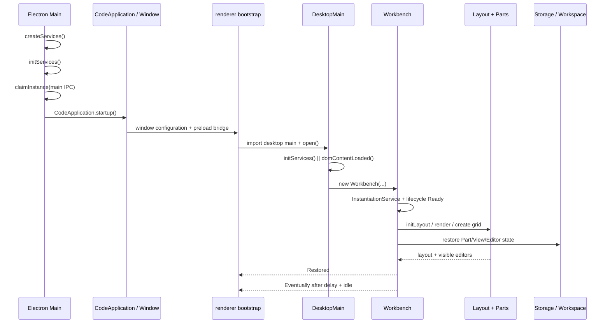

# 01 模块、启动与依赖注入：窗口为什么能起来

> 证据状态：源码链 **已验证**；完整桌面启动 **未验证**（未构建、未启动本地 VS Code）。  
> 固定实现：[`a5b500951314efd502d07465bd138dfbd714a960`](https://github.com/microsoft/vscode/tree/a5b500951314efd502d07465bd138dfbd714a960)。

## 结论先行

打开桌面 Workspace 不是一次 `new App()`。它至少经历两层装配：Electron 主进程负责“这个 VS Code 实例能否成为唯一实例、数据目录是否可用、主 IPC 是否建立”；renderer 再把窗口配置变成 Workbench 服务、Part、布局和恢复任务。依赖注入也不是一个全局 IoC 容器：模块副作用先登记 service descriptor，宿主把 descriptor 放进 `ServiceCollection`，`InstantiationService` 在第一次取用时按构造器依赖图创建并缓存实例。

影响 NeuroBook 的判断：如果现在把 `globalThis` 单例直接扩展成任意插件容器，得到的只是“能找到对象”，没有 VS Code 已经解决的服务装配时序、作用域、dispose ownership、循环依赖和失败状态。更安全的渐进顺序是先统一描述和宿主边界，再引入受控的局部解析器；不要先开放任意运行时代码。

## 启动时有哪些组件，它们怎样配合

先把本章中的名词按“谁负责什么”排开，再看调用顺序。这里的组件不是都对应一个进程；有些是进程内服务，有些是状态模型或生命周期控制器。

| 组件 | 所在边界 | 主要职责 | 启动时机 | 不负责什么 |
| --- | --- | --- | --- | --- |
| `CodeMain` | Electron 主进程 | 准备用户数据、文件/日志/配置服务，处理单实例和主 IPC（进程间通信） | renderer 窗口创建前 | 不绘制 Workbench，不直接运行 View 内容 |
| `CodeApplication` | Electron 主进程 | 把启动参数和窗口配置交给窗口/renderer，并管理应用级生命周期 | 主进程服务就绪后 | 不替代 renderer 的 Workbench 恢复 |
| renderer bootstrap | Electron renderer | 读取 preload 提供的受控窗口配置，加载 desktop main | 窗口打开后 | 不重新解析主进程专属路径和命令行 |
| `DesktopMain` | renderer 内的桌面适配层 | 选择桌面实现的 storage、FileService、IPC、远程服务 | DOM 可用且 renderer 服务初始化后 | 不拥有主进程单实例锁 |
| `Workbench` | renderer 进程 | 统一装配布局、命令、编辑器、View、扩展和生命周期 | `DesktopMain.open()` 创建后 | 不把所有资源/代码都直接放在页面组件里 |
| `LifecycleService` | Workbench 服务 | 发出 `Starting/Ready/Restored/Eventually` 阶段并协调关闭 | Workbench startup | 不保存业务文件或配置值 |
| `Layout` / Parts | Workbench UI 模型 | 创建标题栏、侧栏、Panel、Editor Part 等区域并恢复几何 | `initLayout`/`renderWorkbench` | 不决定扩展代码在哪个宿主运行 |
| Registry 系列 | 进程内控制平面 | 保存 command、setting、View、扩展描述和 activation 索引 | 模块加载或 Workbench 初始化时登记 | 不等于运行时代码已经执行 |
| `Extension Host` | 独立 Node 进程或 Web Worker | 加载扩展模块、调用 `activate()`、保存扩展运行时状态 | 需要扩展能力时惰性创建/握手 | 不是完整的恶意代码安全沙箱 |

### 一次启动的因果关系

```text
1. CodeMain
   建立 ServiceCollection、路径/配置/文件/日志服务，争取单实例
        ↓
2. CodeApplication + renderer bootstrap
   创建窗口，传递受控 window configuration
        ↓
3. DesktopMain
   把桌面实现放进 renderer 的服务集合，并等待 DOM
        ↓
4. Workbench.startup
   合并 service descriptors，进入 Ready，注册 contributions 和 editor factories
        ↓
5. Layout + Parts + Editor/View model
   创建宿主区域，计算尺寸，恢复布局和编辑器分组
        ↓
6. Extension Service / Extension Host
   扫描描述、建立 registry；遇到 command/View/语言等事件才激活运行时代码
        ↓
7. Restored → Eventually
   先达到可交互恢复，再处理慢 editor、低优先级 contribution 和关闭前状态保存
```

这条链里最重要的不是“某个函数先后”，而是依赖方向：**主进程给 renderer 宿主能力，Workbench 给 UI 模型生命周期，Registry 给运行时描述索引，Extension Host 给扩展执行边界，持久化服务给恢复真相**。任何一层都不能被另一个名词替代：`ServiceCollection` 不是 Registry，`Registry` 不是 Extension Host，`EditorPane` 不是文件保存服务。

### 组件协作的三种对象

阅读源码时可以把跨组件传递的东西分为三类：

1. **服务引用**：通过 service identifier 从当前 `InstantiationService` 取得，例如配置、文件、生命周期服务；这是进程内依赖注入，不是跨进程消息。
2. **描述快照**：例如扩展描述、View descriptor、setting schema、command metadata；它们先登记，供宿主筛选、显示和恢复，不等于运行时实例。
3. **可序列化请求**：跨 MainThread/Extension Host 或远程 Server 时，通过 RPC（远程过程调用）传递 command 参数、URI、Buffer、错误和取消；两端不共享原始对象引用。

如果一个段落没有说明自己正在传递哪一类对象，读者很容易把“注册了一个描述”“取得了一个服务”和“调用了一个远程方法”误读成同一个动作。后续章节分别用“服务装配”“描述登记”“RPC 请求”标明。

## 旅程：桌面打开一个 Workspace

### 1. Electron 主进程先建立运行底座

`CodeMain.main()` 只做错误兜底，然后进入异步 `startup()`。源码明确把启动分成：

1. 安装早期 unexpected error handler，避免默认 Electron 错误对话框遮蔽真实错误。
2. `createServices()` 建立初始 `ServiceCollection`。
3. `initServices()` 并行准备扩展目录、code cache、日志、workspace storage、local history、backup；初始化 `StateService`、`ConfigurationService` 和用户 Profile。
4. 在 `InstantiationService.invokeFunction()` 中取得生命周期、文件、日志等服务。
5. `claimInstance()` 尝试监听主 IPC handle；成功者成为第一实例，冲突者连接已运行实例并把命令交给它。
6. 创建 lockfile，注册 shutdown 清理，最后 `createInstance(CodeApplication, ...).startup()` 创建窗口。

证据：[CodeMain.startup / createServices / initServices](https://github.com/microsoft/vscode/blob/a5b500951314efd502d07465bd138dfbd714a960/src/vs/code/electron-main/main.ts)。关键源码摘录：

```ts
const [instantiationService, ...] = this.createServices();
await this.initServices(...);
const mainProcessNodeIpcServer = await this.claimInstance(...);
return instantiationService.createInstance(CodeApplication, mainProcessNodeIpcServer, instanceEnvironment).startup();
```

这说明窗口创建之前已经有了环境路径、文件服务、状态服务、配置服务、用户数据 Profile、策略和协议服务；不是窗口打开后才临时寻找这些能力。

### 2. renderer bootstrap 只负责把窗口配置交给 Workbench

renderer 的 [`electron-browser/workbench.ts`](https://github.com/microsoft/vscode/blob/a5b500951314efd502d07465bd138dfbd714a960/src/vs/code/electron-browser/workbench/workbench.ts) 先从 preload 取得安全的 process/context 配置，显示 splash，等待 `resolveWindowConfiguration()`，设置 NLS 和资源根，然后动态 import `vs/workbench/workbench.desktop.main.js`。导入完成后调用 `result.main(configuration)`。

这一步的设计含义：

- preload/主进程负责提供窗口身份、Workspace、待打开文件、颜色和布局初始信息；
- renderer 不重新解析命令行和用户目录；
- Workbench 入口是一个构建产物模块，而不是页面中的插件脚本列表。

### 3. `DesktopMain.open()` 建立桌面 renderer 服务集合

[`DesktopMain.open()`](https://github.com/microsoft/vscode/blob/a5b500951314efd502d07465bd138dfbd714a960/src/vs/workbench/electron-browser/desktop.main.ts) 并行等待 `initServices()` 和 `domContentLoaded(mainWindow)`，然后：

```ts
const workbench = new Workbench(mainWindow.document.body, options, services.serviceCollection, services.logService);
const instantiationService = workbench.startup();
instantiationService.createInstance(NativeWindow);
```

`initServices()` 里的服务不是主进程服务的简单引用，而是 renderer 侧适配器：

- `ElectronIPCMainProcessService` 通过 main-process channel 访问主进程；
- `NativeWorkbenchEnvironmentService` 解释窗口配置；
- `LoggerChannelClient`/`NativeLogService` 访问日志；
- `FileService` 注册磁盘 provider；
- `RemoteAuthorityResolverService`、`RemoteAgentService` 和 `RemoteFileSystemProviderClient` 为远程 Workspace 预留同一套 Workbench 接口；
- `NativeWorkbenchStorageService` 负责 UI 状态的作用域和持久化。

**从源码推断**：这种“同一 Workbench API、不同宿主适配服务”的结构，是桌面、本地 Web 和远程连接能够复用 Workbench 控制平面的主要原因。

### 4. `Workbench.startup()` 让窗口从“服务已就绪”变成“用户可操作”

[`Workbench.startup()`](https://github.com/microsoft/vscode/blob/a5b500951314efd502d07465bd138dfbd714a960/src/vs/workbench/browser/workbench.ts) 的顺序是固定的：

```text
initServices
  → lifecycle.phase = Ready
  → initLayout
  → Workbench contributions / Editor factories
  → Context Keys
  → listeners
  → renderWorkbench（创建 Parts）
  → createWorkbenchLayout
  → layout
  → restore
  → lifecycle.phase = Restored
  → idle 后 Eventually
```

`renderWorkbench()` 会创建标题栏、Banner、Activity Bar、Sidebar、Editor Part、Panel、Auxiliary Bar、Status Bar 八类 Part 容器；Part 自己再创建内部 Composite、View Container、Editor Group 和具体控件。

`restore()` 不会无限等待每个编辑器：它先让布局恢复，使用 `Promise.race([whenRestored, timeout(2000)])` 把生命周期推进到 `Restored`，再用 2.5 秒延迟和窗口 idle 推进 `Eventually`。因此“Workbench 可用”和“所有慢编辑器已完成恢复”是两个时刻。

### 启动时序图



## 依赖注入：三个容易混淆的动作

### A. 模块加载时登记 descriptor

`workbench.common.main.ts` 和 `workbench.desktop.main.ts` 通过副作用 import 加载服务实现与 contribution 模块。服务实现常见形式是：

```ts
registerSingleton(ICommandService, CommandService, InstantiationType.Delayed);
```

`registerSingleton()` 把“service identifier → 构造器/实例化策略”放入全局 descriptor 注册表。它**不等于**马上构造 `CommandService`。

证据：

- [`platform/instantiation/common/extensions.ts`](https://github.com/microsoft/vscode/blob/a5b500951314efd502d07465bd138dfbd714a960/src/vs/platform/instantiation/common/extensions.ts)
- [`workbench/common.main.ts`](https://github.com/microsoft/vscode/blob/a5b500951314efd502d07465bd138dfbd714a960/src/vs/workbench/workbench.common.main.ts)
- [`workbench/desktop.main.ts`](https://github.com/microsoft/vscode/blob/a5b500951314efd502d07465bd138dfbd714a960/src/vs/workbench/workbench.desktop.main.ts)

### B. 宿主建立 `ServiceCollection`

`CodeMain.createServices()`、`DesktopMain.initServices()`、`BrowserMain.initServices()` 都把当前宿主的具体服务或 `SyncDescriptor` 放入一个 `ServiceCollection`。Workbench 的 `initServices()` 再调用 `getSingletonServiceDescriptors()`，把共享服务 descriptor 加入当前集合。

这一步解决的是**作用域和实现选择**：桌面可以放 `NativeWorkbenchStorageService`，浏览器可以放 `BrowserStorageService`；它们共享 `IStorageService` 这个接口钥匙。

### C. 第一次取用时按依赖图创建实例

[`InstantiationService`](https://github.com/microsoft/vscode/blob/a5b500951314efd502d07465bd138dfbd714a960/src/vs/platform/instantiation/common/instantiationService.ts) 在 `invokeFunction(accessor => accessor.get(id))` 或 `createInstance()` 中解析构造器装饰器记录的依赖：

- 先找当前 `ServiceCollection`，没有时向 parent child scope 查找；
- 遇到 `SyncDescriptor`，把依赖构造成图；
- 缓存创建好的实例，后续取用返回同一个实例；
- `supportsDelayedInstantiation` 为真时返回一个 proxy，真正访问属性或进入 idle 时才创建；
- 实例由所属 `InstantiationService` 的 dispose bucket 管理；child service dispose 时不会误删 parent 的所有服务。

源码直接包含两个不同错误：

```text
illegal state - RECURSIVELY instantiating service '<id>'
cyclic dependency between services
```

前者是同一 service 正在递归创建，后者是依赖图没有根节点。严格模式下未注册依赖还会报告：

```text
[createInstance] <id> depends on <dependency> which is NOT registered.
```

`invokeFunction()` 的 accessor 只在回调期间有效；回调返回后继续使用会报 `service accessor is only valid during the invocation of its target method`。这是一条防止异步闭包偷偷越过生命周期边界的约束。

### 最小服务例子

```text
IFileService（service identifier）
  ↓ 构造器装饰器声明
EditorService(@IFileService, @IConfigurationService, ...)
  ↓ descriptor 已登记，但实例尚未必创建
InstantiationService.createInstance(EditorService)
  ↓ 解析依赖图并按拓扑创建
EditorService 实例 + dispose ownership
```

**已验证**：上述解析、缓存、child、delayed proxy、循环和 dispose 行为在 `InstantiationService` 源码中直接可见。**从源码推断**：它提供的是进程内服务装配，不是插件权限系统；拿到 service 的代码仍拥有该 service 暴露的能力。

## 生命周期：Starting → Ready → Restored → Eventually

固定 commit 的 `LifecyclePhase` 定义为：

| 阶段 | 人话 | 代码动作 | 风险 |
| --- | --- | --- | --- |
| `Starting` | 正在准备窗口 | Workbench 服务尚未完成装配 | 此阶段做重活会挡住编辑器显示 |
| `Ready` | 服务可解析，准备恢复 UI | `Workbench.initServices()` 设置 `lifecycleService.phase` | 服务已就绪不代表布局/编辑器已恢复 |
| `Restored` | View、Panel、编辑器已进入恢复阶段 | `restore()` 的 race/whenRestored 完成后设置 | 慢编辑器可能仍在异步解析 |
| `Eventually` | 稳定后的低优先级阶段 | 最少 2.5 秒、最多约 5 秒并等待窗口 idle | 适合不阻塞首屏的贡献 |

证据：[`services/lifecycle/common/lifecycle.ts`](https://github.com/microsoft/vscode/blob/a5b500951314efd502d07465bd138dfbd714a960/src/vs/workbench/services/lifecycle/common/lifecycle.ts) 的 enum 注释和 [`Workbench.restore()`](https://github.com/microsoft/vscode/blob/a5b500951314efd502d07465bd138dfbd714a960/src/vs/workbench/browser/workbench.ts)。

### 关闭反向链

关闭不是简单 `window.close()`：

1. `onBeforeShutdown` 允许组件同步或异步 veto；
2. 没有 veto 后进入 `onWillShutdown`，组件用 `join()` 等待保存/关闭；
3. `joiner` 有默认顺序和 `Last` 顺序；
4. `force()` 可在用户强制关闭时跳过未完成 join；
5. `onDidShutdown` 释放资源。

桌面 `DesktopMain.registerListeners()` 把 storage close 注册为 joiner，标签是 `Saving UI state`。这解释了为什么 UI 状态写入既有延迟保存，也有关闭时的最后一道同步边界。

## 失败路径：窗口为什么可能起不来

| 失败 | 固定源码证据 | 可观察结果 | 证据状态 |
| --- | --- | --- | --- |
| 用户数据目录、配置或状态初始化失败 | `CodeMain.startup` 的 `initServices` try/catch 与 `handleStartupDataDirError` | 可能出现可解决错误对话框，随后 `quit(error)` | 已验证源码路径；具体 Windows UI 未验证 |
| 已有实例占用 main IPC | `CodeMain.claimInstance` 的 `EADDRINUSE` 分支 | 第二进程把请求转给已有实例后退出，或连接失败时报错 | 已验证源码路径；CLI 行为未实机验证 |
| 未注册 service | `InstantiationService._throwIfStrict` | strict 模式抛出 unknown service；非 strict 记录 warning 后可能得到 undefined | 已验证 |
| 递归/循环服务依赖 | `_safeCreateAndCacheServiceInstance` / `CyclicDependencyError` | 创建失败，Workbench 关键启动链重抛错误 | 已验证 |
| Workbench 关键启动异常 | `Workbench.startup` catch 后 `onUnexpectedError` 并 rethrow | 关键窗口可能无法正常交互 | 已验证源码；实际错误面板未验证 |
| 关闭 veto 或保存 join 未完成 | `ILifecycleService` 的 before/will shutdown 合同 | 关闭被阻止或等待；force 可打断 | 已验证接口；未实机演练 |

## 对 NeuroBook 的研究映射

### 已有能力

- `server/agent/http.ts::useAgentHarness()`：全局单例入口 + 构造器注入。
- `server/runtime/paths/runtime-paths.ts`：15 根 `RuntimePaths` 统一运行时路径。
- `AgentProfileCatalog`、Profile artifact、`ProfileRegistry.publish()`：描述/发布/epoch 已有雏形。
- `AgentToolRegistry`：模型可见 schema 与 harness 执行硬权限分开。
- Runtime Hook 的 SessionLog、RunFrame、TurnSnapshot：有状态事件和可审计快照。

### 借鉴但未形成合同的观察

1. **先做宿主作用域**：为 Profile、Tool、View、Job 等能力定义显式的宿主注册边界；不要让资产直接从 `globalThis` 取任意服务。
2. **延迟创建**：注册 descriptor 不代表运行时已经执行；首次打开 View 或调用 command 时才创建最小运行上下文。
3. **子作用域**：一次 Project Session、一次后台 Job 或一个 View 可以有 child scope，dispose 只释放自己创建的资源。
4. **生命周期门禁**：把“描述已注册”“可执行”“已恢复”“已禁用/失败”区分开，避免用一个 `loaded: boolean` 混合所有状态。
5. **失败可见**：缺 service、循环依赖、激活失败和保存 join 都要有结构化诊断；不能用静默 fallback 掩盖边界错误。

这些是研究建议，不是已批准的 NeuroBook 接口。

## 源码锚点与检查边界

- [CodeMain](https://github.com/microsoft/vscode/blob/a5b500951314efd502d07465bd138dfbd714a960/src/vs/code/electron-main/main.ts)：`CodeMain.main/startup/createServices/initServices/claimInstance`。
- [renderer bootstrap](https://github.com/microsoft/vscode/blob/a5b500951314efd502d07465bd138dfbd714a960/src/vs/code/electron-browser/workbench/workbench.ts)：`load/resolveWindowConfiguration`。
- [DesktopMain](https://github.com/microsoft/vscode/blob/a5b500951314efd502d07465bd138dfbd714a960/src/vs/workbench/electron-browser/desktop.main.ts)：`DesktopMain.open/initServices/registerListeners`。
- [Workbench](https://github.com/microsoft/vscode/blob/a5b500951314efd502d07465bd138dfbd714a960/src/vs/workbench/browser/workbench.ts)：`Workbench.startup/initServices/renderWorkbench/restore`。
- [InstantiationService](https://github.com/microsoft/vscode/blob/a5b500951314efd502d07465bd138dfbd714a960/src/vs/platform/instantiation/common/instantiationService.ts)：`invokeFunction/createInstance/createChild/_createAndCacheServiceInstance`。
- [Lifecycle](https://github.com/microsoft/vscode/blob/a5b500951314efd502d07465bd138dfbd714a960/src/vs/workbench/services/lifecycle/common/lifecycle.ts)：`LifecyclePhase`、shutdown veto/join/dispose 接口。

未读部分：Electron 原生窗口创建的全部平台分支、更新器内部、Marketplace 和完整产品构建产物；这些缺口不影响本章已验证的装配顺序，但会限制对窗口平台差异、更新失败和启动性能的判断。
