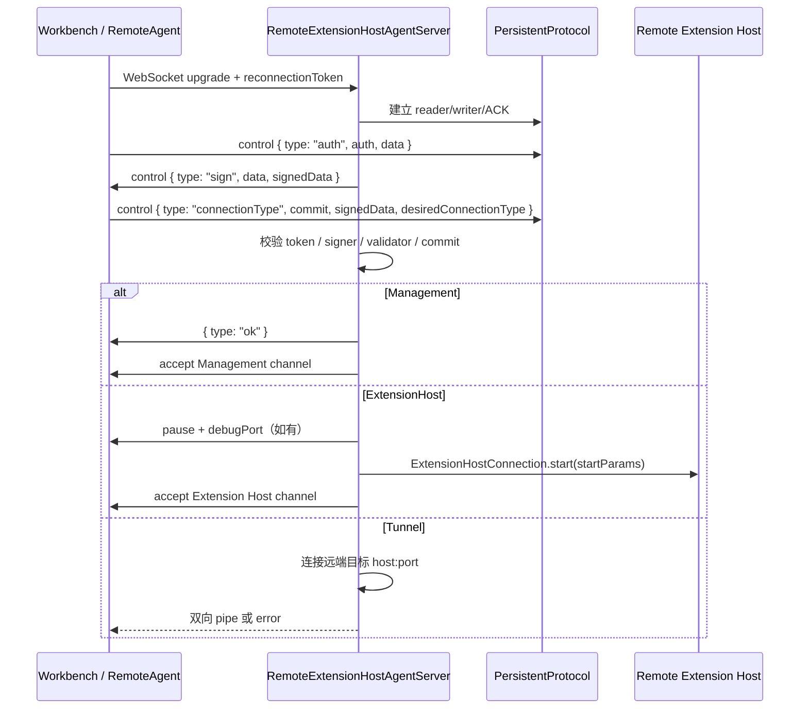

# 02 浏览器、Node 与微软 VS Code Server：代码到底在哪台机器跑

> 证据状态：固定 commit 的宿主、握手、协议和扩展运行位置 **已验证**；真实浏览器连接、Remote-SSH 部署和断线 UI **未验证**。  
> 本章的“Server”只指微软 VS Code Server / Remote Development，不读取或引用第三方 `coder/code-server` 源码。

## 结论先行

同一个 Workbench UI 可以面对三种完全不同的资源位置：桌面本地磁盘、浏览器可授权的本地/远程资源、微软 VS Code Server 所在的远端 Node 环境。关键不是“浏览器版少几个按钮”，而是宿主服务替换了：UI 仍由 Workbench 控制，文件、搜索、终端、远程扩展和部分配置服务会通过 Remote Agent 连接到另一端。

因此对 NeuroBook 的启发是：插件能力不能只标记“前端插件/后端插件”。至少要声明**运行位置、数据 authority、连接依赖和断线语义**；同一个 View 可以在浏览器渲染，但它访问的 Project 文件和 Job 状态可能属于后端 authority。

### 先定义四个边界词

- **宿主（host）**：承载某段代码和服务的运行环境，例如 Electron renderer、浏览器页面或远端 Node；它回答“在哪里跑”。
- **authority**：资源或连接的归属与解析入口，例如某个远程 Workspace；它回答“连接到谁”，不自动等于认证或读写授权。
- **channel**：长连接上按职责分出的逻辑服务通道，例如 Management、Extension Host、Tunnel；它不是一个新的物理 socket。
- **PersistentProtocol**：维护消息序号、ACK（确认收到）、暂停/恢复和重连重放的传输协议；它只解决通信连续性，不替业务保存状态。

本章所说的“远端扩展”是运行在 Workspace 所在机器上的 Extension Host 代码；浏览器中的 Workbench、远端 Server、远端 Extension Host 是三个不同边界，不能合并成一个“浏览器插件进程”。

## 三种部署拓扑

### 桌面本地 Workspace

```text
Electron Main process
  ├─ 单实例、窗口、主进程 IPC、系统路径
  └─ 用户数据/策略/更新等主进程能力
       ↕ IPC
Electron renderer
  └─ Workbench：布局、命令、配置、编辑器、View
       ├─ FileService → 本机 Disk provider
       ├─ Local Process Extension Host → Node 扩展
       └─ Shared process → 跨窗口共享服务
```

**已验证**：`CodeMain.createServices()` 注册 `FileService` + `DiskFileSystemProvider`，`DesktopMain.initServices()` 注册 renderer 侧 IPC、FileService、RemoteAgent 等适配器。**从源码推断**：本地 Workspace 的搜索、文件读取和普通文本模型主要沿本机 provider 运行；本轮未测量具体搜索进程。

### 浏览器 Web Workbench

```text
BrowserMain.open()
  ├─ BrowserWorkbenchEnvironmentService
  ├─ BrowserStorageService / IndexedDB provider
  ├─ FileService + 浏览器 File System Access / IndexedDB
  ├─ RemoteAuthorityResolverService
  ├─ RemoteAgentService + WebSocket socket factory
  └─ Workbench.startup()
       └─ LocalWebWorker Extension Host（web 扩展）
```

[`BrowserMain.open()`](https://github.com/microsoft/vscode/blob/a5b500951314efd502d07465bd138dfbd714a960/src/vs/workbench/browser/web.main.ts) 明确先并行初始化服务和等待 DOM，再创建 Workbench、调用 `startup()`，最后返回一个 API facade。它暴露的 `workspace.didResolveRemoteAuthority()` 会触发 `RemoteAuthorityResolverService.resolveAuthority()`；`openTunnel()` 则把远端地址映射到浏览器可用的本地地址。

浏览器不是 Node：

- 没有本地 Node Extension Host；浏览器扩展进入 `LocalWebWorker`；
- 文件可以由浏览器授权、IndexedDB 或远端 provider 提供；
- 秘密、Profile、日志和缓存由浏览器服务实现，持久化作用域不同于桌面文件；
- 远程 Workspace 时，UI 仍在浏览器，工作区 authority 和远程扩展在 Server 一侧。

### 微软 VS Code Server / Remote Development

```text
远端机器
  server.main.ts
    ├─ 解析 server args
    ├─ 建立 REMOTE_DATA_FOLDER / User / globalStorage / History / Machine
    ├─ builtin extensions + remote extensions 目录
    └─ createServer()
         └─ RemoteExtensionHostAgentServer
              ├─ HTTP：/version、Web UI、远程资源
              ├─ WebSocket + PersistentProtocol
              │    ├─ Management connection（Workbench/Remote Agent channels）
              │    ├─ ExtensionHost connection（远端 Extension Host）
              │    └─ Tunnel connection
              └─ 远端文件、终端、搜索、配置、扩展扫描/执行
```

[`server.main.ts`](https://github.com/microsoft/vscode/blob/a5b500951314efd502d07465bd138dfbd714a960/src/vs/server/node/server.main.ts) 在创建 Server 前计算：

- `REMOTE_DATA_FOLDER`：`--server-data-dir`、`VSCODE_AGENT_FOLDER` 或用户 home 下的默认目录；
- `data/User`、`globalStorage`、`History`、`Machine`；
- 内置扩展目录和远程扩展目录；
- 目录不存在时以 `0700` 递归创建。

它导出 `spawnCli()` 和 `createServer(address)`，真正的服务、连接 token 和 WebSocket 处理在 [`remoteExtensionHostAgentServer.ts`](https://github.com/microsoft/vscode/blob/a5b500951314efd502d07465bd138dfbd714a960/src/vs/server/node/remoteExtensionHostAgentServer.ts)。

## 连接生命周期

### 1. Server 启动

`createServer()` 先调用 `determineServerConnectionToken(args)`，解析失败会输出 token parse warning 并退出；随后 `setupServerServices()` 建立服务和 socket server，创建 `RemoteExtensionHostAgentServer`。构建版如果携带 Web UI，会输出本地 Web UI 地址；`/version` 返回 `product.commit`，用于客户端版本核对。

### 2. authority 解析

浏览器或桌面 Workbench 由 `RemoteAuthorityResolverService` 把 `remoteAuthority` 解析成远程 host/port、连接 token、连接数据和 socket 创建方式。浏览器使用 `BrowserSocketFactory`；桌面可使用 Node/SSH 等 transport。Workbench 不直接把远程 socket 交给 View，而是通过 `RemoteAgentService` 和各服务 channel 消费。

相关客户端证据：

- [`BrowserMain.initServices()`](https://github.com/microsoft/vscode/blob/a5b500951314efd502d07465bd138dfbd714a960/src/vs/workbench/browser/web.main.ts) 注册 `RemoteAuthorityResolverService`、`RemoteSocketFactoryService`、`RemoteAgentService` 和 `RemoteFileSystemProviderClient`。
- [`RemoteAgentService`](https://github.com/microsoft/vscode/blob/a5b500951314efd502d07465bd138dfbd714a960/src/vs/workbench/services/remote/browser/remoteAgentService.ts) 负责连接远程 agent，并向 Workbench 服务暴露远程环境/连接。
- [`RemoteExtensionHost`](https://github.com/microsoft/vscode/blob/a5b500951314efd502d07465bd138dfbd714a960/src/vs/workbench/services/extensions/common/remoteExtensionHost.ts) 使用远程连接创建 Extension Host 运行位置。

### 3. auth → sign → connectionType 三消息握手

`RemoteExtensionHostAgentServer._handleWebSocketConnection()` 创建一条 `PersistentProtocol`，状态机只有四个状态：`WaitingForAuth`、`WaitingForConnectionType`、`Done`、`Error`。



固定源码直接检查：

- 第一条消息不是合法 JSON 或 `type !== 'auth'`：拒绝 `Malformed first message` / `Invalid first message`。
- 强制 token 不匹配：拒绝 `Unauthorized client refused: auth mismatch`。
- 第二条消息格式错误：拒绝 `Malformed second message` / `Invalid second message`。
- renderer commit 与 server commit 不同：拒绝 `Client refused: version mismatch`。
- 构建版签名/token 校验失败：拒绝 `Unauthorized client refused`；开发模式会记录并继续。
- `desiredConnectionType` 未知：拒绝 `Unknown initial data received`。

### 4. 协议 channel 与请求位置

`PersistentProtocol` 不是“每个请求建立一个连接”的 RPC。它维护：

- outgoing message id 和 ACK id；
- 未确认消息队列；
- incoming message id；
- keep-alive；
- 缺包时的 replay request；
- socket close、timeout、disconnect、pause/resume 控制帧。

重连时，`beginAcceptReconnection()` 替换 socket、保留消息状态；`endAcceptReconnection()` 先重新发送 ACK，再重放所有未确认消息。这使 Management 与 ExtensionHost channel 能在连接短暂丢失时继续使用同一个协议状态，而不是把所有服务状态当作全新会话。

### 5. 文件、终端、配置和扩展执行在哪里

| 能力 | 桌面本地 | 浏览器本地 | 浏览器/桌面连接微软 Server |
| --- | --- | --- | --- |
| UI/Workbench | renderer | 浏览器 DOM | 客户端 renderer/浏览器 |
| Workspace 文件 | 本机 FileService provider | 浏览器授权/IndexedDB 或 provider | Server 端文件 provider，经 Remote Agent channel |
| 搜索 | 本地服务/文件 provider | 浏览器或远端 provider | 远端 Workspace 侧为主；具体实现依 extension/runtime 配置 |
| 终端 | 本机 PTY | embedder/远端 tunnel | Server/远端 PTY，客户端只显示与转发 |
| 用户配置/Profile | 本机用户数据 | 浏览器 Profile/存储 | 远端用户数据与客户端 Profile 分层；精确合并见 [05](./05-configuration-system.md) |
| 扩展扫描 | 本地 builtin/user 目录 | Web 扩展扫描 | Server 扫描远程扩展；客户端仍登记全局描述和运行位置 |
| 扩展执行 | Local Process | Local WebWorker | Remote Extension Host（也可能有 UI/web 扩展在客户端） |
| 图片/资源 URL | 本地 provider | 浏览器 provider | `/vscode-remote-resource` 经过 token/路径校验后提供远端资源 |

“远端搜索一定在某个单独搜索进程”不是本章的已验证结论；固定源码可确认 provider/authority 边界，不能从 Workbench 入口推断所有后端进程划分。

## 断线、重连和扩展宿主失败

### Management / ExtensionHost 连接断线

| 触发 | Server 侧源码动作 | 用户可观察结果 | 是否重试 | 证据 |
| --- | --- | --- | --- | --- |
| socket close，持有旧 reconnection token | `PersistentProtocol` 触发 `onSocketClose`；连接对象进入 grace time | UI 可能显示远程断开/请求暂停；具体文案未验证 | 连接方可用同一 token 重连；未验证 UI 重试次数 | 已验证协议与 Server reconnect 分支 |
| 重连 token 不曾见过 | `_rejectWebSocketConnection` | 连接拒绝，原因 `Unknown reconnection token (never seen)` | 不接受该 token | 已验证 |
| token 曾见过但连接已失效 | 拒绝 `Unknown reconnection token (seen before)` | 需要建立新连接/重新解析 authority | 源码未保证自动重新创建 | 已验证源码，用户重连 UI 未验证 |
| 同一 token 并发新连接 | 拒绝 `Duplicate reconnection token` | 连接失败 | 不接受并发连接 | 已验证 |
| 有新连接成功 | 缩短 management/ext host 旧连接 grace time | 旧连接更快清理，新的连接继续 | 是，协议层支持 | 已验证 |

### Extension Host RPC 无响应

[`rpcProtocol.ts::RPCProtocol`](https://github.com/microsoft/vscode/blob/a5b500951314efd502d07465bd138dfbd714a960/src/vs/workbench/services/extensions/common/rpcProtocol.ts) 在第一个未确认请求发出后设置 3 秒 `UNRESPONSIVE_TIME`；ACK 到达则恢复 responsive；超时则发出 `ResponsiveState.Unresponsive`。这只是“无响应诊断”，不等于立即杀死宿主。

远端 Extension Host 连接对象还拥有自己的 reconnection grace time；本地宿主退出则由 `NativeExtensionService._onExtensionHostCrashed()` 统计 crash。固定 commit 中，Local Process 宿主若 crash：

- `VersionMismatch` 显示 `Extension host cannot start: version mismatch.`，提供 `Relaunch VS Code`；
- 记录 crash 和 telemetry；
- `CrashTracker` 允许自动重启时显示 `The extension host terminated unexpectedly. Restarting...` 并重新启动；
- 超出自动重启阈值时提供 `Restart Extension Host`、Extension Bisect 等操作。

远端具体的自动重启次数、部署代理的重试策略和浏览器页面文案未在本轮运行验证，不能把它们写成统一的“必然重试 N 次”。

## 失败路径矩阵

| 失败边界 | 源码位置 | 结果 | 当前证据状态 |
| --- | --- | --- | --- |
| Server 不在/端口不可达 | `RemoteAuthorityResolverService`、`RemoteAgentService` | authority 解析或连接失败；具体错误提示由客户端服务呈现 | 源码路径已确认，未启动真实 Server |
| auth/token 错 | `RemoteExtensionHostAgentServer._handleWebSocketConnection` | 403/拒绝，`Unauthorized client refused...` | 已验证 |
| commit/版本不匹配 | 同上；`server.main.ts` 的 `/version` | `Client refused: version mismatch`；扩展宿主也有 `VersionMismatch` | 已验证 |
| 签名/validator 失败 | handshake `valid` 分支 | 构建版拒绝；dev mode 记录后继续 | 已验证 |
| 权限/路径失败 | `/vscode-remote-resource`、FileService/path provider | 400/403/文件错误；具体 UI 未验证 | 已验证源码，未实机 |
| Tunnel 目标不可连接 | `_createTunnel()` | 发送 `{ type: 'error', reason }` 后关闭协议 | 已验证 |
| Extension Host crash | `NativeExtensionService._onExtensionHostCrashed`、`ExtensionHostCrashTracker` | 自动重启或显示 Restart/Bisect | 已验证源码，未实机 |
| 连接恢复期间 RPC 无 ACK | `RPCProtocol` / `PersistentProtocol` | unresponsive、保留未确认消息并重放 | 已验证协议，未实机 |

## 微软 Server 与第三方 code server 的边界

本章研究的是微软 VS Code 的 `server.main.ts`、`RemoteExtensionHostAgentServer`、Remote Agent 和 Remote Extension Host。第三方 `coder/code-server` 是独立产品和独立仓库；它可以提供相似的浏览器入口，但不能用来证明微软源码中的握手、commit 检查、Extension Host 选址或 `PersistentProtocol` 行为。本轮不读取其源码，也不做实现等价判断。

## 对 NeuroBook 的研究映射

### 已有事实

- NeuroBook 已有 Project Workspace/Runtime Paths、Session attachment authority、durable `AgentJobManager` 和 Project history；这些都是“authority/宿主边界”的先例。
- `SessionAttachmentAuthority` 把 JSONL 作为唯一持久化真相，内存索引可重建；这与“协议重连不等于重新猜状态”是同方向的工程约束。

### 观察

1. 每个插件能力应声明 `runningLocation` 类似信息：浏览器 UI、Node 服务、Project Workspace、后台 Job，至少不能隐式跨边界。
2. 连接 token、Session/Project identity、asset provenance 应是不同字段；不要拿一个 opaque id 同时代表认证、授权和资源归属。
3. 断线恢复要区分“可重放的请求/未确认事件”和“必须重新读取的权威快照”。VS Code 的消息 ACK/重放可借鉴，但 NeuroBook 的 Session snapshot/RunFrame 才是产品真相源。
4. Remote Extension Host 证明“远端执行可以被统一 UI 消费”，不证明第三方代码安全；执行权限仍需 `AgentToolRegistry` 与 process/secret trust 门禁。

## 源码锚点与检查边界

- [BrowserMain](https://github.com/microsoft/vscode/blob/a5b500951314efd502d07465bd138dfbd714a960/src/vs/workbench/browser/web.main.ts)：`BrowserMain.open/initServices`。
- [server.main](https://github.com/microsoft/vscode/blob/a5b500951314efd502d07465bd138dfbd714a960/src/vs/server/node/server.main.ts)：`REMOTE_DATA_FOLDER/createServer/spawnCli`。
- [RemoteExtensionHostAgentServer](https://github.com/microsoft/vscode/blob/a5b500951314efd502d07465bd138dfbd714a960/src/vs/server/node/remoteExtensionHostAgentServer.ts)：`createServer/_handleWebSocketConnection/_handleConnectionType/_createTunnel`。
- [PersistentProtocol](https://github.com/microsoft/vscode/blob/a5b500951314efd502d07465bd138dfbd714a960/src/vs/base/parts/ipc/common/ipc.net.ts)：`sendPause/sendResume/beginAcceptReconnection/endAcceptReconnection/_receiveMessage`。
- [Remote Agent](https://github.com/microsoft/vscode/blob/a5b500951314efd502d07465bd138dfbd714a960/src/vs/workbench/services/remote/browser/remoteAgentService.ts)。
- [Remote Extension Host](https://github.com/microsoft/vscode/blob/a5b500951314efd502d07465bd138dfbd714a960/src/vs/workbench/services/extensions/common/remoteExtensionHost.ts)。
- [Browser Extension Host picker](https://github.com/microsoft/vscode/blob/a5b500951314efd502d07465bd138dfbd714a960/src/vs/workbench/services/extensions/browser/extensionService.ts)：`BrowserExtensionHostKindPicker.pickRunningLocation`。
- [RPCProtocol](https://github.com/microsoft/vscode/blob/a5b500951314efd502d07465bd138dfbd714a960/src/vs/workbench/services/extensions/common/rpcProtocol.ts)：3 秒无 ACK 响应性状态。

未读/未运行：具体 Remote-SSH/CLI 传输脚本、反向代理/身份提供商、真实浏览器 WebSocket、Server 重启和远端磁盘故障。它们可能改变部署层重试和用户界面，但不改变本章已验证的微软 Server 握手与协议边界。
