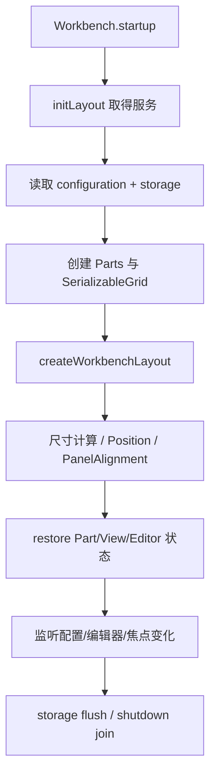

# 03 Workbench 布局、View 与分屏：为什么拖动一个面板不会重排整个编辑器

> 证据状态：固定 commit 的 Part 词表、View Container 迁移、持久化字段和 Editor Grid **已验证**；真实拖拽与重启恢复 **未验证**。  
> 研究判断：Workbench Part/View 的布局状态与 Editor Group 的二维分屏必须分开建模。

## 结论先行

VS Code 的“布局”不是一棵允许任意组件随意插入的 DOM 树。宿主先拥有固定的 Workbench Parts，再由 View Registry 提供 View Container 和 View 描述；View 的同容器排序/可见性由 `ViewContainerModel` 和 split view 管理，跨容器位置由 `ViewDescriptorService` 记录；编辑器分屏则由 `EditorPart` 自己维护一个 `SerializableGrid<IEditorGroupView>`。这四层有不同的合法目标、持久化键和恢复边界。

对 NeuroBook 的安全启发：先让宿主拥有“区域、View、编辑器组、尺寸、作用域”，再允许插件声明 View；拖拽事件应提交意图给宿主校验，不让第三方组件直接改主应用布局。现有 `app/composables/useResizablePanel.ts` 继续作为唯一 resize 边界；不要新增第二套面板宽度持久化。

### 先把布局对象分层

- **Part** 是 Workbench 的大区域，例如 Sidebar、Panel、Editor Part；它拥有区域级几何和可见性。
- **View Container** 是 Part 中承载一组 View 的容器；它拥有位置、顺序和容器级状态。
- **View** 是容器内的一项能力描述与内容 Pane；它拥有自己的可见性和最小尺寸约束，但不直接拥有宿主布局。
- **PaneView** 是把多个 pane 以一维 split view（分隔面板）排列的布局实现；**Editor Group/Grid** 才是编辑器的二维分屏模型。

因此“拖动 View”“移动整个 Panel”“拆分编辑器”是三种不同意图，分别回到 View model、Layout/Part 和 EditorPart 处理。这里的 View 不是任意 DOM 插槽，Part 也不是一个可以被插件随意替换的 Vue 组件。

## Part 词表：屏幕上的东西分别是什么

固定 commit 的 [`layoutService.ts::Parts`](https://github.com/microsoft/vscode/blob/a5b500951314efd502d07465bd138dfbd714a960/src/vs/workbench/services/layout/browser/layoutService.ts) 定义：

| Part | 人话 | 是否直接装 View | 典型模型 |
| --- | --- | --- | --- |
| `TITLEBAR_PART` | 标题栏/命令中心所在区域 | 否 | Workbench Part；native/custom title bar 会改变外壳 |
| `BANNER_PART` | 顶部通知横幅 | 否 | Workbench Part |
| `ACTIVITYBAR_PART` | 左/右侧图标栏 | 间接 | Workbench Part；打开 Composite/Container |
| `SIDEBAR_PART` | 主侧栏 | 是，承载 View Container | Workbench Part + Composite/Pane 容器 |
| `PANEL_PART` | 底部或可移动的 Panel | 是，承载 View Container | Workbench Part + Pane 容器 |
| `AUXILIARYBAR_PART` | 次级侧栏/右侧辅助区 | 是 | Workbench Part |
| `EDITOR_PART` | 编辑器区域 | 否，内部是 Editor Group | Workbench Part + EditorPart/Grid |
| `STATUSBAR_PART` | 底部状态栏 | 否 | Workbench Part |

`View` 不是 `Part`；它是被 View Container 装载的一项描述。`PaneView` 是 split view 中的可布局 pane，实现最小/最大尺寸、折叠、可见性和拖拽相关行为；它不是一个可以绕过宿主把任意 Vue 组件塞进主 Workbench 的注入点。

### 屏幕区域图

```text
┌──────────────────────────── Title Bar / Banner ────────────────────────────┐
│ Activity Bar │ Primary Sidebar (View Containers) │ Editor Part │ Auxiliary │
│              │                                  │ EditorGroup  │ Bar(Views)│
│              │                                  │   ┌────┬────┐ │            │
│              │                                  │   │ G1 │ G2 │ │            │
│              │                                  │   └────┴────┘ │            │
├──────────────┴──────────────────────────────────┴──────────────┴────────────┤
│ Panel (View Containers; bottom/left/right/top)                               │
├─────────────────────────────────────────────────────────────────────────────┤
│ Status Bar                                                                  │
└─────────────────────────────────────────────────────────────────────────────┘
```

**已验证**：`Parts`、`Position`（`LEFT | RIGHT | BOTTOM | TOP`）、`PanelAlignment`（`left | center | right | justify`）和 `LayoutSettings` 字符串都在固定 commit 中定义。**从源码推断**：图把可见区域压成一张屏幕图；现代浮动卡片、native title bar、辅助窗口会改变具体几何，不改变职责分层。

## Workbench 布局恢复：外壳先于 View 内容

`Workbench.startup()` 调用 `initLayout()`、`renderWorkbench()`、`createWorkbenchLayout()`、`layout()`、`restore()`。`Layout.initLayout()` 取得 configuration、storage、editor group、View descriptor、Part service 等依赖，注册布局监听器并初始化布局状态。

`Layout` 内部维护：

- `parts: Map<string, Part>`：Part 实例；
- `workbenchGrid: SerializableGrid<ISerializableView>`：外层可序列化区域树；
- 每个 Part 的 `ISerializableView`；
- `ILayoutState`：runtime 状态 + initialization 状态；
- 侧栏位置、Panel 位置/alignment、可见性、最大化、Zen Mode、标题栏等配置。

布局设置的固定键包括：

- `workbench.activityBar.location`、`workbench.activityBar.autoHide`、`workbench.activityBar.compact`；
- `workbench.editor.showTabs`、`workbench.editor.editorActionsLocation`；
- `window.commandCenter`、`workbench.layoutControl.enabled`、`workbench.shadows`；
- `workbench.experimental.modernUI`；
- 侧栏/状态栏/Panel 的 legacy 与布局服务字段。

### 布局状态的三个动作



- `configuration` 决定默认位置、可见性和行为；
- `storage` 保存用户选择的 UI 状态；
- `SerializableGrid` 只保存宿主能识别的 Part/Editor 节点，不保存任意组件实例；
- View 自定义位置另有 `views.customizations`，Editor Group 另有 `editorpart.state`。

### Panel 的位置与对齐

`PanelAlignment` 的四个值只定义 Panel 在所属水平区域的排布意图：

```text
left   : panel 靠左
center : panel 居中
right  : panel 靠右
justify: panel 拉伸/填满可用方向
```

Panel 可以在 `bottom/top/left/right`，但其 Part geometry 和其中的 View Container 是两层状态。把一个 View 拖到 Panel 不等于把整个 Panel 改到右侧；把 Panel 改到右侧也不等于改变 Editor Group 的 split orientation。

## 四种布局操作

### 旅程：移动一个 View Container

用户把一个容器从 Primary Sidebar 移到 Panel，宿主收到的是“容器 id、目标 location、可选 requestedIndex”的意图：

```text
drag/drop intent
  → ViewDescriptorService.moveViewContainerToLocation(container, location, index)
  → 更新 viewContainersCustomLocations
  → fire onDidChangeContainerLocation / onDidChangeLocation
  → saveViewCustomizations()
  → Part/layout service 重新布局
```

`ViewDescriptorService.moveViewContainerToLocation()` 首先检查 `canMoveViews()`；Sessions window 返回 false 时不允许迁移。成功后把非默认位置写入 `views.customizations`，而不是直接改扩展 manifest 的默认描述。

### 旅程：同一容器内重排

同一容器内的顺序属于 `ViewContainerModel`：

```text
View descriptors
  → ViewContainerModel.active/visible/allViewDescriptors
  → PaneView / split view 顺序与尺寸
  → View 容器 memento / Profile storage
```

[`PaneView`](https://github.com/microsoft/vscode/blob/a5b500951314efd502d07465bd138dfbd714a960/src/vs/base/browser/ui/splitview/paneview.ts) 是布局 pane，不是扩展的任意 DOM 插槽。`CompositeDragAndDropObserver` 和 Workbench DND 代码负责拖动观察；真正改变顺序/容器的操作仍回到宿主服务。

边界：

- `viewDescriptor.canMoveView` 为 false 时不能移动；
- 目标必须是当前窗口可用的 View Container；
- 不应把同容器顺序写入跨容器 `viewLocations`；
- View 隐藏/显示受 `canToggleVisibility`、至少保留一个可见 View 等条件约束。

### 旅程：跨容器迁移

`moveViewToLocation()` 会为目标位置创建 generated container；`moveViewsToContainer()` 完成：

1. 取源容器和目标容器；
2. 从源 `removeViews()`；
3. 向目标 `addViews()`；
4. 如果源是 generated container 且已空，`cleanUpGeneratedViewContainer()` 注销它；
5. 保存 `views.customizations`；
6. 发出 location/container change event。

持久化 JSON 的语义是：

```json
{
  "viewContainerLocations": { "container.id": "panel" },
  "viewLocations": { "view.id": "generated.container.id" },
  "viewContainerBadgeEnablementStates": { "container.id": false }
}
```

源码会跳过“回到默认位置”的条目；删除扩展或默认容器改变后，`onDidChangeStorage` 会把找不到的自定义位置恢复到默认。generated container 只有在没有 View、没有迁移引用时才清理，并同步清除其 Profile storage。

### 旅程：编辑器分屏

编辑器分屏走另一条链：

```text
split intent
  → EditorPart / EditorGroupView
  → SerializableGrid<IEditorGroupView>
  → Grid.resizeView / addGroup / removeGroup
  → editorpart.state memento
```

[`EditorPart`](https://github.com/microsoft/vscode/blob/a5b500951314efd502d07465bd138dfbd714a960/src/vs/workbench/browser/parts/editor/editorPart.ts) 持有 `gridWidget`、`groupViews`、active group 和 most-recently-active groups；`editorpart.state` 保存 serialized grid、activeGroup、最近活跃组。这个 Grid 才是“左/右、上/下、二维分屏”的模型。

因此：

- Sidebar/Panel View 的拖动不应修改 `editorpart.state`；
- Editor Group split 不应伪装成 View Container migration；
- 编辑器组有最小尺寸、空组、最大化/展开和恢复失败边界；
- 编辑器组可以创建 scoped `InstantiationService` 和 scoped `ContextKeyService`，局部能力在组生命周期内释放。

## 状态作用域

| 状态 | 主要字段/存储 | 作用域 | 删除/恢复语义 |
| --- | --- | --- | --- |
| Part 几何与可见性 | Layout state、Workbench storage | Profile/窗口，部分配置来自 workspace | startup restore；损坏时回默认或报错 |
| View 容器位置 | `views.customizations.viewContainerLocations` | `StorageScope.PROFILE`、`StorageTarget.USER` | 回默认位置时删除 override |
| View 所在容器 | `viewLocations` | Profile | generated container 空且无引用时清理 |
| View 可见性/顺序 | `ViewContainerModel` + View container memento | Profile/容器 | View 删除或 reset 时回默认 |
| Editor Group split | `editorpart.state`、workspace/profile memento | Workspace + Profile | `EditorPart` restore；无效节点需要降级处理 |
| Panel alignment/position | `PanelAlignment`、`Position`、configuration/storage | 用户配置/窗口状态 | 配置事件触发布局更新 |

这里的“Profile”是 VS Code 的用户数据/存储上下文，不应直接类比成 NeuroBook 的 Profile artifact，也不应把它虚构成额外的配置优先级层。

## 对 NeuroBook 的研究映射

### 当前已验证事实

- [`app/pages/index.vue`](../../../app/pages/index.vue) 持有 `agentPanelOpen`、`layoutMode` 等固定工作台状态。
- [`app/stores/novel-ide.ts`](../../../app/stores/novel-ide.ts) 把 5 个面板宽度写入 `localStorage` 的 `novel.ide.local`，会话状态写入 `sessionStorage` 的 `novel.ide.session`；当前不是按 Project 细分的通用 Layout Registry。
- [`app/composables/useResizablePanel.ts`](../../../app/composables/useResizablePanel.ts) 是现有唯一 resize 边界。
- [`app/utils/workbench-chrome.ts`](../../../app/utils/workbench-chrome.ts) 是固定 Activity Bar 枚举，不是动态 View Registry。

### 研究建议（不构成合同）

1. **先建声明描述**：View manifest 只描述 id、标题、默认容器、可移动性、最小尺寸、需要的 authority；宿主决定是否可见和是否实例化。
2. **把拖拽建模为意图**：`{ viewId, targetContainerId, position }` 由宿主验证，拒绝不存在、越权、不可移动或会破坏最小布局的目标。
3. **分开一维与二维**：View Container 内部顺序和 resize 是一套；Markdown/编辑器分组 split 是另一套；不要以 CSS `grid-template` 一个字段承载两者。
4. **按作用域拆状态**：用户级 View 位置、Project 级编辑器组/打开文档、Session 级临时面板不能共用 `localStorage` key。
5. **复用 `useResizablePanel`**：研究阶段不建议新增私有 resize composable；若将来抽宿主，应先迁移现有消费者并保留同一尺寸/边界语义。
6. **暂不开放任意 Vue 组件注入**：当前工作台只借鉴 VS Code 控制平面，不直接执行第三方 Vue 组件或资产脚本。

## 源码锚点与检查边界

- [layoutService.ts](https://github.com/microsoft/vscode/blob/a5b500951314efd502d07465bd138dfbd714a960/src/vs/workbench/services/layout/browser/layoutService.ts)：`Parts`、`Position`、`PanelAlignment`、`LayoutSettings`。
- [layout.ts](https://github.com/microsoft/vscode/blob/a5b500951314efd502d07465bd138dfbd714a960/src/vs/workbench/browser/layout.ts)：`Layout.initLayout/createWorkbenchLayout/layout/restore`、`SerializableGrid` Part 状态。
- [viewDescriptorService.ts](https://github.com/microsoft/vscode/blob/a5b500951314efd502d07465bd138dfbd714a960/src/vs/workbench/services/views/browser/viewDescriptorService.ts)：`moveViewContainerToLocation/moveViewsToContainer/cleanUpGeneratedViewContainer/saveViewCustomizations`、`views.customizations`。
- [viewContainerModel.ts](https://github.com/microsoft/vscode/blob/a5b500951314efd502d07465bd138dfbd714a960/src/vs/workbench/services/views/common/viewContainerModel.ts)：View 顺序、可见性和容器内模型。
- [paneview.ts](https://github.com/microsoft/vscode/blob/a5b500951314efd502d07465bd138dfbd714a960/src/vs/base/browser/ui/splitview/paneview.ts)：`PaneView`。
- [dnd.ts](https://github.com/microsoft/vscode/blob/a5b500951314efd502d07465bd138dfbd714a960/src/vs/workbench/browser/dnd.ts)：`CompositeDragAndDropObserver`。
- [editorPart.ts](https://github.com/microsoft/vscode/blob/a5b500951314efd502d07465bd138dfbd714a960/src/vs/workbench/browser/parts/editor/editorPart.ts)：`EditorPart`、`editorpart.state`、Editor Group Grid。

未在本轮执行：拖动真实 View、重启后观察 storage、浮动 auxiliary window、native/custom title bar 视觉差异和 View 缺失时的所有迁移组合。它们不改变本章已验证的状态分层，但会影响具体像素、动画和错误提示。
