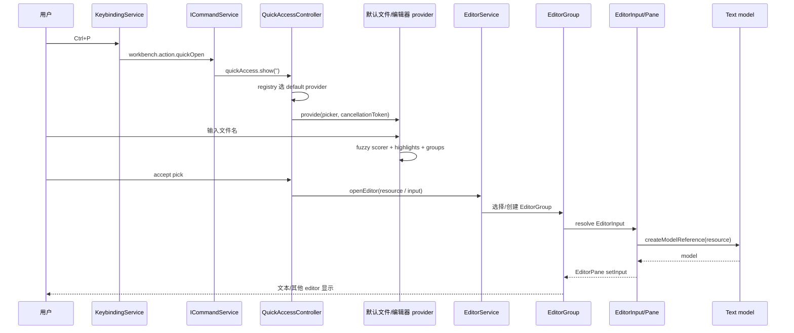

# 04 Quick Access 与命令：Ctrl+P 不是一个特殊搜索框

> 证据状态：Quick Access registry/controller、命令注册/执行、菜单过滤、扩展命令激活 **已验证**；真实键盘操作 **未验证**。

## 结论先行

`Ctrl+P`、`Ctrl+Shift+P`、菜单项、工具栏按钮和扩展 API 可以指向同一个 command，但它们不是同一层：

```text
Keybinding  ─┐
Menu item   ─┼─> command id ─> CommandsRegistry / ICommandService ─> handler
Quick Pick  ─┘                              │
                                      onCommand:<id> activation
```

Quick Access 负责“根据前缀选择 provider、展示可取消的 Quick Pick、把输入交给 provider”；Command Palette provider 负责“从 Command Palette menu 生成可见命令”；`CommandService` 负责“激活需要的扩展、查找 command、执行 handler”。菜单里看得到，不等于当前 context 下 enabled，也不等于扩展拥有任意执行权限。

对 NeuroBook 的启发：命令 ID、入口可见性、context 条件、激活事件、执行授权和实际 handler 必须分成字段；不要把“显示一个按钮”当成“已经获得写 Workspace/启动 Provider 的权限”。

### 先定义入口层的名词

- **Quick Access** 是“输入框 + provider 选择器”的控制器；它根据前缀把输入交给文件、命令或其他 provider。
- **Quick Pick** 是输入框里可过滤、可取消、可选择的候选项 UI；它不是命令注册表。
- **provider** 是根据输入提供候选项或内容的实现；provider 可以被取消，不因此获得文件写入权。
- **context key** 是宿主记录的当前界面条件，例如是否正在命令选择器中；它可影响显示和 keybinding 解析，不替代业务授权。
- **command id** 是稳定的能力标识；menu item、keybinding 和 Quick Access 都只是它的入口，handler 才是实际执行逻辑。

本章把“入口可见”“命令已登记”“扩展已激活”“handler 执行成功”分开描述，这是排查命令为什么找不到或为什么没有权限的最短路径。

## Quick Access 的控制器

固定 commit 的 [`QuickAccessRegistry`](https://github.com/microsoft/vscode/blob/a5b500951314efd502d07465bd138dfbd714a960/src/vs/platform/quickinput/common/quickAccess.ts) 维护：

- default provider（无前缀）；
- 带前缀 provider 列表；
- 按前缀长度降序排序，较长前缀优先；
- `when` context key 条件；
- provider descriptor：构造器、前缀、placeholder、帮助信息、context key。

[`QuickAccessController`](https://github.com/microsoft/vscode/blob/a5b500951314efd502d07465bd138dfbd714a960/src/vs/platform/quickinput/browser/quickAccess.ts) 的 `show()`/`pick()` 过程：

1. 读取当前输入和 context key；
2. 用 registry 选 provider descriptor；
3. 第一次使用时通过 `InstantiationService.createInstance()` 惰性创建 provider；
4. 创建 `QuickPick`，把 prefix 从实际过滤值中剥离；
5. 调用 `provider.provide(picker, cancellationToken, options)`；
6. 输入变化时重新判断 provider，必要时换 picker；
7. picker 隐藏且没有选择时取消 token、dispose provider 相关资源；
8. 接受后记住 provider 的上次输入，可由 `DefaultQuickAccessFilterValue.LAST` 恢复。

这解释了两个用户可感知行为：输入 `>` 后 provider 变成 Command Palette；输入变化可能切换 provider；关掉 picker 后长时间搜索应收到 cancellation，而不是继续向已销毁 UI 写结果。

### Provider 注册不是 provider 执行

[`quickAccess.contribution.ts`](https://github.com/microsoft/vscode/blob/a5b500951314efd502d07465bd138dfbd714a960/src/vs/workbench/contrib/quickaccess/browser/quickAccess.contribution.ts) 登记：

- Help provider；
- View provider；
- `CommandsQuickAccessProvider`，前缀为 `>`，context key 为 `inCommandsPicker`。

它还把 Command Palette action 加进多个菜单，并通过 `KeybindingsRegistry.registerCommandAndKeybindingRule()` 注册 picker 内导航命令。这里的副作用只登记入口和规则，不会在启动时执行每个 provider 的查询。

## Command、menu item、keybinding、Quick Pick、context key 五层

| 层 | 回答的问题 | 固定源码边界 |
| --- | --- | --- |
| command | 真实执行的稳定 ID 是什么 | `CommandsRegistry.registerCommand()` |
| handler | ID 最终调用什么函数 | `ICommandHandler(accessor, ...args)` |
| menu item | 什么时候在菜单/Palette 显示 | `MenuRegistry` + `MenuId` + `when`/`precondition` |
| keybinding | 哪个键组合触发哪个 command | `KeybindingsRegistry`、`IKeybindingService`、resolver |
| Quick Pick | 用户如何搜索/选择候选 | `QuickAccessController` + provider |
| context key | 当前编辑器/窗口/Picker 状态是什么 | `ContextKeyService` + `ContextKeyExpr` |

一个 command 可以有多个 menu item 和 keybinding，也可以没有任何 menu item 但仍由 API 调用。一个 menu item 的 `when` 通过只读 context 决定可见，`precondition` 决定是否 enabled；两者都不是写权限或业务授权合同。

## 旅程：输入文件名打开资源

### 入口

用户按 `Ctrl+P`（平台默认 keybinding；本轮未实机验证），或执行 `workbench.action.quickOpen`。固定 commit 的文件动作把 “Go to File...” 映射到这个 command；`quickAccess.ts` 的 `defaultQuickAccessContext` 使用 `inFilesPicker` 标记文件 picker 上下文。

### 链路



`BaseEditorQuickAccessProvider` 的固定实现可直接看到：

- `prepareQuery(filter)`；
- `scoreItemFuzzy()` 与 scorer cache；
- 多 Editor Group 按 Grid appearance 分组；
- 候选上显示 dirty、group、icon；
- 接受后调用 `EditorGroup.openEditor()`；
- 关闭 dirty editor 的按钮不会静默丢弃未保存内容。

**已验证**：provider 的取消、模糊匹配、分组和打开编辑器入口；文件扫描的具体后端 provider 与实际磁盘响应未在本轮运行。

### 没有结果或打开失败

- provider 没有候选：显示 `No matching editors`/`No matching commands` 类 no-result pick，具体文件搜索文案以 provider 为准；
- 输入没有匹配 prefix：registry 选择不到 provider，controller 仍可显示空 picker；
- URI 没有 FileSystemProvider 或解析失败：`EditorService`/EditorGroup 触发 open failure event，具体通知 UI 未实机验证；
- picker 被关闭：取消 token，provider 不应继续更新已隐藏列表；
- 文件是 dirty editor：候选带 unsaved 状态，关闭动作必须经过 editor group 保存/关闭规则。

## 旅程：输入 `>` 搜索并执行内置命令

### 1. provider 等待扩展注册的短窗口

[`CommandsQuickAccessProvider.getCommandPicks()`](https://github.com/microsoft/vscode/blob/a5b500951314efd502d07465bd138dfbd714a960/src/vs/workbench/contrib/quickaccess/browser/commandsQuickAccess.ts) 会等待 `whenInstalledExtensionsRegistered()`，但用 `raceTimeout(..., 800)` 限制等待。目的不是保证所有扩展永远到齐，而是给刚登记的命令一个短窗口，同时保持 Palette 可用。

### 2. 命令候选来自 Menu Registry

`getGlobalCommandPicks()` 读取 `MenuId.CommandPalette` 的 menu actions，并过滤 `action.enabled`。候选附带 command id、label、category、metadata description 和 `commandWhen`；用户看到的是**当前菜单/上下文允许显示的命令集合**，不是 `CommandsRegistry.getCommands()` 的无条件全量 dump。

### 3. 接受后进入 `CommandService`

[`CommandService.executeCommand()`](https://github.com/microsoft/vscode/blob/a5b500951314efd502d07465bd138dfbd714a960/src/vs/workbench/services/commands/common/commandService.ts) 做以下判断：

```text
command 已注册？
  ├─ 是且 activation event 已完成 → 立即 _tryExecuteCommand
  ├─ 是但 Extension Host 未 ready → drive-by activate，不等待，先执行已注册 handler
  ├─ 是且 host ready → await activateByEvent(onCommand:<id>)，再执行
  └─ 否 → 并行触发 onCommand:<id> 与 * activation/注册事件，最多受 activation 策略限制
```

最终 `_tryExecuteCommand()`：

1. 再查 `CommandsRegistry.getCommand(id)`；
2. 找不到则 reject：`command '<id>' not found`；
3. 发 `onWillExecuteCommand`；
4. 用 `InstantiationService.invokeFunction(command.handler, ...args)` 注入 handler 服务；
5. 发 `onDidExecuteCommand`。

### 扩展命令的跨宿主执行

扩展宿主通过 [`MainThreadCommands`](https://github.com/microsoft/vscode/blob/a5b500951314efd502d07465bd138dfbd714a960/src/vs/workbench/api/browser/mainThreadCommands.ts) 在主线程 `CommandsRegistry` 注册一个代理 handler：

```text
MainThreadCommands.$registerCommand(id)
  → CommandsRegistry.registerCommand(id, (...args) => proxy.$executeContributedCommand(id, ...args))
  → ExtHostCommands
  → extension handler
  → revive/DTO 返回
```

如果主线程第一次执行时本地还没有该 command，`$executeCommand(..., retry = true)` 会触发 `onCommand:<id>` 后返回内部 retry 信号，再由主线程重新查找。参数通过 `revive()` 还原 URI/DTO；这不是把主线程对象引用直接交给扩展。

## 未知、禁用与首次激活

| 情形 | 控制层 | 结果 |
| --- | --- | --- |
| command id 未注册 | `CommandService.executeCommand` | 先触发 `onCommand:<id>` 和 `*`/注册竞争；最后找不到时 reject `command '<id>' not found` |
| command 注册但 menu disabled | `CommandsQuickAccessProvider` | 不进入 Palette 候选；API/其他入口仍可能直接执行，是否允许由 command handler/业务服务决定 |
| provider `when` 不满足 | `QuickAccessRegistry.getQuickAccessProvider` | provider 不参与选择；context key 改变后可能重新选择 |
| provider 无结果 | provider no-results pick | 用户看到无匹配，取消 picker 会 cancel token |
| 扩展命令首次触发 | `CommandService` → `IExtensionService.activateByEvent` | Extension Host 激活依赖，再通过 MainThread/ExtHost RPC 注册/调用 |
| 激活依赖缺失 | `ExtensionsActivator` | 激活 operation 失败并记录 missing dependency；command 可能仍不存在 |
| handler 抛错 | `_tryExecuteCommand` catch | 返回 rejected Promise；通知层是否显示错误由调用方决定 |

## 对 NeuroBook 的研究映射

### 建议的分层观察

- `commandId`：稳定标识能力，不携带执行权限；
- `contribution`：标题、入口、`when`、输入 schema；
- `activation`：首次使用时启动 Profile/Job/Provider runtime；
- `authority`：调用方可以访问的 Project/Session/attachment；
- `execution policy`：是否需要用户审批、是否修改 Workspace、是否允许外部网络/secret；
- `result event`：成功、取消、失败、部分发布都进入 Session/Job snapshot。

### 禁止的混合

- 菜单可见 ≠ 可以写文件；
- command 注册 ≠ Provider 凭据可用；
- Quick Pick 选择 ≠ 参数已经过 schema 校验；
- Extension Host RPC ≠ 安全沙箱；
- `ImageVariantModule` 的 queue ≠ 通用生图队列。

## 源码锚点与检查边界

- [QuickAccess registry](https://github.com/microsoft/vscode/blob/a5b500951314efd502d07465bd138dfbd714a960/src/vs/platform/quickinput/common/quickAccess.ts)：`QuickAccessRegistry.registerQuickAccessProvider/getQuickAccessProvider`。
- [QuickAccess controller](https://github.com/microsoft/vscode/blob/a5b500951314efd502d07465bd138dfbd714a960/src/vs/platform/quickinput/browser/quickAccess.ts)：`QuickAccessController.doShowOrPick/getOrInstantiateProvider`。
- [Command Palette contribution](https://github.com/microsoft/vscode/blob/a5b500951314efd502d07465bd138dfbd714a960/src/vs/workbench/contrib/quickaccess/browser/quickAccess.contribution.ts)：provider、菜单和 keybinding 注册。
- [CommandsQuickAccessProvider](https://github.com/microsoft/vscode/blob/a5b500951314efd502d07465bd138dfbd714a960/src/vs/workbench/contrib/quickaccess/browser/commandsQuickAccess.ts)：`getCommandPicks/getGlobalCommandPicks`。
- [Editor Quick Access](https://github.com/microsoft/vscode/blob/a5b500951314efd502d07465bd138dfbd714a960/src/vs/workbench/browser/parts/editor/editorQuickAccess.ts)：`BaseEditorQuickAccessProvider._getPicks`、`accept`。
- [Command registry](https://github.com/microsoft/vscode/blob/a5b500951314efd502d07465bd138dfbd714a960/src/vs/platform/commands/common/commands.ts)：`CommandsRegistry`。
- [Command service](https://github.com/microsoft/vscode/blob/a5b500951314efd502d07465bd138dfbd714a960/src/vs/workbench/services/commands/common/commandService.ts)：`CommandService.executeCommand/_tryExecuteCommand`。
- [MainThread commands](https://github.com/microsoft/vscode/blob/a5b500951314efd502d07465bd138dfbd714a960/src/vs/workbench/api/browser/mainThreadCommands.ts)：`$registerCommand/$executeCommand`。
- [Keybinding resolver](https://github.com/microsoft/vscode/blob/a5b500951314efd502d07465bd138dfbd714a960/src/vs/platform/keybinding/common/keybindingResolver.ts)：keybinding/context resolution。

未在本轮执行：真实 Ctrl+P/Ctrl+Shift+P、平台 keymap 覆盖、菜单 UI、搜索索引性能和命令执行时的真实扩展安装状态。命令链、provider 选择和失败字符串来自固定源码；键盘映射和用户看到的最终排序仍需运行验收。
