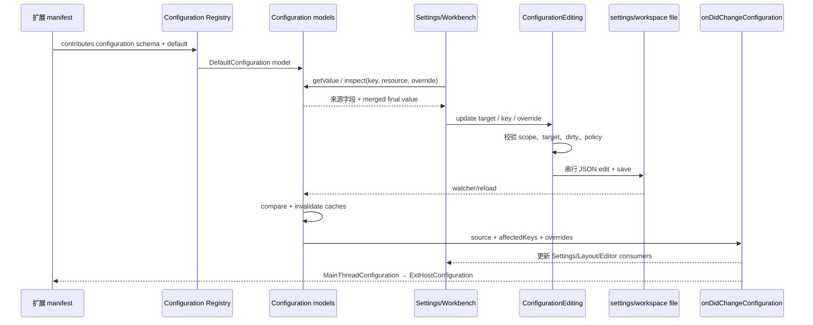

# 05 配置系统：一个设置值怎样从 schema 变成最终结果

> 证据状态：配置 schema 注册、模型字段、合并、`inspect()`、写入 target、文件监听和 change event **已验证**；真实 Settings UI 操作 **未验证**。  
> 注意：本章的 Profile 是用户配置/存储上下文，不把它虚构成独立优先级层。

## 结论先行

VS Code 配置不是一个 JSON 文件，也不是简单的“后写覆盖先写”。固定 commit 中至少有这些模型：默认、策略、应用、local user、remote user、workspace、workspace folder、memory；language override 作为 `ConfigurationModel.overrides` 进入同一套读取；Profile 决定用户 settings resource 和部分作用域，不是自动插入的第九个优先级层。

用户最终读取一个设置时，系统先按资源得到合并模型，再按语言 override 选择视图，最后把 policy 值覆盖到读取结果。用户写入时，Workbench 先根据 setting scope 推导 target，再由 `ConfigurationEditing` 串行编辑对应 JSON/远端配置资源；文件变化会重新解析模型、清除缓存并发出 `onDidChangeConfiguration`。

对 NeuroBook 的启发：配置的**声明 schema、来源层、有效值、写入 target、secret/权限和 change event**必须分开。不能把 `readConfigSnapshot()` 返回的业务 DTO 直接当作一个可被外部 Profile 覆盖的通用配置模型。

### 先定义配置系统的五个对象

- **schema**：设置的类型、默认值、可写作用域和说明；它定义“这个键允许怎样使用”。
- **configuration model**：某一个来源层的内存树，例如 user 或 workspace；多个 model 合并后才得到读取结果。
- **target**：一次写入要落到哪一层，例如 user、workspace、folder 或 memory；它不是读取优先级的同义词。
- **override identifier**：语言或资源专用的视图，例如 `[markdown]`；它是在已有配置模型上选择覆盖值，不是自动增加一层普通优先级。
- **policy**：管理员提供的受管值；本章中它在读取时覆盖结果，并可能使普通写入被拒绝。

Profile 在本章特指 VS Code User Data Profile：它选择哪套用户设置资源和存储上下文，不是一个额外的“Profile 优先级层”，更不等于 NeuroBook 的 Agent Profile artifact。

## 1. schema 先登记，默认值才有来源

扩展的 `contributes.configuration` 由 [`configurationExtensionPoint.ts`](https://github.com/microsoft/vscode/blob/a5b500951314efd502d07465bd138dfbd714a960/src/vs/workbench/api/common/configurationExtensionPoint.ts) 处理，经过 `IConfigurationRegistry` 注册属性 schema。schema 不只是类型：还可声明 scope、default、enum、description、language-overridable、machine-overridable、deprecation 和安全/同步提示。

`ConfigurationScope` 直接影响合法写入位置：

- `application`：只适合用户设置；
- `machine`：机器/远端层；
- `window`：用户、远程用户或 workspace；
- `resource`：可以落到 workspace folder；
- `language-overridable`：允许 `[typescript]` 之类的语言覆盖；
- `machine-overridable`：机器配置也可在更低作用域覆盖的受控类别。

`MainThreadConfiguration` 把配置初始化数据和 change event 通过 RPC 发送给 Extension Host：

```text
IConfigurationService.getConfigurationData()
  → MainThreadConfiguration._getConfigurationData()
  → ExtHostConfiguration.$initializeConfiguration()

configurationService.onDidChangeConfiguration
  → ExtHostConfiguration.$acceptConfigurationChanged(data, change)
```

因此扩展侧看到的配置是主线程模型投影，而不是扩展自己直接读取用户 JSON。

## 2. 固定 commit 的配置模型

[`IConfigurationValue`](https://github.com/microsoft/vscode/blob/a5b500951314efd502d07465bd138dfbd714a960/src/vs/platform/configuration/common/configuration.ts) 明确暴露来源字段：

```text
defaultValue
applicationValue
userValue
userLocalValue
userRemoteValue
workspaceValue
workspaceFolderValue
memoryValue
policyValue
value（最终值）
```

对应的 `ConfigurationTarget` 有：

```text
APPLICATION | USER | USER_LOCAL | USER_REMOTE
WORKSPACE | WORKSPACE_FOLDER | DEFAULT | MEMORY
```

`ConfigurationModel` 自己保存：

- `_contents`：层内的树形值；
- `_keys`：层内已知键；
- `_overrides`：语言/资源 override 的 identifier、keys、contents；
- `_raw`：用于 `inspect()` 回看原始来源；
- `overrideConfigurations` cache：已按语言 identifier 生成的视图。

`ConfigurationModel.inspect()` 返回四种视角：

- `value`：这一层未应用 override 的原始值；
- `override`：指定 identifier 的覆盖值；
- `merged`：该层按 override 合并后的值；
- `overrides`：所有匹配 identifiers 及其值。

## 3. 最终值的真实合并顺序

固定 commit 的 [`Configuration`](https://github.com/microsoft/vscode/blob/a5b500951314efd502d07465bd138dfbd714a960/src/vs/platform/configuration/common/configurationModels.ts) 源码直接表达了基础合并：

```text
workspace consolidated
  = default
    .merge(application)
    .merge(user)
    .merge(workspace)
    .merge(memory)

folder consolidated
  = workspace consolidated.merge(folder)
```

其中 `user` 不是额外优先级：

```text
userConfiguration
  = localUserConfiguration.merge(remoteUserConfiguration)
```

只有存在 remote user model 时才合并；否则 user 就是 local user。资源位于某个 workspace folder 时，再从 folder consolidated model 读取。

读取时如果传入 `overrideIdentifier`，先把 consolidated model 转成对应语言视图；然后 policy model 的值会覆盖相同 key 的读取值。源码中的 `getConsolidatedConfigurationModel()` 对 policy 的处理是最后一层读取覆盖，而不是普通用户可写层。

### 同一个设置键的示例

下面用 `illustration.preview.enabled` 说明**模型字段**；值是教学例子，不是 VS Code 或 NeuroBook 的真实设置：

| 来源 | 示例值 | 语义 |
| --- | --- | --- |
| default | `false` | schema/default contribution 产生的默认值 |
| application | `true` | 应用/Profile 特定的应用层（若该 profile 有此层） |
| userLocal | `false` | 本机用户 settings resource |
| userRemote | `true` | 远程用户 settings resource；与 local 合并成 `user` |
| workspace | `false` | Workspace 配置 |
| workspaceFolder | `true` | 当前 resource 所在 folder 配置 |
| memory | `false` | 当前进程临时覆盖，不必写文件 |
| `[markdown]` override | `true` | 语言/资源 override 视图 |
| policy | `false` | 读取时 policy 覆盖，普通写入拒绝 |

不把这个表简化成“Profile > User > Workspace > Folder”。准确说法是：

1. Profile 选择 settings resource 和当前配置上下文；
2. local/remote user 合并形成 user model；
3. `Configuration` 按 default/application/user/workspace/memory，再按 resource folder 合并；
4. override identifier 选择语言视图；
5. policy 在读取结果上施加受管值；
6. `inspect()` 同时返回各来源，便于 Settings UI 说明“值来自哪里”。

如果删除 `workspaceFolderValue`，folder consolidated model 回落到 workspace consolidated；删除 workspace 后回落到 user；删除用户值后回落到 default/application/memory 等仍存在的来源。真实回落取决于资源、scope 和 override，不能只按一张线性优先级表猜。

## 4. Profile 到底做什么

Workbench `WorkspaceService` 在启动时根据 `userDataProfileService.currentProfile`：

- 选择 current profile 的 `settingsResource`；
- 根据是否 default profile、是否有 remote authority 计算可用 configuration scopes；
- 创建 `UserConfiguration`；
- 非 default profile 可以建立 `ApplicationConfiguration` 相关资源；
- profile 变化时重新建立应用配置上下文并触发配置变化。

这说明 Profile 是“哪套用户资源/存储上下文正在生效”，不是一个可以随意插入 `default → profile → user → workspace` 的独立覆盖层。NeuroBook 的 Agent Profile artifact 与 VS Code User Data Profile 名字相似但职责不同，不能直接复用术语。

## 5. 读取、inspect 与缓存失效

### 读取

`ConfigurationService.getValue()` 调用 `Configuration.getValue()`；`Configuration.inspect()` 返回每一层的 `IInspectValue` 和最终 `value`。`inspect()` 可观察字段包括：

```text
default / application / user / userLocal / userRemote
workspace / workspaceFolder / memory / policy
value / overrideIdentifiers
```

### 缓存

当以下模型变化时，`Configuration` 清空相关 consolidated cache：

- default/application 更新：清空 workspace/folder consolidated；
- local/remote user 更新：清空 user + workspace/folder consolidated；
- workspace 更新：清空 workspace/folder consolidated；
- folder 更新/删除：清空该 resource 的 folder consolidated。

这不是每次 `getValue()` 重新读磁盘；内存 model 和按 resource 的 cache 共同提供稳定读取。

### 文件监听与 change event

`ConfigurationService` 注册：

- `defaultConfiguration.onDidChangeConfiguration`；
- `policyConfiguration.onDidChangeConfiguration`；
- `userConfiguration.onDidChange`，并通过 50ms `RunOnceScheduler` 合并 reload。

reload 后比较旧/新 data，调用 `trigger(change, previous, source)`；事件带 `source`、`affectedKeys`、override changes，消费者可用 `affectsConfiguration(key, overrides)` 精确过滤。

Workbench `WorkspaceService` 还监听 local user、remote user、workspace、folder、profile 变化；远端用户配置由 `RemoteUserConfiguration` 通过 Remote Agent 取得，初始化用 barrier 确保 workspace 完整前不误读。

## 6. 写入：memory 与持久化不是一回事

### 内存更新

`Configuration.updateValue(key, value, overrides)` 是内部模型更新：

- 有 resource 时写入 `_memoryConfigurationByResource`；
- 无 resource 时写入 `_memoryConfiguration`；
- `undefined` 删除 memory 值；
- 使 consolidated cache 失效。

这适合临时状态，不自动写用户 settings/workspace JSON。

### 用户/Workbench 的持久化写入

平台 `ConfigurationService.updateValue()` 接收 key/value/overrides/target，检查：

- target 必须是可由当前实现写入的 user target；
- policyValue 存在时拒绝：`Unable to write <key> because it is configured in system policy.`；
- 与 default 相同的值会转为 `undefined`，删除不必要的用户 override；
- language override identifiers 组成 `[lang]` JSON path；
- 通过 `ConfigurationEditing.write()` 写文件，再 `reloadConfiguration()` 触发事件。

Workbench 的 [`ConfigurationEditing`](https://github.com/microsoft/vscode/blob/a5b500951314efd502d07465bd138dfbd714a960/src/vs/workbench/services/configuration/common/configurationEditing.ts) 提供可编辑 target：

```text
USER_LOCAL | USER_REMOTE | WORKSPACE | WORKSPACE_FOLDER
```

它把写入串行排队，解析对应 settings/workspace/folder model，校验 scope/target/workspace 是否存在，编辑 JSON buffer 并保存。固定源码列出这些失败：

- unknown key；
- application/machine setting 写入 workspace/folder；
- 不支持的 user/workspace/folder target；
- 没有 Workspace 却写 workspace；
- 配置编辑器 dirty；
- 配置文件自上次读取后已被外部修改；
- JSON parse error；
- policy configuration write。

因此“调用 `updateValue()`”必须进一步说明调用的是哪个宿主服务、target 是 memory 还是文件层、是否经过 `ConfigurationEditing`。

## 7. 旅程：同一个设置键从声明到 change event



## 8. 对 NeuroBook 的现状对照

### 已验证现状

- [`server/config/config-service.ts::readConfigSnapshot`](../../../server/config/config-service.ts) 读取业务运行配置快照；`globalConfigPath()` 跟随当前 State Root，Project 配置在 Project Workspace 的 `.nbook/config.json`。
- `saveGlobalConfig()` 与 `saveProjectConfig()` 明确分开；Project 写入包含 global-only 字段时拒绝；`resolveConfigTarget()` 是 Config service 的 Project 数据面边界。
- Agent Profile settings 有独立的 global/project scope、Profile Home 和 resource mutation 校验；这不是 VS Code 的通用 configuration target。
- `readConfigSnapshot()` / `readConfigEditorSnapshot()` 返回 DTO 和编辑面数据；不是可让插件任意注册 schema 的 Registry。

### 研究建议（不构成合同）

1. 把“声明 schema”“有效值”“写入 target”“secret authority”“change event”分开记录。
2. Profile artifact 继续保持 artifact/安装来源语义；不要因借鉴 VS Code `User Data Profile` 而增加隐藏优先级层。
3. Project/Session memory 值可借鉴 `MEMORY` 的可丢弃模型，但必须标明它不进入 durable config 或 provenance ledger。
4. 任何第三方设置写入都要经过宿主 scope/target 校验；禁止插件直接写 `.nbook/config.json` 或借通用 `updateValue` 绕过 Provider 连接稳定性校验。

## 源码锚点与检查边界

- [configuration.ts](https://github.com/microsoft/vscode/blob/a5b500951314efd502d07465bd138dfbd714a960/src/vs/platform/configuration/common/configuration.ts)：`ConfigurationTarget`、`IConfigurationValue`、`IConfigurationChangeEvent`。
- [configurationModels.ts](https://github.com/microsoft/vscode/blob/a5b500951314efd502d07465bd138dfbd714a960/src/vs/platform/configuration/common/configurationModels.ts)：`ConfigurationModel`、`ConfigurationInspectValue`、`Configuration`、`getWorkspaceConsolidatedConfiguration`、`getConsolidatedConfigurationModelForResource`。
- [configurationRegistry.ts](https://github.com/microsoft/vscode/blob/a5b500951314efd502d07465bd138dfbd714a960/src/vs/platform/configuration/common/configurationRegistry.ts)：schema/default/override identifier 注册。
- [configurationExtensionPoint.ts](https://github.com/microsoft/vscode/blob/a5b500951314efd502d07465bd138dfbd714a960/src/vs/workbench/api/common/configurationExtensionPoint.ts)：`contributes.configuration` extension point。
- [mainThreadConfiguration.ts](https://github.com/microsoft/vscode/blob/a5b500951314efd502d07465bd138dfbd714a960/src/vs/workbench/api/browser/mainThreadConfiguration.ts)：配置初始化、变更 RPC、target 推导。
- [platform configurationService.ts](https://github.com/microsoft/vscode/blob/a5b500951314efd502d07465bd138dfbd714a960/src/vs/platform/configuration/common/configurationService.ts)：`initialize/updateValue/inspect/reloadConfiguration`。
- [Workbench WorkspaceService](https://github.com/microsoft/vscode/blob/a5b500951314efd502d07465bd138dfbd714a960/src/vs/workbench/services/configuration/browser/configurationService.ts)：local/remote/workspace/folder/Profile 上下文。
- [ConfigurationEditing](https://github.com/microsoft/vscode/blob/a5b500951314efd502d07465bd138dfbd714a960/src/vs/workbench/services/configuration/common/configurationEditing.ts)：串行 JSON 写入与错误码。

未在本轮执行：真实 Settings UI、跨窗口同步、Settings Sync 服务、policy 文件变更实机、remote user settings 网络断开。固定源码足以确认字段和合并/cache 机制，但不证明每个部署的同步延迟或最终 UI 文案。
