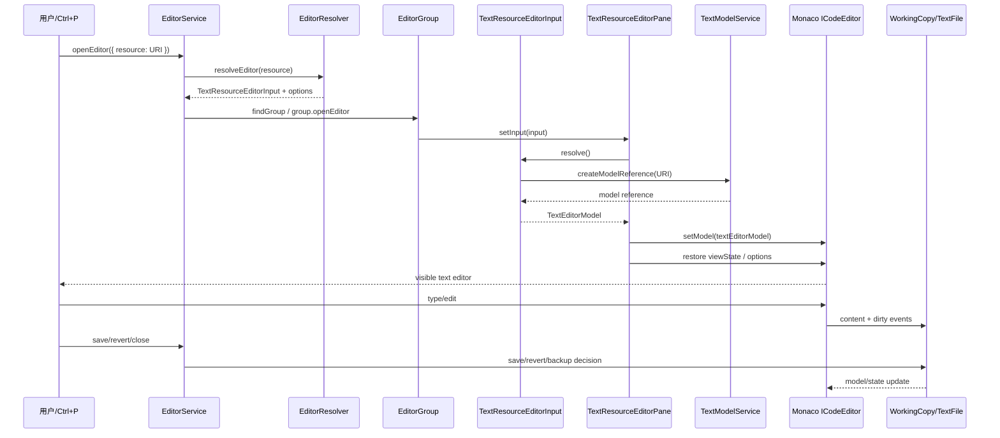

# 06 编辑器架构：Workbench Editor 与 Monaco Editor 如何接上

> 证据状态：URI → EditorInput → EditorService/Group → EditorPane → text model → Monaco control 的分层 **已验证**；真实文件操作、崩溃恢复和语言服务运行 **未验证**。

## 结论先行

“打开一个文件”不是把文件内容塞进一个 `<textarea>`。Workbench 先把 URI 解析为 `EditorInput`，由 `EditorService` 选择 `EditorGroup` 和 editor resolver，再由 `EditorPane` 解析 model、创建/复用 Monaco `ICodeEditor` control，最后 `setModel()`。脏状态、保存、备份、revert 和关闭由 Working Copy/Text File/EditorInput 层协作；Monaco 只负责编辑模型和视图，不拥有 Project 文件的最终保存权。

对 NeuroBook 的启发：章节正文仍应由 Workspace file/history 作为真相源；文生图的预览、历史图和角色配置可以是 View 或 custom editor，但生成资产的所有权、写入、回滚和历史记账不能放在一个前端 editor widget 里。

### 先定义“打开文件”涉及的对象

- **URI** 是资源身份，不是文件内容；它也可以指向远程或虚拟资源。
- **EditorInput** 代表“打开了哪个资源以及如何 resolve/save/revert”；**EditorPane** 代表“用哪种 UI 显示它”。
- **text model** 是内存中的文本、语言和编辑事件；**Monaco control** 是光标、滚动、装饰等编辑视图控制。
- **Working Copy** 是宿主统一管理 dirty、save、backup 的可写副本语义；它把内存变化接到文件持久化流程。

这几个对象不共享职责：URI 不负责权限，Monaco 不负责最终写盘，EditorInput 不负责绘制整个 Workbench。

## 五层对象关系

```text
URI / resource
  ↓ editor resolver
EditorInput（打开了哪个资源、是否 dirty、如何 resolve/save/revert）
  ↓ EditorService.openEditor
EditorGroup（哪个组、tab、active/pinned/transient）
  ↓ EditorPane.setInput
EditorPane（文本、diff、图片、custom editor、webview 的 UI 壳）
  ↓ resolve model / createModelReference
TextEditorModel / TextModel（内容、语言、编辑事件、引用生命周期）
  ↓ control.setModel
Monaco ICodeEditor（DOM、光标、装饰、滚动、view state）
```

### 对象职责

| 对象 | 人话职责 | 不负责什么 |
| --- | --- | --- |
| `EditorInput` | 对资源/文档的身份和操作封装 | 不直接绘制 Monaco DOM |
| `EditorService` | 解析 input、选 group、广播打开/关闭/失败事件 | 不替代底层 file provider |
| `EditorGroup` | 管理 tabs、active editor、group split 归属 | 不决定所有配置/项目权限 |
| `EditorPane` | 把某种 input 渲染成具体 editor control | 不拥有持久化文件真相 |
| text model | 内存内容、语言、编辑操作和事件 | 不等于磁盘已保存 |
| Monaco `ICodeEditor` | 文本视图、光标、滚动、装饰和命令 | 不直接决定 Workspace history |
| Working Copy | 统一 dirty/content/save 观察 | 不取代 EditorInput 的显示选择 |

## 旅程：打开一个 URI 文件

### 1. `EditorService.openEditor()` 解析输入

[`EditorService.openEditor()`](https://github.com/microsoft/vscode/blob/a5b500951314efd502d07465bd138dfbd714a960/src/vs/workbench/services/editor/browser/editorService.ts) 接受 typed `EditorInput` 或 untyped `{ resource, options, ... }`：

1. 如果是 untyped input，先让 `IEditorResolverService.resolveEditor()` 选择 custom editor、diff editor 或默认 text editor；
2. resolver 返回 `ABORT` 时终止打开；
3. 没有 override 时由 `ITextEditorService.resolveTextEditor()` 把 resource 变成文本 EditorInput；
4. `findGroup()` 根据 preferred group、activation、side-by-side、transient 等选目标 EditorGroup；
5. `group.openEditor(typedEditor, options)` 进入具体 editor pane。

它同时处理 Workspace Trust：批量 `openEditors()` 可以先调用 `handleWorkspaceTrust()`，不满足信任时返回空结果，不把未信任资源悄悄当成已允许执行的文档。

### 2. `TextResourceEditorInput.resolve()` 建立 model reference

[`TextResourceEditorInput`](https://github.com/microsoft/vscode/blob/a5b500951314efd502d07465bd138dfbd714a960/src/vs/workbench/common/editor/textResourceEditorInput.ts) 延迟调用 `ITextModelService.createModelReference(resource)`：

```text
第一次 resolve
  → 创建 modelReference Promise
  → 等待 reference
  → 校验 model 类型
  → 缓存 TextResourceEditorModel

EditorInput.dispose
  → await modelReference.then(ref => ref.dispose())
  → cachedModel = undefined
  → super.dispose()
```

这不是每个 tab 都复制一份文本。model service 以 reference 计数/释放底层 model；Input 被销毁时释放自己的引用。模型类型不符合预期会释放 reference 并抛出：

```text
Unexpected model for TextResourceEditorInput: <resource>
```

### 3. `AbstractTextResourceEditor.setInput()` 接到 Monaco

[`textResourceEditor.ts`](https://github.com/microsoft/vscode/blob/a5b500951314efd502d07465bd138dfbd714a960/src/vs/workbench/browser/parts/editor/textResourceEditor.ts) 先调用父级 `setInput()`，再 `await input.resolve()`；解析成功后：

1. 检查 cancellation token；
2. 确认 resolved model 是 `BaseTextEditorModel`；
3. 取得 editor control；
4. `control.setModel(textEditorModel)`；
5. 没有外部 view state 时恢复 editor view state；
6. 应用 selection/options；
7. 根据 resolved model 的 readonly 状态更新 control。

Monaco 对外提供的 `ICodeEditor` 能力包括：

- `getModel()`/`setModel()`；
- `onDidChangeModelContent`、language、decorations、tokens；
- cursor/selection/scroll/layout；
- `executeEdits()`、undo stop、decorations、content/overlay/glyph widgets；
- `saveViewState()`/`restoreViewState()`。

这些能力作用于内存 model 和视图；扩展通过语言服务、编辑器 API、命令和 decoration 等代理接入，不直接控制 Workbench 外壳 DOM。

### 时序图



## 脏状态、保存、另存、revert 和关闭

### Dirty 不等于 model 有内容变化

`IWorkingCopyService` 维护每个 resource/type 的唯一 working copy 注册，发出：

- `onDidRegister` / `onDidUnregister`；
- `onDidChangeContent`；
- `onDidChangeDirty`；
- `onDidSave`。

同一个 resource/type 不能注册第二个 working copy，重复注册会抛出：

```text
Cannot register more than one working copy with the same resource <uri> and type <typeId>.
```

模型内容变化可以是 modified，但是否 dirty 由 working copy/save 状态决定。scratchpad/untitled 等资源也可能 modified，但不一定是普通磁盘 dirty。

### 文本 Input 的保存

`AbstractTextResourceEditorInput.save()`：

- resource 是 `untitled` 或有 FileService provider：调用 `textFileService.save()`；
- 资源没有可处理 provider：转为 `saveAs()`；
- saveAs 调用 `textFileService.saveAs()`，成功返回新 resource；
- 用户取消 saveAs 返回 `undefined`，不伪造成功；
- `revert()` 调用 `textFileService.revert()`。

真实文件写入、冲突检测、auto save、backup 和 file watcher 由 Text File/Working Copy services 完成；EditorInput 只是把操作路由到正确的服务。

### 关闭

EditorGroup 关闭 tab 前需要考虑 dirty、pinned/transient、side-by-side 和保存参与者。关闭后 EditorInput dispose，model reference 释放；如果仍有其他消费者持有 reference，底层 model 不会被过早销毁。

## 恢复与状态

### Editor Group split

`EditorPart` 独立维护 `SerializableGrid<IEditorGroupView>`，保存：

- serialized grid；
- active group；
- most recently active groups；
- centered view 等 editor-part memento。

重启时先恢复 group topology，再恢复每组的 EditorInput 和 view state。无法解析某个资源或 input 时，其他可恢复的组不应被概念上等同于全部失败；具体降级 UI 未在本轮运行。

### 文件/编辑恢复

VS Code 同时有：

- editor UI state：tab/group/scroll/cursor；
- working copy dirty state；
- backup/restore：进程崩溃或退出时保留未保存内容；
- file history/undo：编辑器/工作区服务的另一条状态链。

本轮读取了 `WorkingCopyService` 的 dirty/content/save 事件和文本 Input 的 model reference；未完整读取 backup tracker、TextFile save participant、所有 crash restore 分支。因此不能声称“任何崩溃都能恢复全部编辑内容”，只能说架构上存在独立 working copy/backup 入口。

## 文本、custom editor、webview editor、图片不是同一类

### 文本编辑器

URI → `TextResourceEditorInput` → text model → `TextResourceEditor` → Monaco code editor。语言服务、tokens、completion、diagnostics 作用于 model/语言服务 registry。

### Custom editor

[`customEditorInput.ts`](https://github.com/microsoft/vscode/blob/a5b500951314efd502d07465bd138dfbd714a960/src/vs/workbench/contrib/customEditor/browser/customEditorInput.ts) 与 `customEditors` 服务让某种 `viewType` 接管资源解析和 UI。它仍通过 EditorService/EditorGroup/EditorPane 进入 Workbench，不是把第三方页面直接插入整个 Workbench。

### Webview editor

Webview editor 以独立的 webview/input/panel 生命周期呈现 HTML/脚本，消息经宿主 API 代理；webview iframe 的隔离不等于 Extension Host 代码安全隔离。其资源 URI、消息、dispose 和 Workspace Trust 需要单独合同。

### 图片/二进制

图片可以进入 binary editor、image editor 或 custom editor；不存在 text model/Monaco `setModel()` 这条链。图片 asset 的保存/变体/历史应由资源 authority 和文件服务处理，Editor 只是显示/交互壳。

## 语言服务与 Extension API 的位置

语言服务通过 model 的 language id、language service registry、completion/hover/diagnostic provider 等作用于编辑器内容；扩展 API 通过 MainThread/ExtHost proxy 注册或调用这些服务。扩展不需要、也不应该持有 Workbench 的任意 DOM 引用来实现 language feature。

这给 NeuroBook 一个清晰边界：

- Markdown Studio 负责文本 model 与编辑器 view；
- Project Workspace/Workspace history 负责正文文件权威和写入记账；
- 文生图插件的 placeholder 可以是文本编辑器中的受控 edit/decoration，也可以由 View/custom editor 展示预览；
- 资产原图、变体、Provider 结果和历史必须通过后端/Project authority 写入，不把 `` 的浏览器状态当作持久化成功。

## 失败路径

| 失败 | 源码/模型 | 可观察结果 | 证据 |
| --- | --- | --- | --- |
| URI 无 resolver/provider | `EditorService.openEditor`、FileService/EditorResolver | 打开返回 undefined/失败事件或通知 | 源码链已验证，UI 未验证 |
| Workspace Trust 拒绝 | `openEditors(...validateTrust)` | 不打开或请求信任 | 源码已验证，真实对话框未验证 |
| model 类型错误 | `TextResourceEditorInput.resolve` | `Unexpected model for TextResourceEditorInput...` | 已验证 |
| resolve 被取消 | `AbstractTextResourceEditor.setInput` token | 返回，不把模型挂到 control | 已验证 |
| FileService provider 不支持保存 | `AbstractTextResourceEditorInput.save` | 转 Save As 或失败 | 已验证 |
| 配置/文件被外部修改 | TextFile/ConfigurationEditing | 冲突处理，需用户保存/重载 | 本章不完整读取，未验证 UI |
| working copy 重复注册 | `WorkingCopyService.registerWorkingCopy` | 直接抛重复 resource/type 错误 | 已验证 |
| input 被关闭 | `TextResourceEditorInput.dispose` | 释放 model reference；其他引用仍可保留 model | 已验证 |
| EditorPart 状态损坏 | `editorpart.state` restore | 可能丢失部分 split/tab 状态；具体降级未验证 | 字段已验证，恢复失败 UI 未验证 |

## 对 NeuroBook 的研究映射

1. **Input 与 authority 分离**：`ChapterEditorInput` 之类的 UI 对象不能成为正文真相源；它应持有 Project file identity 和 session snapshot 引用。
2. **模型与持久化分离**：编辑器内存改动先进入 working copy/RunFrame，再由明确的 save/approval 写入 Workspace history。
3. **custom editor 适合富媒体，但不拥有资产**：生成预览/历史图可以是 custom editor 或 View；资产写入必须回到 Project/attachment authority。
4. **恢复分层**：布局、Editor Group、文本 model、Job 状态、正文 history 分别恢复，不能用一次 UI reload 隐藏部分写入失败。
5. **插件 API 作用于稳定模型**：语言/命令/decoration/selection 可作为宿主 API；禁止插件直接操作 Workbench DOM 或绕过 `useResizablePanel`。

## 源码锚点与检查边界

- [EditorService](https://github.com/microsoft/vscode/blob/a5b500951314efd502d07465bd138dfbd714a960/src/vs/workbench/services/editor/browser/editorService.ts)：`openEditor/openEditors/activeEditorPane`。
- [EditorInput](https://github.com/microsoft/vscode/blob/a5b500951314efd502d07465bd138dfbd714a960/src/vs/workbench/common/editor/editorInput.ts)：Input 生命周期/dirty 基础接口。
- [TextResourceEditorInput](https://github.com/microsoft/vscode/blob/a5b500951314efd502d07465bd138dfbd714a960/src/vs/workbench/common/editor/textResourceEditorInput.ts)：`resolve/save/saveAs/revert/dispose`。
- [TextResourceEditorModel](https://github.com/microsoft/vscode/blob/a5b500951314efd502d07465bd138dfbd714a960/src/vs/workbench/common/editor/textResourceEditorModel.ts)：model service 与 dispose。
- [TextResourceEditor](https://github.com/microsoft/vscode/blob/a5b500951314efd502d07465bd138dfbd714a960/src/vs/workbench/browser/parts/editor/textResourceEditor.ts)：`setInput/clearInput`、control.setModel。
- [EditorPane](https://github.com/microsoft/vscode/blob/a5b500951314efd502d07465bd138dfbd714a960/src/vs/workbench/browser/parts/editor/editorPane.ts)：Editor Pane 壳。
- [EditorPart](https://github.com/microsoft/vscode/blob/a5b500951314efd502d07465bd138dfbd714a960/src/vs/workbench/browser/parts/editor/editorPart.ts)：Editor Group Grid 与 `editorpart.state`。
- [ICodeEditor](https://github.com/microsoft/vscode/blob/a5b500951314efd502d07465bd138dfbd714a960/src/vs/editor/browser/editorBrowser.ts)：Monaco editor control/model/view state API。
- [WorkingCopyService](https://github.com/microsoft/vscode/blob/a5b500951314efd502d07465bd138dfbd714a960/src/vs/workbench/services/workingCopy/common/workingCopyService.ts)：dirty/content/save 事件和唯一 working copy 注册。
- [CustomEditorInput](https://github.com/microsoft/vscode/blob/a5b500951314efd502d07465bd138dfbd714a960/src/vs/workbench/contrib/customEditor/browser/customEditorInput.ts)：非文本 editor 输入。

未完整读取/运行：backup tracker、TextFile save participant、Monaco 语言服务具体 provider、所有 webview 安全策略、真实崩溃恢复和大型文件优化。报告不把这些未验证项写成可靠恢复或性能承诺。
