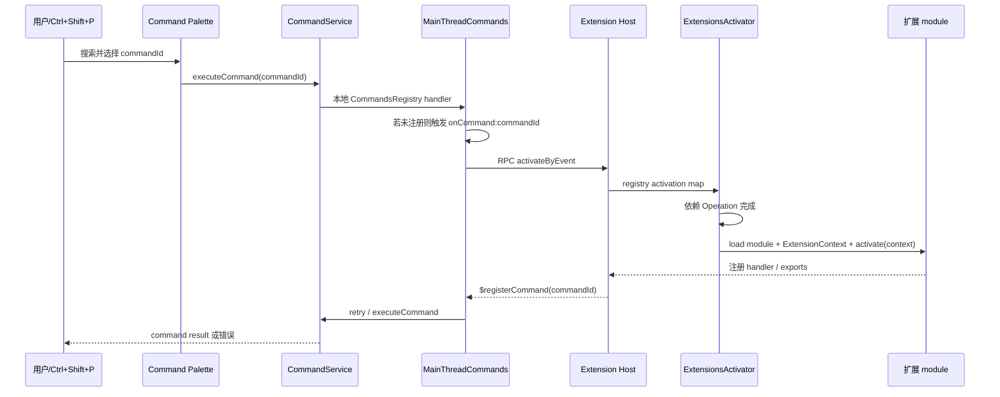
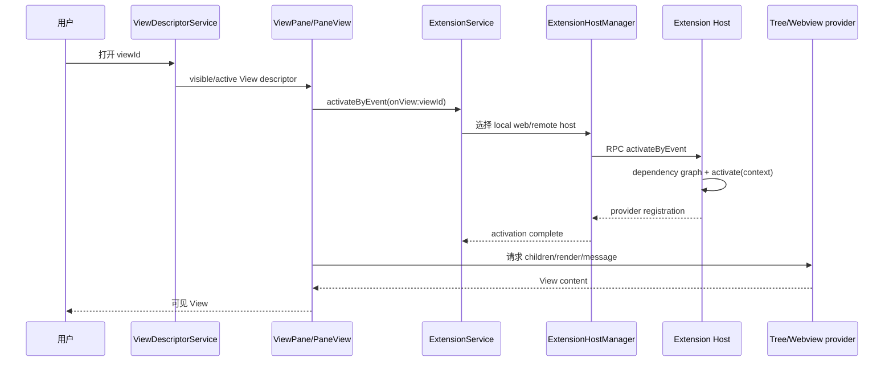

# 07 扩展系统深挖：从扫描到第一次能力调用

> 本章承接 [既有扩展系统研究](../vscode-extension-system.md)，只补固定 commit 的端到端实现链，不复制 manifest、贡献点、信任、发布和 View 的基础说明。  
> 证据状态：扫描/注册表、运行位置、依赖激活、MainThread/ExtHost RPC、动态增删和桌面崩溃恢复 **已验证**；真实 Marketplace 安装、真实扩展运行和 WebView UI **未验证**。

## 结论先行

VS Code 的扩展加载分成四个不会混在一起的阶段：

```text
扫描并去重描述
  → 注册 contribution 和 activation event
  → 计算每个扩展在哪个 Extension Host 运行
  → 事件发生时激活依赖图并跨 RPC 执行能力
```

安装扩展不等于执行扩展；贡献 command/View 不等于已经调用 `activate()`；Extension Host 重启也不等于 Workbench 重启。扩展宿主是故障隔离和 API 代理边界，但不是针对恶意扩展的完整安全沙箱。

对 NeuroBook 的研究映射：先借鉴“描述注册表 + 宿主命令 + 惰性激活 + 可观察失败状态”，再评估可执行 Profile/Workflow 的隔离。不能因为 VS Code 能加载 JavaScript 扩展，就推断第三方 NeuroBook 资产也可安全执行。

### 先定义扩展系统的控制平面与运行时

- **manifest/contribution** 是扩展包提供给宿主的声明，例如 command、View、setting 和 activation event；它先进入注册表。
- **extension point** 是宿主接收某一类声明的 schema/处理入口；它把描述转成 Workbench 能查询的模型。
- **Description Registry** 保存扩展描述、ID/activation 索引和版本快照；它不执行扩展模块。
- **activation** 是宿主按事件和依赖启动扩展运行时代码的过程；`activate()` 是扩展模块的入口函数，不是整个扩展系统。
- **Extension Host** 是独立 Node 进程或 Web Worker；**MainThread/ExtHost RPC** 是两端传递 API 请求和结果的代理边界。

所以本章反复区分“声明已登记”“运行位置已选”“代码已激活”“handler 已成功”四个状态。

## 1. 扩展进入 Workbench：扫描、分组、去重

### 1.1 Workbench Ready 后才初始化

固定 commit 的 [`ExtensionService`](https://github.com/microsoft/vscode/blob/a5b500951314efd502d07465bd138dfbd714a960/src/vs/workbench/services/extensions/browser/extensionService.ts) 在构造时把初始化挂到 `LifecyclePhase.Ready`：

```text
LifecycleService.when(Ready)
  → ExtensionService._initializeIfNeeded()
  → UserDataInitializationService.initializeInstalledExtensions()
  → AbstractExtensionService._initialize()
```

桌面 `NativeExtensionService` 还明确延迟 Extension Host 创建和扫描到 Workbench running；它不能无限延迟到 `Restored`，因为某些 editor 恢复需要 Extension Host，否则会形成 deadlock。初始化实际在 Ready 后等待窗口空闲约 50ms 调度。

这解释了一个用户可见事实：窗口先可以继续恢复布局和 editor，扩展系统在正确的生命周期点准备描述和宿主；不是 `main()` 里同步执行所有扩展代码。

### 1.2 Local、Remote、Development 扫描

浏览器/Workbench ExtensionService 的 `_scanWebExtensions()` 并行扫描：

```text
scanSystemExtensions()
scanUserExtensions(currentProfile.extensionsResource, { skipInvalidExtensions: true })
scanExtensionsUnderDevelopment()
  ↓
dedupExtensions(system, user, [], development)
```

随后 `_resolveExtensionsDefault()` 并行取得：

```text
localExtensions  = web/system/user/development
remoteExtensions = remoteExtensionsScanner.scanExtensions()
```

远程扩展存在时先发出 `RemoteExtensions`，再发出 `LocalExtensions`。remote authority 场景还可能先找到 resolver extension，解析 authority、等待 Workspace Trust，再继续取得默认扩展集合。扫描结果不是运行时代码；它是 `IExtensionDescription` 描述。

### 1.3 Description Registry 是有索引和版本的控制平面

[`ExtensionDescriptionRegistry`](https://github.com/microsoft/vscode/blob/a5b500951314efd502d07465bd138dfbd714a960/src/vs/workbench/services/extensions/common/extensionDescriptionRegistry.ts) 初始化时：

1. 按 builtin → user → development 排序；
2. 建立 extension ID → description map；
3. 读取每个 description 的 activation events；
4. 建立 activation event → descriptions map；
5. 维护 `versionId` 和 snapshot。

重复 ID 不覆盖现有注册项，而记录：

```text
Extension `<id>` is already registered
```

`deltaExtensions(toAdd, toRemove)` 先删再加，检查 `extensionDependencies` 的环；固定源码注释直接写：

```text
Immediately remove looping extensions!
```

因此 registry 提供的是“稳定描述快照 + 激活索引 + 版本”，不是一个把 package JSON 原样暴露给 UI 的数组。

## 2. 贡献点先登记，运行时代码后激活

扩展的 `contributes.configuration` 由 extension point 处理并送入 `IConfigurationRegistry`；`contributes.commands`、`menus`、`views`、`customEditors` 等也走各自 contribution handler。宿主可以先知道：

- command 的 id/title/category；
- View 的 id/name/container；
- setting 的 schema/scope/default；
- custom editor 的 viewType/resource selector；
- 菜单的 when/context 条件。

这些是描述层。扩展运行时代码是否已经执行，要看 Extension Host 的 activation state。

### 2.1 command 注册是跨边界代理

Workbench 的 [`MainThreadCommands`](https://github.com/microsoft/vscode/blob/a5b500951314efd502d07465bd138dfbd714a960/src/vs/workbench/api/browser/mainThreadCommands.ts) 收到 Extension Host 的 `$registerCommand(id)` 后，在本地 `CommandsRegistry` 注册 handler。该 handler 不执行扩展函数，而是：

```text
CommandsRegistry handler
  → ExtHostCommands.$executeContributedCommand(id, ...args)
  → RPC reply
```

执行命令时 `$executeCommand()` 先 revive 参数；如果 `retry` 且本地没有 command，会触发 `onCommand:<id>` activation，然后以内部 `$executeCommand:retry` 让调用方重试。最终 `ICommandService.executeCommand(id, ...args)` 找不到处理器时会给出：

```text
command '<id>' not found
```

这正是“命令已声明”“命令已注册”“扩展已激活”三个状态的差异。

### 2.2 View 先有描述，打开时才填充

View descriptor 进入 `ViewDescriptorService`/View registry 后，Workbench 先按 `viewId` 创建/显示宿主 Pane。首次打开 View 触发对应 `onView:<viewId>` activation event，扩展通过 TreeView/WebviewView 等 API 填充内容。View 的位置、可见性、顺序由 Workbench layout/View model 保存，不应由扩展直接把 Vue/DOM 节点插进主 Workbench。

本章只追核心服务和激活链；既有研究已说明 View contribution、container、`when` 和 Webview 消息边界，见 [既有研究的 View 段落](../vscode-extension-system.md#四-vs-code-view-panel-与编辑器分屏机制)。

## 3. Extension Host 运行位置

### 3.1 固定 commit 的选择规则

[`BrowserExtensionHostKindPicker`](https://github.com/microsoft/vscode/blob/a5b500951314efd502d07465bd138dfbd714a960/src/vs/workbench/services/extensions/browser/extensionService.ts) 的固定规则可归纳为：

| extension kind | 条件 | 运行位置 |
| --- | --- | --- |
| `workspace` | 远端安装可用 | Remote Extension Host |
| `web` | 本地或远端可用，且偏好允许 | Local WebWorker |
| `ui` | 远端安装且偏好 Remote 时 | Remote；否则在可行时作为后备 |
| `main`/Node 入口 | 由桌面 Native host 规则决定 | Local Process 或 Remote，取决于 running location |

浏览器实现中 `LocalProcess` 返回 `null`，`LocalWebWorker` 创建 `WebWorkerExtensionHost`，`Remote` 在有 remote agent connection 时创建 `RemoteExtensionHost`。

这是“扩展类型 + 本地/远程安装 + preference”计算出的宿主位置，不是插件自己随意把代码传到任意机器。

### 3.2 Host 收到的是初始化描述快照

Local WebWorker 初次启动收到：

```text
ExtensionHostExtensions(0, allLocalExtensions, myExtensionIds)
```

重启时收到当前 registry snapshot 的 `versionId` 和按 running location 过滤的扩展；Remote Host 还收到：

```text
remoteAuthority
connectionData
pid
appRoot
extensionHostLogsPath
globalStorageHome
workspaceStorageHome
extensions
```

Remote Extension Host 通过 Remote Agent connection 取得这些信息。扩展宿主因此只运行它所属 location 的扩展，同时保留全局描述以处理依赖/激活关系。

## 4. Extension Host 内部：依赖、加载、`activate()`

### 4.1 两个 Registry

[`AbstractExtHostExtensionService`](https://github.com/microsoft/vscode/blob/a5b500951314efd502d07465bd138dfbd714a960/src/vs/workbench/api/common/extHostExtensionService.ts) 从 init data 建立：

- `_globalRegistry`：宿主收到的全部扩展描述；
- `_myRegistry`：当前 Extension Host 实际承载的扩展子集。

`ExtensionsActivator` 以 `_myRegistry` 激活，但可识别 global registry 中的 host extension。没有 main/browser 入口的 descriptive-only extension 可作为已解决描述，不需要执行代码。

### 4.2 ActivationOperation 等待依赖

[`ExtensionsActivator`](https://github.com/microsoft/vscode/blob/a5b500951314efd502d07465bd138dfbd714a960/src/vs/workbench/api/common/extHostExtensionActivator.ts) 收到 `activateByEvent('onCommand:<id>')` 或 `activateById()` 后：

1. 从 activation map 找目标扩展；
2. 为尚未激活的扩展创建 `ActivationOperation`；
3. 递归处理 `extensionDependencies`；
4. 等待依赖成功；
5. 缺少依赖时结束为 `FailedExtension`；
6. 依赖激活失败时阻断当前扩展；
7. 调用 `actualActivateExtension()`；
8. 复用 operation 状态，避免同一扩展重复激活。

源码错误原文：

```text
Cannot activate unknown extension '<id>'
Cannot activate the '<name>' extension because it depends on unknown extension '<id>'
Cannot activate the '<name>' extension because its dependency '<dependency>' failed to activate
```

扩展激活有 `activationTimes`：code loading、activate call、activate promise resolve 分开计时。失败状态不是“吞掉后当成功”，而是由 host 通知 Workbench 并保留失败结果。

### 4.3 加载模块、构造 Context、调用 activate

`_doActivateExtension()`：

```text
_getEntryPoint(description)
  → _loadESMModule(...) 或 _loadCommonJSModule(...)
  → _loadExtensionContext(...)
  → _callActivate(...)
```

`ExtensionContext` 是受宿主控制的对象，包含：

- `globalState`、`workspaceState`；
- `secrets`；
- `subscriptions`；
- `extensionUri`、`extensionPath`；
- workspace/global storage URI；
- log URI/path；
- `extensionMode`、`extensionKind`；
- 受 proposal 门禁保护的能力。

若模块有 `activate` 函数，宿主调用：

```ts
extensionModule.activate(context)
```

若没有 `activate`，模块 exports 直接作为扩展 exports。完成后建立 `ActivatedExtension`，dispose 时释放 `context.subscriptions` 和内部 Disposable store；停止宿主时调用可选 `deactivate()`，最多等待 5 秒后退出。

## 5. RPC：MainThread 和 ExtHost 如何互相调用

### 5.1 两套代理

Workbench 侧 `MainThreadCommands`、`MainThreadConfiguration` 等实现 `MainContext` customer；Extension Host 侧 `ExtHostCommands`、`ExtHostConfiguration` 等拿到反向 proxy。双方都通过 `ProxyIdentifier` 把“服务对象”映射为整数 RPC actor，不共享对象引用。

```text
Workbench MainThreadCommands
  ↔ RPCProtocol ↔
Extension Host ExtHostCommands
```

`MainThreadConfiguration` 的初始化示例：

```text
configurationService.getConfigurationData()
  → ExtHostConfiguration.$initializeConfiguration(data)

configurationService.onDidChangeConfiguration
  → ExtHostConfiguration.$acceptConfigurationChanged(data, change)
```

扩展更新 setting 时，MainThread 重新计算 target、resource、override，再调用宿主 `configurationService.updateValue()`；扩展不能直接打开 settings JSON 绕过宿主校验。

### 5.2 参数、URI、Buffer、取消和响应

[`RPCProtocol`](https://github.com/microsoft/vscode/blob/a5b500951314efd502d07465bd138dfbd714a960/src/vs/workbench/services/extensions/common/rpcProtocol.ts) 的请求生命周期：

```text
_remoteCall
  → serialize request / URI transform
  → pending reply + request id
  → send
  → receiver ACK
  → handler invoke
  → reply OK / reply error
```

固定实现处理：

- JSON 参数和带 `VSBuffer` 的 mixed 参数；
- URI outgoing/incoming transformer；
- `CancellationToken` 转为 Cancel message；
- 远端错误恢复为 Error name/message/stack；
- 未注册 actor 或未知 method 的明确错误；
- unacknowledged request 超过 `3 * 1000` ms 后进入 `Unresponsive`。

ACK 只说明对端收到了/开始处理请求，不代表业务成功；真正业务结果在 reply OK/reply error。

## 6. 两条完整用户旅程

### 旅程 A：首次执行扩展 command



成功闭环：描述已扫描 → command contribution 已登记 → 命令触发事件 → 依赖激活 → handler 通过 RPC 注册 → Workbench 执行。

失败闭环：

- 扩展 disabled：不会被当前 running location 纳入可执行 host；命令可能不出现或执行失败；UI 细节未实机验证；
- 缺依赖：`FailedExtension`，宿主报告 activation error；
- `activate()` 抛错/Promise reject：激活失败，命令不应伪装成功；
- command id 未找到：`command '<id>' not found`；
- RPC 3 秒无 ACK：标记 Extension Host unresponsive；
- host crash：进入 crash tracker，按次数自动重启或显示 Restart Extension Host；
- version mismatch：显示 `Extension host cannot start: version mismatch.` 并提供 Relaunch VS Code。

### 旅程 B：首次打开扩展 View



这里“View 已有位置”和“View 已有内容”是两个状态。View descriptor 可以在扩展运行时代码启动前存在；内容 provider 需要 activation 后注册。Trust、宿主可用性和 provider 失败会打断内容链，Workbench 的具体通知文案未实机观察。

## 7. 动态安装、卸载、禁用和版本变更

`AbstractExtensionService` 把 profile extension changes 放入 `_deltaExtensionsQueue`，等待初始 installed extensions ready 后获取 registry lock，串行处理每个 delta：

1. 过滤不可动态移除的 extension point 或已激活扩展；
2. 扫描并校验新增描述；
3. 更新 registry，发出 `onDidChangeExtensions`；
4. 依赖环扩展被移除并通知：

```text
The following extensions contain dependency loops and have been disabled: '<id>'
```

5. 更新 proposed API 许可和 extension points；
6. 按 running location 给每个 Extension Host 发 `deltaExtensions`；
7. 对满足条件的新扩展触发隐式 activation。

已激活或使用非动态 extension point 的扩展不会随意热删除；代码卸载与宿主重启边界由 `canRemoveExtension()` 决定。不能把“安装包变了”概括成“当前进程总能无缝替换所有运行时代码”。

## 8. Extension Host 崩溃与恢复

桌面 Native Extension Service 捕获 host crash：

- `VersionMismatch`：提示 `Extension host cannot start: version mismatch.`，选择 Relaunch VS Code；
- 普通 crash：记录已激活扩展、code/signal、telemetry 和 crash count；
- `shouldAutomaticallyRestart()` 为真：状态栏显示 `The extension host terminated unexpectedly. Restarting...` 并启动 hosts；
- 5 分钟内 3 次 crash：显示 `Extension host terminated unexpectedly 3 times within the last 5 minutes.`，提供 Restart Extension Host 等操作。

Extension Host 重启时，Workbench 仍持有布局、View 描述、Editor state 等控制平面状态；新的 host 用 registry snapshot/versionId 重建自己的 runtime registry。已激活扩展的内存对象/handler 不应被当作永久存在，需重新激活。

这是故障隔离，不是安全沙箱：扩展若拥有 Node/文件/网络等能力，宿主崩溃恢复不会自动消除恶意行为、越权访问或数据泄漏风险；Webview iframe 的页面消息边界也不能代替 Extension Host 威胁模型。

## 9. Web Extension、Trust 与可执行能力边界

固定源码确认 Browser ExtensionService 在没有 Local Process 时选择 `LocalWebWorker`；Web Extension 的实际 API 能力还受浏览器宿主和 manifest 入口约束。既有研究已列出 Web Extension 不能直接使用 Node 子进程、Webview 只能通过消息与宿主交互、Workspace Trust 是独立维度。本章不把官方 API 文档未在固定源码中逐项重读的限制扩大为运行时保证。

NeuroBook 映射为两种信任：

```text
assetTrust      资产来自哪里、是否可安装
workspaceTrust  当前 Project 是否允许项目驱动的能力
```

二者不能合并成一个 `trusted: boolean`；安装来源可信不代表项目中的 prompt、workflow 或文档可以自动执行高权限工具。

## 10. 对 NeuroBook 的研究结论

### 已验证可借鉴的控制平面形状

- 描述先于执行：Catalog/Registry 先登记稳定 ID 和 capability metadata；
- activation event 是宿主命令/事件，不让 UI 直接 import 任意模块；
- dependency graph 有明确的 unknown/failed/loop 状态；
- 每个运行位置有明确 host boundary；
- RPC/DTO 只传可序列化参数，支持取消、错误和响应健康度；
- host crash 可以恢复宿主，但不冒充 job/asset 事务成功；
- registry snapshot/version 用于动态变更和重启一致性。

### 禁止直接类比的地方

- VS Code 扩展是受 VS Code 运行时与安装模型约束的代码包，不等于任意第三方代码安全；
- VS Code `ExtensionContext.globalState` 不等于 NeuroBook 的 SessionLog/RunFrame/TurnSnapshot；
- extension host crash restart 不等于 AgentJobManager durable job recovery；
- View descriptor 不等于可执行 Vue component injection；
- `contributes.configuration` 不等于允许插件直接写 `.nbook/config.json`；
- `Remote Extension Host` 不等于 NeuroBook 的 Provider sandbox。

## 源码锚点与检查边界

- [ExtensionService](https://github.com/microsoft/vscode/blob/a5b500951314efd502d07465bd138dfbd714a960/src/vs/workbench/services/extensions/browser/extensionService.ts)：Ready 后初始化、local/remote/web 扫描、host 创建与 running location。
- [NativeExtensionService](https://github.com/microsoft/vscode/blob/a5b500951314efd502d07465bd138dfbd714a960/src/vs/workbench/services/extensions/electron-browser/nativeExtensionService.ts)：扫描延迟、host crash/version mismatch/自动重启。
- [AbstractExtensionService](https://github.com/microsoft/vscode/blob/a5b500951314efd502d07465bd138dfbd714a960/src/vs/workbench/services/extensions/common/abstractExtensionService.ts)：delta queue、registry 更新、extension point、Extension Host 更新。
- [ExtensionDescriptionRegistry](https://github.com/microsoft/vscode/blob/a5b500951314efd502d07465bd138dfbd714a960/src/vs/workbench/services/extensions/common/extensionDescriptionRegistry.ts)：activation map、snapshot/version、dependency loop。
- [ExtensionsActivator](https://github.com/microsoft/vscode/blob/a5b500951314efd502d07465bd138dfbd714a960/src/vs/workbench/api/common/extHostExtensionActivator.ts)：`ActivationOperation`、依赖等待、失败状态。
- [AbstractExtHostExtensionService](https://github.com/microsoft/vscode/blob/a5b500951314efd502d07465bd138dfbd714a960/src/vs/workbench/api/common/extHostExtensionService.ts)：Registry、module loading、context、`activate()`、deactivate。
- [MainThreadCommands](https://github.com/microsoft/vscode/blob/a5b500951314efd502d07465bd138dfbd714a960/src/vs/workbench/api/browser/mainThreadCommands.ts)：跨 RPC command 注册/执行/首次 activation。
- [MainThreadConfiguration](https://github.com/microsoft/vscode/blob/a5b500951314efd502d07465bd138dfbd714a960/src/vs/workbench/api/browser/mainThreadConfiguration.ts)：配置投影、target 推导和写入代理。
- [RPCProtocol](https://github.com/microsoft/vscode/blob/a5b500951314efd502d07465bd138dfbd714a960/src/vs/workbench/services/extensions/common/rpcProtocol.ts)：proxy actor、序列化、URI/Buffer、ACK、取消、3 秒 unresponsive。
- [ExtensionHostManager](https://github.com/microsoft/vscode/blob/a5b500951314efd502d07465bd138dfbd714a960/src/vs/workbench/services/extensions/common/extensionHostManager.ts)：host 启动、激活事件缓存和 RPC manager。

未在本轮验证：真实 VSIX/Marketplace 下载、扩展签名/更新服务、真实安装卸载、真实 Workspace Trust 对话框、真实 WebWorker/Remote Host 运行、真实 host crash 重启和 WebView 页面。上述结论只覆盖固定 commit 源码直接显示的控制链；不推导生产部署、恶意代码防御或性能承诺。
