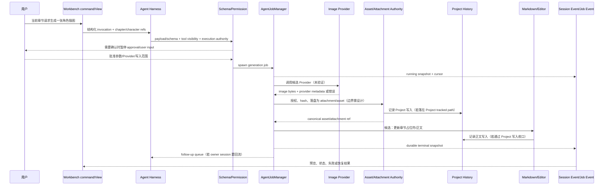

# 09 文生图插件旅程：用“当前章节生成一张角色插图”压力测试边界

> 这是能力边界压力测试，不是 NeuroBook 已批准的文生图需求，也不证明系统已有文生图插件。  
> 证据状态：**已验证** = 当前 NeuroBook 源码直接存在；**候选** = 可映射到现有宿主机制但尚未实现；**未验证** = 本轮没有对应源码、协议或运行证据。

## 结论先行

NeuroBook 已能承载这条旅程中的若干宿主边界：用户输入/审批、结构化参数校验、工具可见 schema 与执行权限分离、durable 后台 Job、Session attachment authority、Markdown 图片目标、Project history 记账和 global/project 配置。它**不能**据此声称已经支持“LLM 规划 → NovelAI → 资产保存 → 正文占位符兑现”的闭环。

最保守的研究判断：

```text
命令/View/配置声明       候选宿主能力
Agent/Tool 规划与审批    已有宿主零件可承载
durable generation job  已有通用 Job 宿主，可承载
真实图片 Provider        未验证，当前无 NovelAI 实现证据
Project asset authority  需独立设计，不能直接等同 Session attachment
正文占位符回写           部分有 Markdown attachment 语义，生成回写仍未验证
```

### 先定义本章的责任词

- **Provider** 是提供图片生成或变体服务的外部/内部实现；它不是 Job Manager，也不自动拥有 secret、Project root 或资产写入权。
- **Asset/Attachment authority** 是负责确认 bytes、身份、归属、元数据和持久化结果的宿主边界；浏览器预览成功不等于 authority commit 成功。
- **durable job** 是可持久化、可取消、可恢复的任务记录；它不保证已经发出的外部 Provider 请求可安全重放。
- **partial/orphan** 表示部分副作用已经发生但整条业务旅程没有完成，例如图片已写入而正文回写失败；它不是成功状态的别名。

这些词用于区分“谁调用 Provider”“谁保存图片”“谁修改正文”“谁记录历史”，避免把一次 HTTP 返回误写成完整产品能力。

### 如何判读这张压力测试

时序图故意把候选 Provider、资产 authority 和正文编辑器画在同一条链上，目的是暴露跨边界缺口，不是暗示这些组件已经连接。对每个箭头都应问：调用方是否有权限、结果是否已 durable commit、失败后是否留下可恢复状态、外部副作用能否证明幂等。只要其中一项没有证据，就保留“候选/未验证”，不能把图中的箭头改写成产品能力。

## 1. 能力边界表

| 图中组件/责任 | NeuroBook 证据 | 状态 | 允许声称 | 禁止声称 |
| --- | --- | --- | --- | --- |
| 用户点击“生成插图” | `app/pages/index.vue` 有 Workbench/Agent surface、命令入口模式；无专门生成按钮证据 | 候选 | 可由宿主 command/View 研究承载 | 已有文生图 UI |
| `illustration.director` Profile/Plugin | `AgentProfileCatalog`、Profile manifest、`payloadSchema`/`outputSchema`、`parsePayload()` | 已验证的 Profile schema 宿主；具体 director 未验证 | Profile 能声明 invocation payload/output schema | 已有 `illustration.director` 或图片规划 Profile |
| LLM 图片规划 | `NeuroAgentHarness` 可按 Profile invocation 运行；`AgentToolRegistry` 向 Provider 投影 schema | 候选 | 可让 Agent 产生结构化计划，但须经过 schema 和权限 | LLM 规划结果天然可执行、天然可信 |
| 结构化参数校验 | `AgentProfileCatalog.parsePayload()`；Tool `parameters`/`validationSchema`；TypeBox | 已验证 | 宿主已有输入/工具校验 seam | 图中具体 schema、字段和 wire format 已存在 |
| 确定性 prompt 编译 | Profile DSL 有 prompt 构建与 session snapshot 机制 | 未验证为图片 prompt compiler | 可研究为纯函数/可审计中间步骤 | 已有稳定 prompt compiler 或输出指纹合同 |
| 角色/章节上下文 | `ToolExecutionContext` 有 session、profile、workspaceRoot、currentProject、vars | 已验证的上下文边界 | 工具可在受控 context 读取宿主提供的上下文 | 插件可直接扫任意 Project root |
| 审批/用户确认 | `NeuroAgentTool.approvalRequired`、`userInputRequest`、`AgentResolution`、只读模式写审批 | 已验证 | 可以在 Provider/资产/正文写入前暂停等待用户 | “点击一次”即可跳过所有副作用确认 |
| Project FIFO | `AgentJobManager` 有串行 durable persist queue；`ImageVariantModule` 有受限变体 queue | 已验证的相关队列先例 | 可借 Job Manager 研究后台 generation queue | 已有通用 Project FIFO 或生成队列调度合同 |
| NovelAI Provider | 本轮在 `server`/`app` 中未发现 NovelAI 实现 | 未验证/当前无证据 | 只能作为候选外部 Provider | NeuroBook 已接入 NovelAI |
| Provider secret | `RuntimePaths.secretsRoot`、config service 的 provider 配置/稳定性校验 | 已验证宿主边界；具体图片 secret 未验证 | secret 应由宿主管理，不能进普通 DTO/Job 日志 | 插件可读取任意 secrets root |
| 生成图片原图落盘 | `SessionAttachmentAuthority` 处理已登记 Session attachment；`AgentAttachmentCodec` 出现在工具 context | 已验证附件 authority；生成资产写入未验证 | 生成结果可研究为受控 attachment/asset 发布 | 上传/Session attachment 自动等于 Project asset |
| 资产 hash/唯一身份 | Attachment ID 使用 `sha256:<64 hex>`，Markdown target 按 hash 分片路径 | 已验证 attachment 身份规则 | 可复用内容寻址思路 | 图中 `assetId`、版本和 provider fingerprint 已定义 |
| 资产变体/缩略图 | `ImageVariantModule` 有 WebP cache、dedupe、active/queue/cache 硬预算 | 已验证受限变体先例 | 可为已授权图片做变体 | `ImageVariantModule` 是 AI 生图 Provider 或通用 FIFO |
| 正文图片占位符 | `attachmentMarkdownTarget()`、`parseAgentImageMarkdown()`、`serializeAgentImageMarkdown()` | 已验证 Session attachment Markdown 语义 | 已登记 attachment 可有 canonical Markdown target | 生成 job 已能自动替换章节正文占位符 |
| Project history | `recordProjectWrite/Delete/Rename()`，写入后记账且 fail-open；外部变更由 reconcile 补 `external` | 已验证历史记账 | 资产/正文写入可分别记账并保留 actor | 两份写入自动组成原子事务 |
| 历史图二次处理 | ImageVariant 可做静态变体；无图像编辑/重绘 Provider 证据 | 候选/未验证 | 可研究为独立 Job/Provider capability | 已有“历史图重绘/二次处理”能力 |
| LLM/角色/Provider 配置 | `readConfigSnapshot`、global/project config、Profile settings scope | 已验证配置宿主；图片字段未验证 | 可分别定义 global/project/config target | 已有图片配置 schema 或 Profile 优先级 |
| 任务恢复 | `AgentJobManager.recoverInterrupted()`：running/waiting → interrupted；terminal pending delivery 可幂等重投 | 已验证 | 能恢复任务记录和结果回流状态 | 外部 Provider 请求可安全自动重放 |
| 插件升级/禁用 | Profile artifact publish、Registry epoch、loadStatus/issues；无通用 plugin activation | 已验证 Profile 发布；文生图插件未验证 | 可研究发布与 runtime snapshot 不一致状态 | 升级/禁用会自动回滚已写资产和正文 |

## 2. 一次“当前章节生成一张角色插图”的端到端时序



### 每一步的真实边界

1. **用户命令**：当前宿主有 Agent command/Workbench surface 模式，但没有专门生图 command 的已验证实现。命令应表达意图和结构化参数，不应携带任意文件路径或 Provider secret。
2. **规划**：Agent/Profile 可以处理带 schema 的 invocation；`ToolExecutionContext` 能提供 session、Profile、Project generation 和 attachment codec。图片规划 Profile 的字段、输出 fingerprint 和 prompt 编译器仍未验证。
3. **校验**：payload schema、tool parameters、`validationSchema` 与用户输入表单是已有校验 seam。校验成功只表示输入合法，不表示 Provider 会成功或用户已授权写入。
4. **审批**：`approvalRequired`/`userInputRequest`/`mutatesWorkspace` 能承载“是否允许调用 Provider”“是否允许写资产/正文”这类门禁。审批 resolution 必须绑定 toolCallId，不能仅按 UI 当前按钮状态放行。
5. **Job**：`AgentJobManager.spawn()` 先发布 running snapshot，再后台执行和 durable 写入；`JobRunContext.signal` 可取消，`setWaiting` 可表达人工等待。它可以是 generation 宿主，但不自带图片 Provider 语义。
6. **Provider**：本轮没有 NovelAI 实现，也没有确认 Provider request/response schema、重试、幂等键、模型版本、内容策略或网络 timeout。这里必须标未验证。
7. **资产**：Session attachment authority 要求 JSONL durable ownership 和 canonical metadata；真实生成图若成为 Project asset，需要确定它属于 Session attachment、Project attachment 还是另一种 asset authority。不能把“有 bytes”直接当作“已发布”。
8. **历史**：`recordProjectWrite()` 负责已发生的 Project 文件 mutation 记账，且失败 fail-open；它不是跨 asset + markdown 的事务协调器。
9. **正文回写**：现有 Markdown helper 可以生成 `workspace/.nbook/agent/attachments/sha256/...` target 并解析图片节点；但没有找到将生成结果自动定位章节、替换占位符、处理并发编辑和审批回滚的实现。
10. **完成回流**：Job 终态先 durable commit，之后才发布公共 snapshot 和 follow-up；这能防止 UI 先看到“完成”再发现结果没有落盘，但不能把外部 Provider side effect 变成可逆事务。

## 3. 适合采用的插件责任边界

### 插件/声明层可负责

- 声明 `image.plan` / `image.generate` 之类的 capability metadata，具体 key 仍需 Proposal 决定；
- 声明输入/输出 schema、支持的 editor/view 入口、需要用户确认的字段；
- 提供纯函数式的 prompt plan/validation/normalization，输出可记录的结构化数据；
- 提供 Provider adapter 的描述，而非直接读取宿主 secrets 或 Project root；
- 提供历史图列表 View 或 custom editor 的渲染/交互声明。

### 宿主必须拥有

- 当前 Session、Project generation、Workspace path policy 和 attachment ownership；
- Tool schema 投影、executionToolKeys、approval/user input 和取消；
- Job id、durable status、恢复、幂等 delivery 和事件 cursor；
- Provider credential、网络/资源预算、超时、审计和内容策略；
- 资产写入、hash/metadata、缩略图变体、正文写入和 Project history；
- editor/view 刷新、布局位置、面板尺寸和升级/禁用状态。

### 不应允许插件直接负责

```text
任意读取 RuntimePaths.secretsRoot
任意写 Project root / .nbook / history.sqlite
自己决定“审批成功”或修改 tool executionToolKeys
把 Provider response 当成已持久化资产
把浏览器  显示当成文件发布成功
用组件实例/HTML payload 迁移 Workbench View
```

## 4. 故障路径与真相源

| 故障 | 应观察到的状态 | 当前已有守护 | 当前缺口/不能声称 |
| --- | --- | --- | --- |
| schema 不合法 | invocation/tool validation 失败，不启动 Provider Job | Profile `parsePayload`、TypeBox schema、工具 validation seam | 图片 planner 的具体 schema 未定义 |
| 用户取消审批 | invocation 保持等待/拒绝，不能产生 Provider side effect | approval resolution/toolCall 绑定、`AbortSignal` | 未验证图片专用审批 UI |
| Job 取消 | `cancelled`，调用 `onCancel`，结果不标 completed | `AgentJobManager.cancel/execute` | Provider 取消是否能撤销已发出的远程请求未验证 |
| Provider 失败 | Job `failed`，保留错误摘要/详情 | Job terminal commit 和 failure status | Provider error taxonomy、重试/幂等未定义 |
| 重复 job | 不应产生重复资产；应有 idempotency key 或明确允许重复 | ImageVariant 对相同 cache key 有 flights dedupe；Job Manager 有稳定 jobId，但没有 generation idempotency 合同 | 不能声称图片生成去重已实现 |
| 队列恢复 | 进程重启后 running/waiting → `interrupted`；pending delivery 可恢复 | `recoverInterrupted`、durable deliveryId/clientMessageId | 不能自动重放未知 Provider side effect |
| 资产写入失败 | Job 不应报告已发布 asset；可进入 failed/partial 状态 | attachment/path authority 需参与；Job 能把终态写入失败标记为 failed | asset commit 状态模型未定义 |
| 资产已写但正文回写失败 | 资产保留为 orphan/partial candidate，正文不伪造成功 | Project history 可分别记账；Job detail 可保存结构化结果 | orphan 回收、重试/人工关联和跨资源事务未实现 |
| 文件被外部修改 | 正文写回发生 conflict 或拒绝，不静默覆盖 | 现有 Project write conflict/mtime 机制和 history reconcile 先例 | 生成占位符的 merge policy 未验证 |
| Session attachment metadata 不一致 | fail closed，拒绝公开/Provider hydration | `SessionAttachmentAuthority.authorizeMessages` 检查 canonical ref、mime、bytes | Project asset metadata 合同未定义 |
| 图片过大/类型不支持 | 变体路径抛明确 image error，不能无限解码 | `ImageVariantModule` 的 MIME、64 MP、cache/queue limits | Provider 原图下载上限/内容扫描未验证 |
| 插件 disabled/升级 | 新 snapshot/load status 可显示 disabled/stale/issue；旧 Job 不应凭空恢复执行 | Profile artifact publish、Registry epoch、loadStatus/issues | 通用 plugin activation、运行中 generation 停止语义未实现 |
| Provider secret 泄露 | secret 不进普通 Job preview/result/session message | RuntimePaths secrets root、config redaction/target 边界 | 图片 Provider secret 专用存储和审计未验证 |

## 5. 已有代码可以直接支撑的最小研究链

下面只描述**可以从现有代码拼出的研究实验**，不称为已完成产品功能：

```text
用户结构化请求
  → 现有 Profile/Tool schema 校验
  → 现有 approval/userResolution
  → AgentJobManager.spawn（使用假的、受控的本地 Provider fixture）
  → Job durable running/terminal/recovery
  → 现有 attachment codec/authority（需明确测试输入）
  → attachmentMarkdownTarget 生成 canonical Markdown
  → 独立 Project write + recordProjectWrite
  → editor/event 刷新
```

这个实验可以验证宿主边界和失败状态；不能验证 NovelAI 兼容、真实图像质量、外部 Provider 重试、跨资源原子发布或插件沙箱。

## 6. 当前不应写进产品结论的句子

以下说法均超出本轮证据：

- “NeuroBook 已支持文生图插件。”
- “`ImageVariantModule` 就是生图队列。”
- “Profile 可以直接调用 NovelAI。”
- “Job recovery 会自动重试生成，不会重复扣费。”
- “把图片写入 attachment 就等于章节正文已发布。”
- “Project history 能回滚资产和正文的组合事务。”
- “Extension Host/Web Worker 足以安全运行第三方图片插件。”
- “历史图可以直接交给同一 Provider 做二次处理。”

## 源码锚点与检查边界

### NeuroBook 已验证锚点

- [`server/agent/profiles/catalog.ts`](../../../server/agent/profiles/catalog.ts)：`AgentProfileCatalog.parsePayload`、`snapshot`、`enableRuntimeRegistry`、`publishProfileRelease`。
- [`server/agent/profiles/profile-registry.ts`](../../../server/agent/profiles/profile-registry.ts)：`ProfileRegistry.publish`、epoch。
- [`server/agent/profiles/profile-artifact-compiler.ts`](../../../server/agent/profiles/profile-artifact-compiler.ts)：`ProfileReleasePublisher`、磁盘提交后 Registry 翻转、committed-but-registry-failed。
- [`server/agent/tools/types.ts`](../../../server/agent/tools/types.ts)：`ToolExecutionContext`、`approvalRequired`、`mutatesWorkspace`、`userInputRequest`、`executeWithContext`。
- [`server/agent/tools/tool-registry.ts`](../../../server/agent/tools/tool-registry.ts)：Provider schema 与执行硬权限分离。
- [`server/agent/jobs/agent-job-manager.ts`](../../../server/agent/jobs/agent-job-manager.ts)：`AgentJobManager.spawn/cancel/recoverInterrupted/execute/commitTerminal`。
- [`server/agent/attachments/session-attachment-authority.ts`](../../../server/agent/attachments/session-attachment-authority.ts)：JSONL durable truth、canonical attachment ref、Project 门禁、Markdown target。
- [`shared/agent/agent-image-markdown.ts`](../../../shared/agent/agent-image-markdown.ts)：Markdown 图片解析、序列化、`attachmentMarkdownTarget`。
- [`server/workspace-history/project-history.ts`](../../../server/workspace-history/project-history.ts)：`recordProjectWrite/Delete/Rename` 与 fail-open 记账。
- [`server/config/config-service.ts`](../../../server/config/config-service.ts)：global/project config snapshot、effective config、写入 target 和 Provider reference 稳定性校验。
- [`server/media/image-variant.ts`](../../../server/media/image-variant.ts)：受限图片变体 cache/queue；不是生成 Provider。

### 检查边界

本轮没有读取到或没有找到：`illustration.director`、NovelAI client/provider、图片生成 request/response schema、确定性 prompt compiler、Project image asset registry、生成图专用数据库、跨资源事务/补偿协议、历史图重绘 Provider、插件升级回滚合同和真实 Provider smoke。也没有调用真实 Provider、写入真实 Project 数据或运行浏览器人工验收。

因此本章的端到端图是**责任映射和研究实验路径**，不是当前运行链；表格中标为候选/未验证的部分不能进入产品发布说明。
