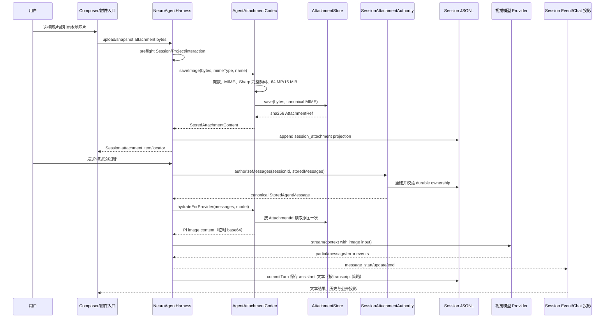

# 11 图像输入到文本：当前已实现旅程

> 本章是 NeuroBook 当前代码映射，不是产品 Spec、Proposal 或 ADR。
> 证据状态：**已验证当前实现** = 当前包内源码与已读测试直接确认；**研究建议** = 为结构化图生文能力提出的边界；**未验证/候选** = 没有当前代码、测试或真实 Provider 证据。

## 结论先行

NeuroBook 当前可以证实的图像方向是：**图片输入 → Attachment 校验与内容寻址 → Session JSONL 授权 → 视觉模型临时 hydration → Provider 返回文本 → Agent 消息事件与 Session transcript**。这条链不是独立的 OCR 或“图片分析插件”，而是 Agent 会话已经拥有的图片消息能力。

当前链路的关键不变量：

1. Session JSONL 保存 `StoredAttachmentContent` 引用，不保存 Pi `ImageContent` 的 base64；
2. `AttachmentId` 是 `sha256:<64 个小写十六进制字符>`，bytes 与 MIME 属于 canonical ref；
3. Provider 调用前重新验证 Session ownership、MIME 和 bytes，随后只为支持 `input: "image"` 的模型读取原图并生成临时 base64；
4. 非视觉模型不读取 blob，而是得到稳定的文本 marker；
5. Provider ACK、Provider 文本结果、Session durable commit 和公开事件不是同一成功状态；
6. 64 MP、16 MiB 单图、8 张/32 MiB 输入和 16 blocks/64 MiB Provider source 等预算在不同边界分别重验。

因此，“普通视觉聊天能返回文本”是**已验证当前实现**；“图片自动生成 OCR、角色卡、章节分析报告并写入 Project”是**未验证/候选**，不能从这条聊天链推导为当前工作流。

## 1. 主旅程

固定审阅输入：用户在一个已绑定 Session 的 Agent 会话中提供本地角色参考图，当前模型声明支持图片，并要求“生成角色外观描述”。



### 1.1 输入与登记

| 节点 | 当前证据 | owner 与真相源 | 可观察结果 |
| --- | --- | --- | --- |
| 上传入口 | `../../../server/agent/http.ts` 的 `uploadAgentSessionAttachment`；Harness 的 `uploadSessionAttachment` | Session mutation 与 `SessionAttachmentAuthority`；上传 bytes 不是最终授权 | 上传前先经过 `preflightSessionAttachmentRegistration`；归档或不允许登记的 Session 失败 |
| 本地快照 | `../../../server/agent/http.ts` 的 `snapshotAgentSessionAttachment`；Harness 的 `snapshotSessionAttachment` | `StableAttachmentSnapshotReader` 负责稳定读取；源文件不成为 Session truth | `realpath → stat → open → fstat`，读前后 identity/size/mtime/ctime 变化会 fail closed |
| 图片校验 | `../../../server/agent/attachments/agent-attachment-codec.ts::AgentAttachmentCodec.saveImage` | Codec 拥有图片领域校验；`sharp` 完整解码；Store 不判断图片格式 | MIME/魔数不一致、损坏、像素或大小越限返回稳定 `AttachmentError`，Store 不写入 |
| 内容身份 | `../../../server/agent/attachments/attachment-store.ts::AttachmentStore.save` | Attachment Store 拥有 hash、adapter key、ref 校验；Adapter 只处理 opaque key 与 bytes | 返回 `sha256:<64 hex>`、canonical MIME、bytes；同一 bytes 可幂等复用 |
| Session 登记 | Harness `saveRegisteredSessionImage` | Session JSONL 是 durable truth；`session_attachment` projection entry 建立可查目录 | 登记不移动 active leaf；公开 item 可按 Session 查询，物理 blob 不等于授权 |

`StableAttachmentSnapshotReader` 的 `maxBytes` 由 Harness 绑定为 `AGENT_IMAGE_POLICY.maxImageBytes`。它先拒绝 Attachment Store 自身路径，再使用同一 FileHandle 读取最多 `maxBytes + 1`，避免用户在授权与读取之间替换文件。

### 1.2 消息真相与授权

持久化消息使用 `StoredUserMessage` 或 `StoredToolResultMessage`，其 `content` 只能是 `StoredContent[]`：文本块或 `{type: "attachment", attachment: AttachmentRef, name?}`。类型文件 `../../../server/agent/messages/stored-types.ts` 明确禁止 Pi `ImageContent` 进入 Session truth、RunFrame 或 queue truth。

`SessionAttachmentAuthority` 的职责不是读取任意 hash，而是：

- 从 Session JSONL 重建全分支附件索引；
- 以 `entryId + contentIndex` 校验 locator；
- 校验当前 Session 是否拥有指定 AttachmentId；
- 以 canonical MIME/bytes 替换消息中的 ref；
- 先执行 Project 数据面门禁，再公开 locator 或 Provider hydration；
- 外部 JSONL 签名持续变化时丢弃候选索引并 fail closed。

`authorizeMessages(sessionId, messages)` 会先收集非 assistant 消息中的 AttachmentId，执行 `validate(sessionId)` 和 `resolve(sessionId, ids)`，再逐块比较 MIME 与 bytes。任何 ownership 缺失或 metadata 不一致都会阻止 Provider 调用；它不会静默采用消息中不可信的 ref。

### 1.3 视觉模型分流与文本结果

`NeuroAgentHarness.streamAssistant` 的固定顺序是：

```text
parseStoredMessages(snapshot.modelMessages)
  → sessionAttachments.authorizeMessages(sessionId, storedMessages)
  → attachmentCodec.hydrateForProvider(authorizedMessages, snapshot.model)
  → tracedStreamSimple(..., providerMessages, ...)
  → message_start / message_update / message_end
  → commitTurn(...)
```

`AgentAttachmentCodec.hydrateForProvider` 依据 `model.input.includes("image")` 分流：

- **视觉模型**：统计 attachment blocks 和原始 bytes 预算；按 AttachmentId single-flight 读取 Store；再次用 bytes 魔数确认 MIME；构造 `{type: "image", mimeType, data: base64}`。该 base64 只存在于本次 Provider payload，不写回 stored messages。
- **非视觉模型**：调用 `storedMessagesForText`；附件变为 `[attachment omitted: <mime>, <bytes> bytes, <name>]` marker；不会调用 Store.load。

`resolvePiModelMetadata` 把配置模型的 `input` 原样映射到 Pi `Model.input`。配置 DTO 的 `input` 只有 `text|image`，缺省模型能力时是 `text`。仓库内已验证的是 Harness 传给 Pi 的 image content；Pi 外部包如何把该对象序列化为具体供应商 wire payload，本轮没有读取其安装源码，标为**未验证/候选**。

Provider 流返回的 assistant 文本会通过 `message_start/update/end` 公开事件；正常 transcript 策略由 `commitTurn` 追加 assistant message 和已完成 tool result 到 Session JSONL。取消时保留最后 partial 并闭合为 `stopReason: "aborted"`；非取消 Provider 异常继续作为执行失败向上抛出。

## 2. 预算、身份和数据边界

### 2.1 当前产品预算

`../../../shared/agent/agent-image-policy.ts::AGENT_IMAGE_POLICY` 是当前图片输入预算的共享常量：

| 字段 | 当前值 | 作用 |
| --- | ---: | --- |
| `maxInputImages` | `8` | 一次 invocation 的图片 block 数量；重复引用也按 block 计数 |
| `maxImageBytes` | `16 * 1024 * 1024` | 单张原图/上传/快照/`read(image)` 上限 |
| `maxInputBytes` | `32 * 1024 * 1024` | 一次 invocation 的图片 bytes 总量 |
| `maxRequestBytes` | `48 * 1024 * 1024` | 图片请求入口的请求预算字段 |
| `maxProviderBlocks` | `16` | 单次 Provider hydration 的非 assistant 图片 block 数 |
| `maxProviderSourceBytes` | `64 * 1024 * 1024` | 单次 Provider hydration 的原始 source bytes 总量 |

完整解码还受 `../../../server/media/raster-image.ts::MAX_RASTER_IMAGE_PIXELS` 的 64 MP 限制。`saveImage` 在 Store 写入前使用 Sharp `limitInputPixels`、metadata 尺寸和 stats；超限图片得到 `limit_exceeded`，损坏或无法完整解码得到 `invalid_input`。

### 2.2 预算重验位置

相同业务意图在不同边界使用不同预算，不能只相信 UI：

1. `AgentAttachmentCodec.saveImage`：单图 byte 上限、魔数/MIME、完整解码、64 MP；
2. Harness `authorizeStoredInvocationInput` / `assertInvocationImageBudget`：queue drain 或 invocation admission 时重验 ownership、8 张、单图和 32 MiB；
3. `AgentAttachmentCodec.hydrateForProvider`：Provider 侧重验 16 blocks 和 64 MiB source；
4. `createReadTool`：读图前后重验 16 MiB，然后交给 Codec，不绕过完整解码；
5. 公开 Chat/Tool projection：只公开 MIME、bytes、omitted 标记和有限文本预算，不公开 base64。

### 2.3 真实数据边界

```text
原始 bytes
  └─ AttachmentStore / canonical blob
      └─ AttachmentRef（sha256、MIME、bytes）
          └─ Session JSONL session_attachment/message locator
              ├─ 文本模型：marker
              └─ 视觉模型：临时 Provider image content
```

`ImageVariantModule` 的 WebP 输出处在展示支路，不是模型输入支路：它消费已经授权的 source capability，缓存位于 Cache Root，结果可删除和重建；它不拥有原图、不进入 Session JSONL，也不是文生图 Provider。

## 3. 当前实现与专用图生文工作流的边界

### 已验证当前实现

- Composer、multipart upload、Project/Workspace 本地快照和 `read(image)` 都能把图片变为 stored attachment block；
- Session Attachment JSONL ownership、locator、Project gate 和 Provider hydration 已有 Authority；
- 模型声明 `input: ["text", "image"]` 时，Provider context 获得 image content；
- 纯文本模型收到 marker，不读取图片 blob；
- Provider 文本结果通过 Agent message event 和既有 Session transcript 机制呈现；
- 公共 Chat/queue/tool 投影省略 base64，保留有界 metadata。

### 研究建议或未验证/候选

以下能力不能从当前链路推导：

- OCR、文本附件提取、全文注入、远程 URL 图片或 Provider File API；
- “图片 → 角色卡/地点卡/章节报告”的独立结构化 output schema；
- 将视觉文本结果自动写入 Project 文件、Character 数据或 Plot 记录；
- 面向批量图片分析的专用 View、command、Job 和结果审阅状态；
- Provider 外部 SDK 的每家 image payload 序列化、计费、超时和重试合同。

如果后续建立 `image-understanding-workflow`，宿主必须复用现有 Attachment Authority 和模型 input gate，但新增结构化结果的 schema、用户确认、Project 写入 authority、并发/取消和冲突处理；不得让新工作流重新读取裸路径或把视觉模型返回文本直接当作已提交 Project 数据。

## 4. 失败与恢复

| 场景 | 当前可观察结果 | 真相源/守护 | 研究边界 |
| --- | --- | --- | --- |
| MIME 声明与魔数不一致 | `invalid_input`，Store 不写入 | `AgentAttachmentCodec.saveImage` | 当前不提供用户自动修复 MIME 的行为 |
| 图片损坏或无法完整解码 | `invalid_input`，Store 不写入 | Sharp `failOn: "error"` 与 Codec 映射 | 具体供应商解码差异未扩展验证 |
| 图片超过 16 MiB | `limit_exceeded`，上传/快照/read/hydration 入口拒绝 | `AGENT_IMAGE_POLICY.maxImageBytes` | 不自动压缩或转码 |
| 图片超过 64 MP | `limit_exceeded`，Store 不写入 | Sharp pixel limit 与 `MAX_RASTER_IMAGE_PIXELS` | 不自动缩放原图 |
| 一次 invocation 超过 8 张或 32 MiB | invocation admission 失败 | Harness `assertInvocationImageBudget` | 不把失败转成静默截断 |
| Provider context 超过 16 blocks 或 64 MiB | hydration 失败，Provider 不被调用 | `hydrateForProvider` 预算 | 不自动抽样/降采样 |
| 非视觉模型 | 继续可发送，但图片变为 marker | `storedMessagesForText`；不读 blob | UI 可提示，但当前不强制禁止发送 |
| Session 未拥有 AttachmentId | `invalid_reference`，整个授权失败 | `SessionAttachmentAuthority.resolve` | 不凭 content hash 开放读取 |
| ref 的 MIME/bytes 与 JSONL canonical 不一致 | `corrupt`，Provider 不调用 | `authorizeMessages` canonical compare | 不静默采用消息内 metadata |
| Session/Project 不匹配或 Project 未 ready | Project gate/interaction gate 失败 | `requireActiveReadyProject`、Session projection | 不把旧 Project 数据面结果发布到新 generation |
| 本地源文件在快照中变化 | `invalid_input`，要求重试 | Stable FileHandle identity/mtime/ctime 检查 | 不保留不稳定快照 |
| Provider 返回错误 | invocation/turn 进入既有错误路径；不会伪造文本结果 | Harness stream/commit 边界 | Provider taxonomy、自动重试和外部幂等未验证 |
| 用户取消 Provider 流 | 最后 partial 可闭合为 aborted message；AbortSignal 传给 Provider | `streamAssistant` 与 turn commit | 外部 Provider 是否已停止由其 SDK 决定 |
| 进程重启或事件游标不一致 | Session/Job 按各自 recovery 机制恢复；hydration 不从旧 base64 恢复 | JSONL、Job durable record、event cursor | 不把 ACK 当作模型业务成功 |
| 旧 Project generation 的异步结果迟到 | 页面操作由 generation/revision 守卫丢弃，不回填当前 surface | `useProjectSession`、Agent Surface operation guards | 本章不把 UI superseded 机制扩成后端事务 |

## 5. 源码锚点与检查边界

### 当前实现锚点

- [`../../../server/agent/http.ts`](../../../server/agent/http.ts)：`uploadAgentSessionAttachment`、`snapshotAgentSessionAttachment`、`resolveAgentSessionAttachments`。
- [`../../../server/agent/harness/neuro-agent-harness.ts`](../../../server/agent/harness/neuro-agent-harness.ts)：`uploadSessionAttachment`、`snapshotSessionAttachment`、`saveRegisteredSessionImage`、`authorizeStoredInvocationInput`、`assertInvocationImageBudget`、`streamAssistant`、`commitTurn`。
- [`../../../server/agent/attachments/agent-attachment-codec.ts`](../../../server/agent/attachments/agent-attachment-codec.ts)：`AgentAttachmentCodec.saveImage`、`hydrateForProvider`。
- [`../../../server/agent/attachments/attachment-store.ts`](../../../server/agent/attachments/attachment-store.ts)：`AttachmentStore.save/load`、hash/key/ref 校验。
- [`../../../server/agent/attachments/session-attachment-authority.ts`](../../../server/agent/attachments/session-attachment-authority.ts)：`authorizeMessages`、`resolveDurableOwnership`、`locator`、JSONL index rebuild。
- [`../../../server/agent/attachments/stable-attachment-snapshot-reader.ts`](../../../server/agent/attachments/stable-attachment-snapshot-reader.ts)：稳定 FileHandle 快照和 Attachment Store containment。
- [`../../../server/agent/tools/file-tools.ts`](../../../server/agent/tools/file-tools.ts)：`createReadTool` 的图片识别、16 MiB 门禁和 Codec 调用。
- [`../../../shared/agent/agent-image-policy.ts`](../../../shared/agent/agent-image-policy.ts)：`AGENT_IMAGE_POLICY` 唯一预算常量。
- [`../../../shared/dto/app-settings.dto.ts`](../../../shared/dto/app-settings.dto.ts)：`ModelInputKind`、模型 input schema、`EnabledModelOptionDto`。
- [`../../../server/agent/harness/pi-model-metadata.ts`](../../../server/agent/harness/pi-model-metadata.ts)：`resolvePiModelMetadata` 到 Pi `Model.input` 的映射。
- [`../../../server/agent/attachments/agent-attachment-codec.test.ts`](../../../server/agent/attachments/agent-attachment-codec.test.ts)：MIME、16 MiB、64 MP、视觉/非视觉 hydration 双路径。
- [`../../../server/agent/attachments/session-attachment-authority.test.ts`](../../../server/agent/attachments/session-attachment-authority.test.ts)：JSONL index、ownership、持续变化 fail closed。
- [`../../../server/agent/harness/neuro-agent-harness.black-box.test.ts`](../../../server/agent/harness/neuro-agent-harness.black-box.test.ts)：图片 attachment 进入 Provider message 与 follow-up recovery 的测试锚点。
- [`../../../.agents/tasks/108-agent-image-attachment-references/README.md`](../../../.agents/tasks/108-agent-image-attachment-references/README.md)：Task 108 的实现范围、已验证结果和未实现项；该 Task 记录浏览器人工验收仍未执行。

### 检查边界

本章读取了当前包内图片 Codec、Store、Session Authority、稳定快照、Harness、模型 DTO、图片工具、相关测试与 Task 108。没有启动真实 Provider/Model，没有验证 `@earendil-works/pi-ai` 对每个外部 API 的最终 wire 序列化，没有执行浏览器人工验收，也没有找到 OCR、远程 URL、结构化图片结果或文生图 Provider 实现。因此本章可以证明当前视觉聊天输入链，不能证明专用图生文产品工作流或任何文生图能力。
