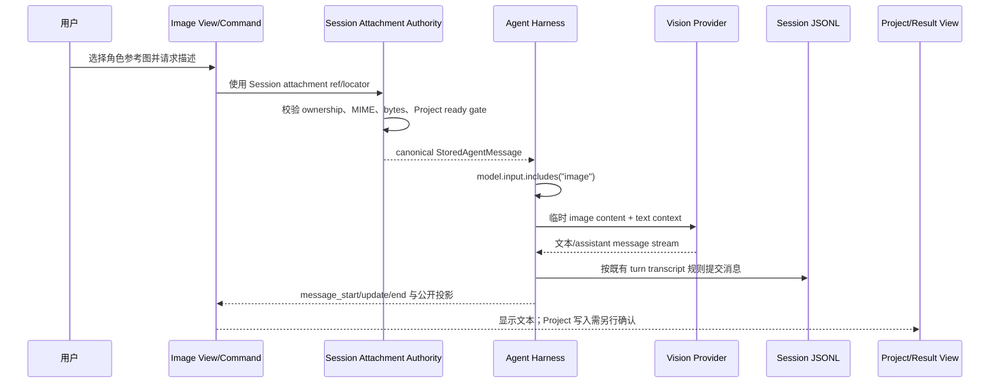
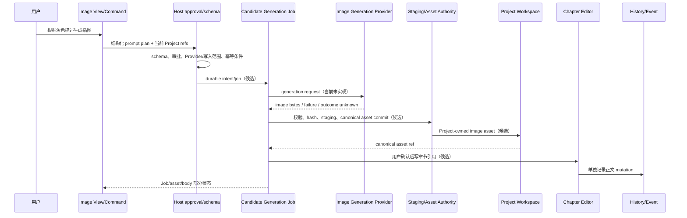

# 14 双向图像系统边界：共享宿主，不共享副作用状态

> 本章是研究建议，不是产品 Spec、Proposal 或 ADR。`docs/specs/README.md` 当前“待实现规范”为空；双向图像 capability 尚未登记为 `planned`。
> 证据状态：**已验证当前实现** = 当前代码与已读测试直接确认；**已批准但未实施的目标合同** = Reference/Task/ADR 明确描述但尚无对应完整产品实现；**研究建议** = 为后续 Proposal/Spec 设计的边界；**未验证/候选** = 当前没有足够源码、测试或真实 Provider 证据。

## 结论先行

“双向图像系统”应共享 Workbench View 宿主和扩展描述控制面，但必须拆成两条独立业务链：

```text
共享控制面
  ├─ Workbench View / Container / Command
  ├─ 联邦 Description Snapshot
  └─ Host authority / approval / event projection

image-understanding（图生文）
  图片输入 → Session Attachment → 视觉模型 → 文本/候选结构化结果

image-generation（文生图）
  文本意图 → 生成 Provider → durable side-effect Job → Project canonical image asset
```

当前只有第一条的“普通视觉聊天”链能由产品代码证明。第二条在产品代码、当前 Spec、Proposal 和 Task 中没有生成 Provider、生成请求 schema 或 Project 图片资产 authority 的完整实现证据；现有 `09-text-to-image-plugin-journey.md` 只能作为候选边界压力测试。

共同拥有一个 View 不等于共同拥有一个 Provider、Job 或资产状态机。图生文可以在现有 Agent invocation 内同步获得文本结果；文生图必然涉及外部图片副作用、幂等/计费/取消和 Project 资产提交，必须另建合同。

## 1. 两条旅程的责任分界

### 1.1 图生文：当前已验证主链



当前证据闭环在 [11 图像输入到文本当前旅程](./11-image-input-to-text-current-journey.md)：`AgentAttachmentCodec.saveImage` 负责魔数、MIME、Sharp 完整解码和 64 MP/16 MiB 边界；`SessionAttachmentAuthority.authorizeMessages` 负责 Session JSONL ownership；`hydrateForProvider` 仅在模型声明 image input 时读取原图并构造临时 base64；`streamAssistant` 和 `commitTurn` 负责 Provider 事件与 Session transcript。

这条链的结果类型是 Agent assistant 文本/消息。当前没有一个独立的“图生文结果资产” authority，也没有证据表明模型文本会自动写入 Character、Plot 或 Project 正文。

### 1.2 文生图：候选反向链



图中的 `Candidate Generation Job`、`Image Generation Provider`、`Project-owned image asset` 和正文引用都不是当前实现。`AgentJobManager` 可以提供 durable Job 的通用宿主形状，`recordProjectWrite` 可以记录已经发生的单文件 Project mutation，但二者没有生成 Provider 幂等、资产提交或正文占位符语义。

因此文生图链中每个“候选”箭头都必须回答：

1. 谁拥有输入 prompt、Provider secret 和审批结果？
2. 谁知道远程 Provider 请求是否已发出、已收费、已取消或 outcome unknown？
3. 谁确认 bytes、hash、版本、来源和 Project 归属已经提交？
4. 谁写正文引用，如何处理用户在 Job 期间编辑了同一章节？
5. Job 重启时如何避免重复外部副作用？

当前没有这些答案的完整产品合同，不能把时序图改写成“已支持文生图”。

## 2. 共享控制面与独立领域 authority

### 2.1 共享部分

| 共享控制面能力 | 当前证据 | 两条链可共享的边界 | 不应共享的内容 |
| --- | --- | --- | --- |
| View/Container | 当前固定 Workbench 槽位；View Host 是研究建议 | 入口、可见条件、布局、尺寸、Project/Session context 显示 | Vue component instance、业务数据 owner、私有 localStorage |
| Command/description | 当前 Activity emit 与既有 Agent command 模式；统一 registry 未实现 | 稳定 intent、参数 schema 引用、来源、可见/禁用条件 | Provider secret、raw path、直接写 Project 的函数 |
| Approval/permission | `AgentToolRegistry` 的 schema/execute 分离、`approvalRequired`、`executionToolKeys` | 用户确认、取消信号、模型可见 schema 与执行硬权限分层 | 用“View 可见”或“command 已登记”代替写入授权 |
| Event projection | Session/Job/Project 各自有事件或历史投影 | UI 展示加载、运行、失败和结果摘要 | 把 ACK、模型结果、Job terminal、asset commit 合并为一个 success |
| Description snapshot | 统一联邦快照是研究建议；Profile snapshot 是局部先例 | 索引 `id/kind/source/capability/status/issue` | 接管 Profile/Skill/Workflow/Tool 的真相源 |

### 2.2 图生文独立边界

| 对象 | owner/状态 | 当前证据 |
| --- | --- | --- |
| 输入图片 bytes | Attachment Store + `AgentAttachmentCodec` | 内容寻址、MIME/bytes、魔数/Sharp/64 MP/16 MiB |
| Session 归属 | `SessionAttachmentAuthority` + Session JSONL | ownership、locator、canonical metadata、Project gate |
| Provider input | `hydrateForProvider` 产生临时 Pi image content | `model.input.includes("image")` 分流；不写回 Session truth |
| 文本结果 | Agent assistant message/turn transcript | `streamAssistant` 事件、`commitTurn` 既有 transcript 策略 |
| 结构化结果 | 未发现独立 authority/schema | 只能标研究建议/候选 |
| Project 写入 | 未由当前视觉聊天自动触发 | 必须经过另一个 Project authority 和用户可观察确认 |

### 2.3 文生图独立边界

| 对象 | 候选 owner/状态 | 当前证据/缺口 |
| --- | --- | --- |
| Prompt plan | Host schema/approval 或 Profile/Workflow 产出 | Profile schema/Tool validation 有通用先例；具体 image generation schema 未发现 |
| Generation Provider | 独立 provider adapter | 未发现 NovelAI、DALL·E、Flux、SDXL 或其它生成 client/provider |
| Generation Job | `AgentJobManager` 可作为通用 durable host 候选 | Job 有 running/waiting/completed/failed/cancelled/interrupted，但无生成幂等/计费/Provider outcome 语义 |
| Canonical image asset | 候选 Project Workspace asset authority | ADR 0006 只规定原图归领域所有、变体不拥有原图；没有通用 Project image asset registry |
| Session reference | 显式登记为 Session attachment 后才可引用 | Session Attachment 不能自动拥有生成图的 Project 归属 |
| Markdown/body reference | 候选 Editor/Project write authority | 现有 attachment Markdown helper 不等于生成 Job 自动回写章节 |
| Provider outcome | `success/failure/unknown` 需独立合同 | 当前没有生成 Provider 或 outcome ledger |

## 3. Asset authority：不建立跨领域 MediaAsset 总表

ADR 0006 已接受的边界是：Attachment Store 与 Project Workspace 各自保存自己的 canonical bytes；Image Variant Module 只消费调用方提供的授权 source capability，输出位于 Cache Root 的可删除、可重建 WebP，不拥有原图，不建立统一 `MediaAsset` 表。

因此，若未来实现文生图，研究建议遵守以下 owner 方向：

```text
Generation Provider
  → Job result bytes（尚未发布）
  → Project asset authority 校验/hash/metadata/staging
  → Project canonical image asset commit
  → 显式 Session attachment registration（可选）
  → 用户确认的 Markdown/body reference commit（可选）
```

不能直接把以下对象互换：

- Provider 返回的 bytes ≠ 已发布 Project asset；
- Session Attachment ref ≠ Project Workspace asset identity；
- WebP variant cache ≠ canonical generated image；
- Markdown target ≠ 正文已经成功写入；
- 浏览器预览/HTTP 200 ≠ authority commit；
- Job completed ≠ 外部 Provider side effect 可重放或可逆。

如果生成图成为 Project canonical asset，应该由 Project 领域决定文件位置、manifest/metadata、冲突检查、历史 actor 和清理策略；不能在 Image Variant Module 或通用 Attachment Authority 中偷建总表。

## 4. DTO、ACK、URI 和业务成功

### 4.1 图生文链

当前链至少包含四种不同数据：

```text
AttachmentRef DTO
  → Session locator（entryId + contentIndex）
  → Provider image content（临时 data/base64）
  → Assistant message / Session transcript
```

`AttachmentRef.id` 只标识内容寻址身份，locator 才表达 Session 授权位置；Provider image content 只服务本次调用，不是 durable URI；assistant 文本是 Agent 结果，不是 Project asset commit。

### 4.2 文生图候选链

未来候选链至少需要分开记录：

```text
structured generation intent DTO
  → Job ID + idempotency key
  → Provider request receipt/ACK（只证明传输或接收）
  → Provider outcome（success/failure/unknown）
  → asset staging/canonical asset ref
  → optional Session attachment locator
  → body/editor write result
```

其中 `Job ID` 是 NeuroBook 任务记录身份，不能直接当 Provider 幂等键；Provider ACK 不能当图片已经持久化；URI/asset ref 不能当写入授权；body write result 不能反向证明 Provider 成功。具体字段名、wire schema、幂等键生成和计费语义均属于后续 Proposal/Spec/ADR，当前不定义产品 API。

## 5. 失败、部分提交和恢复

### 5.1 图生文当前边界

图生文已有的失败守护详见 [11](./11-image-input-to-text-current-journey.md#_4-失败与恢复)：图片校验/预算/ownership/Project gate/非视觉模型/Provider stream/取消各自有处理。视觉文本结果失败不会伪造 Project 写入；hydration 失败不会产生 Provider image input。

### 5.2 文生图候选部分状态

以下状态是研究建议，不能写成当前 `AgentJobStatus` 枚举：

| 部分状态 | 发生了什么 | 可恢复动作 | 禁止推断 |
| --- | --- | --- | --- |
| `provider_outcome_unknown` | 请求可能已到达 Provider，客户端未确认结果 | 先查询 Provider 或人工核对；只有有幂等证据才重试 | Job interrupted 可以安全重放请求 |
| `asset_orphan_candidate` | Provider/下载得到 bytes，但 Project asset commit 未完成 | 保留可审计 staging/人工处理；回收规则需另定 | 临时 bytes 已是正式 Project asset |
| `asset_committed_body_failed` | canonical asset 已提交，正文引用写失败 | 保留 asset，提供重新关联/人工插入路径 | 自动回滚跨存储所有副作用 |
| `body_conflict` | 章节在计划快照后被用户或其它 writer 修改 | 返回冲突，要求用户选择或生成新引用 | 静默覆盖当前正文 |
| `cancel_after_provider` | 用户取消发生在远程请求已发出之后 | 标记取消请求与 Provider outcome 分离，等待/核对结果 | AbortSignal 能撤销远程计费或已生成图片 |
| `duplicate_intent` | 相同用户意图再次提交 | 依幂等合同合并、返回已有结果或明确允许重复 | 稳定 `jobId` 自动保证 Provider 不重复 |
| `plugin_stale_or_disabled` | 描述或 Provider adapter 变更，旧 Job 尚未结束 | 新调用使用新 snapshot；旧 Job 按其记录和版本诊断 | 升级/禁用自动回滚已提交 asset/body |

### 5.3 不建设跨存储全局事务

ADR 0015 已接受 Session JSONL、Project 文件、History SQLite 和 Job JSON 各自拥有生命周期；当前不建设跨存储分布式事务。文生图候选链应采用可观察的顺序提交和补偿/人工关联，而不是声称 asset + body + history 原子提交。

## 6. 双向贡献压力测试

| 贡献类型 | 图生文 | 文生图 | owner |
| --- | --- | --- | --- |
| Image View | 选择 Session attachment、查看文本结果 | 输入 prompt/预览 Job/选择 asset/body target | Workbench host；业务数据回到各 authority |
| Command | 发送图片到当前 Agent invocation | 创建 generation intent、审批后启动 Job | Host command/Agent Harness；具体 Job/Provider 领域独立 |
| Setting/schema | 模型 `input` 能力、图片预算提示 | Provider endpoint/model/size/quality 等候选配置 | Config/Provider authority；未定义生成 schema |
| Profile/Workflow/Tool | 生成结构化描述或调用视觉模型的候选编排 | 规划 prompt、校验参数、请求用户确认的候选编排 | 现有 Catalog/Tool authority；不开放越权执行 |
| Provider adapter | 现有 Agent Provider image input；外部 wire 序列化未本地验证 | 新的 Image Generation Provider，当前不存在 | Provider runtime；secret 由宿主拥有 |
| Job | 普通 Agent invocation 的既有 lifecycle；非生成专用 Job | durable side-effect Job、幂等/取消/未知结果 | AgentJobManager 只能作为通用宿主候选 |
| Asset authority | Session Attachment；Project 结构化结果需另建目标 | Project canonical image asset；Session/Markdown 仅显式引用 | 既有 Session/Project 领域，不能由 ImageVariant 接管 |
| Event/result | Session message/公开 Chat projection | Job/asset/body 各自事件和部分状态 | 各 authority；ACK 不等于成功 |

## 7. 场景烟测的研究判定

### 输入角色参考图，生成外观描述

应能回链 [11](./11-image-input-to-text-current-journey.md#_1-主旅程)：

```text
图片 bytes
→ saveImage/快照校验
→ AttachmentRef + Session JSONL entry
→ authorizeMessages
→ model.input image gate
→ hydrateForProvider
→ 视觉模型文本
→ Session event/transcript
```

这条链是当前实现；结构化角色卡或 Project 写入仍是候选扩展点。

### 根据角色描述生成插图并插入章节

只应得到以下候选缺口：

```text
View/command
→ structured intent + approval
→ durable generation Job
→ independent image Provider
→ outcome unknown / idempotency
→ Project canonical asset commit
→ body conflict-aware reference commit
```

任何审阅结果若把该链写成“NeuroBook 已支持文生图”、把 `ImageVariantModule` 写成生成 Provider，或把 Session attachment 自动写成 Project asset，均违反本章证据边界。

## 8. 源码锚点与检查边界

### 当前实现锚点

- [`./11-image-input-to-text-current-journey.md`](./11-image-input-to-text-current-journey.md)：当前图生文图片输入主链和失败矩阵。
- [`./09-text-to-image-plugin-journey.md`](./09-text-to-image-plugin-journey.md)：未实现文生图候选压力测试。
- [`../../../server/agent/attachments/session-attachment-authority.ts`](../../../server/agent/attachments/session-attachment-authority.ts)：Session Attachment owner/locator/Project gate。
- [`../../../server/agent/attachments/agent-attachment-codec.ts`](../../../server/agent/attachments/agent-attachment-codec.ts)：图片保存和 Provider hydration。
- [`../../../server/agent/harness/neuro-agent-harness.ts`](../../../server/agent/harness/neuro-agent-harness.ts)：`streamAssistant`、`commitTurn`、图片 invocation admission。
- [`../../../server/agent/jobs/agent-job-manager.ts`](../../../server/agent/jobs/agent-job-manager.ts)：通用 durable Job、取消、恢复和 delivery；无生成 Provider 语义。
- [`../../../server/agent/tools/tool-registry.ts`](../../../server/agent/tools/tool-registry.ts)：Provider schema 与 execution authority 分离。
- [`../../../server/media/image-variant.ts`](../../../server/media/image-variant.ts)：受限 WebP 变体 cache/queue，不是 AI 生图 Provider。
- [`../../../server/workspace-history/project-history.ts`](../../../server/workspace-history/project-history.ts)：Project 单文件写入 history，fail-open；不构成跨资源事务。
- [`../../../docs/adr/0006-image-variant-and-original-ownership.md`](../../../docs/adr/0006-image-variant-and-original-ownership.md)：原图归领域、变体可重建、无统一 MediaAsset。
- [`../../../docs/adr/0015-architecture-boundaries-and-deferred-structure.md`](../../../docs/adr/0015-architecture-boundaries-and-deferred-structure.md)：不建设跨存储全局事务。

### 检查边界

本章读取了 11、09、ADR 0006、ADR 0015、Attachment/Job/Tool/History/ImageVariant 代码和当前 Spec 注册表。没有找到任何生成 Provider、生成 request/response schema、Project 图片资产 registry、生成图数据库、正文占位符事务、幂等/计费协议或真实 Provider smoke。因此图生文部分可以引用当前实现；文生图部分全部是候选边界和缺口，不是产品能力或已批准 Spec。
