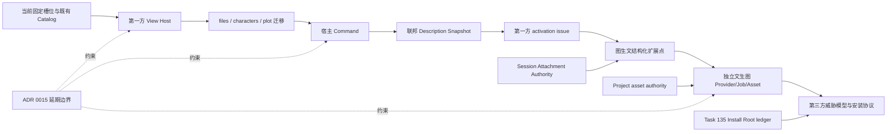

# 15 重构顺序与决策门：先宿主边界，再双向图像能力

> 本章是研究建议，不是产品 Spec、Proposal 或 ADR。它把 [08 映射](./08-neurobook-mapping.md)、[11 当前图生文旅程](./11-image-input-to-text-current-journey.md)、[12 View 宿主](./12-workbench-view-host-refactor.md)、[13 扩展控制面](./13-extension-control-plane-refactor.md) 和 [14 双向图像边界](./14-bidirectional-image-system-boundaries.md) 排成后续决策顺序。
> 证据状态：**已验证当前实现** = 当前代码与已读测试直接确认；**已批准但未实施的目标合同** = Proposal/Reference/Task/ADR 已描述但尚无对应完整实现；**研究建议** = 本章建议的迁移步骤和门禁；**未验证/候选** = 当前没有足够源码、测试或真实 Provider 证据。

## 结论先行

最安全的顺序是：

```text
当前行为基线与 capability 归属
  → 第一方 View Host / Container / 生命周期
  → files / characters / plot 迁移
  → 宿主 Command + 联邦 Description Snapshot
  → 第一方 Catalog/Command/View 桥接与 activation issue
  → 图生文结构化扩展点
  → 独立文生图 Provider / Job / Project asset 链
  → 第三方安装与执行威胁模型
```

顺序的理由不是“先做 UI 比较快”，而是每一步都只引入一个新的 authority：先让 Workbench 拥有 View 的描述、位置和生命周期，再让扩展描述可被宿主观察，最后才让图片能力产生业务副作用。图生文复用已经存在的 Attachment/Session/Provider 输入链；文生图不能复用图生文的 Session message 状态，必须单独证明外部 Provider、幂等/计费/取消、Project canonical asset 和部分提交恢复。

当前没有已登记的目标 Spec 可直接执行：`docs/specs/README.md` 的待实现规范为空。因此下述阶段是**研究建议**；每个进入实现前必须走 Proposal → capability Spec → Task。`Character Workbench Proposal` 仍为 `reviewing`，只能说明一个可能的第一方 Character View 消费者，不能充当 View Host 合同。

## 1. 不变的基线和边界

### 1.1 当前已验证的最小事实

| 基线 | 当前真相源 | 不能从中推导 |
| --- | --- | --- |
| Workbench 由固定页面槽位装配 | `../../../app/pages/index.vue`、`../../../app/utils/workbench-chrome.ts` | 已有通用 View Registry 或第三方 contribution API |
| `files`、`characters`、`plot` 是现有 Novel IDE tab | `../../../app/stores/novel-ide.ts` 的 `NOVEL_IDE_TABS` 与布局状态 | 三项已经是宿主 View descriptor |
| Agent/Trace/World/History 等有固定面板或 command 入口 | `../../../app/pages/index.vue`、Novel IDE Activity/Tool Panel | 所有 Activity item 都应改称 View |
| Profile/Skill/Workflow/Tool 各有独立 Catalog/Registry | [13](./13-extension-control-plane-refactor.md) | 可安全合并成一个 `Plugin` runtime |
| 图片输入可以进入视觉模型并产生 Agent 文本 | [11](./11-image-input-to-text-current-journey.md) | 已有 OCR、结构化角色卡、Project 自动写入或文生图 |
| Job JSON 是 Agent durable truth | `../../../server/agent/jobs/agent-job-manager.ts` 与 durable store | 外部 Provider 请求可以安全自动重放 |
| Attachment 与 Project 原图 ownership 分离 | [`../../../docs/adr/0006-image-variant-and-original-ownership.md`](../../../docs/adr/0006-image-variant-and-original-ownership.md) | 可建立统一跨领域 `MediaAsset` 总表 |
| Session JSONL、Project 文件、History SQLite、Job JSON 各自拥有生命周期 | [`../../../docs/adr/0015-architecture-boundaries-and-deferred-structure.md`](../../../docs/adr/0015-architecture-boundaries-and-deferred-structure.md) | 可以为双向图像顺手建设全局事务 |
| Task 135 的 Install Root/provenance ledger 是目标合同 | [`../../../assets/reference/agent/agent-asset-install.md`](../../../assets/reference/agent/agent-asset-install.md)、[`../../../.agents/tasks/135-agent-asset-install-protocol/README.md`](../../../.agents/tasks/135-agent-asset-install-protocol/README.md) | 当前已有 `installed.json` 或外部包安装器 |

### 1.2 五种状态必须继续分开

任何阶段都不得用一个 `active` 或 `loaded` 字段替代以下状态：

```text
安装状态
  ≠ Description snapshot 状态
  ≠ View eligible/visible 状态
  ≠ Extension activation 状态
  ≠ Job running/terminal 状态
  ≠ Session attachment ownership
  ≠ Project asset committed 状态
```

最小证据要求：每个新字段必须说明 owner、作用域、持久化真相、恢复语义和失败可见性；如果只是 UI 派生状态，必须标明 generation/revision/superseded 保护，不得伪装成 durable success。

## 2. 总体迁移图



图中实线是建议依赖，虚线是现有边界约束。`X1` 已验证；`X2` 对文生图是候选缺口；`X3` 是已批准但未实施的目标合同；`X4` 禁止各阶段顺手跨越 Session/Project/History/Job 的领域边界。

## 3. 阶段 0：行为基线和 Proposal/Spec 归属

### 目标

在任何代码迁移前，把三个 capability 和两条图像方向的当前行为、目标合同、研究建议分开登记：

- `workbench-view-host`：宿主 View/Container、布局作用域、生命周期；
- `extension-control-plane`：联邦描述快照、第一方 Command/Description bridge、activation issue；
- `bidirectional-image-workflows`：图生文结构化扩展点与文生图候选边界；
- 图生文和文生图仍是 capability 内的两条独立 Provider/Job/asset-state 方向，不各自假装已有实现。

### 当前证据与保持不变的 authority

- [12](./12-workbench-view-host-refactor.md) 记录固定槽位、单 Editor Group、`useWorkbenchChrome` 和 `useResizablePanel`；不改变现有 UI 行为。
- [13](./13-extension-control-plane-refactor.md) 记录 Profile/Skill/Workflow/Tool/Job 的不同 owner；不合并 Catalog、编译、安装和执行。
- [11](./11-image-input-to-text-current-journey.md) 是唯一当前图像端到端主旅程；不追加 Project 结构化写入。
- [14](./14-bidirectional-image-system-boundaries.md) 将文生图全部保留为候选；不执行 fake/real Provider smoke。

### 消费者迁移与旧入口

本阶段不迁移消费者、不删除旧入口、不新增兼容 alias。只建立 capability 现状矩阵、当前调用方清单、失败边界和后续 Proposal 责任人；研究文档不能替代产品 Spec。

### 决策门 0：进入第一方 View Host

必须同时具备：

1. 固定槽位和实际消费者清单已从 `index.vue`、`novel-ide` store、Activity/Tool Panel 复核；
2. View、Container、Editor、Dialog、Command 的分类已经逐项写明，不把所有 Activity item 改称 View；
3. 用户级布局、Project 级打开状态、Session/page 临时状态三者的作用域已明确；
4. 不引入 `runtime-contract` 大包、全局事务、Editor Split 或第三方可执行 payload；
5. Proposal 和 capability Spec 明确“研究建议”转为“当前合同”的边界。

门未通过时，后续阶段只能继续研究，不得开始 View Registry 实现。

## 4. 阶段 1：第一方 View Registry、Container 和生命周期

### 新增能力（研究建议）

建立 app-scoped、host-owned 的第一方 View descriptor registry：

```text
described → eligible → instantiated → visible/hidden → disposed/error
```

descriptor 只应包含稳定 `id`、展示元数据、默认 Container、可见条件、移动/尺寸约束、所需 authority 和状态作用域。View factory、服务和 storage 由宿主内部绑定；第一阶段只允许仓库内第一方 factory，禁止第三方 Vue component、render function、HTML/CSS、任意模块路径或组件实例进入 contribution payload。

### 保持不变的 authority

- `index.vue` 仍负责当前页面的 Project/Session context 装配，直到每个迁移消费者有新宿主入口；
- `useNovelIdeStore` 继续拥有现有布局、tab、panel width/open 状态；
- `useWorkbenchChrome` 继续是 app-scoped registry 先例，不被 View descriptor 直接替代；
- `useResizablePanel` 继续负责 clamp/drag/commit，不让 View factory 私自保存尺寸；
- `useProjectSession` 继续拥有 Project generation/ready/dirty flush 语义；
- Agent Surface 的 generation/revision/superseded 思路只作为异步发布先例，不与 Session 业务状态合并。

### 消费者迁移

先只接入第一方空 registry 和一个可观测 descriptor 流程，再迁移 `files`、`characters`、`plot`。每个消费者迁移都必须能追踪：

```text
Activity/command
  → descriptor
  → container
  → instantiated view
  → Project generation / Session context
  → layout scope
  → async result superseded guard
```

### 删除旧入口条件

只有当对应 View 满足以下条件，才能删除其固定页面分支或旧槽位：

- 所有入口已通过新 descriptor/container 进入；
- 旧入口的打开、关闭、选中、尺寸、Project 切换和恢复行为有等价证据；
- 旧入口不再有独立消费者、测试或深链接；
- 异步请求在组件销毁、Project 切换、generation 变化后不会发布到新 View；
- 旧状态字段已迁移到宿主 owner，未留下 alias、静默 fallback 或双写。

### 决策门 1：View Host 可迁移

至少需要针对空 registry、重复 id、不可用 context、恢复目标删除、factory 异常、损坏布局快照、Project 切换和 superseded async result 的行为测试或可重复 smoke。第一阶段继续保留单 Editor Group；没有独立 Proposal/Spec/Task，不得引入 Editor split。

## 5. 阶段 2：迁移 `files`、`characters`、`plot`

### 新增能力与范围

这三个入口是第一批 View 消费者，因为它们已经属于 Novel IDE 的主要内容区；它们验证 descriptor → Container → View，不同时解决扩展安装、第三方运行时或文生图。

| 消费者 | 迁移目标 | 不在本阶段 |
| --- | --- | --- |
| `files` | 第一方文件 View，复用现有 Project/file authority | 不重做 EditorInput/EditorGroup，不新增任意文件 provider |
| `characters` | 第一方 Character View，复用 Project generation/dirty flush | Character Workbench Proposal 仍 `reviewing`，不能作为 View Host 合同 |
| `plot` | 第一方 Plot View，复用现有 Project/Markdown authority | 不把结构化图生文结果自动写入 Plot |

### 保持不变的 authority

Project generation、dirty editor flush、Project history、Markdown/Editor 写入和 Session context 仍由既有领域拥有。View 只是读取宿主 projection、发出结构化 intent 或 command，不持有 raw Project root、History DB 句柄或独立 localStorage。

### 消费者迁移与旧入口删除

逐个消费者切换，而不是为新旧入口增加长期兼容分支：

1. 先在新 Host 中发布第一方 descriptor；
2. 将 Activity/Tab/command 的唯一调用方切换到 descriptor；
3. 验证 Project 切换、dirty flush、layout 恢复和旧异步结果丢弃；
4. 删除旧固定 slot 分支及其不再使用的状态字段；
5. 检查无旧 import、旧 event alias 或组件私有持久化。

### 决策门 2：第一方 View 消费者闭环

`files`、`characters`、`plot` 均需通过真实 Workbench surface 观察到打开、切换、关闭、恢复和 Project 切换；既有编辑行为不得被 View registry 接管。若某一项需要 Editor Split、跨 Project 事务或新的 Character Workbench product contract，应停在 Proposal 决策门，不在本阶段顺手扩 scope。

## 6. 阶段 3：宿主 Command 与联邦 Description Snapshot

### 新增能力（研究建议）

在 View Host 稳定后，建立宿主拥有的 Command 描述和只读联邦快照：

```text
Profile / Skill / Workflow / Tool / first-party View / Command
  → 各领域 owner 校验、覆盖、编译、加载和持久化
  → federation 只索引 id/kind/source/capability/status/issue/schema reference
  → Host command/View 读取当前快照
  → 执行回到原领域 authority
```

快照不得接管 Profile `catalogGeneration`、`memoryRevision`、`ProfileRegistry.epoch`，也不得伪造 Skill/Workflow/Tool 当前不存在的统一 epoch、loadStatus 或安装版本。安装包 identity、description、contribution description、runtime instance 继续是四种对象。

### 保持不变的 authority

- Profile Catalog/compiled artifact/Registry 继续拥有 Profile 版本和运行解析；
- Skill Catalog 继续拥有 system/user key 遮蔽和错误隔离；
- Workflow Catalog 继续拥有 system/user/project 覆盖和受限求值；
- Tool Registry 继续区分 Provider schema 与 execute、approval、`executionToolKeys`、mutation gate；
- Job Manager 继续拥有 Job JSON、事件 cursor、delivery status 和重启 recovery；
- RuntimePaths 继续拥有 workspace/secrets/cache containment。

### 消费者迁移

先迁移第一方 View 和宿主 Command 的读取方式，再桥接现有 Profile/Skill/Workflow/Tool 的描述。消费者只读 snapshot 来决定显示、禁用和诊断；真正执行必须回到原 owner。重复 id、高优先级资产损坏、stale description、activation failure 和 snapshot rebuild 都必须带来源与 issue，禁止静默 fallback。

### 删除旧入口条件

只能删除重复的宿主静态描述或旧 Activity/Command 装配，当且仅当：

- 新 snapshot 的 identity、source、capability label 和 issue 覆盖全部旧消费者；
- 原 Catalog/Registry 仍是唯一执行 authority；
- 旧静态列表、旧注册函数和旧 re-export 没有外部调用方；
- 重启、Catalog 更新和快照刷新不会让 UI 使用 stale descriptor 执行新副作用；
- 没有添加通用 `Plugin` alias 或双写路径。

### 决策门 3：描述控制面成立

必须能观察到“描述刷新 → View/Command 显示或禁用 → activation 失败结构化 issue → 原领域执行/失败”；重启后描述重建而不是恢复内存 runtime instance，durable Job 按自己的记录恢复。没有安装账本也不能伪造已安装版本。

Task 135 不阻塞第一方描述快照，但在 Install Root/provenance ledger 真正落地前，阻塞外部包安装和自动执行。实现 Task 135 前必须重新读取当前治理入口；不得把 Reference 的目标协议当作当前行为。

## 7. 阶段 4：第一方 activation issue 与结构化图生文

### 新增能力（研究建议）

先为第一方 View/Command/Profile/Workflow 桥接定义可观察的惰性激活错误，再把结构化图生文建立在 11 的现有图片输入链上：

```text
Image View/Command
  → Session Attachment ref/locator
  → SessionAttachmentAuthority
  → model.input image gate
  → hydrateForProvider
  → 视觉模型文本
  → schema-validated candidate result
  → 用户确认
  → 独立 Project/Character/Plot write authority（若批准）
```

`schema-validated candidate result` 是候选新增结果，不等于当前 assistant 文本；它必须有明确 DTO、schema、用户确认、目标 authority、冲突和取消合同。不能把 OCR、角色卡或 Plot 写入从普通视觉聊天隐式升级出来。

### 保持不变的 authority

- 图片原图仍由 Attachment Store/Session Attachment owner 管理；
- `modelSupportsImages`/`Model.input` 仍是 Provider image hydration 门禁；
- Session JSONL 仍只保存 Stored content/ref，不保存 Pi base64；
- Project/Character/Plot 写入仍由各自 authority 负责；
- Agent Job/Session transcript/公开事件不因结构化候选而合并成一个状态。

### 消费者迁移与旧入口

新增工作流只能从宿主 Command/View 进入，并显式复用 attachment ref/locator；禁止新工作流读取裸路径、绕过 Session authorization 或把 Provider 文本直接写入 Project。当前普通视觉聊天入口保持可用，直到新结构化链拥有等价或更严格的失败行为；不得用兼容分支隐藏 metadata/ownership 失败。

### 决策门 4：图生文扩展点成立

至少要有：结构化输入/输出 schema、图片预算复用、Session/Project ownership 门禁、非视觉模型行为、Provider 失败/取消、旧 Project generation superseded、用户确认和 Project 写入冲突的证据。没有这些证据，图生文仍只能使用当前普通视觉聊天主链，不得宣称“图片分析工作流已实现”。

## 8. 阶段 5：独立文生图 Provider、Job 和 Project 图片资产

### 新增能力（候选，必须另立合同）

文生图是第二条业务链，不是阶段 4 的多一个 `input` 值：

```text
structured prompt intent
  → approval/provider/write scope
  → durable side-effect Job + idempotency key
  → independent Image Generation Provider
  → provider outcome: success / failure / unknown
  → staging + validation/hash
  → Project canonical image asset commit
  → optional Session attachment registration
  → optional conflict-aware body reference commit
```

当前没有 Provider、生成 request/response schema、Project 图片资产 registry、幂等/计费/取消合同。`AgentJobManager` 只可作为 durable host 候选；`ImageVariantModule` 继续只是可删除重建的 WebP cache，不能变成生成 Provider 或通用生成队列。

### 保持不变的 authority

- ADR 0006 的原图 ownership 和变体 cache 边界；
- ADR 0015 的多存储独立生命周期和不建设全局事务边界；
- Project Workspace 决定 canonical asset 路径、metadata、冲突、history actor 和清理；
- Session Attachment 只有显式登记后才拥有 Session locator；
- Job JSON 只记录 NeuroBook Job，不替 Provider outcome 或 Project commit 背书。

### 消费者迁移与旧入口

不迁移现有图生文消费者到文生图状态机；新生图 View/Command 只能在独立 Provider/Job/asset Spec 通过后接入。没有现有文生图旧入口可删除，也不得创建 fake Provider、fake asset commit 或文生图 smoke 来填空。

### 决策门 5：进入文生图实现

Proposal/Spec/ADR/Task 必须单独回答：

1. Provider request/response、模型版本、内容策略、超时和错误 taxonomy；
2. Job id 与 Provider idempotency key 的关系；重启、取消后如何处理可能已计费请求；
3. `success/failure/unknown` outcome ledger 和查询/人工恢复路径；
4. bytes 校验、hash、metadata、staging、canonical Project asset commit；
5. asset committed/body failed、body conflict、orphan candidate 的部分状态；
6. Session attachment 和 Markdown 引用是否可选、何时显式登记；
7. secret/network/resource authority、审计和日志脱敏；
8. 用户确认、Project generation/revision、并发编辑和历史记账；
9. 不依赖跨 Session JSONL、Project 文件、History SQLite、Job JSON 的全局事务；
10. 真实 Provider 之外的 deterministic fixture 只能验证宿主边界，不能证明供应商语义。

任一项未闭合，停在研究/候选，不进入产品实现。

## 9. 阶段 6：第三方安装、执行威胁模型与 Task 135

### 新增能力（最后评估）

只有第一方 View Host、描述快照、第一方 activation issue、图生文结构化扩展点和文生图独立合同都稳定后，才评估外部包安装和可执行扩展。Task 135 的 Seed Root/Install Root/Project Root/provenance ledger 是目标合同，不是本轮自动实现；它还不能证明第三方代码安全。

第三方执行前必须有独立威胁模型和可验证隔离合同，至少包括：

- 包来源完整性、版本/内容指纹、升级和撤销；
- Install Root/provenance ledger 的原子更新、损坏恢复和冲突策略；
- 文件、网络、secret、process、Provider 和 Project authority 的能力白名单；
- 资源配额、取消强制、崩溃隔离、版本兼容和审计；
- hostile fixture、恶意包、路径穿越、symlink/junction、依赖注入和日志泄露验证；
- 明确 Extension Host、Worker、iframe、Node process 只描述运行位置/故障边界，不能单独充当安全结论。

### 保持不变的 authority

在这些门通过前，第三方不得得到 Vue component factory、任意模块路径、raw root、secret、database handle、直接 Project write 或 Provider client。第一方 View descriptor registry 不能通过“未来兼容字段”偷偷开放这些能力。

### 决策门 6：是否允许外部扩展

没有安装账本、来源校验、能力隔离、资源/取消合同和 hostile fixture 证据，结论必须是“不允许第三方任意执行”，而不是“先在 Extension Host 中试运行”。即使 Task 135 的安装协议已实施，也还需要独立 runtime threat model；安装成功不等于运行安全。

## 10. 各阶段禁止顺手解决的问题

以下事项不属于本次迁移序列，除非另有批准的 Proposal/Spec/ADR：

- 新建通用 `runtime-contract` 包或借机解环 shared/Manager 依赖；
- 把 Profile、Skill、Workflow、Tool 的覆盖、编译、安装和执行统一成 `Plugin`；
- 引入 Editor Split、通用 MediaAsset 总表或 ImageVariant 生图语义；
- 设计 Session JSONL + Project 文件 + History SQLite + Job JSON 的全局事务；
- 自动 Provider retry、自动恢复未知外部副作用或静默低优先级 fallback；
- 将 Character Workbench reviewing Proposal 升级为已批准 View Host 合同；
- 将 Task 135 Reference/README 升级为当前安装器实现；
- 为 monorepo 迁移创建旧路径兼容副本或 alias。

Task 150 仍可能移动 monorepo 路径。任何后续实现前必须重读最新 `.agents`、Task、docs 和 packages 作用域治理，并以真实路径更新锚点；不得根据旧路径创建兼容文件。

## 11. 决策表：什么时候继续，什么时候停

| 观察结果 | 继续动作 | 必须停止/回到 Proposal 的信号 |
| --- | --- | --- |
| 固定槽位消费者已完整列出 | 建第一方 View descriptor | 发现隐藏 consumer、深链接或未定义状态 owner |
| View lifecycle 和 layout scope 有可重复证据 | 迁移 `files/characters/plot` | 需要 Editor Split、跨 Project 事务或组件私有 storage |
| Description snapshot 只读且保留领域 owner | 接第一方 Command/activation issue | 需要联邦层写回 Catalog/Job/Session/Project |
| 第一方 activation failure 可观察 | 建结构化图生文 seam | 需要第三方任意代码、raw path 或跨域隐式写入 |
| 图生文复用 Attachment authority 并有 schema/确认 | 评估独立文生图合同 | 没有 Project asset owner、Provider outcome unknown 或幂等语义 |
| 文生图 Provider/Job/asset/body 部分状态闭合 | 单独执行产品实现 | 只能依赖 Job retry 或全局事务掩盖未知副作用 |
| 安装账本和威胁模型闭合 | 评估第三方 capability | 只有 Extension Host/Worker 名称，没有 hostile fixture/能力隔离 |

## 12. 建议的下一份 Proposal：范围和明确不批准项

### 建议批准的最小范围

下一份 Proposal 建议只批准：

1. 第一方、app-scoped、host-owned Workbench View Registry/Container/lifecycle；
2. `files`、`characters`、`plot` 的第一方迁移，继续单 Editor Group；
3. 宿主 Command 和只读联邦 Description Snapshot，不接管各领域 Catalog/Registry；
4. 基于当前已验证图片输入链的结构化图生文扩展点，包含 schema、确认、Project 写入 authority 和失败边界的设计任务。

### 保留为总体方向但暂不批准实现

双向图像系统仍是总体方向，但文生图只有在独立 Provider、Job 幂等/计费/取消、Project canonical asset authority、部分提交/冲突/未知 outcome 合同闭合后，才能进入另一份 Proposal/Spec/Task。当前不要把 09 或 14 的候选时序图当产品 smoke。

### 明确暂不批准

- 第三方任意 Vue/Node 代码；
- 复合扩展包、自动安装和隐式依赖解析；
- Editor Split；
- 统一跨领域媒体库/`MediaAsset` 总表；
- Session/Project/History/Job 全局事务；
- 自动 Provider retry 或未知副作用自动重放；
- 用 fake Provider 证明文生图产品能力；
- 把 Extension Host、Web Worker 或 iframe 单独视为安全沙箱。

## 13. 源码锚点与检查边界

### 研究章节

- [`./08-neurobook-mapping.md`](./08-neurobook-mapping.md)：三项 capability map、依赖方向和证据标签。
- [`./09-text-to-image-plugin-journey.md`](./09-text-to-image-plugin-journey.md)：文生图候选反向链，不是产品 smoke。
- [`./11-image-input-to-text-current-journey.md`](./11-image-input-to-text-current-journey.md)：唯一当前图生文主旅程。
- [`./12-workbench-view-host-refactor.md`](./12-workbench-view-host-refactor.md)：固定 Workbench 到第一方 View Host 的研究映射。
- [`./13-extension-control-plane-refactor.md`](./13-extension-control-plane-refactor.md)：联邦描述快照和 Catalog owner 边界。
- [`./14-bidirectional-image-system-boundaries.md`](./14-bidirectional-image-system-boundaries.md)：两条图像方向的独立 Provider/Job/asset-state 边界。

### 当前实现锚点

- [`../../../app/pages/index.vue`](../../../app/pages/index.vue)：固定 Workbench 装配和 Activity/Panel 消费者。
- [`../../../app/stores/novel-ide.ts`](../../../app/stores/novel-ide.ts)：`NOVEL_IDE_TABS`、布局、Project/Session 相关 UI 状态。
- [`../../../app/utils/workbench-chrome.ts`](../../../app/utils/workbench-chrome.ts)：固定 Activity item union 和 chrome 装配。
- [`../../../app/composables/useWorkbenchChrome.ts`](../../../app/composables/useWorkbenchChrome.ts)：app-scoped registry 先例。
- [`../../../app/composables/useResizablePanel.ts`](../../../app/composables/useResizablePanel.ts)：统一尺寸 clamp/commit 边界。
- [`../../../app/composables/useProjectSession.ts`](../../../app/composables/useProjectSession.ts)：Project generation、ready、dirty flush 和切换保护。
- [`../../../shared/editor-workbench.ts`](../../../shared/editor-workbench.ts)：固定 `WorkspaceEditorKind`，不是通用 View descriptor。
- [`../../../server/agent/attachments/session-attachment-authority.ts`](../../../server/agent/attachments/session-attachment-authority.ts)：图生文 Session ownership/locator/Project gate。
- [`../../../server/agent/jobs/agent-job-manager.ts`](../../../server/agent/jobs/agent-job-manager.ts)：durable Job、取消和恢复；不定义图生图 Provider 语义。
- [`../../../server/agent/profiles/catalog.ts`](../../../server/agent/profiles/catalog.ts)、[`../../../server/agent/skills/skill-catalog.ts`](../../../server/agent/skills/skill-catalog.ts)、[`../../../server/agent/workflow/workflow-catalog.ts`](../../../server/agent/workflow/workflow-catalog.ts)：不同 Catalog 的 owner/覆盖/错误语义。

### 目标合同与治理锚点

- [`../../../assets/reference/agent/agent-asset-install.md`](../../../assets/reference/agent/agent-asset-install.md)：Task 135 的安装协议目标；不是当前安装实现。
- [`../../../.agents/tasks/135-agent-asset-install-protocol/README.md`](../../../.agents/tasks/135-agent-asset-install-protocol/README.md)：安装协议尚未实施的任务证据。
- [`../../../../../.agents/tasks/00150-monorepo-boundary-convergence/README.md`](../../../../../.agents/tasks/00150-monorepo-boundary-convergence/README.md)：迁移中的路径和治理风险；执行前需重新核对。
- [`../../../docs/adr/0006-image-variant-and-original-ownership.md`](../../../docs/adr/0006-image-variant-and-original-ownership.md)：原图 ownership 与可重建变体边界。
- [`../../../docs/adr/0015-architecture-boundaries-and-deferred-structure.md`](../../../docs/adr/0015-architecture-boundaries-and-deferred-structure.md)：延期的结构解环和全局事务边界。
- [`../../../../../docs/specs/README.md`](../../../../../docs/specs/README.md)：当前待实现规范为空；研究建议进入实现前须建立 capability Spec。

### 检查边界

本章基于当前 Workbench、Catalog、Attachment、Job、Project/History、ADR、Task、Reference 和研究章节的静态证据编排顺序；没有修改产品源码、测试、Spec、Proposal、ADR、Reference 或 Task，没有启动真实 Provider/Model、第三方代码或浏览器人工验收。阶段 1–4 的实现门需要第一方行为测试或实际 UI/服务 smoke；阶段 5–6 的 Provider、资产和威胁模型证据尚不存在，必须保持为未来决策门。
