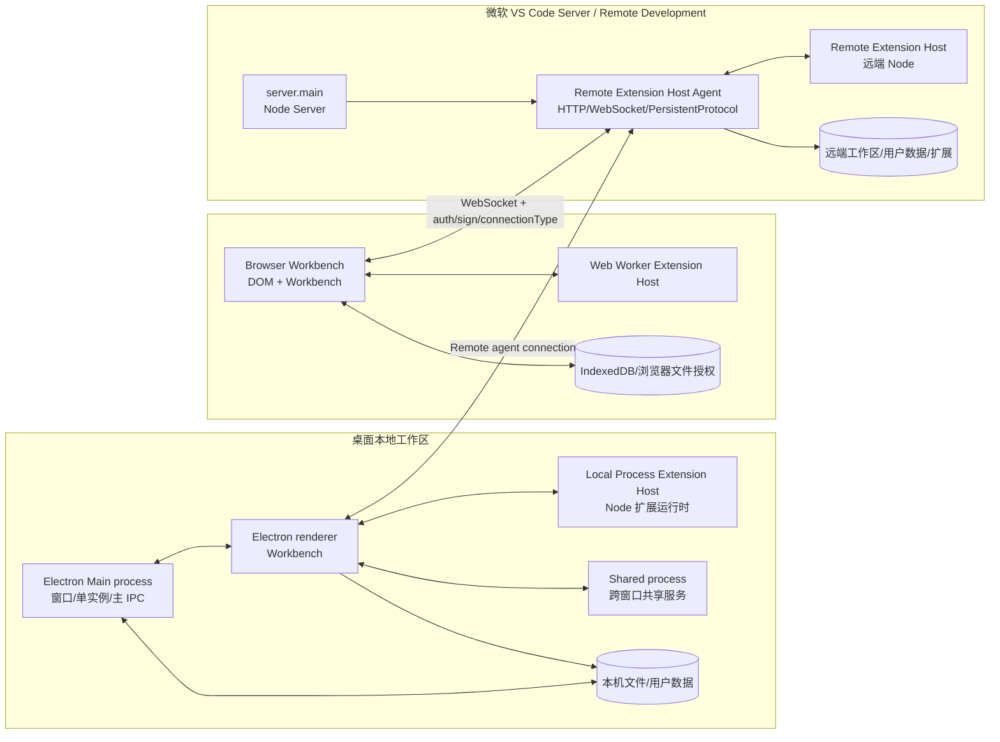
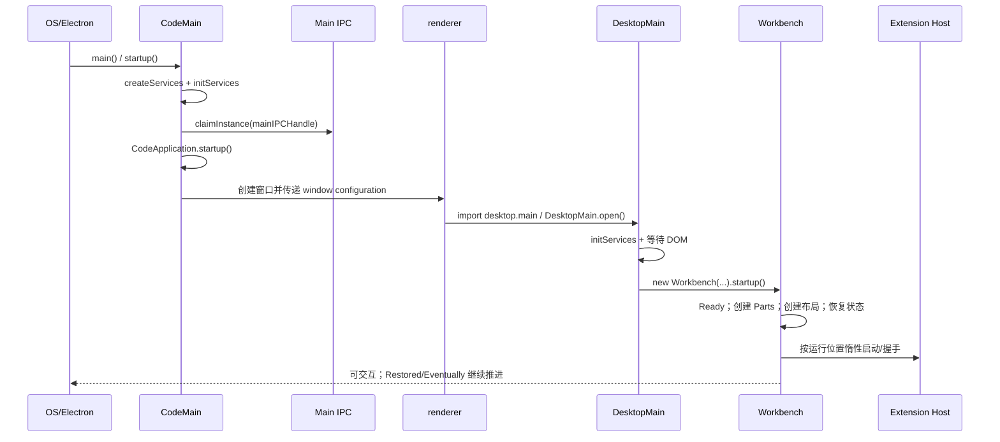

# VS Code 架构深挖：从打开窗口到首次插件调用

> 调研状态：research；不是 NeuroBook 当前产品合同。
> 调研问题：打开 VS Code 后，哪些进程、宿主、服务、状态模型和插件边界共同把用户动作变成可见结果？这些机制对 NeuroBook 的渐进式扩展控制面、可重排工作台和双向图像能力有什么启发？
> 证据标签：VS Code 章节的 **已验证** 表示固定 commit 源码或官方文档直接确认；NeuroBook 映射统一使用 **已验证当前实现**、**已批准但未实施的目标合同**、**研究建议**、**未验证/候选**。研究建议不能替代 Proposal、Spec 或 ADR。

## 结论先行

VS Code 不是“一个 Electron 页面加若干插件回调”。它是一个控制平面：桌面主进程先建立环境、文件、配置、状态和 IPC；renderer 进程装配 Workbench；Workbench 再通过服务注册表、Part/View/Editor 模型恢复界面；扩展描述先进入注册表，只有在命令、View、语言或其他事件真正需要时，才在合适的 Extension Host 中激活运行时代码。

对 NeuroBook 的直接启发不是复制 VS Code 的 `activate()` 入口，而是分离五件事：

1. **描述**：资产声明“提供什么”，先登记，不执行。
2. **宿主控制**：命令、配置、View、文件/附件、后台任务等入口由宿主拥有。
3. **惰性运行**：首次能力调用才启动对应运行时，并记录成功、失败和禁用状态。
4. **状态持久化**：布局、配置、会话快照、资产来源账本各自有明确作用域。
5. **边界与故障**：Extension Host 是故障隔离和能力代理边界，但不是恶意代码安全沙箱；NeuroBook 的第三方可执行资产必须另做威胁模型。

这份报告是研究映射，不把这些启发写成 NeuroBook 已批准的 API。采用某条行为时，仍需另建 Proposal/Spec/ADR。
## 后续 NeuroBook 决策研究

本组 `01–10` 章节继续保留 VS Code `1.133.0` 的固定 SHA 取证身份；以下章节是基于当前 monorepo 的后续映射，不修改 VS Code 历史结论，也不是产品合同。

阅读顺序：先看 [08 NeuroBook 映射](./08-neurobook-mapping.md) 的三项 capability map，再看 [11 图像输入到文本当前旅程](./11-image-input-to-text-current-journey.md) 的已实现主链、[12 Workbench View 宿主重构](./12-workbench-view-host-refactor.md)、[13 扩展控制面重构](./13-extension-control-plane-refactor.md)、[14 双向图像边界](./14-bidirectional-image-system-boundaries.md) 和 [15 重构顺序与决策门](./15-refactor-sequence-and-decision-gates.md)。[09 文生图旅程](./09-text-to-image-plugin-journey.md) 只作为候选反向链边界检查。

研究结论要进入实现，必须先按 Proposal → capability Spec → Task 建立当前合同。`docs/specs/README.md` 当前“待实现规范”为空；因此本组不会把 capability 写成已登记的 `planned` Spec。


## 一页人话模型

- **Main process（主进程）**：桌面 Electron 的总管，处理单实例、窗口、主进程 IPC、用户数据目录和系统能力。
- **Workbench（工作台）**：用户看到的控制平面；管理布局、编辑器、命令、配置、View 和生命周期。
- **Part（工作台区域）**：标题栏、Activity Bar、侧栏、Panel、编辑器区、状态栏等宿主区域。
- **View Container（View 容器）**：装一组 View 的可移动抽屉，例如侧栏中的 Explorer 容器。
- **View**：容器内的一项可显示能力；它可以延迟创建内容，但位置和可见性由宿主记录。
- **EditorInput / EditorPane / EditorGroup**：分别是“打开了什么”、 “用什么 UI 显示”、 “在哪个编辑器分组显示”。
- **Extension Host（扩展宿主）**：承载扩展运行时代码的独立进程或 Web Worker；Workbench 通过 RPC 代理调用它。
- **Remote Agent / Remote Extension Host**：当工作区在另一台机器时，远端 Node 服务提供文件、终端和远程扩展执行，浏览器或桌面端仍主要负责 UI。
- **Service identifier / InstantiationService**：依赖注入的钥匙和解析器；服务先以 descriptor 登记，首次取用时才按依赖图创建实例。

### 组件全景：从外壳到能力运行时

可以把 VS Code 先拆成六层。下面的“层”是本报告为了阅读而采用的分组，不是源码中的单一目录或官方产品名；同一个服务可能跨越相邻两层。

| 层 | 主要组件 | 人话职责 | 它把什么交给下一层 |
| --- | --- | --- | --- |
| 1. 进程与宿主 | Electron Main、renderer、Browser Workbench、微软 VS Code Server | 决定窗口、浏览器页面、远端 Node 分别在哪里运行 | 窗口配置、连接、文件/系统能力 |
| 2. 服务装配 | Service identifier、`ServiceCollection`、descriptor、`InstantiationService` | 把“需要什么服务”连接到当前宿主的具体实现，并管理作用域与释放 | 可按需取得的服务实例 |
| 3. 控制平面 | Workbench、Commands Registry、Configuration Registry、View Registry、Extension Description Registry | 登记能力描述、校验用户意图、决定何时显示和何时激活 | command、setting、View、Editor 等稳定对象 |
| 4. 用户界面模型 | Part、View Container、View、Editor Part、Editor Group、Editor Pane | 把稳定对象组织成区域、列表、面板、标签页和编辑器分屏 | 可见 UI 与布局状态 |
| 5. 资源与状态 | URI、FileService、EditorInput、text model、Working Copy、Configuration model、storage/memento | 读取资源、承载内存修改、保存/恢复和发出变化事件 | 内容、脏状态、最终配置和恢复快照 |
| 6. 扩展运行时 | Extension Host、MainThread/ExtHost proxy、`RPCProtocol`、Remote Agent | 在指定位置运行扩展代码，通过 API 代理使用宿主能力，并处理失败/重启 | 可序列化的请求、结果、错误和状态 |

这里有四个容易混淆的区分：

- **宿主**回答“代码和资源在哪台机器/哪个进程”；**服务**回答“当前进程如何取得能力”；**模型**回答“状态是什么”；**控件**回答“用户看到了什么”。
- **Registry（注册表）**保存描述和索引，**Service（服务）**执行查询、写入或生命周期管理；登记 command 不等于 handler 已执行，登记 View 不等于内容已创建。
- **Workbench**拥有布局、入口和生命周期；**Extension Host**承载扩展运行时代码；扩展只能通过宿主 API/RPC 触达受支持能力，不能因为能运行 Node 或 Web Worker 就拥有任意宿主权限。
- **持久化状态**按权威来源拆开：布局/配置/编辑器恢复各有模型和存储；扩展运行时内存对象、RPC 的 ACK（确认收到）和业务成功也不是同一件事。

### 谁调用谁：三条主协作链

#### 启动链：先装配宿主，再恢复用户界面

```text
Electron Main / BrowserMain
  → 宿主服务与连接适配器
  → Workbench.startup()
  → Lifecycle（Ready）
  → Parts + View/Editor 注册表
  → Layout / Editor Group 恢复
  → Extension Host 惰性启动与扩展描述登记
  → Restored / Eventually
```

启动链的关键是“外壳先于内容”：窗口和服务先具备合法实现，布局再创建 Part，Editor/View 再根据快照恢复；扩展代码不是页面加载时逐个直接 import。`Ready` 表示服务可解析，`Restored` 表示恢复链已推进，`Eventually` 表示低优先级工作继续进行，三者不是同一个“加载完成”布尔值。详见 [01](./01-modules-bootstrap-di.md)。

#### 用户动作链：入口、命令、运行时和状态分开

```text
键盘/菜单/Quick Access
  → keybinding + context key 判断入口
  → command id
  → Command Registry / Command Service
  → 必要时触发 activation event
  → MainThread ↔ RPCProtocol ↔ Extension Host
  → 宿主服务执行（文件、配置、编辑器、任务等）
  → 状态模型更新 + change event
  → Workbench/View/Editor 重新显示结果
```

`Quick Access` 是“搜索入口和 provider 选择器”；`Command Service` 才是“查找并执行 handler”的服务。`context key` 只能影响入口是否显示/启用，不能替代文件、Project、secret 或外部网络的授权判断。详见 [04](./04-quick-access-commands.md) 与 [07](./07-extension-system-deep-dive.md)。

#### 编辑器链：资源身份、内存模型和持久化写入分层

```text
URI（资源身份）
  → EditorInput（打开了什么）
  → EditorGroup（在哪个分组）
  → EditorPane（用什么编辑器 UI）
  → text model（内存内容）
  → Monaco control（光标/滚动/装饰）
  → Working Copy / Text File service（dirty、save、backup）
  → 文件/Workspace history（持久化真相）
```

Monaco control 只负责编辑视图和内存模型；它不直接拥有 Workspace 文件的最终写入权。详见 [06](./06-editor-architecture.md)。

#### 远程链：UI 留在客户端，authority 决定资源和代码位置

```text
Browser/renderer Workbench
  → RemoteAuthorityResolverService（解析远端身份）
  → PersistentProtocol（带 ACK、重连和重放的长连接协议）
  → Remote Agent / Server
  → 远端 FileService、终端、配置、Remote Extension Host
```

“authority”在本报告中表示某个资源/连接的归属与访问入口，不等于权限本身；认证 token、Project/Workspace 身份和读写授权仍须分开。详见 [02](./02-hosts-web-remote-server.md)。

### 用一个问题定位组件

| 用户问法 | 先看哪个组件 | 再看哪个状态/边界 |
| --- | --- | --- |
| “这个入口为什么出现/消失？” | Menu、Keybinding、Quick Access、Context Key | `when`/`precondition`、当前 command 是否注册 |
| “这个能力为什么还没执行？” | Extension Description Registry、Activation、Extension Host | activation event、依赖、运行位置、host 状态 |
| “这个面板为什么在这里/尺寸为什么变了？” | Part、View Container、ViewDescriptorService、PaneView | Profile storage、`views.customizations`、布局约束 |
| “这个文件为什么打开成这种编辑器？” | Editor Resolver、EditorInput、EditorGroup、EditorPane | URI provider、Workspace Trust、model reference |
| “这个设置最终为什么是这个值？” | Configuration Registry、Configuration Model | source layers、override、policy、target |
| “断线后为什么没有自动恢复业务结果？” | PersistentProtocol、RPCProtocol、业务状态服务 | ACK/replay 与 durable state/side effect 是否分开 |

这些问题的共同回答模板是：**谁登记描述 → 谁选择运行位置 → 谁执行 → 谁拥有状态 → 失败后谁恢复**。后续专题都按这五个问题展开。

### 总拓扑：桌面、本地 Web、微软 VS Code Server



**已验证**：`BrowserMain.open()` 先装配服务，再创建 `Workbench` 并调用 `startup()`；`server.main.ts` 计算远端 data/extension 目录并委托 `createServer()`；Server 连接在 `remoteExtensionHostAgentServer.ts` 中以 `PersistentProtocol` 承载控制帧和连接类型。**从源码推断**：上图把这些边界压缩成部署拓扑，未在本轮启动真实三种环境。

### 桌面启动时序



**已验证**：`CodeMain.startup()` 的服务、初始化、单实例 IPC 和 `CodeApplication.startup()` 顺序；`DesktopMain.open()` 的服务初始化、DOM 等待、Workbench 创建和启动；`Workbench.startup()` 的服务、布局、注册表、渲染、恢复顺序。源码链接见 [01](./01-modules-bootstrap-di.md)。

## 来源账本

| 项目 | 固定值/边界 |
| --- | --- |
| 研究对象 | `microsoft/vscode`，release `1.133.0` |
| 实现快照 | `a5b500951314efd502d07465bd138dfbd714a960` |
| release 发布时间 | `2026-08-12T09:41:17Z`（按执行计划固定记录） |
| 本地复核 | `git rev-parse refs/tags/1.133.0^{commit}` 与固定 SHA 相等；`git cat-file -e <sha>^{commit}` 成功 |
| remote | `https://github.com/microsoft/vscode.git` |
| 源码目录 | `C:/Users/notnotype/Documents/CodeRepository/GithubProjects/vscode`；detached HEAD 固定 SHA |
| 源码链接规则 | 一律使用 `https://github.com/microsoft/vscode/blob/a5b500951314efd502d07465bd138dfbd714a960/<path>`，不使用 `main` |
| 官方文档入口 | [Architecture](https://code.visualstudio.com/docs/getstarted/architecture)、[Extension Host](https://code.visualstudio.com/api/advanced-topics/extension-host)、[Extension Manifest](https://code.visualstudio.com/api/references/extension-manifest)、[Contribution Points](https://code.visualstudio.com/api/references/contribution-points)、[Remote Development](https://code.visualstudio.com/docs/remote/remote-overview)、[VS Code Server](https://code.visualstudio.com/docs/remote/vscode-server) |
| 第三方 code server 边界 | 不读取 `coder/code-server` 源码；本报告的“Server”只指微软 VS Code Server/Remote Development |

## 源码锚点与检查边界

- **已验证**：本地固定 commit 的源码路径、类/函数、配置键和状态字段；源码链接可复查。
- **从源码推断**：跨进程、跨模块的用户旅程；它们是根据调用方向和数据结构归纳，不等同于真实运行 trace。
- **未验证**：本轮没有构建或启动 VS Code，没有连接真实远端，没有安装 Marketplace 扩展，没有测量启动耗时，也没有读取 Marketplace/更新服务内部实现。故障 UI 文案、网络中间层部署和生产级性能只在源码直接显示的范围内陈述。
- 现有 [`../vscode-extension-system.md`](../vscode-extension-system.md) 保留扩展系统与 View/Panel 的浅层研究证据；本组专题只补端到端调用链、RPC、恢复和 NeuroBook 映射，不复制其正文。

## 用户旅程追踪矩阵

| 用户动作 | 主报告/图 | 固定 SHA 证据 | 成功链 | 失败触发与可见结果 | 文档验收动作 |
| --- | --- | --- | --- | --- | --- |
| 桌面打开一个 Workspace | [01 启动时序](./01-modules-bootstrap-di.md#旅程-桌面打开一个-workspace)、启动时序图 | `src/vs/code/electron-main/main.ts::CodeMain.startup`；`src/vs/workbench/electron-browser/desktop.main.ts::DesktopMain.open`；`src/vs/workbench/browser/workbench.ts::Workbench.startup` | main 建服务 → 单实例 → renderer → Workbench 服务/Parts → 布局恢复 → 编辑器恢复 | data 目录初始化、服务缺失、循环依赖、窗口恢复异常会记录错误或中止关键启动；真实 UI 未验证 | 顺着图核对入口、宿主、服务、状态、失败节点 |
| 浏览器连接微软 Server | [02 Server 生命周期](./02-hosts-web-remote-server.md#连接生命周期) | `src/vs/workbench/browser/web.main.ts::BrowserMain.open`；`src/vs/server/node/server.main.ts::createServer`；`remoteExtensionHostAgentServer.ts::RemoteExtensionHostAgentServer._handleWebSocketConnection` | Web Workbench → authority resolver → auth/sign/connectionType → Management/ExtensionHost channel → 远程文件/终端 | server 不在、token 错、commit mismatch、重连 token 无效、Tunnel 失败；源码错误原因已列，真实页面未验证 | 逐项核对连接表和失败表 |
| Ctrl+P 打开文件 | [04 Quick Access](./04-quick-access-commands.md#旅程-输入文件名打开资源) | `src/vs/workbench/browser/parts/editor/editorQuickAccess.ts`；Quick Access Registry；`EditorService` | keybinding → Quick Access provider → 模糊匹配 → URI → EditorInput → EditorPane/model | provider 无结果、URI 无 provider、打开失败触发 `onDidOpenEditorFail`；未实机验证 | 检查输入、provider、EditorInput、失败事件是否闭环 |
| Ctrl+Shift+P 执行内置命令 | [04 命令旅程](./04-quick-access-commands.md#旅程-输入-搜索并执行内置命令) | `src/vs/platform/commands/common/commands.ts::CommandsRegistry`；`src/vs/workbench/services/commands/common/commandService.ts::CommandService.executeCommand` | `>` provider → command metadata → `CommandsRegistry` → `ICommandService` → handler | 未注册命令先触发 activation，最终仍找不到时报 `command '<id>' not found` | 核对 command/menu/keybinding/context key 分层 |
| 读取、写入并监听配置 | [05 配置](./05-configuration-system.md#_7-旅程-同一个设置键从声明到-change-event) | `configuration.ts::ConfigurationTarget`；`configurationModels.ts::Configuration`/`ConfigurationInspectValue`；`configurationService.ts::ConfigurationService.updateValue` | schema/default → policy/user/workspace/folder/memory 合并 → `getValue/inspect` → `ConfigurationEditing` → reload/event | policy 值不可写、非法 target、文件变更 reload；未实机验证 | 使用同一键核对每层和 change event |
| 打开、修改、保存和恢复文本文件 | [06 编辑器](./06-editor-architecture.md#旅程-打开一个-uri-文件) | `EditorService`；`TextResourceEditorInput.resolve`；`AbstractTextResourceEditor.setInput`；`EditorPart` | URI → EditorInput → model reference → EditorPane → Monaco `ICodeEditor.setModel` → working copy save/backup | provider 缺失、解析类型错误、取消、保存取消/失败；源码链已验证，真实 UI 未验证 | 核对 input/model/pane/group 和脏状态路径 |
| 移动侧栏/Panel 位置 | [03 布局](./03-workbench-layout-views.md#旅程-移动一个-view-container) | `layoutService.ts::Parts/Position/PanelAlignment`；`Layout`；`ViewDescriptorService.moveViewContainerToLocation` | 宿主命令 → Part/ViewContainer location → SerializableGrid/layout → Profile storage | 非法位置、Sessions window 禁止移动、恢复状态损坏；未实机验证 | 分别核对容器位置与 Part 几何 |
| 同容器内重排 View | [03 View](./03-workbench-layout-views.md#旅程-同一容器内重排) | `ViewContainerModel`；`PaneView`；`CompositeDragAndDropObserver`（索引见 [10](./10-source-index-and-glossary.md)） | drag intent → 宿主校验 → ViewContainerModel 顺序/可见性 → Profile storage | 不可移动 View、目标不是同容器、空容器清理；未实机验证 | 检查排序不被误写成二维 Grid |
| 跨容器移动 View | [03 View](./03-workbench-layout-views.md#旅程-跨容器迁移) | `ViewDescriptorService.moveViewsToContainer`；`views.customizations` | view → generated container/目标容器 → cleanup source → 保存 customizations | Sessions window 禁止；非法目标或扩展移除后回默认 | 核对 `viewLocations`、generated container 和回滚默认 |
| Split 编辑器 | [03 编辑器分屏](./03-workbench-layout-views.md#旅程-编辑器分屏) | `editorPart.ts::EditorPart`；`SerializableGrid<IEditorGroupView>`；`editorpart.state` | split intent → EditorGroup → 二维 Grid → memento 恢复 | 最小尺寸、空组、恢复数据无效；未实机验证 | 确认与 Sidebar/Panel 一维模型分开 |
| 首次执行扩展 command | [07 扩展](./07-extension-system-deep-dive.md#旅程-a-首次执行扩展-command) | `CommandService`；`mainThreadCommands.ts`；`ExtensionDescriptionRegistry`；`ExtensionsActivator` | manifest/command description → registry → `onCommand:<id>` → Extension Host → MainThread/ExtHost RPC → handler | 缺依赖、禁用、激活异常、宿主 crash/version mismatch；恢复链已验证，真实插件未安装 | 逐节点核对激活状态和 RPC |
| 首次打开扩展 View | [07 扩展 View](./07-extension-system-deep-dive.md#旅程-b-首次打开扩展-view) | `AbstractExtensionService`；`ViewDescriptorService`；`PaneView`；`WebWorkerExtensionHost`/`RemoteExtensionHost` | View description 已登记 → UI 宿主创建 Pane → activation event → 扩展填充内容 | View 不可用、workspace trust、运行位置不可用、宿主失败 | 检查“先描述后激活”而非直接执行 |
| 用户在 Agent 会话提供角色参考图并要求生成外观描述 | [11 图像输入到文本当前旅程](./11-image-input-to-text-current-journey.md#_1-主旅程) | `packages/neuro-book/server/agent/attachments/agent-attachment-codec.ts::AgentAttachmentCodec.saveImage/hydrateForProvider`；`SessionAttachmentAuthority`；`neuro-agent-harness.ts` | 图片 bytes → 校验/内容寻址 → Session JSONL ownership → Project/Session 授权 → `model.input.includes("image")` → Provider image content → 文本结果 | MIME/魔数、16 MiB/64 MP、图片预算、跨 Session/Project 引用、非视觉模型和 Provider 失败均 fail closed 或降级 marker；结构化 Project 写入未实现 | 必须逐节点回链当前包内代码；不能把普通视觉聊天写成专用结构化工作流 |
| 未来根据角色描述生成插图并插入章节 | [09 文生图候选旅程](./09-text-to-image-plugin-journey.md#_2-一次-当前章节生成一张角色插图-的端到端时序)；[14 双向图像边界](./14-bidirectional-image-system-boundaries.md#_1-2-文生图-候选反向链) | `AgentJobManager`、`AgentToolRegistry`、`recordProjectWrite` 只提供通用宿主先例；真实生成 Provider/Project 图片资产 authority 未发现 | 命令/View → schema/审批 → candidate durable Job → candidate Provider → candidate Project asset → candidate 正文引用 | provider outcome unknown、幂等、资产孤儿、正文冲突和部分发布必须单独建模；不得声称已支持文生图 | 只做候选边界审阅，不运行 fake/real Provider smoke；任何“已支持文生图”表述均判失败 |

## 阅读顺序

1. [01 模块、启动与依赖注入](./01-modules-bootstrap-di.md)：回答“窗口为什么能起来”。
2. [02 浏览器、Node 与微软 Server](./02-hosts-web-remote-server.md)：回答“代码在哪台机器跑”。
3. [03 Workbench 布局、View 与分屏](./03-workbench-layout-views.md)：回答“哪些状态属于宿主布局”。
4. [04 Quick Access 与命令](./04-quick-access-commands.md)：回答“Ctrl+P/命令面板如何找到能力”。
5. [05 配置系统](./05-configuration-system.md)：回答“设置如何合并、写回、变更”。
6. [06 编辑器架构](./06-editor-architecture.md)：回答“文件如何从 URI 变成可编辑文本”。
7. [07 扩展系统深挖](./07-extension-system-deep-dive.md)：回答“首次调用插件发生什么”。
8. [08 NeuroBook 映射](./08-neurobook-mapping.md)：把机制转成三项 capability 的渐进式观察框架，不生成产品合同。
9. [09 文生图旅程](./09-text-to-image-plugin-journey.md)：保留为未实现的候选反向链压力测试。
10. [10 源码索引与术语](./10-source-index-and-glossary.md)：按固定 SHA 和当前包路径复查。
11. [11 图像输入到文本当前旅程](./11-image-input-to-text-current-journey.md)：验证当前图片输入→视觉模型→文本结果主链。
12. [12 Workbench View 宿主重构](./12-workbench-view-host-refactor.md)：把固定槽位映射为宿主拥有的 View/Container/Editor 边界。
13. [13 扩展控制面重构](./13-extension-control-plane-refactor.md)：联邦现有 Catalog 的描述快照、权限和激活边界。
14. [14 双向图像边界](./14-bidirectional-image-system-boundaries.md)：分开图生文与候选文生图的 Provider/Job/asset-state。
15. [15 重构顺序与决策门](./15-refactor-sequence-and-decision-gates.md)：供后续 Proposal 直接审阅的顺序和证据门。

- `packages/neuro-book/server/agent/http.ts::useAgentHarness()` 提供 `globalThis` 单例入口，并配合构造器注入；没有 VS Code 式统一 IoC 容器。
- `packages/neuro-book/server/agent/profiles/catalog.ts::AgentProfileCatalog`、Profile artifact、`ProfileRegistry.publish()`、`AgentToolRegistry`、Runtime Hook 已提供若干控制平面零件；没有统一 Description Registry 或插件 activation state machine。`docs/specs/README.md` 当前待实现规范为空。
- `packages/neuro-book/app/pages/index.vue` 与 `app/stores/novel-ide.ts` 仍以固定槽位和 local/session 持久化组织工作台；`app/composables/useResizablePanel.ts` 是唯一 resize 边界；现有 `useWorkbenchChrome` 只是 app-scoped Chrome 单槽注册表，不是 View Registry。
- `packages/neuro-book/server/agent/attachments/agent-attachment-codec.ts` 与 `SessionAttachmentAuthority` 已形成图片输入到视觉模型的当前链；它不提供 OCR、图片到结构化 Project 写入或文生图。
- `packages/neuro-book/server/media/image-variant.ts::ImageVariantModule` 是受限图片变体处理先例（`MAX_ACTIVE_JOBS = 2`、`MAX_QUEUED_JOBS = 64`），不是 AI 生图 Provider，也不是通用 Project FIFO。

这些事实来自本轮读取的 NeuroBook 源码；跨模块“下一步应该如何解耦”集中写在 [08](./08-neurobook-mapping.md)，并标注研究置信度。

## 检查边界与状态

本组报告不修改产品代码、Spec、ADR、Proposal、Reference 或 Task。VS Code 章节没有在真实桌面、浏览器远程连接、第三方扩展安装或 Marketplace 上执行操作；NeuroBook 章节没有启动真实 Provider/Model、写入真实 Project 数据或做浏览器人工验收。因此当前图生文章节只能做源码与现有测试证据闭环，文生图只能做候选边界审阅。研究目录位于 `packages/neuro-book/docs/research/vscode/`；仓库 `docs:check` 明确排除 research 的相对链接，交付前另跑该目录的一次性相对链接检查。
