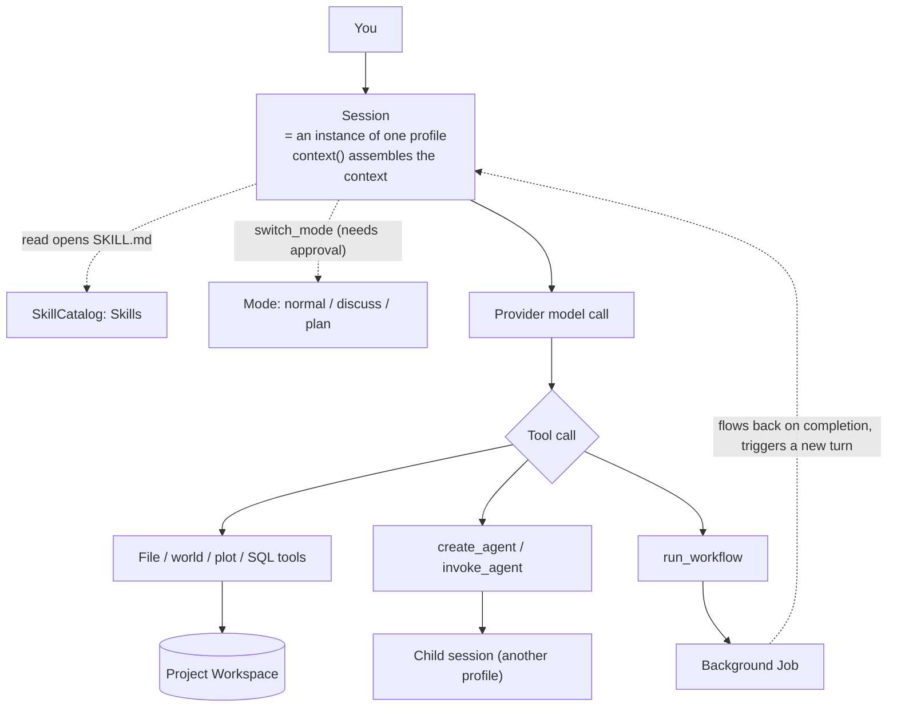

# Agent Mental Model

A NeuroBook Agent is an AI collaborator that works on your novel project. It is not an isolated chat box — it is a unit of work that can read the Project Workspace, call tools, use Skills, create linked agents, and write results back into a session or into project files.

The underlying runtime is NeuroAgentHarness. It builds on Pi-style multi-provider support, tool calling and an append-only session tree, and adds multi-agent collaboration, HITL (human-in-the-loop), a runtime Profile / Tool Catalog, context compaction, session summaries, lifecycle management and runtime hooks.

If you just want to start writing, go through the [Tutorials](/en/tutorials/) first. If you want to understand why agents can collaborate, call the writer, or enter RP mode, this group of pages is the entry point.

## Core Concepts

| Concept | In plain terms |
| --- | --- |
| Agent | The AI collaborator currently executing a task. |
| session | One work record of an agent: history, branches, tool results and run state. |
| profile | An agent's role, tool permissions, input/output contract and prompt structure. |
| Skill | A reusable workflow card that tells an agent how to do a class of task. |
| Workflow / Job | An explicit, visualized orchestration across several sessions, plus the background unit of work that carries a long task's lifecycle. |
| Subject RAG | The data, index and tools covering only the current subject's `events.jsonl` / `memory.jsonl`. There is no built-in automatic actor consumption flow today. |

In v3 a profile *is* the agent type. The system no longer maintains the old leader / subagent type hierarchy; collaboration is formed instead through profile keys, session links and tool calls.

## How They Fit Together



Three things to take away:

- **Child sessions are peers**, not "subordinates" — a child session is just another profile's session, related by a link.
- **Jobs are asynchronous**: `run_workflow` runs in the background by default, the agent ends its turn immediately, and the result flows back later to trigger a new turn.
- **Mode decides whether a tool actually runs**: in read-only mode, write tools are intercepted and require approval.

## The Default Way They Collaborate

An ordinary novel project starts from `leader.default`. It works out what you want and calls specialized profiles when it needs them:

- `writer`: writes the real chapter prose, one agent per chapter.
- `retrieval`: searches and filters content nodes in lorebook / manuscript.
- `researcher`: researches online, for up-to-date material or verification against external sources.
- `world.engine`: complex World Engine maintenance and validation.
- `inline.editor`: the Inline AI in Markdown Studio, running on its own background session.
- `summarizer` / `memory.curator`: background profiles for session title summaries and subject memory curation respectively; you never create them directly.

`director` (the story director) is kept as an advanced manual profile, not a required stop for ordinary writing — leader.default already holds the full set of plot read and write tools.

When you pick the wrong entry point, the entry leader should tell you which profile fits the task better and suggest creating or switching to that agent. The stable routing table is in [Profile Routing](https://github.com/notnotype/neuro-book/blob/master/packages/neuro-book/assets/reference/agent/profile-routing.md).

::: warning RP profile entry points are currently offline
`rp.leader`, `rp.writer`, `simulator.leader` and `simulator.actor` are still in the codebase, but they are **hidden from the New Agent menu** while they are redesigned to the standard set by writing mode. Profile names on historical sessions and the old profile files are preserved.
:::

## What an Agent Reads and Writes

An agent's tool working directory is bounded by the Workspace Root. When it works on the current novel, paths resolve into the Project Workspace, for example:

```text
lorebook/character/protagonist/index.md
manuscript/001-volume/001-chapter/index.md
world-engine/schema/index.ts
```

Three roles:

- `lorebook/`: **stable canon** — worldbuilding rules, background and baseline character material that does not change as the story moves.
- `manuscript/`: **the real prose**.
- World Engine: **state that changes** — where a character is right now, how badly they are hurt, how the factions stand. It lives in the project database, not in ordinary files; read and write it through `execute_world`, or just ask the Agent.

The test is one question: does this change as the story moves? If it changes, it goes into the World Engine; if it does not, it goes into lorebook.

## Keep Reading

- [Agent Tools](./tools.md): the full tool list, and when to reach for file tools, the World Engine, plot tools or a linked agent.
- [Skills](./skills.md): the 17 built-in Skills, override rules and allowlists.
- [Agent Workflows and Jobs](./workflow.md): how to orchestrate several sessions with a replayable script and run long tasks as background jobs.
- [Subject RAG Memory](./subject-rag-memory.md): the data, index and tool contracts that are preserved, and the gap in automatic integration today.
- [Agent Harness](./advanced.md): sessions, runtime hooks, SSE, queues and black-box behavior contracts.
- [Agent Reference](https://github.com/notnotype/neuro-book/blob/master/packages/neuro-book/assets/reference/agent/README.md): the entry point to the stable implementation reference.
