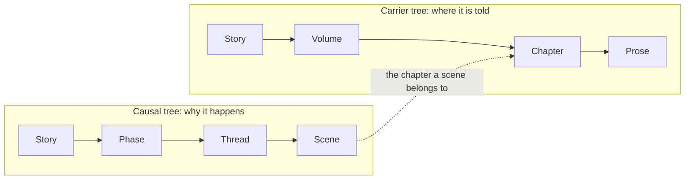

# Plot Workbench

If World Engine tracks "what happened in the world", Plot tracks **"how the story gets told"**.

The **Plot** button in the top bar opens the plot workbench.

## Two trees: what you tell vs. how you order it

The structural problem of a long novel is that **the order events happen in** and **the order the reader meets them in** are not the same thing. Flashbacks, cutaways, parallel threads — mix them into one tree and none of it stays legible.

So Plot uses two trees.

**The carrier tree** governs where the story is told; **the causal tree** governs why it happens:

The two trees meet at **the chapter a scene belongs to**. So a scene in chapter 5 can belong causally to a thread that runs three hundred years earlier: clear structure, intact causality.

Scenes also anchor straight into World Engine: **when it happens, where, and who is present**. Story planning and world state mesh together instead of being two records that talk past each other.

## The promise ledger: setups as technical debt

A gun planted in chapter 3 still has not fired by chapter 200. That is not a memory problem, it is **not having a ledger**.

NeuroBook books every setup as **a debt you owe the reader**:

- **Plant**: register a promise, spelling out what you promised and how you expect to pay it off.
- **Advance**: the promise's beats hang on scenes, so when a scene's status changes the beat status follows.
- **Pay off**: when you reach the target chapter, the promise flows into the writing brief automatically, so the AI knows this is where the thread closes.

Promises have **no type taxonomy**; behaviour is driven by the fields you fill in. Fill in a deadline chapter and overdue becomes a thing; fill in a cadence and you get "raise it again every few chapters" prompts. Setups are tagged by how they pay off — planted payoff, prophecy, motif, mirror.

None of this is only for setups. **Want the romance to land a sweet beat every few chapters?** Book it as a promise too, and it will tell you it has been thirty chapters.

## Creative decision records

Why did you turn the protagonist dark three months ago? Scroll back and all you find is the outcome, never the reason — so you want to change it and do not dare, in case something breaks.

Decision records borrow the ADR (architecture decision record) practice from engineering: **archive the decision on the spot**.

- An open decision blocks the AI from quietly nailing things down for you.
- Signing off **requires** the decision itself, the motivation and the risk.
- Dropping an option requires writing down why.
- A decision can be overturned by a later one, but the overturn leaves a trace.

Three months on, what you see is not just "the protagonist went dark", but "we picked B out of A / B / C because it plants a setup for the volume 4 reversal; known risk: early readers may drop the book".

## Chapter briefs

Every chapter can carry a **chapter brief**, the chapter-level constraints handed to writer:

- The goal of this chapter, the POV character, requirements for the opening and the ending
- **Information control**: what the reader knows, what the protagonist knows, what must stay hidden, what may only be hinted at
- Things not to write

The information control fields are Hitchcock's theory of suspense turned into engineering — there is a bomb under the table and the characters do not know, which is the only reason the suspense works. **AI narrates from a god's-eye view by default**; without explicit constraints it will let a character say something she has no way of knowing. Fill these fields in and they are enforced while writing.

If all four information control fields are empty, the system blocks the writing handoff and asks you to fill in the chapter brief first.

## Scene fields

Scenes and threads carry a few more fields for controlling pace:

- **Scene outcome**: achieved / not achieved / no conflict / endured
- **Pacing role**: what this scene carries in the overall rhythm
- **Thread type**: the MICE categories (milieu / idea / character / event)

Left empty means **not filled in**, and carries no semantics of its own — the system will not guess on your behalf.

## The interface

The workbench has three real sections:

| Section | Contents |
| --- | --- |
| Thread planning | Structural editing of both trees, scene and thread detail |
| Promise ledger | Promise list, beat timeline, fulfill / abandon / reopen |
| Decision records | Open decisions pinned to the top, ADR-style detail, sign off and void |

The left sidebar also has a Plot shortcut, so you can switch back to it from Agent mode.

::: tip Status
The planning layer — promise ledger, decision records, pacing fields — is implemented; full browser-side acceptance checks are still under way.
:::

## Further reading

- [Plot Reference](https://github.com/notnotype/neuro-book/blob/master/packages/neuro-book/assets/reference/plot/system.md): the full data model and field contracts.
- [Agent Plot Tool Spec](https://github.com/notnotype/neuro-book/blob/master/packages/neuro-book/assets/reference/plot/agent-spec.md): what an Agent is allowed to do to the plot.
- [Chapter Brief](https://github.com/notnotype/neuro-book/blob/master/packages/neuro-book/assets/reference/plot/writer-brief.md): how a brief is compiled into writer's task.
- [World Engine](/en/core/world-engine): the source of truth for the world state a scene anchors to.
