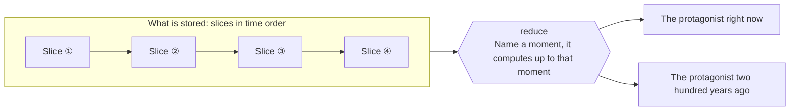
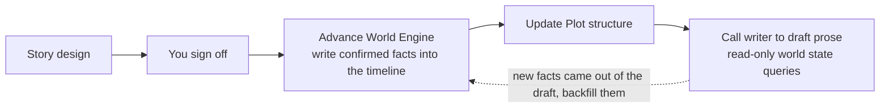

# World Engine

World Engine solves the most stubborn problem in long-form writing: **the further you write, the more you contradict your own canon**.

An arm severed last volume grows back in this one. You fixed the size of the national treasury three months ago; ask the AI today and it invents a fresh number. The root cause is that your canon lives in the model's conversation memory, and conversation memory drifts, gets compacted, and expires.

World Engine moves world state out of model memory and into an engine that can compute and audit it.

## The core idea: store changes, not state

World Engine **does not store "the current state"**. What it stores is a series of **slices** ordered in time — each slice records which changes happened at one moment.

The world state at any moment is computed (reduce) from every slice before that moment.

Three things follow directly:

- **No drift**: state is computed, not remembered. "What state is the protagonist in now" and "what state was she in two hundred years ago" are the same operation.
- **Backfilling canon is natural**: to add something to the past, insert a slice at the right moment. Flashbacks, memories and buried history come for free.
- **Auditable**: "when did he get that sword" resolves to an exact moment and the change record that put it there.

## Subjects and schema

Anything in the world that has state is a **subject** — not just people. A sect, a kingdom, a continent, an entire war can each be a subject.

Every project defines its own world structure in `world-engine/schema/index.ts` (a Zod schema): which attributes a protagonist has, which fields a sect has, what type each number is. **You define the structure**; NeuroBook makes no assumption about what kind of novel you are writing.

Changes are expressed through 4 operations: `replace`, `increment`, `remove`, `append`. What gets written is a **declarative sequence of changes**. Old values are not stored, and the backend never rewrites later slices behind your back — so history stays trustworthy.

## Time and calendars

Time is the skeleton of World Engine, so the calendar is configurable: `world-engine/calendar.ts` supports three strategies.

| Strategy | Use for |
| --- | --- |
| `gregorian` | The real Gregorian calendar, the default for new projects. Handles BC dates |
| `simple` | Simplified era counting, e.g. "Year 372, Spring" |
| `custom` | A fully invented calendar with your own months, cycles and leap rules |

For you and for the HTTP API, time is always a string in the project's own calendar (for example `公元2020年4月12日 18:00`). Internally the engine stores one unified time scale, so different calendars can convert between each other.

## How the Agent uses it

The Agent reads and writes the world through a single tool, `execute_world`. Inside it is a controlled code sandbox, and the API comes in four groups:

- `world.time.*`: parse and format time
- `world.subject.*`: create subjects and query their state
- `world.slice.*`: write, precisely edit and delete slices
- `world.search.*`: search by content

**Splitting read from write is a hard constraint**: leader runs in readwrite mode and can advance world state; **writer only gets readonly mode**, with no write APIs injected at all. Which means the AI **cannot casually break your worldbuilding** while it is drafting prose — it can look, it cannot touch.

The engine reports **issues** on its own initiative. Class E is a persistent data error — a reference to a subject that does not exist, say — and must be fixed. Class A is a one-off reminder you only need to confirm. This is where "consistency conflict detection" comes from: not a model feeling that something is off, but the engine computing it from rules.

## Using it in the interface

The **World** button in the top bar opens the World Engine workbench, where you can create subjects, write / edit / delete slices, query the state at any moment, and read the issue list.

Day to day, though, the more common move is to **just ask the Agent**: "what state is the protagonist in now", "what did this place look like two hundred years ago", "record the outcome of this battle in the timeline". You do not need to understand slices and reduce; the Agent handles that.

## Where it sits in the writing chain

In the default writing flow, World Engine sits **after the story is signed off and before the prose is written**:

If drafting produces new facts — you decide mid-scene to injure a supporting character, say — go back to World Engine and backfill.

::: tip Worldbook vs. World Engine
`lorebook/` holds **stable canon**: things that do not change as the story moves, like the rules of the world or a sect's historical background. World Engine holds **state that changes**: where a character is right now, how badly hurt, how the factions stand. The test is a single question — "does this change as the story moves?"
:::

## Further reading

- [World Engine Reference](https://github.com/notnotype/neuro-book/blob/master/packages/neuro-book/assets/reference/world-engine/README.md): the full shelf of principles and contracts.
- [Recording Principles](https://github.com/notnotype/neuro-book/blob/master/packages/neuro-book/assets/reference/world-engine/recording-principles.md): what to record and at what granularity — the key to not over-modeling.
- [Schema System](https://github.com/notnotype/neuro-book/blob/master/packages/neuro-book/assets/reference/world-engine/schema-system.md): how subject structure is defined.
- [Calendar System](https://github.com/notnotype/neuro-book/blob/master/packages/neuro-book/assets/reference/world-engine/calendar-system.md): time expression and the three calendar strategies.
- [Plot Workbench](/en/core/plot-workbench): the story structure layer, meshed with World Engine at the scene level.
