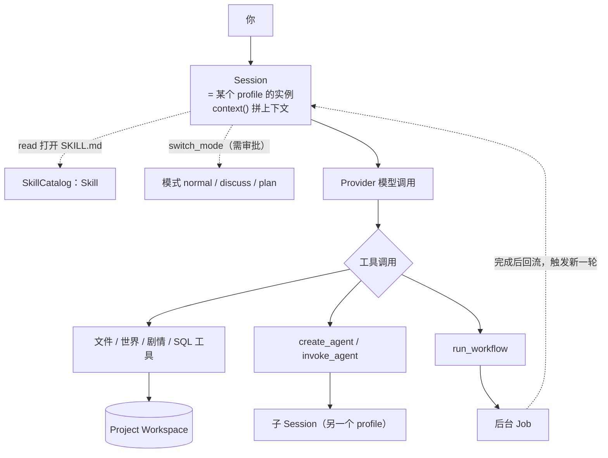

# Agent 心智模型

NeuroBook 的 Agent 是围绕小说项目工作的 AI 协作者。它不是一个孤立聊天框，而是能读取 Project Workspace、调用工具、使用 Skill、创建 linked agent，并把结果写回 session 或项目文件的工作单元。

底层运行时是 NeuroAgentHarness：它基于 Pi 风格的 multi-provider、tool calling 和 append-only session tree 扩展，支持 Multi-Agent 协作、HITL（Human-in-the-Loop）、运行时 Profile / Tool Catalog、上下文压缩、会话摘要、生命周期管理与 Runtime Hooks。

如果你只想开始创作，先走 [基础教程](/tutorials/)。如果你要理解 Agent 为什么能协作、能调用 writer、能进入 RP 模式，这一组页面是入口。

## 核心概念

| 概念 | 直觉解释 |
| --- | --- |
| Agent | 正在执行任务的 AI 协作者。 |
| session | Agent 的一条工作记录，包含历史、分支、工具结果和运行状态。 |
| profile | Agent 的角色、工具权限、输入输出合同和提示词结构。 |
| Skill | 可复用工作流程卡，告诉 Agent 如何完成某类任务。 |
| Workflow / Job | 显式编排多个 session 的可视化流程，以及承载长任务生命周期的后台工作单元。 |
| Subject RAG | 只覆盖当前 subject 的 `events.jsonl` / `memory.jsonl` 的数据、索引和工具；当前没有内置自动 actor 消费流程。 |

v3 中 profile 就是 agent 类型。系统不再维护旧式 leader / subagent 类型层级，而是通过 profile key、session link 和工具调用形成协作网络。

## 它们怎么串起来



三条要点：

- **子 Session 是平级的**，不是"下级"——它只是另一个 profile 的会话，通过 link 关联。
- **Job 是异步的**：`run_workflow` 默认后台跑，Agent 立刻结束当前回合，结果稍后回流触发新一轮。
- **模式决定工具能不能真的执行**：只读模式下写工具会被拦截并要求审批。

## 默认协作方式

普通小说项目默认从 `leader.default` 开始。它负责理解用户意图，并在需要时调用专用 profile：

- `writer`：写正式章节正文，一章一个 agent。
- `retrieval`：检索和筛选 lorebook / manuscript 内容节点。
- `researcher`：联网研究，处理最新资料或外部来源核验。
- `world.engine`：复杂世界引擎维护与校验。
- `inline.editor`：Markdown Studio 里的 Inline AI，跑在独立后台会话上。
- `summarizer` / `memory.curator`：后台 profile，分别负责会话标题摘要和 subject 记忆整理，不由用户直接创建。

`director`（剧情导演）保留为高级手动 profile，不是普通写作的必经节点——leader.default 自己就持有全套剧情读写工具。

当用户选错入口时，入口 leader 应说明任务更适合哪个 profile，并建议新建或切换到对应 agent。稳定路由表见 [Profile Routing](https://github.com/notnotype/neuro-book/blob/master/packages/neuro-book/assets/reference/agent/profile-routing.md)。

::: warning RP 相关 profile 当前已下线入口
`rp.leader`、`rp.writer`、`simulator.leader`、`simulator.actor` 仍在代码库中，但**已从新建 Agent 菜单隐藏**，正在按写作模式的标准重新设计。历史会话的 profile 名称和旧 profile 文件保留。
:::

## Agent 会读写什么

Agent 的工具工作目录以 Workspace Root 为边界。处理当前小说时，路径指向 Project Workspace，例如：

```text
lorebook/character/protagonist/index.md
manuscript/001-volume/001-chapter/index.md
world-engine/schema/index.ts
```

三条分工：

- `lorebook/`：**稳定设定**——不随剧情改变的世界观规则、背景、人物基础设定。
- `manuscript/`：**正式正文**。
- World Engine：**会变的状态**——角色现在在哪、伤势如何、势力关系怎样。它存在项目数据库里，不是普通文件；通过 `execute_world` 读写，或直接问 Agent。

判据是"这个东西会随剧情改变吗"。会变的进 World Engine，不变的进 lorebook。

## 继续阅读

- [Agent 工具](./tools.md)：完整工具清单，以及什么时候该用文件工具、世界引擎、剧情工具还是 linked agent。
- [Skill](./skills.md)：17 个内置 Skill 清单、覆盖规则与白名单。
- [Agent Workflow 与 Job](./workflow.md)：如何用可重放脚本编排多个 session，并通过后台 Job 运行长任务。
- [Subject RAG 记忆](./subject-rag-memory.md)：保留的数据、索引和工具合同，以及当前自动集成缺口。
- [Agent Harness](./advanced.md)：session、runtime hooks、SSE、队列和黑盒行为合同。
- [Agent Reference](https://github.com/notnotype/neuro-book/blob/master/packages/neuro-book/assets/reference/agent/README.md)：稳定实现参考入口。
