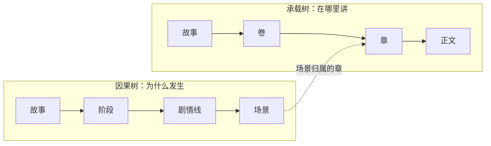

# Plot 剧情工坊

如果 World Engine 管的是「世界发生了什么」，Plot 管的是**「故事怎么讲」**。

顶栏 **Plot** 按钮打开剧情工作台。

## 两棵树：讲什么 vs 怎么排

长篇的结构问题在于，**故事发生的顺序**和**读者读到的顺序**不是一回事。倒叙、插叙、多线并行——一旦混在一棵树里就理不清。

所以 Plot 用两棵树：

**承载树**管故事在哪里讲，**因果树**管故事为什么发生：

两棵树在**场景归属的章**上交汇。于是你可以让第 5 章的一个场景，在因果上属于三百年前的某条剧情线——结构清晰，因果不乱。

场景还直接锚定 World Engine：**发生在什么时间、什么地点、谁在场**。所以剧情规划和世界状态是咬合的，不是两套各说各话的记录。

## 承诺账本：伏笔当技术债管

第 3 章埋的枪，第 200 章还没响。这不是记性问题，是**没有账本**。

NeuroBook 把每个伏笔当作**对读者的一笔欠债**来记账：

- **埋下**：登记一个承诺，写清楚你许诺了什么、期待怎么兑现。
- **推进**：承诺的节拍挂在场景上，场景状态一变，节拍状态跟着变。
- **兑现**：写到目标章时，这个承诺会自动进入写作指令，AI 写正文时就知道这里该收线了。

承诺**不设类型分类**，行为由字段驱动：填了期限章才有逾期概念，填了节奏才有「隔几章提一次」的提示。伏笔按兑现机制打标签——铺垫兑现、预言、母题、镜像对照。

这套东西不只管伏笔。**感情线想每隔几章发一次糖**？也记成一个承诺，它会提醒你已经三十章没发了。

## 创作决策记录

三个月前为什么让主角黑化？翻回去只看到结果，没有理由——想改又不敢改，怕碰坏什么。

决策记录借用了工程里的 ADR（架构决策记录）做法：**决策当场存档**。

- 未决状态会挡住 AI 擅自把事情写死。
- 拍板时**必须填**决定内容、动机和风险。
- 放弃某个方案要写明原因。
- 决策可以被后来的决策推翻，但推翻也留痕。

于是三个月后你能看到的不只是「主角黑化了」，而是「当时在 A / B / C 三个方案里选了 B，因为要给第四卷的反转留伏笔，已知风险是前期读者可能弃书」。

## 章节写作指令

每一章可以带一组**写作指令**，这是给 writer 的章级约束：

- 本章目标、视角人物、开头和收尾要求
- **信息控制**：读者知道什么、主角知道什么、必须隐瞒什么、只能暗示什么
- 禁写事项

信息控制这组字段是希区柯克悬念理论的工程化——桌下有炸弹而角色不知道，悬念才成立。**AI 天然是上帝视角**，如果不显式约束，它会让角色说出不该知道的话。填了这几个字段，写作时会强制生效。

信息控制四个字段全空时，系统会挡住写作交接，提示先补章节指令。

## 场景字段

场景和剧情线上还有几个用于把控节奏的字段：

- **场景结果**：达成 / 未达成 / 无冲突 / 被动承受
- **节奏角色**：这场戏在整体节奏里承担什么
- **剧情线类型**：按 MICE 分类，决定「这条线怎样才算关」——环境 `milieu` / 谜题 `idea` / 角色 `character` / 事件 `event`

留空表示**未填写**，不表示任何语义——系统不会替你猜。

## 界面

工作台有三个真实分区：

| 分区 | 内容 |
| --- | --- |
| 线程规划 | 两棵树的结构编辑、场景与剧情线详情 |
| 承诺账本 | 承诺列表、节拍时间线、兑现 / 放弃 / 重开 |
| 决策记录 | 未决置顶、ADR 式详情、拍板与作废 |

左侧侧栏也有 Plot 快捷入口，Agent 模式下可以从侧栏切回。

::: tip 状态说明
剧情规划层（承诺账本、决策记录、节奏字段）已实施，浏览器端完整验收仍在进行中。
:::

## 继续阅读

- [Plot Reference](https://github.com/notnotype/neuro-book/blob/master/packages/neuro-book/assets/reference/plot/system.md)：完整数据模型与字段合同。
- [Agent 剧情工具规范](https://github.com/notnotype/neuro-book/blob/master/packages/neuro-book/assets/reference/plot/agent-spec.md)：Agent 能对剧情做什么。
- [章节写作指令](https://github.com/notnotype/neuro-book/blob/master/packages/neuro-book/assets/reference/plot/writer-brief.md)：指令怎么编译进 writer 的任务。
- [World Engine](/core/world-engine)：场景锚定的世界状态真相源。
