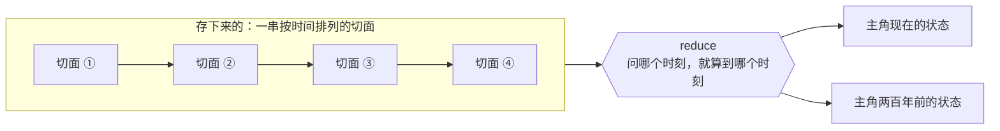
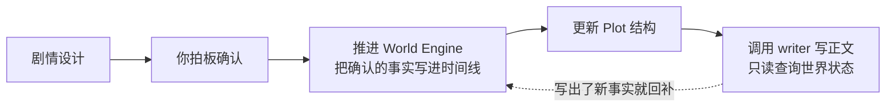

# World Engine 世界引擎

World Engine 解决长篇写作最顽固的问题：**写着写着就吃书**。

上一卷断掉的手臂，这一卷自己长回来了；三个月前定的国库存量，现在问 AI 它给你编一个新数字。根因是设定活在模型的对话记忆里，而对话记忆会漂移、会被压缩、会过期。

World Engine 把世界状态从模型记忆里搬出来，放进一个可推算、可审计的引擎。

## 核心思路：不存状态，只存变化

World Engine **不保存「当前状态」**。它保存的是一串按时间排列的**切面（slice）**——每个切面记录某个时间点发生了哪些变更。

任意时刻的世界状态，由该时刻之前所有切面推算（reduce）得来。

这带来三个直接好处：

- **不会漂移**：状态是算出来的，不是记住的。问「主角现在什么状态」和问「主角两百年前什么状态」是同一种操作。
- **补设定很自然**：想给过去补一段设定，就在合适的时间点插一个切面。倒叙、回忆、隐藏往事天然支持。
- **可审计**：「他什么时候拿到这把剑的」能查到确切的时间点和那次变更记录。

## 主体（subject）与 schema

世界里有状态的东西都是 **subject**——不只是人物，门派、王国、大陆、一场战争都可以是。

每个项目用 `world-engine/schema/index.ts`（Zod schema）定义自己的世界结构：主角有哪些属性、门派有哪些字段、数值是什么类型。**结构由你定义**，NeuroBook 不预设你在写什么类型的小说。

变更通过 4 种操作表达：`replace`（替换）、`increment`（增减）、`remove`（删除）、`append`（追加）。写入的是**声明式的变更序列**，不存旧值，后端也不会自动改写后续切面——所以历史永远是可信的。

## 时间与历法

时间是 World Engine 的骨架，所以历法可配置：`world-engine/calendar.ts` 支持三种策略。

| 策略 | 适用 |
| --- | --- |
| `gregorian` | 现实公历，新项目默认。支持公元前 |
| `simple` | 简化纪年，例如「第 372 年 春」 |
| `custom` | 完全架空的历法，自定义月份、周期、闰法 |

对你和对 HTTP 接口，时间一律用项目历法的字符串（例如 `公元2020年4月12日 18:00`）。引擎内部用一个统一的时间刻度存储，所以不同历法之间可以换算。

## Agent 怎么用它

Agent 通过单一工具 `execute_world` 读写世界，工具内部是一个受控的代码沙箱，API 分四组：

- `world.time.*`：解析和格式化时间
- `world.subject.*`：主体的创建与状态查询
- `world.slice.*`：切面的写入、精确编辑、删除
- `world.search.*`：按内容检索

**读写分权是硬约束**：leader 用 readwrite 模式，可以推进世界状态；**writer 只有 readonly 模式**，不注入写入类 API。这意味着 AI 在写正文的时候**不可能顺手改坏你的世界设定**——它只能查，改不了。

引擎会主动报告 **issue**：E 类是持久的数据错误（比如引用了不存在的主体），必须修；A 类是一次性提醒，确认语义即可。这就是「一致性矛盾检测」的来源——不是靠模型觉得哪里不对，是引擎按规则算出来的。

## 在界面里用

顶栏 **World** 按钮打开 World Engine 工作台，可以创建主体、写入 / 编辑 / 删除切面、查询任意时刻的状态、查看 issue 列表。

但日常写作中，更常见的用法是**直接问 Agent**：「主角现在什么状态」「两百年前这里什么样」「把这场战斗的结果记进时间线」。你不需要理解切面和 reduce，Agent 会处理。

## 写作主链里的位置

默认写作流程中，World Engine 位于**剧情确认之后、写正文之前**：

写完之后如果产生了新事实（比如写着写着决定让某个配角受伤），回到 World Engine 做回补。

::: tip 和世界书的分工
`lorebook/` 放**稳定设定**——不随剧情变的东西，比如世界观规则、门派历史背景。World Engine 放**会变的状态**——角色现在在哪、伤势如何、势力关系怎样。判据是「这个东西会随剧情改变吗」。
:::

## 继续阅读

- [World Engine Reference](https://github.com/notnotype/neuro-book/blob/master/packages/neuro-book/assets/reference/world-engine/README.md)：完整原理与契约书架。
- [记录原则](https://github.com/notnotype/neuro-book/blob/master/packages/neuro-book/assets/reference/world-engine/recording-principles.md)：什么该记、记到什么粒度——避免过度建模的关键。
- [Schema 系统](https://github.com/notnotype/neuro-book/blob/master/packages/neuro-book/assets/reference/world-engine/schema-system.md)：主体结构怎么定义。
- [历法系统](https://github.com/notnotype/neuro-book/blob/master/packages/neuro-book/assets/reference/world-engine/calendar-system.md)：时间表达与三种历法策略。
- [Plot 剧情工坊](/core/plot-workbench)：剧情结构层，和 World Engine 在场景上咬合。
